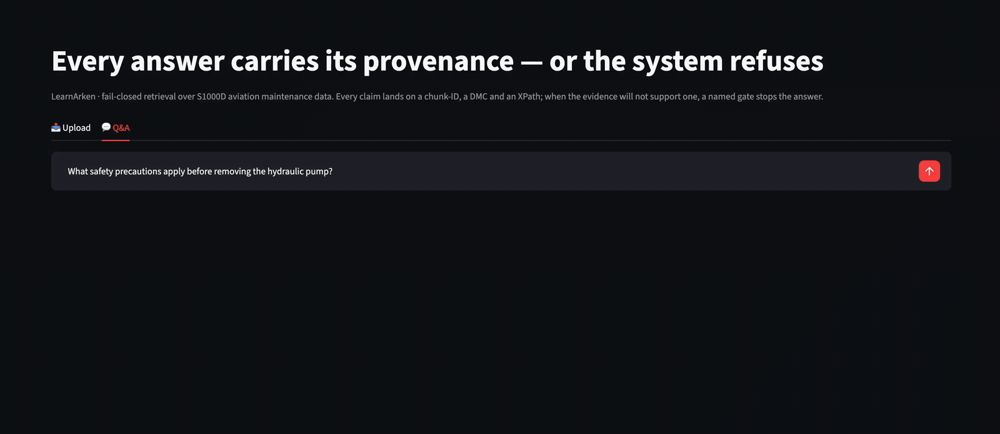
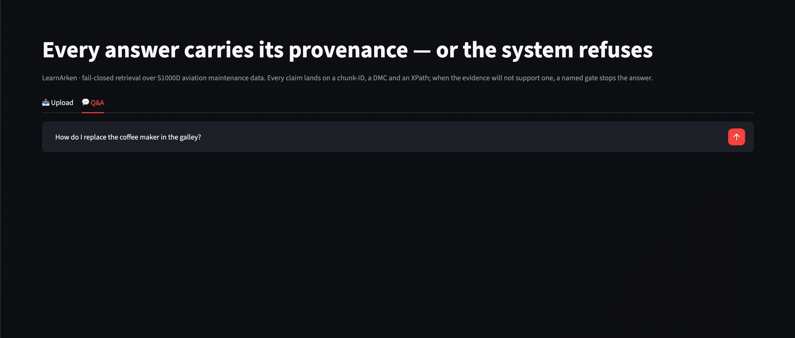
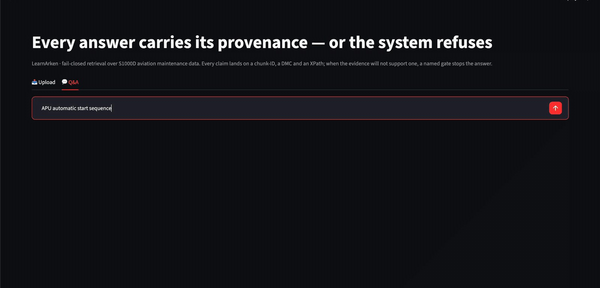
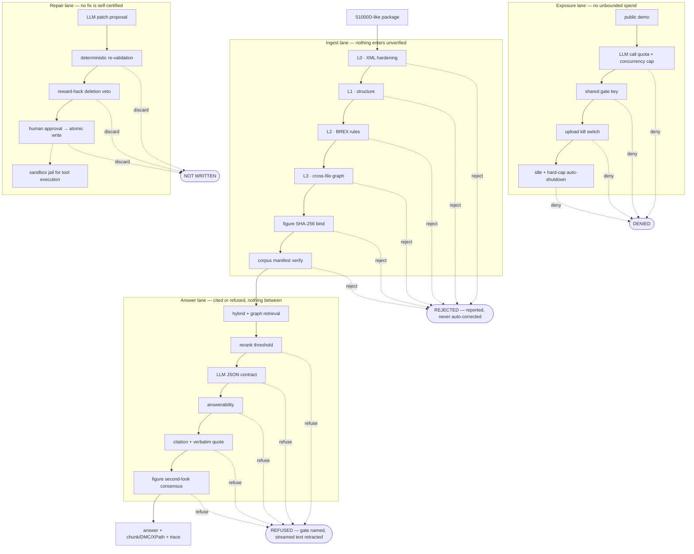

# LearnArken

**A fail-closed, standards-governed RAG system for aviation technical
publications (S1000D): every answer carries chunk-ID + DMC + XPath provenance,
or the system refuses. Built zero-to-one — ingest gate, hybrid + knowledge-graph
retrieval, grounded QA, self-repair agent, adversarial evaluation, on-demand
deployment.**

[](https://github.com/Osmond-Xin/LearnArken/actions/workflows/ci.yml)

*[中文版 / Chinese version](README.zh-CN.md)*

**Why this exists.** I built this to get hired as an AI engineer working on
governed retrieval in regulated domains — so it is written to be **checked, not
admired**. Every benchmark number below is generated from a committed artifact
and carries a command that reproduces it; prose claims link to the code or the
review that settled them. (Precisely: CI guards dead links, the tagged numbers
in EVIDENCE.md, and every benchmark table against its source JSON — hand-written
prose numbers elsewhere are not machine-guarded, and §6 says why that residual
gap is stated rather than claimed away.) The toy-scale parts and the unbuilt
parts are labelled in the same voice as the wins, because in this domain a
system that overstates itself is the failure mode being engineered against.

**How to read this in the time you have.**

| You have | Read |
| --- | --- |
| **3 minutes** | The three terminal transcripts in [§1](#1-why-this-system-has-to-be-able-to-say-i-dont-know) — a package rejected, an answer welded to an XPath, a question refused with the gate named. Then the honest self-assessment against Arken's seven pillars in [§6](#6-mapped-to-a-governed-reasoning-architecture) |
| **15 minutes** | Add [§2](#2-the-interception-chain) (16 gates, all failing in the same direction) and [§4](#4-hybrid-retrieval-how-it-works-and-what-the-ablation-proved) (what the ablation proved *against* my expectations) |
| **You want to audit it** | [docs/EVIDENCE.md](docs/EVIDENCE.md) maps claim → artifact → command. [llms.txt](llms.txt) is the same map for a machine: **point your own AI agent at it and have it check my numbers rather than take them from me** |

| | |
| --- | --- |
| **Scale of delivery** | 13 shipped nodes, `v0.1.0` → `v1.3.0`, each with a human-written spec, an independent red-team review, and a human adjudication |
| **Test suite** | 585 tests — `make test` (pytest) → `576 passed, 12 skipped` offline, which is what CI runs; `579 passed, 9 skipped` with the local Vespa + Neo4j services up. Both measured 2026-07-28, both by running them. Lint is the separate `make lint` |
| **Evidence rule** | a number that cannot be reproduced is not published (INV-5) — [EVIDENCE.md](docs/EVIDENCE.md) maps every claim → artifact → command |
| **Honest boundary** | synthetic S1000D-like XML (INV-1), educational corpus size, distribution simulated on one machine — full list in [docs/constitution.md](docs/constitution.md) |

> **What `INV-n` means.** Before writing any code I wrote a
> [project constitution](docs/constitution.md): eight numbered **invariants**
> that no day's work is allowed to violate, ranking above any spec or my own
> convenience. They are cited by ID throughout this repo — red-team reviews
> quote the ID when reporting a violation, which is what makes "this rule was
> broken" an argument rather than an opinion. The four cited most often below:
>
> | | |
> | --- | --- |
> | **INV-1 · Data red line** | Only synthetic XML I authored, or clearly-licensed third-party files, may enter this repo. No real customer data, ever. |
> | **INV-4 · Fail-closed refusal** | When evidence is insufficient the system must refuse. Every answer either carries verifiable citations or is an explicit refusal — **there is no third state**. |
> | **INV-5 · Reproducibility** | Every published number needs a fixed seed, a versioned golden set, and a copy-pasteable command. A number that cannot be reproduced is not published. |
> | **INV-7 · Honest layering** | Outward claims may only assert what has code + tests + a demonstrable artifact, kept in three never-blurred layers: `Implemented` / `Toy-scale` / `Planned`. |
>
> The remaining four cover distributed-interface discipline (INV-2), enumerated
> error injection (INV-3), human-owned evidence (INV-6), and the anti-slippage
> rule (INV-8).

---

## 1. Why this system has to be able to say "I don't know"

An MRO engineer stands beside an aircraft with a laptop open, looking for the
right maintenance procedure **now**. In that situation a confident wrong answer
is not a worse answer than no answer — it is a different kind of event
entirely. So the design constraint is inverted from a consumer chatbot:

> **Fail-closed** means a stage's failure mode is *stop*, not *best effort*.
> A malformed package is rejected rather than partially ingested. Weak evidence
> refuses rather than hedges. A citation that cannot be verified voids the
> answer that was already streaming.

One documented exception, stated here rather than buried: if Neo4j is
unreachable, the **graph retrieval route** returns nothing and logs a warning,
so `query` degrades to plain hybrid instead of aborting. That is a deliberate
availability choice for an *optional candidate-expansion* arm — and the
evaluation path does **not** inherit it: `run_ablation` refuses up front on
`graph.is_up()`, so a benchmark row can never silently be measured without the
route it claims to test.

Three real outputs, in order — reject, answer, refuse. These come from an actual
run (2026-07-25) and are **excerpts, reflowed to fit this page**: findings are
elided at `…`, long lines are wrapped, and the HuggingFace cache warning the
CLI also prints is stripped. Run the commands yourself for the literal text.

**A non-compliant package is rejected, with the deviation named**

```console
$ uv run learnarken validate samples/package-b
Package: samples/package-b
  Files checked: 11   BREX rules evaluated: 5
  Findings: 7 error(s), 1 warning(s)

  L2 — BREX (single-file):
    [BREX-001/error] DMC-LA100-A-29-30-00-00A-520A-A_EN-CA.xml:59
      step text matches hazard keyword(s) ['nitrogen', 'discharge'] with no preceding
      warning or caution (neither reqSafety nor this/an earlier step)
      fix: add a warning or caution to reqSafety, or to the hazardous step itself
    …                                          (1 further BREX error elided)

  L3 — cross-file integrity:
    [XREF-001/error] DMC-LA100-A-29-10-00-00A-040A-D_EN-CA.xml:46
      dmRef targets DMC-LA100-A-29-20-00-00A-520A-A, absent from the package
    [XREF-003/error] DMC-LA100-A-24-10-00-00A-040A-D_EN-CA.xml
      claims issue 003-00 but DML-LA100-LEARN-C-2026-00002.xml registers it at 001-00
    [XREF-004/error] DMC-SS200-A-58-10-00-00A-520A-A_EN-CA.xml
      modelIdentCode 'SS200' is outside the accepted set ['LA100'] — out-of-domain document
    …                        (2 further XREF errors + 1 cycle warning elided)
```

Note what it does *not* do: auto-correct. Every finding carries a `fix:` line
for a human to act on. The machine detects; the human decides.

**An answerable question gets an answer welded to its source**

```console
$ uv run learnarken query "What safety precautions apply before removing the hydraulic pump?"
Before removing the hydraulic pump, make sure the hydraulic system pressure is fully
released before disconnecting any line, because hydraulic fluid under pressure can
penetrate skin and cause serious injury.

  CHUNK_ID          DMC                              XPATH
  ----------------------------------------------------------------------------------------
  106807baae8e3f1c  DMC-LA100-A-29-10-00-00A-520A-A  /dmodule/content/procedure/preliminary
                                                     Rqmts/reqSafety/safetyRqmts/warning
    ↳ "Hydraulic fluid under pressure can penetrate skin and cause serious injury…"
  graph: DMC-LA100-A-29-10-00-00A-520A-A → refs: DMC-LA100-A-29-10-00-00A-941A-D
  graph: DMC-LA100-A-29-10-00-00A-720A-A → refs: DMC-LA100-A-29-10-00-00A-520A-A, …
  model=MiniMax-M3 · trace=eval/traces/20260725T151139-6c281bc4.json
```

The citation is not a footnote — it is an **XPath into the source document**,
plus the verbatim quote that had to be found inside the cited chunk before the
answer was allowed out. The LLM only ever emits chunk ids; DMC and XPath are
backfilled by the system, so a model cannot invent a plausible-looking source.

**A question the corpus cannot answer gets refused, with the gate named**

```console
$ uv run learnarken query "APU automatic start sequence"
I don't know — no answer was found in the indexed corpus.

  (refused · gate=llm · trace=20260725T151158-bed9b006)
```

There is no third outcome. Refusal is a first-class result: it names which gate
fired and writes a trace, so a false refusal is debuggable rather than
mysterious. False-refusal and trap-refusal rates are **measured**
([§5](#5-golden-sets-and-measurement-discipline)), because a system that refuses
everything is also broken.

### The same three outcomes, in the browser

The transcripts above are the CLI. Here is the identical behaviour through the
demo UI. Each recording is **one take, cropped and scaled — nothing cut,
retimed or reordered** ([the conversion is a committed
script](tools/make_demo_gif.sh) run over a committed source recording),
and each ships with **the trace of the run inside it**, so the claims below are
checkable against the record rather than taken on trust.

**An answer welded to its evidence.** Every claim lands on a chunk id, a DMC, an
XPath and the verbatim quote that had to be found in the cited chunk.



*Trace: [`demo-answer.trace.json`](docs/assets/demo-answer.trace.json)*

**A refusal that costs nothing.** Nothing in the corpus scored above the measured
threshold, so the question is refused *before the model is ever called* — there
is no `Generating (LLM)…` stage in this recording. Check it rather than believe
it: the trace has **`"llm_called": false`**, because the engine writes no `llm`
span at all when it refuses at the retrieval threshold. The refusal is still
routed: what would resolve it, and who should act.



*Trace: [`demo-refusal.trace.json`](docs/assets/demo-refusal.trace.json)*

**A retraction, and what it did — and did not — withdraw.** Here the model judged
the evidence insufficient *before* emitting any answer text, so the retraction
protocol fired but nothing visible was taken off the screen. The UI says exactly
that, rather than implying a withdrawal the viewer never saw — and the trace
carries **`"answer_text_emitted": false`**, so that distinction is checkable too.
Telling "the protocol ran" apart from "text was retracted" is precisely what a
demo is tempted to blur.



*Trace: [`demo-retraction.trace.json`](docs/assets/demo-retraction.trace.json)*

Recording procedure, verbatim queries, the exact conversion commands and
measured reproduction rates: [docs/assets/CAPTURE.md](docs/assets/CAPTURE.md).
The published traces are **reduced** for publication — the full prompt and the
model's raw output are dropped by [`tools/public_trace.py`](tools/public_trace.py),
which says what it removes and why.

### Why the scenario came before the stack

Before I was an engineer I was a product manager, and the rule I worked by was
that you do not get to design until you have sat with the person who will
actually use the thing.

The interview that has stayed with me: I discovered my end users were
dispatchers — junior-high education, typing with one finger. Every screen and
every flow I had designed silently assumed a keyboard-fluent office worker. The
software was not wrong; it was unexecutable by the only people who would ever
touch it. So I threw out the interface and the workflow and rebuilt both around
what that user could actually do, at the speed they could actually do it.

That is the conviction underneath this repository: **a system that cannot be
executed by the person standing in front of the problem is not a system, it is a
demo.** So this project did not start from a stack. It started from a scenario —
the engineer beside the aircraft — written into
[docs/constitution.md §1](docs/constitution.md) on Day 1 (2026-07-12), before a
line of code existed, together with the two properties that scenario makes
non-negotiable: **latency** and **recall**. That is why the retrieval ablation
reports p50 next to recall instead of recall alone
([BENCHMARKS §3](docs/BENCHMARKS.md)), and why the answer path was built to
refuse rather than to hedge. The gates in §2 are downstream of that decision,
not the origin of it. (Precision, since this page is meant to be checked: the
constitution says benchmarks "always report both". The chunking-strategy and
embedding-provider tables report recall only. The rule overstates the tables —
recorded here rather than quietly inherited.)

## 2. The interception chain

The interesting engineering is not any single model — it is that **16 gates
across four lanes fail in the same direction**: each one's failure mode is
reject / refuse / discard / deny, never "continue with less". Remove one and
the system starts producing confident garbage somewhere specific. (The one
deliberate exception in the codebase — the optional graph route degrading when
Neo4j is down — is named in §1 and is not one of these 16.)



### Ingest lane — a document trying to enter the knowledge base

| # | Gate | What it stops | Where |
| --- | --- | --- | --- |
| 1 | **XML hardening (L0)** | XXE, entity expansion, DTD/network fetch, malformed XML — `defusedxml` screens first, then a locked-down `lxml` parser (`resolve_entities=False`, `no_network=True`, `load_dtd=False`) | [loader.py](src/learnarken/loader.py) · `test_validation.py` |
| 2 | **Structure (L1)** | Missing required elements/attributes against a project mini-XSD | [validation/rules.py](src/learnarken/validation/rules.py) |
| 3 | **Business rules (L2 · BREX)** | Project-specific violations — e.g. a hazardous step with no preceding warning; a malformed DMC field | [validation/rules.py](src/learnarken/validation/rules.py) |
| 4 | **Cross-file integrity (L3)** | Dangling `dmRef`, missing ICN illustration, DML issue-number mismatch, **out-of-domain module** (a ship module in an aircraft library) — all `error`, all rejecting. Reference cycles are reported as a `warning`, not a rejection: S1000D does not forbid them, so the gate flags rather than stops | [validation/engine.py](src/learnarken/validation/engine.py) |
| 5 | **Figure binding** | An image whose description no longer matches its bytes — the PNG is SHA-256-bound and the VLM-described hotspots are **mechanically diffed** against the DM-declared set; ICN paths that escape the package are refused | [multimodal/ingest.py](src/learnarken/multimodal/ingest.py) |
| 6 | **Corpus manifest** | Querying an index that is not what you think it is — chunking strategy, embedding provider, **pinned model revision** and the exact chunk-id set must match both the manifest *and* the live engine's actual doc ids, or the run aborts. Enforced on the answer and evaluation paths (`query`, `eval`); the exploratory `search` command does **not** call it | [retrieval/\_\_init\_\_.py](src/learnarken/retrieval/__init__.py) (`verify_corpus`) |

### Answer lane — a question trying to get an answer

| # | Gate | What it stops | Where |
| --- | --- | --- | --- |
| 7 | **Rerank threshold** | Answering off weak evidence. The threshold is *measured* (`eval/results/day5-refusal-threshold.json`); if that artifact is missing or out of `[0,1]`, the engine **refuses to run at all** rather than silently disabling the gate | [answer/engine.py](src/learnarken/answer/engine.py) |
| 8 | **LLM output contract** | Best-effort parsing of a broken response — invalid JSON or missing keys is a *refusal*, not a salvage attempt | [answer/engine.py](src/learnarken/answer/engine.py) |
| 9 | **Answerability** | The model's own `is_answerable: false`, honoured as binding rather than second-guessed | [answer/prompt.py](src/learnarken/answer/prompt.py) · [answer/engine.py](src/learnarken/answer/engine.py) |
| 10 | **Citation + verbatim quote** | A valid-looking pointer with nothing behind it. Each citation must name a **retrieved** chunk *and* carry a `supporting_quote` that is a literal span of that chunk. Failure **retracts already-streamed text** | [answer/engine.py](src/learnarken/answer/engine.py) · `test_day5_answer.py` |
| 11 | **Figure second-look (G15)** | Inventing what a figure shows. A visual question re-reads the image with **multi-sample consensus** (one read of an unstable VLM channel is not trusted); anything the verified description cannot support is refused at citation confirmation. **Scope, honestly**: the positive-grounding check fires when *every* cited chunk is a figure — a mixed text+figure answer is not re-checked token-by-token today | [answer/figure_relook.py](src/learnarken/answer/figure_relook.py) · [answer/engine.py](src/learnarken/answer/engine.py) |

A graph-store error on the fact-injection path propagates rather than being
swallowed — a degraded context is not silently substituted for a full one.

### Repair lane — a proposed fix trying to get written

| # | Gate | What it stops | Where |
| --- | --- | --- | --- |
| 12 | **Deterministic re-validation** | The LLM certifying its own fix. A patch is written into the sandbox and the deterministic validator re-runs; only a real before/after finding delta counts as a fix, and a failure mid-write restores the original | [repair/tools.py](src/learnarken/repair/tools.py) · `test_day7_repair.py` |
| 13 | **Reward-hack veto** | Deleting the node to silence the finding — a patch removing more than a bounded fraction of the file is vetoed even if validation then passes | [repair/tot.py](src/learnarken/repair/tot.py) |
| 14 | **Approve-then-write** | Silent mutation. Dry-run is the default; `--apply` prompts **per patch**; the combined approved set is re-applied to a temp copy and re-validated, and is discarded if it introduces *new* findings; the swap is journaled and crash-recoverable | [repair/apply.py](src/learnarken/repair/apply.py) |
| 15 | **Sandbox jail** | The agent's code-execution tool reaching the filesystem or network — AST/argv allow-list, temp-dir jail, rlimits, timeout. **Honestly labelled**: this is an application-layer fence, not OS isolation; production belongs in nsjail/gVisor | [repair/sandbox.py](src/learnarken/repair/sandbox.py) · `test_day7_sandbox.py` |

### Exposure lane — a public demo trying to spend money

Gate 16 (one envelope, four fences): an LLM **call quota + concurrency cap**
around the generation path — the only fence that can see model spend, since it
is not cloud billing; a shared `X-Demo-Key` on every state-changing or spending
route; an **upload kill switch** (uploads mutate a corpus shared with the next
visitor); and in-VM **30-minute idle + 3-hour hard-cap auto-shutdown** enforced
from the kernel clock, plus a budget alert.
([api/demo_guard.py](src/learnarken/api/demo_guard.py) · [deploy/](deploy/runbook.md))

> The point is the **conjunction**. Any one of these gates alone is a feature;
> together they are the reason an answer from this system is worth something in
> a domain where being wrong is expensive.

## 3. What S1000D is, and why it shapes every gate above

S1000D is the international specification for technical publications in
aerospace, defence and maritime. Three properties of it drive the design:

**The identifier is structured data, not a filename.** A *data module* (DM) is
the unit of content; its **DMC** encodes model, system-difference,
system/subsystem/unit (SNS), disassembly, information type and item location:

```
DMC-LA100-A-29-10-00-00A-520A-A
    │     │ │  │  │  │   │    │
    │     │ │  │  │  │   │    └── item location code
    │     │ │  │  │  │   └─────── info code (520) + variant (A)
    │     │ │  │  │  └─────────── disassembly code (00) + variant (A)
    │     │ └──┴──┴────────────── SNS: system 29 · sub/sub-sub 10 · assembly 00
    │     └────────────────────── system difference code
    └──────────────────────────── model identification code (the aircraft type)
```

Field positions and syntax are modelled and validated in code
([models.py](src/learnarken/models.py) `DmCode`,
[validation/rules.py](src/learnarken/validation/rules.py)). The *semantics* are
where honesty matters: **this repo ships no authoritative SNS or info-code
dictionary**. What the corpus does show is that ATA chapter 29 is hydraulic
power and that the module carrying info code `520` here is titled *"Hydraulic
pump — Remove procedures"* — the title is the evidence, not a decode table.

That is why the BM25 arm uses **identifier-preserving tokenization** (splitting
`LA-29-0025-7` into fragments destroys the query), why gate 4 can detect an
out-of-domain module by `modelIdentCode` alone, and why a *perturbed* DMC in the
golden set must return **zero hits** rather than a near neighbour.

**Compliance is machine-checkable, and project-specific.** **BREX** (Business
Rules EXchange) is where a project declares its own rules in machine-readable
form — which is what makes gate 3 a rule engine rather than hardcoded
opinions. **DML** (data module list) registers each module with an issue
number, so superseded versions are detectable rather than ambient.

**The corpus is natively a graph.** `dmRef` cross-references between modules
and `graphic` references to ICN illustrations are declared in the XML. So the
knowledge graph in this project is **derived deterministically by serializing
those declarations into Neo4j** — no LLM entity extraction, no hallucinated
edges. The same reference graph is simultaneously the L3 integrity check, the
`graph impact` reverse-dependency query, and the third retrieval route in §4.

The takeaway: S1000D is not a document format that happens to have links — it
is a graph with a validation contract. The gates and the KG route fall out of
the standard rather than being bolted onto it.

## 4. Hybrid retrieval: how it works, and what the ablation proved

Real maintenance queries are not one kind of query. Part numbers and DMCs are
*lexical*. "What do I do before pulling the pump?" is *semantic*. "Which
modules does this warning propagate to?" is *structural*. One retriever cannot
be best at all three, so four stages run and are fused:

| Stage | Mechanism | The query type it exists for |
| --- | --- | --- |
| **Sparse** | BM25 with identifier-preserving tokenization | exact part numbers, DMCs, catalog codes |
| **Dense** | Qwen3-Embedding-8B (local, revision-pinned) in Vespa, exact `nearestNeighbor` | paraphrases, "how do I…" phrasing that shares no tokens with the manual |
| **Graph** | deterministic entity linking (regex + corpus lexicons, **no LLM**) → 1–2-hop `REFS` traversal, cycle-safe and hub-capped | multi-hop questions whose answer spans modules |
| **Fusion** | Reciprocal Rank Fusion, k=60 | combining three arms whose scores are **not comparable** — RRF fuses *ranks*, so no score calibration is needed |
| **Rerank** | `bge-reranker-v2-m3` cross-encoder over 20 candidates | the only stage that sees query and document *jointly* rather than as independent vectors |

Measured on the human-annotated golden set (82 queries; full tables, per-category
breakdown and latency in [docs/BENCHMARKS.md](docs/BENCHMARKS.md)):

| Mode | Recall@5 | Recall@10 | nDCG@10 | p50 |
| --- | --- | --- | --- | --- |
| bm25 | 0.83 | 0.88 | 0.77 | <1 ms |
| dense | **0.99** | **1.00** | **0.90** | 56 ms |
| hybrid (RRF) | 0.93 | **1.00** | 0.88 | 6 ms |
| hybrid + rerank | **0.99** | 0.99 | 0.88 | 123 ms |

**These numbers describe the 43-chunk corpus they were measured on (Day 4), not
today's.** Day 12 added figure assets to both evaluated packages, so the corpus
is now 45 chunks and re-running the command gives different numbers in 12 of 32
cells. The table is left exactly as measured rather than refreshed: a benchmark
is a statement about a specific corpus at a specific revision, and when the
source material changes the earlier measurement is *void*, not approximate.
Keeping the scoped record is the decision ([ADR-0004](docs/adr/0004-measurements-are-bound-to-their-corpus.md)).
It also names the guard that did not exist: CI checks that tables match their
artifacts, and nothing checked that the artifacts still match the corpus.

**Three results I published against my own interest**, because they are the
part that would be dishonest to hide:

- **The textbook expectation did not hold.** "Dense loses on identifier
  queries" is standard advice; at this corpus size an 8B embedder resolved them
  fine. The ablation is what told me that — not intuition.
- **The graph route is flat after reranking.** `hybrid+graph+rerank` is
  *bit-identical* to `hybrid+rerank`: with 43 chunks and 20 candidates per arm,
  the candidate pool already covers nearly the whole corpus, so a route whose
  job is rescuing missed chunks has nothing to rescue. Its measured value is
  pre-rerank ranking on multi-hop queries (MRR 0.81→0.89) and citation-path
  explainability. Shipped as a mechanism, **not sold as a benchmark gain**.
- **No dense-bearing mode can refuse.** Dense always returns *k* hits and
  fusion inherits that, so retrieval-level "zero-hit" refusal exists only in
  pure BM25. Refusal had to be built at the answer layer instead — which is
  precisely gates 7–11.

Two candidate techniques were **evaluated and declined on the evidence**:
SPLADE and ColBERT, because the paraphrase gap they would treat was already
closed and identifier queries were not losing
([ADR-0001](docs/adr/0001-day4b-gate-stays-shut.md)). numba, a self-written
Rust extension, and Python free-threading were declined the same way, after
profiling showed no target on this corpus ([ADR-0003](docs/adr/0003-day13-rust-gate.md)).
Not building something for a defensible reason is an engineering deliverable.

## 5. Golden sets and measurement discipline

Every number above rests on **human-annotated golden sets**, and the harness is
built to make a flattering number hard to produce by accident:

| Set | Size | What it is for |
| --- | --- | --- |
| `day3.jsonl` | 32 (27 answerable + 5 traps) | chunking-strategy comparison |
| `day4.jsonl` | 82 (67 answerable + 15 traps) | retrieval ablation — **all rows human-reviewed** |
| `day8-adversarial.jsonl` | 32 | attacks: rewrite-invariance, perturbation, no-answer, cross-doc |
| `day11-multihop.jsonl` | 10 | multi-hop questions, human-authored under an anti-circularity protocol |

- **No-answer traps are first-class.** Every set carries queries whose correct
  behaviour is *nothing* — including **perturbed identifiers** that sit
  plausibly between real ones. Without them, "recall" rewards a system that
  always answers.
- **Anti-circularity.** The multi-hop questions were authored under a written
  protocol so they are not reverse-engineered from what the retriever already
  finds ([eval/golden/README.md](eval/golden/README.md)).
- **The evaluator is itself evaluated.** Groundedness is judged by **two
  heterogeneous judges** (Codex / GPT-family and Gemini 3.1 Pro) — never by the
  generator's own model family, which self-prefers its own hallucinations — and
  the headline uses their **intersection**. The judges are then calibrated
  against 30 blind human labels via **Cohen's κ** (Codex 0.74, agy 0.67:
  "substantial", short of blind trust).
- **Non-determinism is measured, not averaged away.** The generator is
  non-deterministic at temperature 0, so behaviour is reported as a mean over
  N=3 repeated runs — and when the aggregate moved only inside that noise, the
  README said so instead of claiming the win. The honest result: one
  *reproducible* cross-document arithmetic defect eliminated 3/3 → 0/3, while
  the overall pass rate stayed flat at 0.94 → 0.92. Judge-scored groundedness
  did move: intersection 0.53 → 0.69. Those four rows were hand-typed until a
  2026-07-25 audit caught them drifting from their own artifacts; they are now
  **generated** from the frozen JSON like every other table here, so the drift
  class is closed rather than corrected once
  ([BENCHMARKS §6](docs/BENCHMARKS.md#6-adversarial-evaluation--day-8)).
- **Tables are generated, not typed.** The benchmark tables are rendered from
  `eval/results/*.json` by `tools/gen_benchmark_tables.py`, and a test fails the
  suite if they drift. That guard exists because a hand-edited row was once
  arithmetically impossible — caught by a red team, not by me.
- **Every number ships with a command** (INV-5). If it cannot be re-run, it is
  not published.

## 6. Mapped to a governed-reasoning architecture

This project was **retrospectively audited** against Arken's publicly described
architecture ([thearken.com/architecture](https://thearken.com/architecture)) —
seven properties a governed reasoning system must hold *in conjunction*.
Retrospectively is the honest word and it is load-bearing: the thirteen daily
specs were written against this project's own constitution, and none of them
cites those seven properties. The alignment below is a post-hoc audit, not
design intent recovered after the fact. Self-assessed honestly, including where
it does not reach:

| Their pillar | What exists here | Layer |
| --- | --- | --- |
| **Refusal as first-class output** | Strict two-outcome answering, 5 refusal gates, and a refusal is now a **routed action item** in their three parts — the gate that fired, *what would resolve it* (registered per gate, so a new gate cannot ship without one), and *who should act*. False-refusal and trap-refusal rates measured. **Boundary, stated**: an owner is only attached when the question names a module the corpus declares and does not contain — inferring one from free text is the fabrication gate 10 exists to prevent, so most refusals carry an explicit `null` owner with a reason ([refusal.py](src/learnarken/refusal.py)) | Implemented — owner routing Toy-scale |
| **Source-traceable output (the trace)** | Five-span trace per answer written *during* the run — retrieval candidates, rerank scores + threshold, injected graph facts, the exact LLM request, outcome + citations as chunk ID · DMC · XPath | Implemented |
| **Audit by design** | Traces generated in-operation, never reconstructed; [EVIDENCE.md](docs/EVIDENCE.md) maps claim → artifact → command; judge verdicts frozen to artifacts. **Guard scope, precisely**: CI guards dead links, the numbers tagged in EVIDENCE.md, and every benchmark table against its source JSON. Hand-written prose numbers elsewhere are still unguarded — the honest reason this is stated rather than claimed away is that a hand-typed table *did* drift, was caught by red team on 2026-07-25, and the response was to move it under the generator | Implemented — with a named residual gap |
| **Sovereignty by deployment** | Local-first by construction: embeddings (Qwen3-8B), reranking, Vespa and Neo4j all run **on the machine**; index and source corpus never leave. Generation is OpenAI-compatible, so a loopback model server (llama.cpp / vLLM / Ollama) is a drop-in — and **`LEARNARKEN_LOCAL_ONLY=1` is a hard egress fence**: with it armed, a non-loopback endpoint raises instead of being called, on the chat path, the VLM path, the eval harness and the API alike ([config.py](src/learnarken/config.py)). **Residual gap, stated plainly**: this repo bundles no local chat/VLM model, so with the default config the retrieved evidence snippets and figure bytes *do* leave the machine. The fence is the enforcement; supplying the local model is the deployment step | Enforceable & tested — no local model bundled |
| **Authorisation before reasoning** | Measured against their sharpest wording — "*Authorization constrains reasoning, not just retrieval*" ([/trust](https://thearken.com/trust)). Clearance is now applied **inside the retrieval call**: the BM25 corpus is built without inadmissible chunks and the Vespa query carries the constraint in its `where` clause ahead of `nearestNeighbor`, so a withheld chunk is never a candidate; the graph facts injected into the prompt are redacted the same way, because a DMC in the prompt is reasoning too. Exclusions are recorded in the trace with the classified DMC redacted ([clearance.py](src/learnarken/clearance.py)). **Honest limits**: this is *scoping*, not authentication — there is no identity model, so a caller states its own clearance; and there is no counterpart to their five disclosure levels or six RBAC roles | Partial — enforced pre-retrieval, no identity model |
| **Gaps as a distinct class** | **Mechanism built, and it found the boundary.** `learnarken gaps` emits a first-class gap object — deterministic signature (the declared DMC), the declaration path (`dmRef` or DML registration), and an owner it routes to or an explicit unknown, never a guess ([gaps.py](src/learnarken/gaps.py)). **But their definition says "*admitted* knowledge", and in this system a declared-but-absent module is an ingest error, so the package carrying it is rejected and never admitted.** The two classes meet at a stage boundary: what ships is `pre_admission_declared_missing`. The admitted class is computed over the union of admitted packages and is **empty on this corpus** — reported as empty rather than filled with the pre-admission kind. Ownership is a project-authored map, not S1000D's `responsiblePartnerCompany` | Toy-scale — mechanism real, Arken's case not reachable yet |
| **Goal-oriented foundation** | **Not built** — and the pillar I agree with most, see the note below. Knowledge here is organized by document structure (DM/DMC/SNS), not by organizational work goals | Gap |

Three implemented (one with a named residual gap), one partial, one enforceable
but not yet fully deployed, one toy-scale, one genuine gap. Claiming seven of
seven would be the exact failure this architecture is designed to prevent — and
building the gap class is a small case study in that: the mechanism went in
cleanly and then the *definition* refused to fit, because a fail-closed ingest
gate rejects the very packages whose gaps Arken would route. The finding was
worth more than the feature, so both are reported. Where the first
draft of this table *did* overclaim ("the corpus never leaves"), the response
was to find the blocker in the code and remove it, not to soften the sentence:
see [F-02](docs/reviews/readme-refactor-2026-07-25.md).

### On the seventh pillar, and where my practice met its theory

The goal-oriented pillar traces to **Goal-Oriented Knowledge Management**
(Balafas, Jackson & Dawson, Loughborough, 2004) — Arken states publicly that it
is built on GOKM. **I have not read that 2004 paper**: I could not obtain the
original. What I did read is the twelve-step knowledge-management implementation
methodology from the same group (Dawson, 2009), which is where the GOKM citation
appears. Saying which of the two I actually read is the same rule as INV-5
applied to a bibliography.

Reading it was the moment the dispatcher story above acquired a name. Its
Step 7 — *involve the users in the solution* — is argued from a national
military administration system that shipped on time, on budget and to
specification, and was still received as a disaster because the end users were
never consulted once. (The paper puts a figure on that programme. It is not
reproduced here: INV-5 admits a number that can be re-run in this repo, or no
number — being able to cite a source is not the same as being able to reproduce
it, and the argument does not need the figure.) That was my instinct as a PM;
what I did not have was the framework that
explains **why** it holds and what else travels with it.

What travels with it is the part I am missing. The same methodology insists on a
recognised problem (Step 1), the **cost** of that problem measured before
anything is built (Step 2), a return on investment computed against it (Step 4),
value for each individual who must feed the system (Step 5), and the actual
savings measured afterwards (Step 10). This repository has the engineering half
of that discipline — increments, each separately justified, tested and evaluated
before the next is added (Step 12), with the techniques declined on evidence in
[docs/adr/](docs/adr/) — and, as of today, **none of the business half**. No
costed baseline appears anywhere in this README. By the standard of the theory I
am agreeing with, that is a real gap, and naming it is cheaper than discovering
it in an interview.

So the seventh pillar is not "different by design". It is the one I most agree
with and have not built. Their own framing — "*GOKM is built around the goal of
the work — the decision being made, **the procedure being executed**, the answer
that must hold up*" ([/whitepapers](https://thearken.com/whitepapers)) — is
close enough to S1000D to be uncomfortable: the procedure being executed is
exactly what a data module *is*. Knowledge here is organized by the document
structure S1000D gives me, and a goal layer — *return the aircraft to service
after a hydraulic pump replacement* as the organizing object, with its ordered
data modules, preconditions and gates — would sit above it. S1000D's task and
procedure structure makes that distance shorter than it would be in most
corpora. It is not built because a real goal taxonomy has to come from the
organization that does the work, and inventing one myself would be exactly the
Step 7 failure described above.

## 7. How it was built — spec-driven, AI-implemented, adversarially reviewed

The second artifact of this project is the delivery method. One node per day,
seven fixed steps: **learn → spec (human-written) → implement (AI) → red-team
review (independent read-only model) → adjudicate (human, finding by finding) →
verify (acceptance criteria) → ship (tag)**.

Three understanding gates that cannot be faked, all committed:

| Gate | Evidence | Why it can't be faked |
| --- | --- | --- |
| Spec **decision layer** is human-written (goal, acceptance criteria, scope cuts, key decisions) | [docs/specs/](docs/specs/) | Decomposition and judgment show directly in the writing; AI-drafted elaboration is explicitly labelled |
| Adjudications are human-written | [docs/reviews/](docs/reviews/) | You cannot judge red-team findings without understanding the implementation |
| Journals are human-written | [docs/journal/](docs/journal/) | Three fixed questions: what did I learn / where was the AI wrong / what AI proposal did I reject and why |

Red-team discipline: **the reviewing model must differ from the implementing
model**, reviews are read-only, and every number a red team reports is re-run by
me before merge. Several days returned `DO_NOT_MERGE` — those findings and their
adjudications are in the repo, not edited out
([docs/redteam.md](docs/redteam.md) · [docs/AI-COLLABORATION.md](docs/AI-COLLABORATION.md)).

Delivery record: 13 nodes, `v0.1.0` → `v1.3.0` (skeleton & constitution →
canonical model & validators → BM25 baseline → hybrid retrieval → grounded QA →
API & demo → repair agent → adversarial evaluation → evidence chain →
on-demand deployment → KG-RAG → multimodal → performance experiments). Per-day
acceptance criteria: [docs/execution-plan.md](docs/execution-plan.md).

## 8. Honest boundaries

Stated up front so no reviewer has to discover it (INV-7):

- **Synthetic data.** Sample packages are self-authored S1000D-*like* XML with
  an enumerated violation manifest (INV-1). No real S1000D content is used or
  copied.
- **Toy scale.** 43–45 chunks. Retrieval numbers say which design choice is
  better *here*; they are not production recall claims. Latency figures are one
  dev machine, warm cache, no concurrency — no SLO is claimed.
- **"Compliant" means this project's validator says so.** There is no expert
  ground truth for S1000D conformance in this repo.
- **Distribution is simulated** on one machine — interfaces are designed
  as-if-distributed (sharding behind an abstraction, byte-equivalent to the
  serial baseline, no shared-memory shortcuts) but no multi-node run exists.
- **The repair sandbox is an application-layer fence**, not OS isolation.
- **The public demo is single-visitor**, shared-key gated, plain HTTP; TLS and
  per-recipient session auth are deferred and logged
  ([docs/reviews/day10.md](docs/reviews/day10.md)).
- **Known deferred work**, carried openly: number/unit-aware answer matching
  (the substring matcher treats `125 Nm` as satisfying `25 Nm`), a judge-call
  circuit breaker, index content-hash/epoch, a tiered hallucination-boundary
  policy, and the full RDF/SPARQL graph (only the deterministic dependency-graph
  slice is built — [ADR-0002](docs/adr/0002-minimal-graph-query-slice.md)).

## 9. Run it

```bash
uv sync --locked                               # Python 3.12 + deps (needs uv)
make lint && make test                         # ruff, then pytest → 576 passed, 12 skipped (offline)
uv run learnarken inspect samples/package-a    # summarize a sample package
uv run learnarken validate samples/package-b   # four-layer validation findings
```

The full surface — one CLI, ten commands:

| Command | What it does |
| --- | --- |
| `inspect` | summarize a package (hardened XML parsing, JSON output) |
| `validate` | the four-layer L0–L3 validator |
| `dm` · `chunk` · `search` | inspect one data module · split into chunks · BM25 query |
| `index` | chunk, embed with the pinned local model, feed Vespa, sync the graph |
| `query` | grounded QA — cited answer or refusal, nothing between |
| `repair` | self-healing repair agent for L0–L3 findings (dry-run by default) |
| `graph impact` | reverse-dependency traversal: what breaks if this module changes |
| `eval retrieval` · `eval ablation` · `eval adversarial` | the three measurement harnesses behind [BENCHMARKS](docs/BENCHMARKS.md) |

Plus `make demo` — FastAPI backend + Streamlit client with SSE streaming and a
retraction protocol (a refusal that fires *after* streaming began withdraws
what was shown).

`inspect` and `validate` run offline. The retrieval, QA and repair paths
(`index`, `query`, `repair`, `make demo`) need the local services up (Vespa +
Neo4j) and a repo-root `.env` — see [docs/local-services.md](docs/local-services.md).
Validation results are only claimed for locked installs (`uv.lock`); CI runs
`uv sync --locked` so parser behaviour cannot drift with dependency versions.

**Live demo, on demand.** The full stack (Vespa + Neo4j + local embedding and
rerank models + a remote LLM) is too heavy for any free tier, so rather than
ship a permanently degraded copy, the demo boots the **real stack on request**:
a per-recipient token link opens a status page that doubles as a guided
walkthrough; clicking *start* boots a stopped GCP VM running the exact
`make demo` topology — same code, same benchmarks, no substituted backend — then
counts down to auto-shutdown behind the cost fences of §2. Mechanism, security
envelope and exact commands: [deploy/runbook.md](deploy/runbook.md).

### Repository guide

| Entry | Contents |
| --- | --- |
| [docs/BENCHMARKS.md](docs/BENCHMARKS.md) | Every benchmark, golden set, honest reading and reproduction command |
| [docs/EVIDENCE.md](docs/EVIDENCE.md) · [llms.txt](llms.txt) | Claim → artifact → command map, machine-readable for an AI reviewer |
| [docs/constitution.md](docs/constitution.md) | Business scenario + 8 project invariants (highest authority) |
| [docs/architecture/](docs/architecture/README.md) | Architecture snapshot: file inventory, data flow, config & services, tech selection, API/demo |
| [docs/specs/](docs/specs/) · [docs/reviews/](docs/reviews/) · [docs/journal/](docs/journal/) | Daily evidence chain: specs / red team + adjudication / journals |
| [docs/discussions/](docs/discussions/) | Distilled design discussions: question → options → decision → rationale |
| [docs/adr/](docs/adr/) | Architecture decision records, including the techniques declined on evidence |
| [docs/execution-plan.md](docs/execution-plan.md) · [docs/project-design.md](docs/project-design.md) | 13-node plan with per-day acceptance criteria; the original full design brief (written Day 0 — parts of it were later declined on evidence, see the ADRs) |
| [docs/research/](docs/research/README.md) · [docs/gemini-deepresearch/](docs/gemini-deepresearch/) | Daily deep-research reports + unknowns scans |
| [docs/redteam.md](docs/redteam.md) · [docs/local-services.md](docs/local-services.md) | Red-team recipes; local Vespa/Neo4j/LLM service handbook |
| [samples/](samples/README.md) | Sample-package notes and license audit |
| [deploy/](deploy/runbook.md) | On-demand GCP deployment: VM stack, idle watchdog, token trigger, runbook |
| [CLAUDE.md](CLAUDE.md) | Operating rules and role boundaries for the AI implementer |

Learning materials (tutorials, journals) are in Chinese; all outward-facing
artifacts — this README, the constitution, the evidence map and every benchmark
report — are in English.

## 10. Contact

**Yi Xin** — Data & AI-Application Engineer. I build end-to-end AI systems:
retrieval and RAG pipelines, LangGraph agents, and the backend infrastructure
under them.

| | |
| --- | --- |
| **Email** | [jonzy.xin@outlook.com](mailto:jonzy.xin@outlook.com) |
| **LinkedIn** | [linkedin.com/in/osmond-xin-92a736308](https://www.linkedin.com/in/osmond-xin-92a736308/) |
| **GitHub** | [github.com/Osmond-Xin](https://github.com/Osmond-Xin) |
| **Portfolio** | **[niagaradataanalyst.com](https://www.niagaradataanalyst.com/)** |
| **Work authorization** | PGWP-eligible in Canada — no employer sponsorship required |

If this project is interesting, **[niagaradataanalyst.com](https://www.niagaradataanalyst.com/)**
has the rest of the work — a ~20-node LangGraph job-search agent with 460+
tests, a LangChain RAG pipeline with source attribution, and a Go/MQTT IIoT
backend on TypeScript/Node + PostgreSQL/TimescaleDB. I am open to AI engineer
roles working on retrieval, agents, and governed reasoning in regulated
domains — and happy to walk through any gate, benchmark, or red-team
adjudication in this repository line by line.
