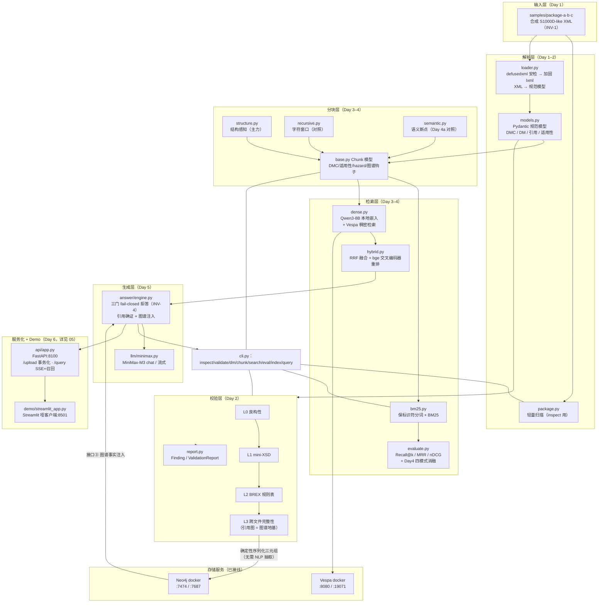
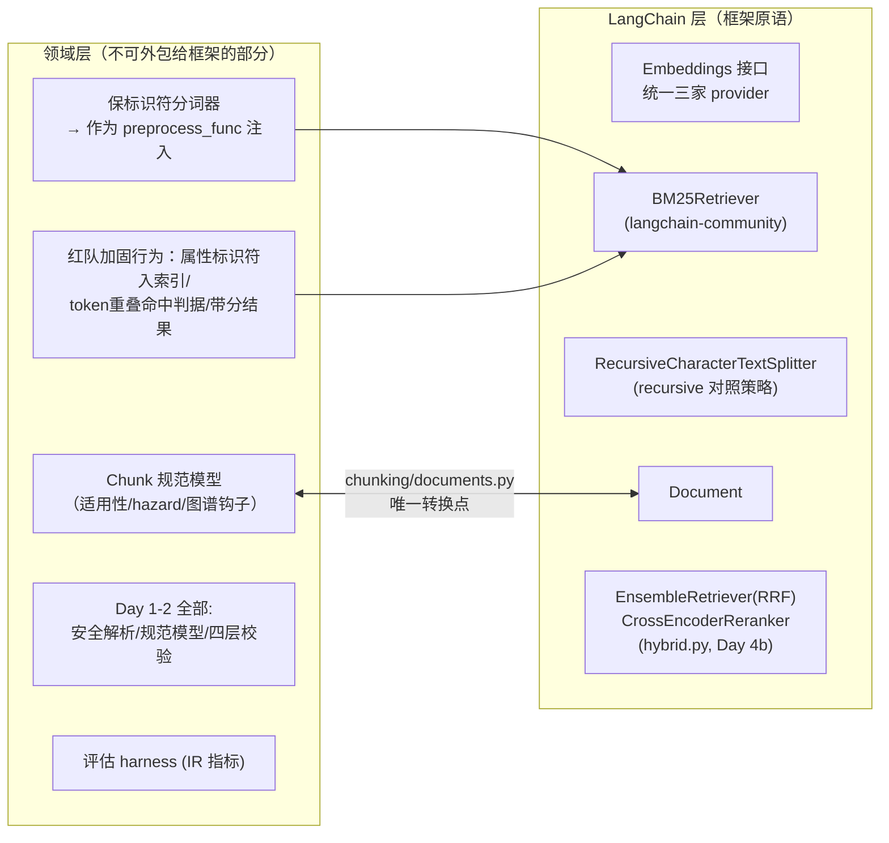

# 02 · 系统架构：数据流、模块设计思路与稳健性评估

> **AI-drafted，待人审**。快照：2026-07-17（Day 5 已合并 v0.5.0；Day 6 实现完成、
> 待提交）。图中全部节点均已实现（Day 1–6）。
> Day 6 的服务化架构单列于 [05-api-and-demo](05-api-and-demo.md)。

## 1. 总架构图



## 2. 数据流（一条 XML 的旅程）

1. **进门安检**（loader.py）：defusedxml 先过一遍（防实体炸弹/外部实体），
   再由禁实体、禁 DTD、禁网络的 lxml 重解析拿行号与 XPath；超过大小上限直接
   fail-closed 拒收。**任何文件都不会以"未安检"状态进入下游。**
2. **规范化**（models.py）：XML 变成带类型的 Pydantic 模型。适用性同时保留
   displayText（人读）和结构化断言（机器过滤）——这是 Day 2 为 Day 3 埋的钩子。
3. **两条消费路径**：
   - **校验路径**：L0→L1→L2→L3 逐层收紧，低层失败不进高层（INV-4）；
     L3 顺手建出跨文件引用图。
   - **检索路径**：分块器沿文档自带边界切块，chunk 继承 DMC、适用性
     （排除场合）、hazard 标志（紧急场合）、出站引用（图谱钩子）——
     下游永远不需要回头重新解析 XML。
4. **评估闭环**：检索结果对着**人工标注**的 golden set 打分，
   数字进 README 且必附复跑命令（INV-5）。
5. **检索→生成（Day 5）**：混合检索+重排出候选，`answer_question` 过**三门
   fail-closed**——阈值门(重排 top-1 < 实测阈值,不调 LLM)、LLM 门
   (`is_answerable:false`/契约违规)、**引用确证门**(每条 quote 须是被引 chunk
   的逐字子串);任一不过 → 拒答占位符。图谱事实(接口③)与证据一起进 prompt。
6. **生成→服务化（Day 6）**：同一 `answer_question` 经 `on_event` 回调向
   FastAPI 吐 status/token/retract 事件,SSE 推给 Streamlit 哑客户端;
   **流式带召回**——生成完无有效引用即回撤已显示内容(详见 05)。

## 3. 模块设计思路（为什么长这样）

### 3.0 LangChain：系统默认技术栈（2026-07-16 起，重点说明）

Yi Xin 裁决（discussions/day4 D13）：LangChain 作为项目默认技术选型引入——
动机是**借项目掌握框架**，同时成为后续组件的默认实现方式。落地原则：
**框架接管管道原语，领域逻辑保留在自己这层**。



各天代码的 LangChain 化审计结论（D13）：

| 组件 | 结论 |
| --- | --- |
| Day 1–2（XML 安全解析、规范模型、四层校验器） | **无 LangChain 等价物**——校验不是该框架的领域，保持自研 |
| Day 3 recursive 对照分块 | **已升级**为 LC `RecursiveCharacterTextSplitter`（800/100） |
| Day 3 BM25 | **已升级**为 LC `BM25Retriever`（底层同为 rank-bm25），分词器经 `preprocess_func` 注入；三项红队加固行为在我们的包装层保留 |
| Day 3 structure-aware 分块 | 领域 IP，无等价物，保留；经 `Document` 桥接进框架 |
| Day 4 embedding 供应商 | 全部躲在 `Embeddings` 接口后（MiniMax 自研适配器——stock 版连不上带 X-Proxy-Token 的代理；本地模型用 `HuggingFaceEmbeddings`） |
| 评估 harness | 无等价物（IR 指标），保留 |
| Day 4b RRF/rerank | **已落地**：LC `EnsembleRetriever`（RRF 融合）+ `CrossEncoderReranker`（bge-reranker-v2-m3，经 `HuggingFaceCrossEncoder`），import 自 `langchain-classic` |
| Day 5 RAG 编排 | **未用 LCEL**——answer 引擎自研同步栈：三门 fail-closed 是领域逻辑不外包；LLM 客户端因非标准 X-Proxy-Token 头也自研（urllib） |

已知风险：`langchain-community`（BM25Retriever 与 reranker 的
`HuggingFaceCrossEncoder` 所在包）**已进入日落期**（import 时有弃用警告）。
接受理由：底层就是我们已有的 rank-bm25 / sentence-transformers，且领域层
包装使得改挂别处是半天工作量；出现独立集成包后再迁。

### 3.1 单向分层，无环依赖

```text
package.py ──┐
loader.py ───┼──▶ models.py（只被依赖，不依赖任何人）
validation/ ─┘         ▲
chunking/  ────────────┘        chunking 依赖 loader + models
retrieval/ ──▶ chunking + embedding/ + vespa/   （Chunk 即接口，看不见 XML）
answer/ ─────▶ retrieval + llm/ + graph/        （三门拒答在这一层）
cli.py ──┐
api/ ────┴──▶ 以上全部（两个平行编排点，不含领域逻辑）
```

- **models.py 是纯数据层**：零业务逻辑，谁都可以依赖它，它不依赖任何模块。
- **Chunk 是检索层与解析层之间的防腐层**：retrieval/ 只认识 Chunk，
  不认识 XML。Day 4 换成 Vespa/embedding 时，解析层一行不用动。
- **cli.py 曾是唯一编排点**：模块之间不互相调用编排逻辑。**Day 6 验证了这条
  接缝**——`api/app.py` 与 CLI 平行编排同一批引擎函数（`analyze_package`/
  `index_package`/`answer_question`），领域逻辑一行未改，两个前端共用同一 INV-4
  fail-closed 映射。

### 3.2 "对照组"是架构的一等公民

recursive.py 存在的唯一目的就是被打败：没有结构盲的对照组，"结构感知值多少分"
就只是一句主张而不是一个数字。Day 4 的消融表（BM25/dense/hybrid/+rerank 四行）
是同一思想的延伸——**每个架构主张必须有一行对照数字**。

### 3.3 未来钩子是显式义务，不是顺手为之

- L3 引用图 → Neo4j 三元组（discussions/day3 D3：图的关键信息**不需要 NLP 抽取**，
  确定性序列化规范模型即可）；
- Chunk 携带 `outbound_dm_refs`/`icn_refs` → D3 的"不许饿死未来图谱"义务；
- Applicability 结构化断言 → Day 4/5 检索过滤与 RAG 拒答的输入。

## 4. 稳健性评估（诚实分层，INV-7）

### 4.1 工程化的部分（可信赖）

| 机制 | 说明 |
| --- | --- |
| 安全解析 | defusedxml + 加固 lxml 双通道；大小上限 fail-closed；控制字符清洗 |
| Fail-closed 分层 | 校验低层失败不进高层；**RAG 三门(阈值/LLM/引用确证)证据不足即拒答(INV-4,Day 5)**；索引服务失败绝不降级作答 |
| 引用可追溯 | 每条答案带 chunk_id + DMC + XPath + 逐字 quote；LLM 只吐 chunk_id,DMC/XPath 系统回填(防引用漂移) |
| 索引一致性 | `index_package` 写 manifest(provider/strategy/chunk_id)，`verify_corpus` 三查 fail-closed 防陈旧/混合索引；**Day 6 上传磁盘事务化**(staging 校验+索引后原子换入) |
| 服务化健壮性(Day 6) | 路由 `def` 进线程池(不堵事件循环)；SSE 召回覆盖门拒答+传输中断；CSRF Origin 门；`make demo` fail-closed 预检 |
| 可复现性 | uv.lock + CI `--locked` + 依赖上界；固定种子；版本化 golden set；chunk_id 确定性哈希；**实测拒答阈值 artifact(非手挑)** |
| 证据链 | 每个基准数字 → 复跑命令 → 人工标注集；红队数字合并前人工复跑 |
| 供应链 | CI action 按 SHA 固定；pre-commit 防私钥入库 |

### 4.2 玩具层（已知且已标注的简化）

| 简化 | 真实世界对应 | 触发升级的条件 |
| --- | --- | --- |
| mini-XSD | 真实 S1000D schema（数千元素） | 本切片不升级（INV-1 限制下无意义） |
| BREX-001 危险词词表 | 业务方编写的 BREX 规则 | 有真实业务规则来源时 |
| 拒答阈值门玩具规模弱 | 校准良好的置信模型 | 分布重叠、只挡 1/15 陷阱;真拒答靠三门叠加(诚实分层) |
| 引用确证 = 逐字子串必要条件 | 语义 entailment | **Day 8 对抗评估**做语义蕴含,当前只保证「引用指向真实存在的原文」 |
| 每请求重新 chunk 全语料 | 共享缓存 + index epoch | demo 语料小,正确性压过延迟;缓存化牵出红队 #8 内容哈希 |
| 单机模拟分布式 | 真分片 | 切片外；INV-2 保证接口不封死这条路 |
| Demo 单用户单 worker、无鉴权 | 公网多租户 | loopback 前提;限流/JWT/熔断明确超范围(扫描 §未知的已知) |

### 4.3 适应性检查：Day 4–10 的增量能不能接住

| 变更 | 现有接缝 | 落地结果 |
| --- | --- | --- |
| 稠密嵌入（Day 4） | Chunk.text 即输入；`Embeddings` 接口 | ✅ 换到 **Qwen3-8B 本地**——MiniMax 因长度偏置移除;换 provider 是注册表一行 |
| Vespa 稠密/混合检索（Day 4） | retrieval/ 只认 Chunk | ✅ schema 部署 + `VespaDenseRetriever`,scope 过滤 fail-closed |
| RRF + 重排（Day 4） | 两路召回都返回 chunk_id 排名 | ✅ `EnsembleRetriever` + `bge-reranker-v2-m3` |
| Neo4j 三元组（Day 5，ADR-0002） | L3 引用图 + chunk 图谱钩子 | ✅ 索引时图同步 + 接口③ 事实注入(多跳留 Day 9) |
| RAG 问答（Day 5） | 带 DMC/XPath 锚点的 chunk | ✅ 三门 fail-closed + 引用回填 |
| FastAPI + Demo（Day 6） | 编排集中、领域逻辑不外泄 | ✅ API 平行编排引擎函数,零领域改动;SSE 召回是新增协议层 |
| 语义 groundedness（Day 8） | 引用确证已卡逐字子串必要条件 | 待做:蕴含判定叠在现有门之上 |
| 多跳图查询（Day 9） | graph.facts 已就位、ADR-0002 划界 | 待做:依赖查询类 |

**结论**:Day 4–6 的增量都从既有接缝接住了,`Embeddings` 接口、Chunk 防腐层、
cli 编排点三处设计在各自那天兑现了预留价值;无隐性债务,已知简化均在诚实分层登记。
