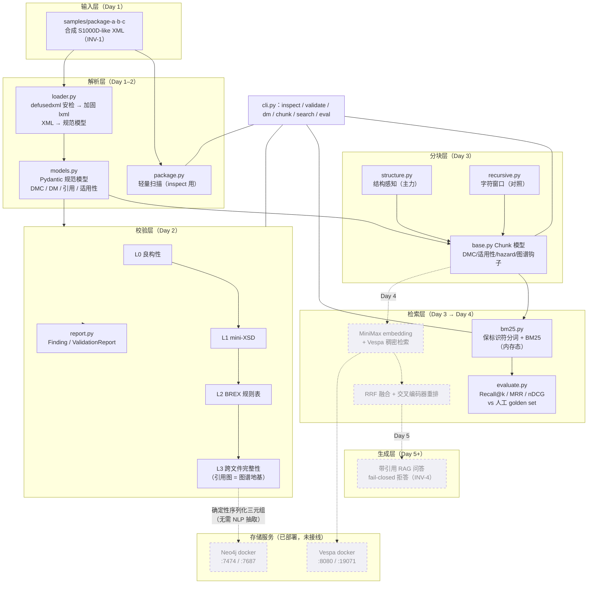

# 02 · 系统架构：数据流、模块设计思路与稳健性评估

> **AI-drafted，待人审**。快照：2026-07-15（Day 3 完成、Day 4 未动工）。
> 图中实线 = 已实现；虚线 = 已完成选型/部署但代码未写（Day 4+ 计划）。

## 1. 总架构图



## 2. 数据流（一条 XML 的旅程）

1. **进门安检**（loader.py）：defusedxml 先过一遍（防实体炸弹/外部实体），
   再由禁实体、禁 DTD、禁网络的 lxml 重解析拿行号与 XPath；超过大小上限直接
   fail-closed 拒收。**任何文件都不会以"未安检"状态进入下游。**
2. **规范化**（models.py）：XML 变成带类型的 Pydantic 模型。适用性同时保留
   displayText（人读）和结构化断言（机器过滤）——这是 Day 2 为 Day 3 埋的钩子。
3. **两条消费路径**：
   - **校验路径**：L0→L1→L2→L3 逐层收紧，低层失败不进高层（INV-4）；
     L3 顺手建出跨文件引用图。
   - **检索路径**：分块器沿文档自带边界切块，chunk 继承 DMC、适用性
     （排除场合）、hazard 标志（紧急场合）、出站引用（图谱钩子）——
     下游永远不需要回头重新解析 XML。
4. **评估闭环**：BM25 检索结果对着**人工标注**的 golden set 打分，
   数字进 README 且必附复跑命令（INV-5）。

## 3. 模块设计思路（为什么长这样）

### 3.1 单向分层，无环依赖

```text
package.py ──┐
loader.py ───┼──▶ models.py（只被依赖，不依赖任何人）
validation/ ─┘         ▲
chunking/  ────────────┤   chunking 依赖 loader + models
retrieval/ ────────────┘   retrieval 只依赖 chunking（Chunk 即接口）
cli.py ──▶ 以上全部（唯一的编排点）
```

- **models.py 是纯数据层**：零业务逻辑，谁都可以依赖它，它不依赖任何模块。
- **Chunk 是检索层与解析层之间的防腐层**：retrieval/ 只认识 Chunk，
  不认识 XML。Day 4 换成 Vespa/embedding 时，解析层一行不用动。
- **cli.py 是唯一编排点**：模块之间不互相调用编排逻辑，方便 Day 6 把 CLI
  换成/加上 FastAPI——编排逻辑挪个地方就行。

### 3.2 "对照组"是架构的一等公民

recursive.py 存在的唯一目的就是被打败：没有结构盲的对照组，"结构感知值多少分"
就只是一句主张而不是一个数字。Day 4 的消融表（BM25/dense/hybrid/+rerank 四行）
是同一思想的延伸——**每个架构主张必须有一行对照数字**。

### 3.3 未来钩子是显式义务，不是顺手为之

- L3 引用图 → Neo4j 三元组（discussions/day3 D3：图的关键信息**不需要 NLP 抽取**，
  确定性序列化规范模型即可）；
- Chunk 携带 `outbound_dm_refs`/`icn_refs` → D3 的"不许饿死未来图谱"义务；
- Applicability 结构化断言 → Day 4/5 检索过滤与 RAG 拒答的输入。

## 4. 稳健性评估（诚实分层，INV-7）

### 4.1 工程化的部分（可信赖）

| 机制 | 说明 |
| --- | --- |
| 安全解析 | defusedxml + 加固 lxml 双通道；大小上限 fail-closed；控制字符清洗 |
| Fail-closed 分层 | 校验低层失败不进高层；未来 RAG 证据不足即拒答（INV-4） |
| 可复现性 | uv.lock + CI `--locked` + 依赖上界；固定种子；版本化 golden set；chunk_id 确定性哈希 |
| 证据链 | 每个基准数字 → 复跑命令 → 人工标注集；红队数字合并前人工复跑 |
| 供应链 | CI action 按 SHA 固定；pre-commit 防私钥入库 |

### 4.2 玩具层（已知且已标注的简化）

| 简化 | 真实世界对应 | 触发升级的条件 |
| --- | --- | --- |
| mini-XSD | 真实 S1000D schema（数千元素） | 本切片不升级（INV-1 限制下无意义） |
| BREX-001 危险词词表 | 业务方编写的 BREX 规则 | 有真实业务规则来源时 |
| 内存态 BM25、无持久化 | 服务化索引 | Day 4 spec 问题：BM25 是否搬进 Vespa |
| 单机模拟分布式 | 真分片 | 切片外；INV-2 保证接口不封死这条路 |
| zero-hit 率 0.40 | 词汇检索不会拒答 | Day 5 fail-closed 答案层 + Day 8 对抗评估解决，**不靠 BM25 解决** |

### 4.3 适应性检查：Day 4–10 的增量能不能接住

| 即将到来的变更 | 现有接缝 | 风险 |
| --- | --- | --- |
| MiniMax embedding（Day 4） | Chunk.text 即输入；新建 embedding client（参考实现只有 chat，**embedding 端点形状未验证**——local-services.md 开口项） | 中：端点形状是 Day 4 spec 必答题 |
| Vespa 稠密/混合检索（Day 4） | retrieval/ 只认 Chunk，可平行加 VespaIndex；容器已跑通，**schema 未部署** | 中：Vespa 应用包部署是新领域 |
| RRF + 重排（Day 4） | 两路召回都返回 chunk_id 排名，融合是纯函数 | 低 |
| Neo4j 三元组（Day 4 复评点） | L3 引用图 + chunk 图谱钩子已就位，序列化是确定性的 | 低（是否入切片待 Day 4 收口复评） |
| RAG 问答（Day 5） | 检索返回带 DMC/XPath 锚点的 chunk，引用标注天然可做 | 低 |
| FastAPI（Day 6) | 编排逻辑集中在 cli.py，平移即可 | 低 |

**结论**:架构对 Day 4–10 的计划增量是开放的；两个真实风险点都在 Day 4
（MiniMax embedding 端点、Vespa schema 部署），且都已被记录为 spec 必答题，
不是隐性债务。
