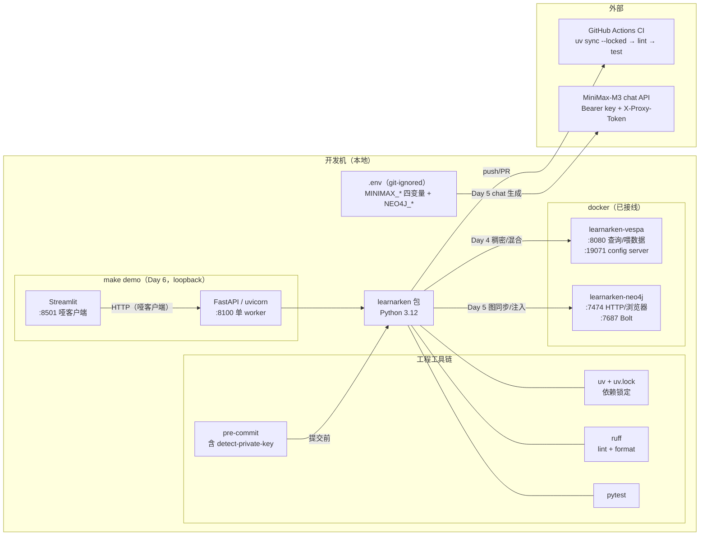

# 03 · 配置全景：工具链、本地服务与外部 API

> **AI-drafted，待人审**。快照：2026-07-17（Day 5 已接线 Vespa/Neo4j/MiniMax；
> Day 6 加 FastAPI + Streamlit）。密钥值一律不出现在仓库（只在本地 `.env`，
> git-ignored）；本文只记录变量名、端口与拓扑。服务操作细节的权威文档是
> [docs/local-services.md](../local-services.md)。

## 1. 配置拓扑图



## 2. 工程工具链配置

| 配置项 | 所在文件 | 要点 |
| --- | --- | --- |
| Python 版本 | pyproject.toml | `>=3.12`（StrEnum、新语法） |
| 依赖策略 | pyproject.toml + uv.lock | 运行时仅 4 个依赖，全部带上界；CI `--locked` 安装。**理由**：解析器行为不许在未锁定安装下漂移（Day 2 红队裁决 #13） |
| ruff | pyproject.toml `[tool.ruff]` | py312 目标、100 列、规则集 E/F/I/UP/B/SIM |
| pytest | pyproject.toml `[tool.pytest.ini_options]` | testpaths=tests，`-q` |
| pre-commit | .pre-commit-config.yaml | ruff（--fix）+ ruff-format + 大文件/冲突/**私钥检测**/空白 |
| CI | .github/workflows/ci.yml | push(main) + PR 触发；action 按 commit SHA 固定 |
| 入口命令 | pyproject.toml `[project.scripts]` | `learnarken` → `cli:main`，9 个子命令（加 `index`/`query`/`eval ablation`）|
| 运行时依赖 | pyproject.toml | Day 4/5/6 增至含 langchain 全家 + sentence-transformers + fastapi/uvicorn/python-multipart，**全部带上界**；`streamlit` 在独立 `demo` 组、`httpx` 在 `dev` 组。CI 三处均 `--locked`（红队 day6 #10:锁文件是唯一事实源）|
| Day 6 一键 demo | Makefile `demo` → tools/run_demo.sh | fail-closed 预检 → uvicorn 单 worker → 轮询就绪(超时非零退出) → Streamlit |

## 3. 本地 docker 服务（Day 3 部署，Day 4–5 接线完成）

### Vespa — 向量数据库（稠密/混合检索）

| 项 | 值 |
| --- | --- |
| 容器名 | `learnarken-vespa`（镜像 `vespaengine/vespa:latest`） |
| 端口 | `8080` 查询/喂数据；`19071` config server |
| 鉴权 | 无（仅本地开发） |
| 就绪信号 | `curl -s localhost:19071/state/v1/health` → `up` |
| **当前状态** | ✅ **已接线**（Day 4）:应用包 `chunk.sd` schema 已部署,`index`/`search`/`query` 走稠密/混合检索;`verify_corpus` 用 `list_doc_ids` 校验 engine 与本地语料一致 |

### Neo4j — 图存储（三元组导出 / graph-RAG 备选）

| 项 | 值 |
| --- | --- |
| 容器名 | `learnarken-neo4j`（镜像 `neo4j:latest`，community 2026.06.0） |
| 端口 | `7474` HTTP/浏览器 UI；`7687` Bolt 驱动 |
| 凭证 | `neo4j` / `learnarken`（一次性本地开发口令，可留在文档；一旦暴露到 localhost 之外必须挪进 `.env`） |
| 验证 | `docker exec learnarken-neo4j cypher-shell -u neo4j -p learnarken 'RETURN 1;'` |
| 凭证来源 | `NEO4J_USER`/`NEO4J_PASSWORD` 走 `.env`（`.env.example` 已列） |
| **当前状态** | ✅ **已接线**（Day 5，ADR-0002）:`index` 时 `graph.sync` 幂等 upsert DM 节点 + dmRef/ICN 边;`query` 经 `graph.facts` 做接口③ 上下文注入。多跳依赖查询留 Day 9。 |

## 4. MiniMax-M3 chat API（Day 5 生成供应商）

环境变量（值只在本地 `.env`；`config.load_minimax_config` 只读 repo-root `.env`、
仅接受 `MINIMAX_*` 白名单、强制 https——红队 day4 #7 加固）：

| 变量 | 用途 |
| --- | --- |
| `MINIMAX_API_URL` | base url |
| `MINIMAX_MODEL_NAME` | 模型名（`MiniMax-M3`）|
| `MINIMAX_API_KEY` | `Authorization: Bearer` |
| `MINIMAX_API_PROXY_TOKEN` | **非标准 `X-Proxy-Token` 请求头**——库存 OpenAI SDK 不会带，必须手工加 |

**已探测形状**（specs/day5 Probe，2026-07-16）:OpenAI 兼容 `/chat/completions`,
成功 = HTTP 200 **且** `base_resp.status_code==0`;**M3 恒发 `<think>…</think>`
前缀**(即便 temp 0 + `response_format:json_object`),解析前剥除。**Day 6 补测流式**
(2026-07-17):`stream:true` 走 `text/event-stream`,delta 里含 think,无 `[DONE]`
哨兵,stream 模式 `usage` 为 null——`chat_json_stream` 据此实现。

**历史**:MiniMax 曾是 *embedding* 供应商候选,因实测长度偏置于 Day 4 裁决移除
(现默认 Qwen3-8B 本地);该裁决不覆盖 chat/生成——即本节 M3 所做。

## 5. Demo 服务（Day 6，`make demo`，均 loopback）

| 服务 | 端口 | 要点 |
| --- | --- | --- |
| FastAPI / uvicorn | `127.0.0.1:8100` | **单 worker**（本地嵌入/重排模型进程内常驻,多 worker 各加载一份炸内存）；路由 `def` 进线程池；`/health` `/upload` `/query`(SSE) |
| Streamlit | `127.0.0.1:8501` | 哑客户端,只 HTTP 打后端 |

安全边界（详见 [05-api-and-demo §5](05-api-and-demo.md)）:仅 loopback 绑定;
**CSRF Origin 门**守 `/upload` `/query`（server 端客户端无 Origin 头放行,浏览器
跨源 403）;上传 Content-Length 预检 + 2 MiB 上限 + `DMC-*.xml` 文件名服务端重铸;
`var/uploads/`（git-ignored）是上传落盘区,事务化 staging 在 `.staging/` 子目录。
不做鉴权/限流/JWT——loopback 前提下属超范围。

## 6. 配置层级与密钥红线

```text
仓库内（公开）          仓库内（文档）           本地（绝不入库）
├─ pyproject.toml      ├─ local-services.md    ├─ .env（MINIMAX_*/NEO4J_* 值）
├─ uv.lock             │   变量名/端口/命令      ├─ var/uploads/（demo 上传落盘）
├─ ci.yml              │   （无任何密钥值）       └─ 真实 S1000D 参考文件
├─ .env.example（形状） └─ 本目录（快照）              （samples/s1000d 非提交部分）
└─ .pre-commit（防线）
```

红线执行有三道机器防护：`.gitignore`（第一 commit 即配,含 `.env`/`var/`）、
pre-commit `detect-private-key`、以及"文档只记形状不记值"的写作纪律。
