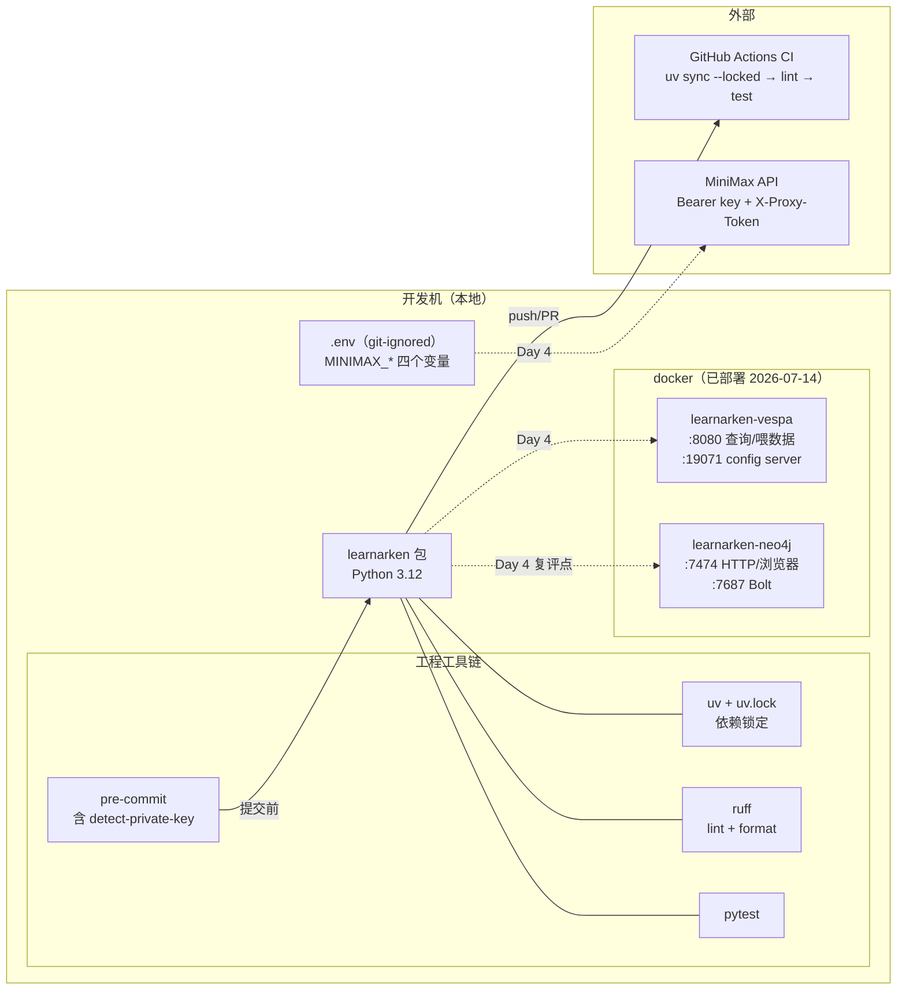

# 03 · 配置全景：工具链、本地服务与外部 API

> **AI-drafted，待人审**。快照：2026-07-15。密钥值一律不出现在仓库
> （只在本地 `.env`，git-ignored）；本文只记录变量名、端口与拓扑。
> 服务操作细节的权威文档是 [docs/local-services.md](../local-services.md)。

## 1. 配置拓扑图



## 2. 工程工具链配置

| 配置项 | 所在文件 | 要点 |
| --- | --- | --- |
| Python 版本 | pyproject.toml | `>=3.12`（StrEnum、新语法） |
| 依赖策略 | pyproject.toml + uv.lock | 运行时仅 4 个依赖，全部带上界；CI `--locked` 安装。**理由**：解析器行为不许在未锁定安装下漂移（Day 2 红队裁决 #13） |
| ruff | pyproject.toml `[tool.ruff]` | py312 目标、100 列、规则集 E/F/I/UP/B/SIM |
| pytest | pyproject.toml `[tool.pytest.ini_options]` | testpaths=tests，`-q` |
| pre-commit | .pre-commit-config.yaml | ruff（--fix）+ ruff-format + 大文件/冲突/**私钥检测**/空白 |
| CI | .github/workflows/ci.yml | push(main) + PR 触发；action 按 commit SHA 固定 |
| 入口命令 | pyproject.toml `[project.scripts]` | `learnarken` → `cli:main`，6 个子命令 |

## 3. 本地 docker 服务（Day 3 环境准备日部署，Day 4 接线）

### Vespa — 向量数据库（稠密/混合检索）

| 项 | 值 |
| --- | --- |
| 容器名 | `learnarken-vespa`（镜像 `vespaengine/vespa:latest`） |
| 端口 | `8080` 查询/喂数据；`19071` config server |
| 鉴权 | 无（仅本地开发） |
| 就绪信号 | `curl -s localhost:19071/state/v1/health` → `up` |
| **当前状态** | 容器运行、config server 健康；**应用包（schema）未部署**——8080 在部署 schema 前不应答查询，部署是 Day 4 工作 |

### Neo4j — 图存储（三元组导出 / graph-RAG 备选）

| 项 | 值 |
| --- | --- |
| 容器名 | `learnarken-neo4j`（镜像 `neo4j:latest`，community 2026.06.0） |
| 端口 | `7474` HTTP/浏览器 UI；`7687` Bolt 驱动 |
| 凭证 | `neo4j` / `learnarken`（一次性本地开发口令，可留在文档；一旦暴露到 localhost 之外必须挪进 `.env`） |
| 验证 | `docker exec learnarken-neo4j cypher-shell -u neo4j -p learnarken 'RETURN 1;'` |
| **当前状态** | 容器运行、鉴权通；**无数据**——是否把最小图查询拉入切片，待 Day 4 收口复评点决定（execution-plan Day 4 🔁） |

## 4. MiniMax API（Day 4 embedding 供应商）

环境变量（值只在本地 `.env`）：

| 变量 | 用途 |
| --- | --- |
| `MINIMAX_API_URL` | base url |
| `MINIMAX_MODEL_NAME` | 模型名 |
| `MINIMAX_API_KEY` | `Authorization: Bearer` |
| `MINIMAX_API_PROXY_TOKEN` | **非标准 `X-Proxy-Token` 请求头**——库存 OpenAI SDK 不会带，必须手工加（参考实现：FollowTheBig `src/followthebig/utils/llm.py`，含 3 次指数退避重试） |

**Day 4 开口项（spec 必答）**：参考实现只有 chat completions，**没有 embedding
端点**——embedding 调用是新代码，两种候选形状（OpenAI 兼容 `/embeddings` vs
MiniMax 原生 `texts` + `type: db/query` + `GroupId`）须先对真实端点验证再定。

## 5. 配置层级与密钥红线

```text
仓库内（公开）          仓库内（文档）           本地（绝不入库）
├─ pyproject.toml      ├─ local-services.md    ├─ .env（MINIMAX_* 值）
├─ uv.lock             │   变量名/端口/命令      └─ 真实 S1000D 参考文件
├─ ci.yml              │   （无任何密钥值）          （samples/s1000d 非提交部分）
└─ .pre-commit（防线）  └─ 本目录（快照）
```

红线执行有三道机器防护：`.gitignore`（第一 commit 即配）、pre-commit
`detect-private-key`、以及"文档只记形状不记值"的写作纪律。
