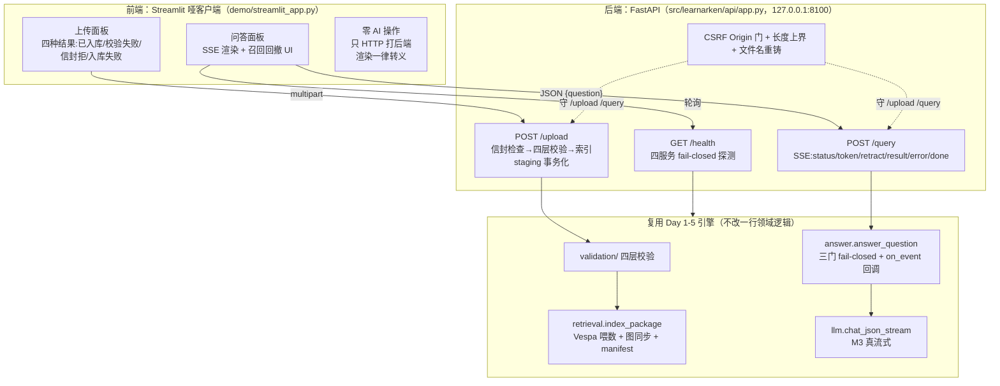
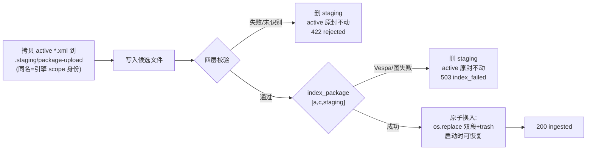

# 05 · 服务化与 Demo：FastAPI + Streamlit（Day 6，Day 10 公网化补章）

> **AI-drafted，待人审**。快照：2026-07-18（Day 1–10 全部合并，`v1.0.0`）。
> 本篇讲 CLI→HTTP 服务化的架构：一个 FastAPI 后端 + 一个
> Streamlit **哑客户端**,SSE 流式带**召回/回撤**,上传**事务化**入库;
> §9 是 Day 10 的公网模式与按需部署补章。
> 决策出处：[specs/day6](../specs/day6.md)、[discussions/day6](../discussions/day6.md)、
> [reviews/day6](../reviews/day6.md)（两轮红队 + 裁决）、
> [research/day6-unknowns](../research/day6-unknowns.md)；Day 10 侧
> [specs/day10](../specs/day10.md)、[reviews/day10](../reviews/day10.md)。

## 1. 总架构图

## 2. 三个决定架构的取舍（面试级）

### 2.1 SSE × fail-closed:为什么选「真流式 + 事后召回」

这是 Day 6 的核心裁决(discussions/day6 D1,Yi Xin 裁)。矛盾在于:
**引用确证(第三道门)只能在拿到完整 JSON 后跑**,而 SSE 的价值是先吐字。
先吐的字可能事后被判「该拒答」——直接顶撞 INV-4(有据回答 xor 拒答)。

未知点扫描曾倾向「不流式」(维修域说错扭矩值的代价 ≫ 晚 3 秒)。裁决推翻它:
**流式,且流本身可召回**。协议层落地:

- 流式 token 显式标注**「未经引用确证」**——这是刻意可见的属性,不是泄漏;
- 生成完若无有效引用 ⇒ 发 `retract` 事件,前端抹掉已显示内容,落到标准拒答;
- INV-4 约束的是**最终**结果:一次回答要么带确证引用、要么是拒答占位符,
  中间流出的字永远以「未生效」呈现,失败即回撤。

架构立场一句话:**把「未确证」这件事做成协议里的一等事件,而不是藏起来赌它不发生。**

### 2.2 同步栈接 ASGI:路由声明 `def` 而非 `async def`

`answer_question` 全栈同步(urllib LLM 客户端、sentence-transformers、reranker)。
FastAPI 的 `def` 路由自动进线程池,`async def` 路由独占事件循环——同步阻塞代码
写进 `async def` 就是「服务级瘫痪」。所以路由声明 `def`,引擎跑在 worker 线程,
经 `queue.Queue` 把事件喂给 SSE 生成器。**知道什么时候不该 async,比会写 async
更能证明理解。**

### 2.3 哑客户端:保证放在结构里,不放在约定里

Streamlit **绝不 import `learnarken`**(测试强制断言)。所有实质计算走 HTTP。
理由:UI 里写业务逻辑 ⇒ 前后端两套规则、结果漂移。这和 Day 5「引用确证在引擎层、
决不靠 prompt 约定」是同一种立场。模型/文档文本一律转义渲染(`st.text`/`st.table`,
无 `unsafe_allow_html`)——上传的文档无法把 HTML/JS 夹带进操作员浏览器。

## 3. 上传的事务化(红队 day6 #1)

**问题**:直接把新文件写进 active 目录,若随后校验/索引失败,已被覆盖的旧的
有效模块就永久丢了;崩溃在「写入」与「校验」之间会留下未校验的 active 文件。

**解法**(`_staged_commit`):active 目录在校验**且**索引都通过前绝不改动。

- staging 目录与 active **同名**(`package-upload`)——basename 是引擎侧的
  package scope 身份,staging 不能改变它(否则 Vespa 文档 scope 漂移)。
- chunk_id 是内容哈希、与目录名无关,所以 staging 与换入后的 active 产出同一批
  chunk_id,manifest/query 的 `verify_corpus` 天然对齐。
- 原子换入用 `os.replace` 两段(active→trash、staging→active),中间空窗由
  `_corpus_lock` 覆盖,崩在空窗由启动时 `_recover_interrupted_swap` 修复。
- **兜底**:`try/finally` 保证任何路径(含意外异常)都清 staging,而 active 只被
  换入段触碰,清理不会污染它。
- 遗留边界:index_package 内部若 Vespa 半喂成功再失败(孤儿文档),是 day5 #8
  的 index-epoch 议题,下一次查询的 `verify_corpus` 会 fail-closed 拦住——诚实拒绝。

## 4. SSE 事件协议与召回完整性(红队 day6 #3)

`POST /query` → `text/event-stream`,事件序:

| 事件 | 载荷 | 语义 |
| --- | --- | --- |
| `status` | `{stage}` | retrieval/rerank/generating 进度 beat |
| `token` | `{text}` | **answer 字段**增量文本(经 `AnswerFieldExtractor` 从 M3 流里剥出,跳过 `<think>`/JSON 脚手架);**确证前**,刻意窗口 |
| `retract` | `{gate,message}` | 生成后被 fail-closed 门(`llm`/`llm-contract`/`citation-validation`)否决,**或**已吐 token 后流传输中断(`gate:transport`)——客户端须撤回全部 token |
| `result` | 完整 `AnswerResult` | 唯一权威结果(答案或拒答占位符);阈值门拒答无前置 token(LLM 从未被调) |
| `error` | `{message}` | fail-closed 传输/服务失败,已 `_sanitize` |
| `done` | `{}` | 终止 beat |

**召回完整性**:三门拒答由引擎的 `refuse()` 发 `retract`(阈值门除外——没生成
东西);**传输中断**由 API 层补:若已吐 token 再发生 `LLMError`,先发
`retract`(`gate:transport`)再发 `error`——非 Streamlit 的 SSE 客户端也拿到
协议级撤回信号,不会把未确证的字留在屏幕上。二者互斥,绝不重复发 retract。

## 5. Demo 安全边界(决策 4,demo 范围)

| 面 | 措施 | 出处 |
| --- | --- | --- |
| 网络暴露 | 仅 bind `127.0.0.1`(两服务);本地前提下不做限流/JWT。**公网面是 Day 10 的加法**(见 §9),本节信封原样保留 | 扫描 §未知的已知 |
| **CSRF** | 状态变更路由(`/upload` `/query`)查 `Origin`/`Referer`:server 端客户端(Streamlit `requests`、curl)无此头 → 放行;浏览器跨源 POST 带外源头 → 403。挡住 drive-by 站点的语料投毒 | 红队 day6 #4 |
| 查询输入 | Pydantic `min_length=3,max_length=500`;问题在证据栅栏之外(Day 5 spotlighting) | — |
| 上传输入 | Content-Length 预检(多部解析前) + 读后 2 MiB 上限 + `DMC-*.xml` 文件名服务端重铸 + UTF-8 可解 + defusedxml + 四层校验 | 红队 day6 #2/#7 |
| 错误暴露 | fail-closed 错误只出「类型+消息」且 `_sanitize`;意外异常出不透明「internal error」并落日志 | 红队 day6 #8 |

安全评审(第二个 Agent)结论:清掉了路径穿越、Streamlit XSS、XXE、日志泄密;
唯一 Medium 是 CSRF,已修。

## 6. 一键 Demo:`make demo`

`tools/run_demo.sh`:**fail-closed 预检**(`tools/demo_preflight.py`:repo-root
cwd、`.env`、阈值 artifact、Vespa、Neo4j——任一缺给出修复命令并中止)→ 起
uvicorn(**单 worker**:本地嵌入/重排模型进程内常驻,多 worker 各加载一份会炸
内存)→ 轮询 `/health`,**60s 内不健康则非零退出**(绝不把前端接到死后端,
红队 day6 #6)→ 起 Streamlit,均 bind loopback,Ctrl-C 双双停。

## 7. 状态管理:CLI→服务化的真正鸿沟

`answer_question` **每请求**重新 chunk 全语料 + `verify_corpus`。CLI 一次性进程
无所谓;服务端这是每请求开销。Day 6 的裁决是**保留每请求重验**(不做 lifespan
缓存):上传后新模块即刻可查,manifest 检查始终诚实,demo 语料小、正确性压过延迟。
缓存化会牵出「索引漂移了怎么办」——即 index epoch / content hash(红队 #8),
明确留给后续。模型本身仍进程内缓存(`@cache` 的 embedder、`_RERANKER_CACHE`)。

## 8. 稳健性分层(诚实,INV-7)

| 层 | 说明 |
| --- | --- |
| 工程化(可信) | 上传磁盘事务化;SSE 召回覆盖门拒答+传输中断;CSRF Origin 门;fail-closed 预检;哑客户端结构性保证;**Day 10:demo_guard 三闸 + VM 内看门狗** |
| 玩具层(已标注) | 单用户单 worker;`_corpus_lock` 粗粒度(查询racing换空窗最坏 fail-closed);无 request_id↔trace_id 贯穿;demo_guard 配额是进程内存(VM 短命,per-boot 作用域是对的) |
| 明确超范围 | 真多租户面(JWT/限流/水平扩展);多轮记忆;`GET /traces/{id}`;async 全栈重构;index-epoch(#8) |

## 9. Day 10 补章:公网模式与按需部署

Day 6 的一切安全推理都建立在 **loopback 前提**上。Day 10 把同一套栈放上
internet-exposed 的按需 GCP VM,前提失效——应对是**纯加法**,Day 6 信封一行未改:

### 9.1 demo_guard:公网安全信封(红队 day10 #1/#2/#4/#5,全 fail-closed)

`DEMO_PUBLIC=1` 才生效,本地 `make demo` 与测试零改变:

| 闸 | 挡什么 | 机制 |
| --- | --- | --- |
| **LLM 花费闸** | 问答路径刷爆 MiniMax 账单——**GCP $20 预算警报看不见 LLM 花费**,这是唯一真实费用围栏 | 每日调用配额 + 并发信号量;超限/满载 ⇒ 拒答,绝不排队等花钱;per-boot 内存计数(VM 30 min 自关,作用域正确) |
| **共享门钥** | drive-by IP 扫描器 | 变更/花费路由须带 `X-Demo-Key`(= `DEMO_GATE_KEY`);钥匙只从 token 状态页发放,Streamlit 从 `?k=` 转发 |
| **上传总闸** | 访客变异共享活语料、跨访客持久化 | 公网模式上传直接拒 |

前端同步收紧:公网模式隐藏上传页签、不渲染健康探测详情字符串。
`/demo/status` 刻意比 `/health` 粗——只出 stage 布尔,不出探测详情(详情可能
携带异常文本,而此端点经 shim 出公网)。

### 9.2 按需拓扑与费用围栏

完整拓扑与组件表在 [03 §7](03-config-and-services.md);文件职责在
[01 §三](01-file-inventory.md)。架构要点:

- **部署物=基准物**:VM 上跑的就是 `make demo` 拓扑(Vespa+Neo4j+本地模型+M3),
  基准表零口径漂移(specs/day10 决策 1,选型 D);
- **暴露面最小化**:公网只有 Streamlit(:8501)与只读状态 shim(:8110);
  FastAPI 保持 loopback,由 shim 单路径代理 `/demo/status`;
- **活动时钟只被业务触碰**:`/query`/`/upload` 才重置闲置时钟,状态轮询不重置
  ——否则页面倒计时轮询会让 30 分钟自关永不触发(unknowns T1);
- **看门狗在 VM 内、歧义朝关机解**:业务闲置 ≥30 min、开机 ≥3 h 硬顶、自检
  连续失联,三条任一 ⇒ 关机;不依赖任何外部服务存活。
