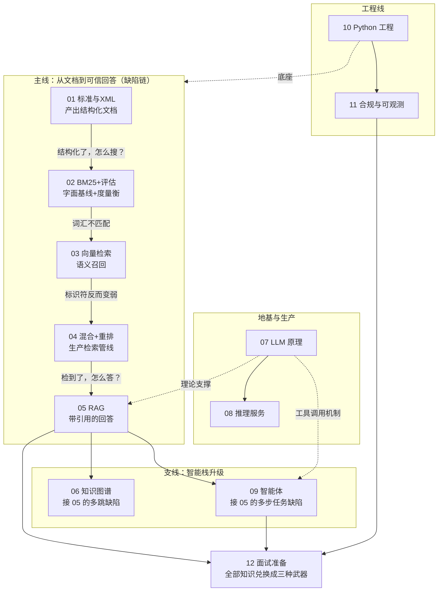

# 教程总览：写给"老程序员 + 产品经理"的现代 AI 系统入门

> 这套教程假设你：写过多年代码（懂数据库、索引、缓存、状态机、API），做过产品（懂用户价值、权衡、风险），但**没有**接触过 LLM、向量检索、知识图谱这些新东西。每篇教程都从你已有的知识出发做类比，再深入到面试需要的细节。

## 这套教程怎么用

1. **按编号顺序读**。编号顺序就是依赖顺序，跳读会遇到没解释过的术语。
2. **每篇的结构固定**：
   - 「一句话」：这个技术解决什么问题。
   - 「本篇在全局脉络中的位置」：它从哪篇继承问题、给哪篇留问题（带图）。
   - 「老类比」：用你熟悉的旧技术打比方。
   - 「原理详解」：面试深度的讲解。开头通常有「版图与选型」（§0）——这个技术的替代方案全景 + 为什么选它；结尾通常有「限制清单」——它管不了什么、**谁来接盘**，以及「杠杆排序」——力气花在哪收益最大。
   - 「调优与参数」：实际工程里要拧的旋钮。
   - 「失败模式」：什么输入会让它翻车（面试官最爱问）。
   - 「面试问答」：高频问题 + 参考答案要点。
3. **读完一篇，回到 [learning-guide.md](../learning-guide.md) 对应章节**，把"Mastery standard"当成自测题。
4. **动手环节以 [execution-plan.md](../execution-plan.md) 的日节点为准**（AI-first 工作流：人写 SPEC、AI 实现、红队评审、人裁决），教程只负责讲懂，不替代动手。

## 全书脉络图：一条缺陷链、一个地基、两条支线

十二篇不是并列的十二个主题，而是一张有向图——**主线每一篇都在解决上一篇留下的缺陷**：

每篇教程开头的「脉络位置」小图就是这张总图的局部放大。迷路时回来看这张。

## 全局心智模型：这个系统到底在干什么

用一句产品经理的话概括 LearnArken 要做的事：

> **把一堆格式严格的技术手册（飞机维修手册那种），变成一个"能回答问题、能给出处、能查合规、答案可审计"的智能系统。**

拆开看，它其实是五个你熟悉的老系统的组合，只是每个都换了新引擎：

| 老系统 | 新引擎 | 对应教程 |
| --- | --- | --- |
| ETL + 数据校验（XML 解析、Schema 校验、规则引擎） | S1000D 标准建模 + 自定义校验器 | 01 |
| 全文搜索引擎（Lucene 那一套倒排索引） | BM25 + 稠密向量 + 混合检索 | 02, 03, 04 |
| 关系数据库 + ER 图 | RDF/OWL 知识图谱 + SPARQL | 06 |
| "搜索 + 模板拼接答案"的问答系统 | RAG（检索增强生成） | 05 |
| 工作流引擎 + 规则引擎 + 审批流 | 多智能体（Agent）系统 | 09 |

再加上三块支撑能力：

| 支撑能力 | 老类比 | 对应教程 |
| --- | --- | --- |
| LLM 本身怎么工作 | 一个超大号的"自动补全"，理解它才能理解一切 | 07 |
| 推理服务（vLLM 等） | 应用服务器调优：连接池、批处理、缓存 | 08 |
| Python 工程 + 合规审计 | 你最熟悉的部分，只是场景换了 | 10, 11 |

最后一篇 12 是纯面试准备。

## 文件清单（含执行计划对应节点）

| 文件 | 主题 | 大致内容 | 动手节点 |
| --- | --- | --- | --- |
| [01-standards-and-xml.md](01-standards-and-xml.md) | 技术出版标准 | S1000D、DMC、BREX、SNS、XML/XSD/XPath、标准版图 | Day 1-2 |
| [02-information-retrieval.md](02-information-retrieval.md) | 检索基础 | 倒排索引、BM25 与替代算法、超参数实战边界、评估 | Day 3 |
| [03-embeddings-and-vector-search.md](03-embeddings-and-vector-search.md) | 向量与 ANN | embedding 模型版图、HNSW、IVF、PQ、FAISS、Qdrant | Day 4 |
| [04-advanced-retrieval.md](04-advanced-retrieval.md) | 高级检索 | 缺陷→补救版图、SPLADE、ColBERT、重排、RRF、HyDE | Day 4 |
| [05-rag.md](05-rag.md) | RAG | 知识注入版图、分块、引用、失败链、trace、judge 校准 | Day 5、8 |
| [06-knowledge-graph.md](06-knowledge-graph.md) | 知识图谱 | 知识表示版图、RDF/OWL/SPARQL、命名图版本、三接口 | 元数据 Day 3；全图 Planned |
| [07-llm-fundamentals.md](07-llm-fundamentals.md) | LLM 原理 | 接入方式版图、token、prefill/decode、KV cache、限制总纲 | Day 5 |
| [08-inference-serving.md](08-inference-serving.md) | 推理服务 | 瓶颈→优化版图、vLLM、PagedAttention、投机解码、SLO | 文档化 lab |
| [09-agents.md](09-agents.md) | 智能体 | 自主性光谱、ReAct、工具契约、ToT/MCTS、critic/judge | Day 7 |
| [10-python-engineering.md](10-python-engineering.md) | Python 工程 | 并发模型版图、asyncio、FastAPI、Pydantic、性能路径 | Day 1、6 |
| [11-compliance-observability.md](11-compliance-observability.md) | 合规与可观测 | 信任栈五层、审计哈希链、数据分级、OTel、签批 | Day 6、9 |
| [12-interview-prep.md](12-interview-prep.md) | 面试准备 | 招聘漏斗版图、讲述脚本、问题库、AI-first 应答、降落术 | Day 9-10 |

## 四条贯穿全书的主线

读任何一篇时，都带着这四个问题，它们是这个领域的"第一性原理"：

### 主线一：召回 vs 精度 vs 延迟的三角权衡

传统数据库查询是精确的：`WHERE part_no = 'P-1002'` 要么命中要么不命中。而这个系统里几乎所有环节都是**近似的**：检索是近似的（可能漏掉相关文档），向量索引是近似的（用精度换速度），LLM 生成是概率性的（可能编造）。所以整个工程的核心不是"实现功能"，而是**测量并权衡三个指标**：

- **召回（Recall）**：该找到的，找到了多少？
- **精度（Precision）**：找到的里面，有多少是对的？
- **延迟（Latency）**：用户等多久？

几乎每个技术选型都是在这个三角里挪动位置。面试官问"为什么用 X 不用 Y"，答案八成落在这个三角上。

### 主线二：LLM 是不可信的，系统的价值在于"围栏"

把 LLM 想象成一个**极其博学但会一本正经胡说八道的实习生**。整个系统架构——检索给证据、图谱给事实、校验器给规则、critic agent 给质疑、审计日志给追责——全都是围着这个实习生搭的围栏。理解了这一点，多智能体、引用、groundedness 这些概念就都不神秘了：它们都是"不信任 LLM"的工程化表达。

在航空/国防这种领域，这条主线就是产品的生命线：错一个扭矩值可能出人命，所以"答案可验证、可追溯、可拒答"比"答案聪明"重要得多。

这条主线还有一层**自指**：本项目的开发流程本身（AI 写代码 → 独立模型红队 → 本人裁决 → 机械闸兜底，见 execution-plan）就是同一套"不信任 + 围栏"哲学用在开发侧。系统设计和开发流程互为镜像，面试时点破这层很出彩。

### 主线三：没有评估就没有工程

老式开发的验收标准是"功能跑通 + 测试通过"。这个领域的验收标准是"**指标提升且可复现**"。加一个 SPLADE、换一个 rerank 模型，如果没有一张 before/after 的指标表，就等于什么都没做。这也是为什么 learning-guide 里每项技术都要求"Proof artifact"。面试时能甩出一张自己测的基准表，比背十篇论文都有说服力。

### 主线四：上限在数据侧，旋钮在参数侧（杠杆排序）

每篇教程的"杠杆排序"反复出现同一个规律：**决定质量上限的是数据表示**（analyzer/分块/embedding 模型/进窗证据），**参数只是在上限内做置换**（k1/b 挪 1~3 个点、efSearch 换 recall-延迟、temperature 五分钟调完）。工程直觉因此是双向的：排查问题从下游往上游查（失败链），投入资源从上游往下游投。面试里能主动区分"抬上限的工作"和"逼近上限的工作"，是工程成熟度的标志——这条主线就是把它变成本能。

## 术语速查表（遇到就回来查）

| 术语 | 一句话解释 |
| --- | --- |
| token | LLM 处理文本的最小单位，约等于 0.75 个英文单词或半个汉字到一个汉字 |
| embedding | 把文本变成一串数字（向量），语义相近的文本向量距离近 |
| 稠密检索 (dense) | 用 embedding 向量的相似度找文档 |
| 稀疏检索 (sparse) | 用词项匹配找文档（BM25 是经典款，SPLADE 是神经网络款） |
| ANN | 近似最近邻搜索，在海量向量里快速找"差不多最近"的 |
| RAG | 先检索相关资料，把资料塞进提示词，再让 LLM 回答 |
| chunk | 文档切出来的小块，检索和塞上下文的基本单位 |
| rerank | 对检索结果做第二轮更精细的排序 |
| RRF | 按名次融合多路检索结果的方法，绕开分数不可比问题 |
| 幻觉 (hallucination) | LLM 编造不存在的事实 |
| groundedness | 答案是否有检索到的证据支撑 |
| LLM-as-judge | 用另一个 LLM 给回答打分；使用前必须先与人工标注对齐校准 |
| prompt | 发给 LLM 的完整输入（指令 + 上下文 + 问题） |
| 推理 (inference) | 用训练好的模型做预测/生成（不是逻辑推理的意思） |
| KV cache | 生成过程中缓存的中间计算结果，是推理服务优化的核心对象 |
| agent | 能自主决定"下一步调用什么工具"的 LLM 程序 |
| 三元组 (triple) | 知识图谱的原子事实：主语-谓语-宾语 |
| SPARQL | 知识图谱的查询语言，地位类似 SQL |
| DMC | S1000D 里数据模块的全局唯一编码 |
| BREX | S1000D 里项目自定义的业务规则集 |

## 学习节奏建议

- 每篇教程 1~2 天读懂 + 1 个自测（能不看材料向别人讲 10 分钟）；执行计划的日节点是"当天动手前读对应篇"，两个节奏对齐用。
- 不要在 07/08（LLM 原理与推理服务）上追求全懂，第一遍抓住 prefill/decode 和 KV cache 两个概念即可，做到能画图讲解。
- 09（Agent）必须在 05（RAG）之后读，否则会觉得 Agent 是魔法。
- 12（面试准备）读两遍：开工前读一遍知道终点长什么样，全部学完再读一遍做模拟。
- 每篇的「版图与选型」节是面试"为什么用 X 不用 Y"类问题的弹药库，第二遍复习时可以只读各篇 §0 + 限制清单 + 杠杆排序，半天串完全书骨架。
