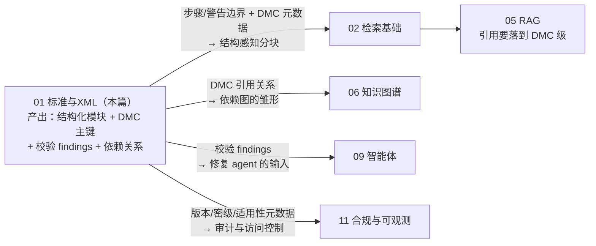
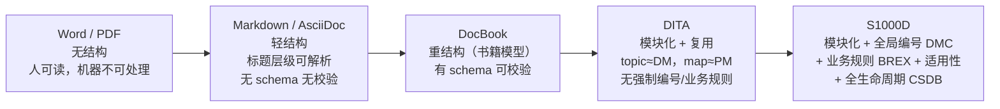
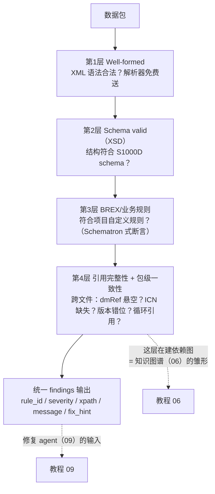

# 01 · 技术出版标准与 XML：S1000D 到底是个什么东西

## 一句话

S1000D 是航空/国防行业的"技术手册数据库设计规范"：它规定了维修手册不能写成 Word 文档，而要拆成带全局唯一编号的结构化 XML 模块，从而实现复用、校验、按机型定制和全生命周期管理。

## 本篇在全局脉络中的位置

本篇是整个教程体系的**源头**：后面每一篇消费的都是本篇产出的"结构化 + 有唯一标识 + 带元数据"的文档。没有这一层，后面全是在给一堆无结构 PDF 做检索——那是另一个（低得多的）难度等级的项目。



抓两件事：**DMC 是全项目的主键**（检索元数据、引用溯源、知识图谱、审计日志全靠它对齐）；**校验分层的思想**（结构→业务→包级一致性）会在后面反复复用——评估检索是校验、评估 RAG 回答还是校验，模式一样。

## 老类比

你一定维护过这样的老项目：文档是几百个 Word/PDF，改一个零件号要人肉搜索替换十几处，谁也不知道漏没漏。S1000D 就是行业受够了这个之后的答案，它的思路和你把"单体巨石代码"重构成"模块化 + 依赖管理"一模一样：

| 软件工程概念 | S1000D 对应物 |
| --- | --- |
| 一个函数/类（单一职责的最小单元） | **数据模块 Data Module (DM)**：一个自包含的信息单元，比如"更换液压泵的步骤" |
| 函数的全限定名（包名+类名+方法名） | **DMC（Data Module Code）**：数据模块的全局唯一编码 |
| main() / 构建脚本（把模块组装成产品） | **出版物模块 Publication Module (PM)**：定义哪些 DM 按什么顺序组成一本"手册" |
| 静态资源的资源 ID | **ICN（Information Control Number）**：插图/多媒体的唯一编码 |
| 包的目录规范（com.company.module...） | **SNS（Standard Numbering System）**：按系统/子系统/部件划分的编号体系 |
| 团队的 lint 规则 / ESLint 配置 | **BREX（Business Rules Exchange）**：项目自定义的业务规则，本身也是一个 DM |
| Git 的版本号 + changelog | **Issue/InWork 版本信息**：每个 DM 自带版本和状态 |
| 条件编译 / feature flag | **Applicability（适用性）**：标注"这段内容只适用于 XX 型号 XX 序列号" |
| 制品仓库（Artifactory） | **CSDB（Common Source DataBase）**：存放所有 DM 的源数据库 |

有了这个映射表，S1000D 的一切设计动机都能推导出来。

## 原理详解

### 0. 标准版图：文档管控强度是一条谱，S1000D 在最重的一端

在扎进 S1000D 之前，先看它在整个"文档技术"版图里的位置——管控强度从左到右递增，每往右一步，都是用写作自由换机器可处理性：



各家一句话点评：

- **Word/PDF**：所见即所得的代价是"所见即全部"——机器拿到的是排版指令不是语义。做 RAG 时的 PDF 解析地狱（表格错位、双栏乱序、页眉混入正文）就是这笔债的利息。
- **Markdown/AsciiDoc**：软件业文档主流。标题层级给了最起码的分块边界，但没有 schema——没人能机器校验"每个危险操作前必须有警告"。
- **DocBook**：OASIS 的书籍模型，有完整 schema，出版社和大型开源项目（如 Linux 文档）在用。结构强但复用模型弱。
- **DITA**：民用行业的"轻量版 S1000D"，topic 化复用做得好，但没有 DMC 这种强制全局编号，也没有 BREX 这种项目级业务规则交换机制。
- **S1000D**：管控最重——因为行业代价最高。手册错一步，后果是安全事故加法律责任，所以"能被机器校验"不是优化项而是准入门槛。

**为什么本项目选 S1000D-like 而不是拿真实数据？** 三个理由：① 真实 S1000D 内容受出口管制和版权约束，公开仓库不能放（诚信红线）；② 自造合成数据可以**故意埋入已知违规**——校验器的 golden 测试需要"标准答案"，真实数据反而给不了；③ 面试叙事上，"我实现了 DMC 解析 + BREX 风格规则引擎 + 包级引用校验，并明确标注了简化范围"比"我见过真实数据"更能证明理解（见文末面试问答第一条）。

**为什么值得学最重的标准？** 谱系右端的概念可以向左降级复用（学会 S1000D 的分层校验，Markdown 项目的 lint 你闭眼就能设计），反之不行。技术出版智能这个赛道（Arken 类产品）的壁垒恰恰在最重的那端。

### 1. DMC：为什么一个编号要这么长

一个典型的 DMC 长这样（各段用 `-` 连接）：

```
DMC-S1000DBIKE-AAA-D00-00-00-00AA-041A-A
     └模型标识┘ └───SNS 系统编码───┘ └信息码┘
```

关键组成部分（面试能说出前四个就够了）：

- **Model Identification Code**：哪个产品/项目（如某型飞机）。
- **SNS（System/SubSystem/Unit）**：内容涉及哪个系统层级。类比 ATA 章节号——航空业早就习惯"29 章 = 液压系统"这种约定，SNS 是它的泛化。
- **信息码（Information Code）**：内容的**类型**，如 040=描述、5xx=拆卸、7xx=装配、041=常规描述。同一个部件的"描述"和"拆卸步骤"是两个不同 DM。
- **Item Location Code**：信息适用于部件在什么位置状态（装机上/拆下来）。

设计意图：**编号本身携带语义**。看到 DMC 不用打开文件就知道它讲哪个系统、什么类型的内容。这就是为什么 LearnArken 里 DMC 解析器是第一个要写的组件——它是所有下游（图谱、检索元数据、依赖分析）的主键。

### 2. DM 的内部结构：两段式

每个 DM 的 XML 分两大块：

- **identAndStatusSection（标识与状态段）**：DMC、标题、版本 (issueInfo)、语言、安全密级、适用性、质量保证状态。相当于文件头 + 元数据。
- **content（内容段）**：真正的正文。按信息类型不同有不同 schema：描述型 (description)、程序型 (procedure，含步骤 step)、故障隔离型 (fault isolation)、零件数据型 (IPD) 等。

程序型 DM 里最重要的子结构（也是 RAG 分块时的天然边界）：

- `preliminaryRqmts`：作业前提——所需工具、耗材、备件、安全条件。
- `mainProcedure` 下的 `proceduralStep`：可嵌套的步骤树。
- `warning` / `caution` / `note`：警告（人身安全）、注意（设备安全）、备注。**警告在正文中的位置有严格规定（必须在被警告的步骤之前）**，这是校验规则的好素材。

### 3. BREX：规则的规则

XSD（XML Schema）只能校验"结构合法"：标签拼写对不对、嵌套对不对、必填字段有没有。但项目还有大量**业务规则**是 XSD 表达不了的，比如：

- "本项目只允许使用信息码 040、520、720。"
- "所有 warning 必须有 vitalWarningFlag 属性。"
- "适用性声明里只能引用产品属性表中定义过的属性。"

BREX 就是把这些规则**写成机器可读的 XML**（内含 XPath 表达式 + 允许/禁止判定 + 违规提示），每个 DM 通过 `brexDmRef` 声明自己遵守哪套 BREX。相当于每个源码文件头部声明 "本文件受 .eslintrc.strict 管辖"。

传统实现里 BREX 检查常用 **Schematron**（一种基于 XPath 断言的规则校验语言，模式是"对每个匹配 X 的节点，断言 Y 成立，否则报消息 Z"）。LearnArken 选择自写一个 Schematron 风格的规则引擎，输出结构化 findings：`{rule_id, severity, xpath, message, fix_hint}`——这个 findings 格式会贯穿整个项目（校验报告、critic agent 的证据、审计日志）。

**校验技术选型版图**（和文档标准一样，也是一条谱）：

| 技术 | 表达什么 | 一句话定位 |
| --- | --- | --- |
| XSD | 结构：元素/属性/类型/基数 | 官方 schema 直接用，不自己写 |
| RELAX NG | 同 XSD，语法更人性 | 知道存在即可，S1000D 生态以 XSD 为主 |
| Schematron | XPath 断言式业务规则 | BREX 检查的传统实现，"规则=选择器+断言+消息" |
| 自写规则引擎 | 同 Schematron + 可控输出 | 本项目选择：findings 结构化，直接进审计流和 agent 工具 |
| LLM 审查 | 语义层（"这步描述和图不符"） | 以上都管不了的内容正确性，教程 09 的 critic agent 接盘 |

### 4. 校验的四个层次（面试高频）

拿到一个数据包，校验从浅到深分四层，**每层都比上一层更"业务"**：



1. **Well-formed**：XML 语法本身合法（标签闭合、转义正确）。解析器免费送。
2. **Schema valid（XSD）**：结构符合 S1000D 的 schema——元素、属性、类型、基数。
3. **BREX/业务规则**：符合项目自定义规则（Schematron 式断言）。
4. **引用完整性 + 包级一致性**：跨文件检查——`dmRef` 指向的 DM 在包里存在吗？`infoEntityRef` 引用的 ICN 图片文件在吗？PM 引用的 DM 版本和包里实际版本一致吗？有没有循环引用？**这层本质上是在建依赖图**，也是后面知识图谱的雏形。

这个分层直接对应 LearnArken 的校验管线设计。面试时能主动说出"XSD 管结构、BREX 管业务、引用检查管包级一致性，三者是不同层次"就已经超过大多数候选人。

### 5. Applicability（适用性）：最容易被低估的难点

同一个 DM 可能写着："对序列号 001-050 的飞机，执行步骤 A；对 051 以后，执行步骤 B。" 适用性通过引用 **ACT（产品属性）/ CCT（条件）** 的表达式实现，本质是一棵布尔表达式树挂在任意内容节点上。

对 RAG 的影响巨大：如果检索时不带适用性过滤，用户问"XX 型号怎么换泵"，可能检回**不适用于该型号**的步骤——在维修场景这是安全事故级错误。所以 LearnArken 的 chunk 元数据必须携带适用性信息，查询时做元数据过滤。这是"graph-contextualized chunking"的动机之一。

### 6. 相邻标准：知道定位就够了

| 标准 | 一句话定位 | 和 S1000D 的关系 |
| --- | --- | --- |
| **ATA iSpec 2200** | 民航传统手册标准，ATA 章节号（21 空调、29 液压…）深入人心 | S1000D 的前辈，SNS 概念源头；很多民航项目仍在用 |
| **ASD S2000M** | 物料管理/备件供应流程标准 | 管零件的商务与供应数据，和 S1000D 的 IPD（图解零件数据）打通 |
| **MIL-STD-40051** | 美军技术手册标准 | 美国国防体系的对应物，理念相近 |
| **DITA** | 通用行业的模块化文档标准（OASIS） | 民用软件业的"轻量版 S1000D"：topic ≈ DM，map ≈ PM，但没有 DMC/BREX 这类强管控 |

LearnArken 用适配器模式对接这些标准：一个 canonical 模型，多个标准各写一个 adapter。这是经典的老工程智慧（防腐层），面试时值得点明。

### 7. XML 技术栈速成（老程序员的快速回忆）

- **命名空间**：`xmlns:dm="http://..."` 相当于包名，避免元素名冲突。用 lxml 时 XPath 必须带命名空间映射，这是新手第一个坑。
- **XPath**：XML 的查询语言。`//proceduralStep[warning]` = 所有含警告的步骤。BREX/Schematron 的断言就是 XPath。
- **XSD**：XML 的 schema 定义。lxml 可以加载 XSD 做校验并给出行号级错误。
- **lxml**：Python 事实标准的 XML 库（libxml2 的绑定，C 速度）。关键 API：`etree.parse`、`XMLSchema.validate`、`xpath()`、`sourceline`（拿行号，做精确 findings 用）。

### 8. 这条路线的限制清单（谁来接盘）

结构化 + 规则校验不是银弹，它管不了的部分正好是后面教程的出场理由：

| # | 限制 | 一句话 | 谁接盘 |
| --- | --- | --- | --- |
| 1 | schema valid ≠ 内容正确 | "扭矩 500 N·m"写成"50 N·m"，四层校验全绿 | 语义审查：LLM critic（09）+ 人工抽查纪律 |
| 2 | 规则只能拦"已知违规模式" | BREX 是白名单/黑名单思维，没写成规则的错拦不住 | 对抗评估思路（05 评估节）：主动构造新错误类型 |
| 3 | 结构化不等于可检索 | 模块化解决了"改一处漏十处"，没解决"用户用口语找术语" | 检索全家族（02→04） |
| 4 | 适用性求值是指数级复杂 | 布尔树 × 产品配置组合爆炸，全量求值不现实 | 本项目裁剪为元数据过滤（03 §7）；完整求值标注 Planned |
| 5 | 标准迁移成本极高 | 存量 Word/PDF 转 S1000D 是人力黑洞 | 不在本项目范围；业界靠转换服务商 + 近年的 LLM 辅助转换 |

**杠杆排序**（校验工程的力气花在哪，收益从高到低）：引用完整性检查（第 4 层，跨文件错误人工几乎不可能查全，机器查是质变）> BREX 规则引擎（每条规则拦一类事故）> XSD（官方 schema 白送，接上就行）> well-formed（解析器免费）。注意这个排序和实现顺序**正好相反**——越底层越先实现，越上层收益越大。

## 调优与参数

这一章没有"调参"，但有对应的**设计决策**（面试同样会问"为什么这么设计"）：

- **canonical 模型放多少字段**：太少丢信息（下游要回头重新解析 XML），太多变成 XML 的 1:1 镜像（失去"canonical"意义）。原则：下游（校验/图谱/检索）用得到的才进模型。
- **findings 的粒度**：一条规则违反一次报一条，带 XPath 和行号。宁可多报可聚合，不可少报难定位。
- **确定性**：同一个包两次 transform 输出必须逐字节相同（字典序排序、固定时间戳策略），否则版本 diff 和快照测试全部失效。

## 失败模式

1. **命名空间陷阱**：XPath 查询 `//dmodule` 返回空，因为文档有默认命名空间。检测：解析后打印 root.tag 看是否带 `{uri}` 前缀。
2. **实体注入 / XXE**：XML 外部实体攻击。lxml 需要显式关闭外部实体解析（`resolve_entities=False`），技术出版包来自外部供应商，这是真实攻击面。
3. **引用悬空**：DM 引用了包里不存在的 DM/ICN。单文件校验发现不了，必须包级检查。
4. **版本错位**：PM 引用 DM 的 issue 001，包里实际是 issue 003。语义上"内容可能已经变了"，安全敏感。
5. **适用性表达式引用未定义属性**：布尔树里引用了 ACT 里没有的属性，运行时求值才爆炸。应在校验层提前发现。
6. **BREX 自引用**：BREX 本身也是 DM，也要遵守某个 BREX（通常是默认 BREX），别陷入死循环。

## 面试问答

**Q: 你没做过真实 S1000D 项目，凭什么说了解它？**
A 要点：坦诚 + 展示深度。"我用合法的合成数据构建了 S1000D-like 的子集：实现了 DMC 解析、DM 两段式结构建模、BREX 风格规则引擎和包级引用校验，并且明确标注了简化范围（比如没有实现完整的 applicability 求值和 CSDB 工作流）。我能讲清 DMC 各段含义、XSD/BREX/引用检查的分层，以及适用性对检索安全性的影响。"——承认边界反而加分。

**Q: XSD 已经能校验了，为什么还要 BREX？**
A 要点：XSD 只能表达结构约束（元素、类型、基数），无法表达跨字段、跨文件、项目特定的业务规则。BREX 是项目级的规则声明与交换格式，本质是"lint 配置"，用 XPath 断言实现。分层校验，各司其职。

**Q: 为什么不用现成的 Schematron 实现，要自己写规则引擎？**
A 要点：学习目的（理解规则引擎内核：规则 = 选择器 + 断言 + 消息）；输出格式可控（结构化 findings 直接进审计流和 agent 工具）；真实 Schematron 作为已知的替代方案能说出其模型（pattern/rule/assert）。

**Q: 为什么选 S1000D 这种重标准练手，而不是 DITA 或 Markdown？**
A 要点：管控强度谱上概念只能从重往轻降级复用，不能反向；S1000D 的 DMC/BREX/适用性是"文档即数据库"思想的完全体，学会它，轻量标准的工程问题都是子集；且目标赛道（技术出版智能）的业务壁垒就在重标准端。同时诚实说明用的是合成 S1000D-like 子集及原因（版权/出口管制 + golden 测试需要已知违规）。

**Q: 技术手册和普通文档做 RAG 有什么本质区别？**
A 要点：①结构强（步骤、警告、表格有语义，不能瞎切块）；②标识符密集（零件号、DMC——对稠密检索是灾难，见教程 04）；③适用性过滤是安全要求不是优化项；④答案必须可溯源可审计；⑤版本敏感（旧版程序可能已被安全通告替代）。

**Q: 讲讲你的校验管线怎么设计的。**
A 要点：四层漏斗（well-formed → XSD → BREX 规则 → 包级引用/依赖），每层输出统一的 findings 结构（rule_id/severity/path/message/fix_hint），fail-fast 但收集全量错误再报告，全过程确定性可重放，findings 进审计日志。加分点：主动说"schema valid ≠ 内容正确"——校验的天花板在语义层，那是 LLM 审查和人工抽查的地盘。
