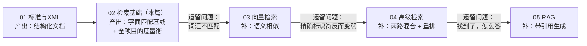
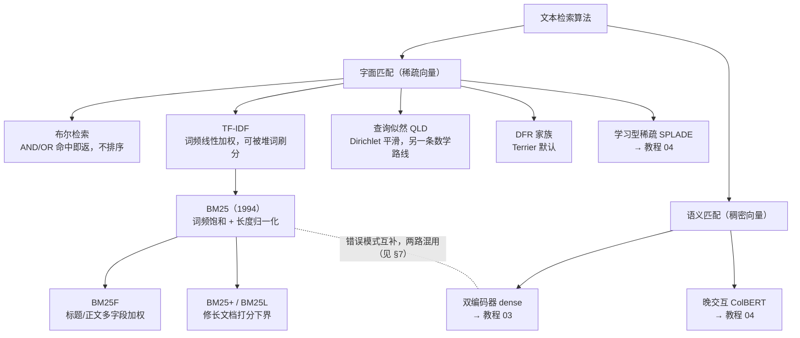
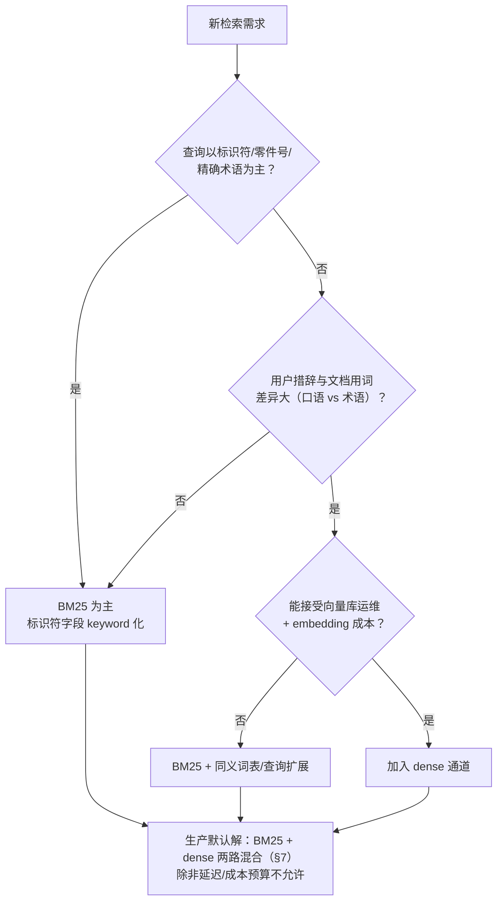
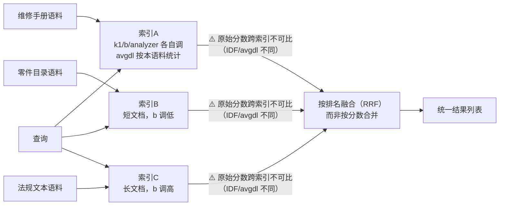
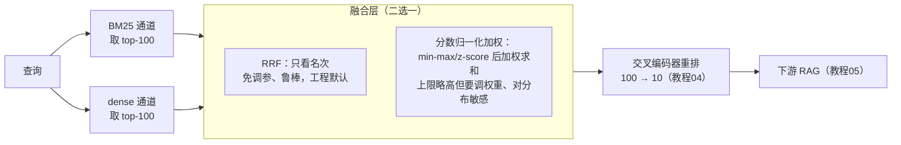

# 02 · 信息检索基础：BM25 与"怎么证明检索是好的"

## 一句话

信息检索（IR）解决"从海量文档里找出和查询最相关的几条"，BM25 是统治了二十多年、至今仍是强基线的经典算法；而检索评估（Recall@k、MRR、nDCG）是整个项目所有后续工作的"验收标尺"。

## 本篇在全局脉络中的位置

教程 02–05 是一条"发现缺陷 → 补缺陷"的主线，每一篇都在解决上一篇留下的具体问题：



所以读本篇要抓两件事：**BM25 这条基线的能力边界在哪**（后面所有教程都是冲着这些边界来的），以及**评估这把尺子怎么造**（没有它，后面所有"改进"都无法证明）。

## 老类比

- **倒排索引 = 书后面的索引页**。正排是"第 37 页有哪些词"，倒排是"'液压泵'出现在第 37、112、245 页"。数据库老手可以直接理解为：给"文档-词"多对多关系建了一个以词为主键的索引表。
- **BM25 = 带权重的 SQL 全文查询**。Lucene、Elasticsearch、Solr、Sphinx 的默认排序，你如果用过 MySQL 的 `MATCH ... AGAINST` 或者 PostgreSQL 的 `ts_rank`，就是同类思想的成熟版。
- **评估指标 = 性能压测报告**。老工程里没有压测数据不敢说"优化了性能"；这个领域没有 Recall@k 对比表不敢说"改进了检索"。

## 原理详解

### 0. 算法版图：BM25 之外还有什么，为什么基线还是它

BM25 不是唯一选择，它是一个大家族里存活下来的赢家。先看版图，再谈选型：



各家一句话点评：

- **布尔检索**：`grep` 的进化版，只回答"含不含"，不回答"哪个更相关"。今天仍活在过滤条件里（`AND status=released`），但不能当排序主力。
- **TF-IDF**：BM25 的直系祖先。词频是线性的——垃圾文档把关键词重复 100 遍就能刷到第一。BM25 的饱和设计就是冲它来的。
- **查询似然 QLD（Query Likelihood + Dirichlet 平滑）**：换一条数学路线（把每个文档看成一个语言模型，算它"生成"查询的概率），效果与 BM25 五五开。值得知道的实证结论：**经典字面算法之间的差距通常只有 1~2 个 nDCG 点**（Trotman 等人的系统对比），远小于分词器配置和领域适配带来的差距——所以别在经典算法选型上纠结，力气花在 analyzer 上。
- **BM25F / BM25+**：BM25 的两个实用变体。BM25F 把"标题命中比正文命中值钱"做进公式（Elasticsearch 的字段 boost 是它的工程近似）；BM25+ 修一个长文档被过度惩罚的数学缺陷。知道它们存在即可，面试提得出名字就够。
- **学习型稀疏（SPLADE）/ 稠密（dense）/ 晚交互（ColBERT）**：都是"可训练"阵营，靠标注数据学习语义匹配，分别在教程 03/04 展开。

**那为什么 2026 年基线仍然是 BM25？** 四个理由，按分量排序：

1. **零训练、零标注、开箱即用**——新领域第一天就能跑。
2. **跨域鲁棒**：BEIR 基准（18 个跨领域数据集）的著名结论——在 MSMARCO 上训练的稠密检索器换个领域做 zero-shot，**经常输给不需要任何训练的 BM25**。领域越垂直（如技术手册），这条越成立。
3. **可解释**：能指出命中了哪个词、每个词贡献多少分。稠密检索给你一个 0.83 的余弦相似度，你没法向审计员解释它是什么。
4. **它是所有花哨方法的照妖镜**：一个新方法连 BM25 都打不赢，就是负优化。这就是为什么本项目 Day 3 先建 BM25 基线、Day 4 才上 dense。

选型决策可以压缩成一张图：



注意终点：几乎所有路径最后都汇到"混合"。单路检索是预算受限时的妥协，不是理想架构——这个立场贯穿教程 04 和项目 Day 4。

### 1. 倒排索引与分词管线

文本进入索引前要过一条分析管线（analyzer），Lucene 术语体系：

```
原文 → 字符过滤(去HTML等) → 分词(tokenizer) → 词元过滤(小写化/去停用词/词干化) → 词项(term)
```

每个环节都是可配置的权衡：

- **分词**：英文按空格标点切；中文需要分词器；**而技术手册里最麻烦的是标识符**——`DMC-S1000DBIKE-AAA-D00-00-00-00AA-041A-A` 按标点切开就碎了，`P/N 1234-567` 同理。解决办法：对标识符字段用 keyword（不切分）或自定义 pattern tokenizer。**这是"技术领域检索"区别于通用搜索的第一个实战点。**
- **词干化（stemming）**：running→run。技术文档里慎用——"bleeding"（排气/放液，液压术语）被stem 成 "bleed" 通常没问题，但序号、代号被误切会造成事故。
- **停用词**：the/a/of 不进索引。注意 "no"、"not" 在维修文档里是安全关键词（"do NOT open"），乱去停用词会翻车。

倒排表里每个词项记录：出现在哪些文档（posting list）、每个文档里出现几次（tf）、位置（支持短语查询）。

### 2. BM25 打分公式（拆开就不吓人）

对查询 Q 中每个词 q，文档 D 的得分：

```
score(D,Q) = Σ IDF(q) × ( tf(q,D) × (k1+1) ) / ( tf(q,D) + k1 × (1 - b + b × |D|/avgdl) )
```

三个直觉，每个对应公式的一部分：

1. **IDF（逆文档频率）：稀有词更重要。** "液压泵"比"检查"更有区分度。IDF ≈ log(总文档数/含该词的文档数)。这就是为什么零件号这种极稀有词一旦匹配，BM25 得分极高——**这是 BM25 在技术领域强大的根本原因**。
2. **tf 饱和：出现 10 次不比出现 5 次好一倍。** 公式里 tf 的增益是渐近饱和的，k1（通常 1.2~2.0）控制饱和速度。对比更老的 TF-IDF：TF-IDF 的 tf 是线性的，垃圾文档堆砌关键词就能刷分，BM25 的饱和设计解决了这个问题。
3. **长度归一化：长文档天然含更多词，要打折。** b（通常 0.75）控制惩罚力度，b=0 完全不惩罚，b=1 完全按长度比例惩罚。技术手册的 DM 长度差异大，b 值得实测调优。

公式里有个后面要反复用到的隐藏事实：**IDF 和 avgdl 都是"整个语料"的统计量**。同一个查询在两个不同的索引上跑，即使命中同一篇文档，分数也不同。记住这一点，§6 的多索引问题和 §7 的混合融合问题都源于它。

### 3. BM25 的限制清单（后面所有教程的靶子）

**天花板一号——词汇不匹配（vocabulary mismatch）**：BM25 只认**字面匹配**。查"发动机润滑故障"，文档写的是"引擎滑油系统异常"，一个词都对不上，BM25 得分为零。稠密检索（教程 03）和 SPLADE（教程 04）都是冲着它来的。

其余限制，按工程杀伤力排序：

| # | 限制 | 一句话 | 补救方向 |
| --- | --- | --- | --- |
| 1 | 词汇不匹配 | 同义改写零分 | dense（03）、SPLADE（04）、同义词表 |
| 2 | 词袋，不懂词序 | "先拆滤芯再关泵"和"先关泵再拆滤芯"打分相同——维修顺序是安全问题 | 短语查询部分补救；真解在重排（04） |
| 3 | 不懂否定与语义角色 | "禁止加热"和"必须加热"高度相似 | 重排 + 生成端拒答逻辑（05） |
| 4 | 分数不可跨语料比较 | IDF/avgdl 是语料统计量，两个索引的 37.2 分不是同一个意思 | 排名融合 RRF（§6、§7） |
| 5 | 不能从数据里学习 | 没有参数可以吃标注/点击数据 | 学习型检索全家族（03、04） |

这张表就是教程 03/04/05 的"需求文档"——每一行都有后续教程接盘。

### 4. 检索评估：这个项目的"度量衡"

评估需要三样东西：**文档集 + 查询集 + 相关性标注（qrels）**。工业界叫 golden set。LearnArken 的做法是对合成手册人工构造几十个查询和标准答案。

设查询的相关文档集合已知，系统返回 top-k 排序列表：

- **Recall@k**：相关文档中有多少被排进了前 k。`召回了3个相关文档中的2个 → Recall@5 = 0.67`。**RAG 场景最重要的指标**——因为 LLM 只能看到塞进上下文的 top-k，没被召回的证据永远不可能出现在答案里。
- **Precision@k**：前 k 个里有多少是相关的。上下文窗口宝贵时重要。
- **MRR（Mean Reciprocal Rank）**：第一个相关结果排第几？排第 1 得 1 分，第 3 得 1/3，对所有查询取平均。适合"用户只想要一个正确答案"的场景。
- **nDCG@k**：考虑**分级相关性**（非常相关=3分，有点相关=1分）且**位置越靠前权重越高**（增益除以 log2(位置+1) 折损），再除以理想排序的得分做归一化。最全面，学术界默认。

**实践口诀**：给 RAG 选检索器，先看 Recall@k（k=你打算塞进上下文的条数）；比较排序质量看 nDCG；单答案场景看 MRR。

### 5. 评估的工程纪律

- golden set 要**版本化**（进 git），查询要覆盖不同类型：事实查询、过程查询、标识符精确查询、跨文档依赖查询。
- 每次改动（换分词器、调 k1/b、加新检索器）跑同一套评估，结果进 benchmark 表。
- 警惕**过拟合 golden set**：调参调到在 30 个查询上完美，换 30 个新查询就崩。留一部分查询做 held-out。

### 6. 超参数的真实作用范围：k1/b 值多少力气

这是最容易被教程神化、被实战祛魅的部分。三个工程事实：

**事实一：k1/b 是语料级参数，不是文档级参数。** 公式里的 avgdl（平均文档长度）和 IDF 都按整个索引统计，Elasticsearch 里 similarity 配置也是挂在索引/字段上的。所以"这篇 PDF 用 k1=1.2、那篇 PDF 用 k1=0.9"在同一个索引里**机制上就不成立**——单篇文档没有自己的 avgdl。

**事实二：调 k1/b 的收益天花板不高。** 两个旁证：① Lucene/Elasticsearch 默认 k1=1.2、b=0.75，Anserini（学术检索标配）默认 k1=0.9、b=0.4——两套默认值差别不小，却都"能用"，说明这片参数平原相当平坦；② 系统性对比研究里，k1/b 网格搜索带来的提升通常只有 **1~3 个 nDCG 点**。把优化杠杆按收益排个序：

```
分块与 analyzer（标识符不被切碎）   ≈ 10+ 个点（标识符查询上可以是 0 分与满分之差）
混合检索 + 重排（§7、教程04）      ≈ 5~15 个点
字段加权（title boost）           ≈ 几个点
k1/b 网格搜索                     ≈ 1~3 个点
```

数字是量级感不是承诺，你的语料要自己实测（项目 Day 4 的消融表就是干这个的）。但杠杆排序本身很稳定：**先把分词器和分块修对，最后才轮到 k1/b。** 反过来做，是在没装准星的枪上打磨扳机。

**事实三：异构语料的正确姿势是"分索引"，不是"分文档调参"。** 你的直觉是对的——维修手册、零件目录、法规文本的长度分布和术语密度完全不同，一套 k1/b 确实难以通吃。工程解法：



关键陷阱在图中间：**BM25 分数跨索引不可比**（§2 的隐藏事实），索引 A 的 37.2 分和索引 B 的 12.8 分之间没有大小关系。直接拿分数排序，统计量占便宜的那个索引会永远霸榜。解法是只看**名次**不看分数——RRF（Reciprocal Rank Fusion）：每路结果按排名给分 `1/(k+rank)`，加总重排。这和 §7 混合检索用的是同一招，因为本质是同一个问题：**任何两套打分体系之间都不可比**。

**什么时候才值得回头调 k1/b**：语料长度分布确实怪异（调 b）、术语重复次数有真实含义（调 k1）、golden set 可靠、且更高杠杆已经榨干。四个条件齐了再动手。

### 7. 多算法混合：不是"能不能"，而是"默认就该"

你可能已经从 §0 的决策图看出来了：混合不是高级技巧，是生产默认。原因一句话——**BM25 和 dense 的错误模式互补**：BM25 死于同义改写（词汇不匹配），dense 死于精确标识符和罕见词（embedding 对没见过的零件号无能为力）。互补性是混合收益的全部来源；如果两路错得一样，混了也白混。

标准两路架构：



三个设计要点：

- **融合层用 RRF 起步**：原因同 §6——两路分数天生不可比（BM25 是无界的对数和，余弦相似度在 [-1,1]），按名次融合直接绕开这个问题。归一化加权是有了可靠评估集之后的进阶选项。
- **"宽进严出"分工**：召回层两路各取宽 top-100 追 Recall，重排层用更贵的交叉编码器压到 top-10 追 Precision。每一层用自己的指标验收（§4 的实践口诀）。
- **另一派思路是 query routing**：训练个分类器判断查询类型（长得像零件号 → 只走 BM25；口语问题 → 只走 dense），省一路算力，但引入分类错误这个新失败点。垂直领域查询类型分布稳定时可以考虑；默认还是两路全召回更稳。

细节（RRF 的 k 值、重排模型选型、消融方法）在教程 04 展开；本项目 Day 4 会把 BM25 / dense / hybrid / hybrid+rerank 四行消融表做出来，就是这张图的实证版。

### 8. 选型：OpenSearch vs Tantivy

- **OpenSearch**（Elasticsearch 的开源分支）：完整搜索服务——analyzer 管理、字段 boost、聚合、分布式。重（JVM），但"生产形态"。
- **Tantivy**：Rust 写的 Lucene 风格库，轻快，嵌入式，适合本地实验。
- LearnArken 两条路都通向同一个评估表，选哪个不重要，**能解释 analyzer 配置和字段 boost（标题命中加权）怎么影响指标**才重要。

## 调优与参数

| 参数 | 作用 | 调法 |
| --- | --- | --- |
| k1 (1.2~2.0) | tf 饱和速度 | 术语重复有意义的语料调高;网格搜索看 nDCG |
| b (0~1, 默认0.75) | 长度惩罚 | 文档长度差异大且长文档质量不低时调低 |
| 字段 boost | 标题/摘要命中加权 | title^3 body^1 起步，看 MRR 变化 |
| analyzer | 分词/词干/停用词 | 标识符字段用 keyword；正文字段实验 stemming 开关 |
| top-k | 返回条数 | 与下游上下文预算联动，看 Recall@k 曲线拐点 |

**动手顺序提醒**：这张表按"面试常问"排序，不是按"收益"排序。按收益动手的顺序是 §6 的杠杆排序——analyzer 最先，k1/b 最后。

## 失败模式

1. **标识符被分词器切碎**：查 `P-1002` 召回一堆含 "1002" 的无关文档。检测：构造标识符查询集单独测。
2. **词汇不匹配**：同义词/术语变体查不到。检测：golden set 里故意放释义型查询（query 用口语，文档用术语）。
3. **停用词误杀安全词**："do not open" 的 not 被去掉。检测：警告类文本的召回测试。
4. **长度归一化过猛**：内容最全的长 DM 永远排不上去。检测：看长文档在结果中的分布。
5. **golden set 太小/有偏**：指标波动大，改进是噪声。缓解：每类查询至少 10+ 条，报告时带查询类型分组。
6. **跨索引/跨通道直接比较原始分数**：统计量占便宜的一路永远霸榜，另一路形同虚设。检测：统计融合结果 top-10 里各通道的贡献占比，一路长期低于 10% 就要查融合层。

## 面试问答

**Q: 为什么 2026 年了还要 BM25，直接上向量检索不行吗？**
A 要点：①技术领域标识符/零件号/DMC 是精确匹配需求，BM25 的 IDF 机制天然擅长，稠密检索恰恰最弱（教程 04 有实验证据）；②零训练成本、可解释（能指出命中哪个词）、延迟低；③它是评估基线——不打赢 BM25 的花哨方法都是负优化；④生产上 BM25+dense 混合几乎总是单路的上位替代。

**Q: BM25 之外还有哪些检索算法？你为什么选 BM25？**
A 要点：字面阵营有 TF-IDF（BM25 的前身，无饱和会被刷分）、查询似然 QLD（另一条数学路线，与 BM25 五五开）、DFR，以及变体 BM25F（多字段）/BM25+（长文档修正）；可训练阵营有 dense、SPLADE、ColBERT。选 BM25 的理由：经典算法间差距 <2 个点没必要纠结，而 BM25 生态最成熟；BEIR 证明跨域 zero-shot 它经常打赢 dense；且它是消融表的基线行。答这题的加分点是主动说出"这些经典算法差距远小于 analyzer 配置的影响"。

**Q: 能不能给不同的文档（比如不同 PDF）用不同的 k1/b？**
A 要点：同一索引内不行——avgdl/IDF 是语料级统计量，per-doc 参数会让分数失去可比性。正确做法是按语料分片建多索引、各自调参，查询时并发查、用 RRF 按排名融合（原始分数跨索引不可比）。加分点：主动说明这与 BM25+dense 混合是同一个数学问题的两个实例。

**Q: 混合检索为什么常用 RRF 而不是把两路分数加权相加？**
A 要点：BM25 分数无界、余弦相似度有界，量纲不同直接加权没有意义；归一化（min-max/z-score）可行但对分数分布敏感、要调权重；RRF 只用名次，免调参、对异常分数鲁棒，是工程默认。有可靠评估集后可以实验归一化加权换取上限。

**Q: Recall 和 Precision 在 RAG 里哪个更重要？**
A 要点：先 Recall——证据没进上下文，后面全是无米之炊；但上下文有预算且噪声会干扰 LLM，所以架构是"宽召回 + 精排"：第一阶段追 Recall@100，rerank 阶段追 Precision@5。分阶段指标不同。

**Q: nDCG 和 MRR 有什么区别，什么时候用哪个？**
A 要点：MRR 只关心第一个相关结果的位置，适合单答案场景；nDCG 考虑全列表、分级相关性和位置折损，适合多证据场景。RAG 要多条证据支撑，故 nDCG/Recall 为主。

**Q: 你的 golden set 怎么构造的？多大？怎么防止过拟合？**
A 要点：从合成手册人工构造，按查询类型分层（事实/过程/标识符/跨文档），每类 10+；标注分级相关性；held-out 子集不参与调参；golden set 和评估脚本进 git 保证可复现。

**Q: k1 和 b 是什么？你调过吗？**
A 要点：k1 控制词频饱和、b 控制文档长度惩罚。答"调过"必须能报出实验：在自建基准上网格搜索，b 从 0.75 调到 X 时 nDCG 变化多少，并解释原因（DM 长度分布）。没做就说默认值 + 知道怎么调，别编数据。加分点：主动给出杠杆排序——analyzer/分块 > 混合重排 > 字段加权 > k1/b，说明知道力气该花在哪。
