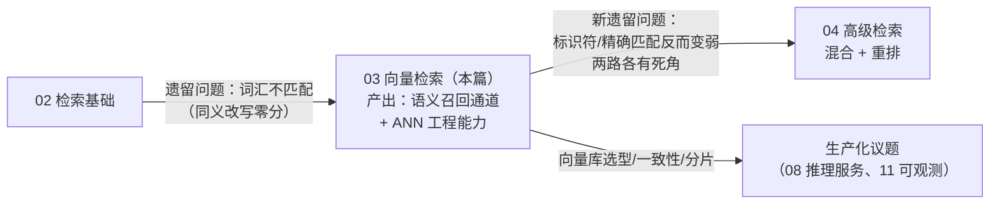
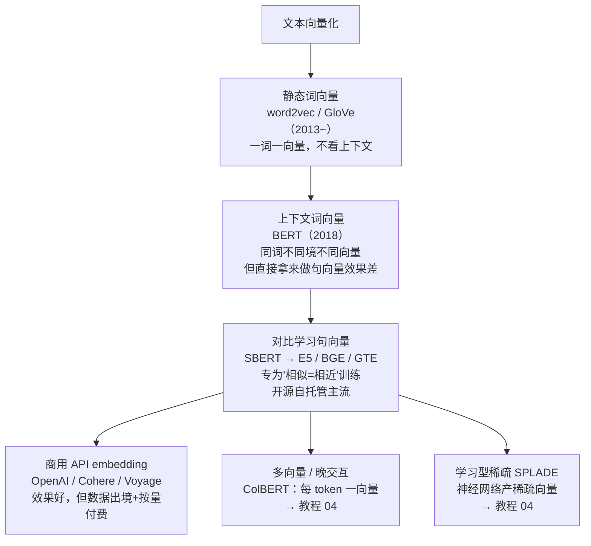
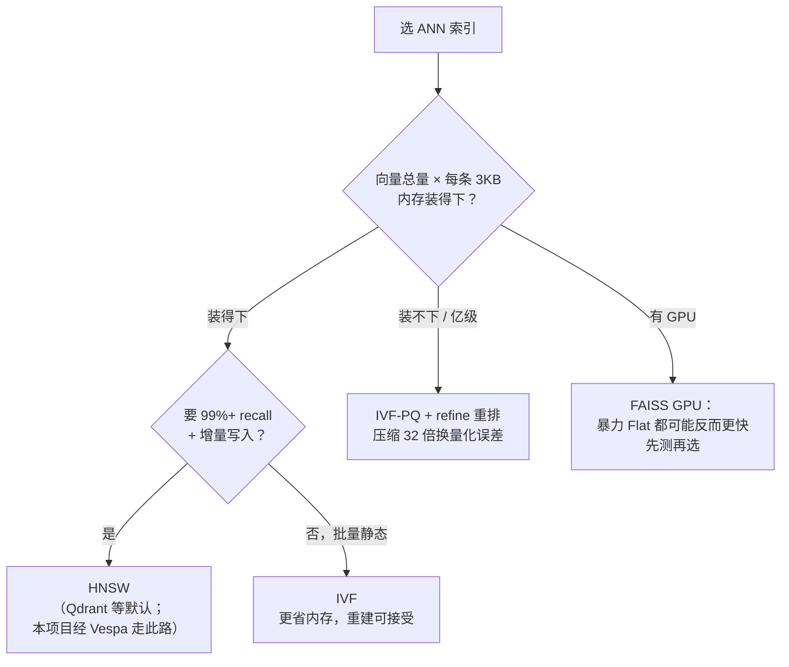

# 03 · Embedding 与向量检索：语义搜索和 ANN 索引的原理

## 一句话

Embedding 把文本变成高维向量使"语义相近 = 距离近"，从而让"引擎滑油异常"能搜到"发动机润滑故障"；而 ANN（近似最近邻）索引解决"在百万级向量里毫秒级找最近邻"的工程问题，HNSW/IVF/PQ 是三种核心思路。

## 本篇在全局脉络中的位置



本篇解决 02 留下的头号缺陷（词汇不匹配），但**引入一个新缺陷**：embedding 把文本压进语义空间，抹掉了字符级差异——`P-1002` 和 `P-1003` 语义上都是"零件号"，向量几乎相同，而检索意图恰恰是精确区分。02 的强项正是 03 的弱项，反之亦然，这个互补性是 04 混合检索的全部依据。读本篇同样抓两条线：**embedding 的质量上限在哪定**（模型选型 + 分块），**ANN 只是速度工程**（它决定多快逼近上限，不决定上限本身）。

## 老类比

- **Embedding = 一个学出来的哈希函数，但"相似输入产生相近输出"**。传统哈希追求雪崩效应（差一位就天翻地覆），embedding 恰恰相反——这正是它可以被"按距离检索"的原因。也可以想成自动化的多维评分卡：以前给文档人工打标签（主题=液压、类型=维修、难度=高），embedding 是模型自动打出的 768 个连续维度的"标签"，只是维度不再有人类可读的名字。
- **向量检索 = "按相似度 ORDER BY 的 SELECT"**。`SELECT * FROM chunks ORDER BY distance(vec, :query_vec) LIMIT 10`。没有索引时这是全表扫描（暴力检索），ANN 索引就是这条查询的"B+ 树"——只是它是近似的。
- **HNSW = 跳表（skip list）的图版本**。你懂跳表就懂 HNSW 一半了。
- **PQ = 有损压缩（JPEG）**。为了塞进内存，把向量压缩到 1/32 大小，代价是距离计算有误差。

## 原理详解

### 0. Embedding 模型版图：从词向量到多向量，选型看什么



选型上下文（为什么本项目用 BGE/E5 这类开源模型 + 自托管）：

- **榜单陷阱**：MTEB 是起点不是终点——榜单测的是通用语料，你的语料是航空术语和零件号（OOD，训练分布外）。**选型的唯一可信依据是自己领域 golden set 的实测**，这正是 02 先建评估的原因。榜单头部换成谁了不重要，实测流程不变。
- **自托管 vs API**：技术手册常涉密级/出口管制，向量化意味着全文过一遍模型——数据出境到第三方 API 在这个行业经常直接不可行。自托管开源模型（SentenceTransformers 加载）是默认解，API 是通用领域的便利选项。
- **维度与成本联动**：384/768/1024 维不只是精度差别——维度翻倍 = 内存翻倍 = ANN 延迟上升。小模型 + 领域实测够用，就不上大的。
- **微调**：有领域标注对（查询↔相关段落）时可以微调 embedding，垂直领域提升显著。本项目标注量不够，标注 Planned，先靠混合检索补短板——这个"先混合后微调"的顺序本身就是工程判断（混合零训练成本，微调要数据要卡）。

### 1. Embedding 从哪来

一个预训练 Transformer（如 BERT 系）读入文本，输出每个 token 的向量，再池化（通常取平均或 [CLS]）成一个定长向量（384/768/1024 维常见）。关键是训练目标：用**对比学习**在海量"相关文本对"上训练——让相关对的向量靠近、无关对远离。于是"语义相近 → 向量相近"是**训练出来的性质**，不是天然的。

工程上你需要知道的：

- **常用开源模型**：E5、BGE、SBERT 系（SentenceTransformers 库加载）。选型看 MTEB 榜单 + 自己领域的实测。
- **归一化**：向量除以自身长度（变成单位向量）后，余弦相似度 = 点积，计算更快且度量统一。**默认永远归一化**，混用归一化和未归一化向量是经典事故。
- **相似度度量**：余弦（方向差异）、点积、欧氏距离。归一化之后三者单调等价，选哪个不再重要。
- **非对称检索**：查询是短句，文档是长段，性质不同。E5/BGE 要求加前缀（`query: ...` / `passage: ...`），忘加前缀指标显著下降——**这是最常见的集成 bug**。
- **embedding 版本管理**：换 embedding 模型 = 全量重建索引（新旧向量空间不兼容，不可混存）。所以每个向量必须带 `model_name + version` 元数据。这是把老工程"schema 迁移"直觉带进新领域的地方。

### 2. 为什么需要 ANN：维度灾难

暴力检索是 O(N×d)：100 万个 768 维向量，每查询约 7.7 亿次乘加，单查询几百毫秒且随 N 线性涨。传统空间索引（KD 树、R 树）在高维下退化为近似全扫（维度灾难：高维空间里所有点对的距离趋于相同，"剪枝"失效）。

所以放弃精确，换取速度：**ANN 返回"大概率是最近邻"的结果，用 recall（近似结果与真实 top-k 的重合率）度量牺牲了多少**。三大流派：

### 3. HNSW：图导航流派（Qdrant/大部分向量库的默认）

**结构**：把所有向量连成一张"小世界"图——每个点和 M 个邻居相连，且分多层：顶层稀疏（长程连接，像洲际航线），底层稠密（短程连接，像市内道路）。这就是跳表思想：顶层大步跳，逐层细化。

**查询**：从顶层入口点出发，贪心地"走向离查询更近的邻居"，走不动了下一层，最底层维护一个大小为 efSearch 的候选堆，返回其中 top-k。

**复杂度与特性**：查询近似 O(log N)；recall 可以调到 99%+；**全内存**（图结构 + 原始向量都在内存），内存开销是三派里最大的；支持增量插入（不用重建）。

**核心参数**：
- `M`（每点邻居数，16~64）：越大图越稠密，recall 越高、内存越大、构建越慢。
- `efConstruction`（构建时候选队列，100~500）：越大图质量越好，构建越慢。
- `efSearch`（查询时候选队列）：**运行时可调的 recall/延迟旋钮**，越大越准越慢。压测时画 efSearch-recall-latency 曲线是标准动作。

### 4. IVF：聚类分桶流派（FAISS 的主力）

**结构**：先用 k-means 把全部向量聚成 nlist 个簇（比如 4096 个），每个向量归入最近的簇——**这就是倒排索引的向量版**：簇心是"词项"，簇成员是"posting list"。

**查询**：查询向量先和 nlist 个簇心比较，选最近的 nprobe 个簇，只在这些簇内暴力搜索。搜索量从 N 降到约 N×(nprobe/nlist)。

**参数**：`nlist`（经验值 ~4×√N）；`nprobe`（查几个簇，recall/延迟旋钮，1→快而糙，nlist→退化为暴力）。

**边界失误**：查询点落在两个簇的边界时，真实最近邻可能在没被 probe 的隔壁簇——这是 IVF 损失 recall 的根本原因，nprobe 就是对冲手段。

### 5. PQ：压缩流派（省内存的杀手锏）

**思路**：把 768 维向量切成 m 段（如 96 段各 8 维），每段独立做 k-means 聚成 256 类，该段就用 1 字节的"类别号"表示。768 维 float32 = 3072 字节 → 96 字节，**压缩 32 倍**。

**查距离**：查询时预先算好"查询的每段与该段 256 个簇心的距离表"，之后每个候选向量的距离 = 查表求和（ADC，非对称距离计算）。快，但有量化误差。

**组合拳 IVF-PQ**：IVF 缩小搜索范围 + PQ 压缩存储，十亿级检索的经典配置（FAISS 名字 `IVF4096,PQ96`）。误差补偿手段：先用 PQ 距离粗排出 top-200，再用原始向量精算 top-10（refine/重排）。

### 6. 三派对比与选型（面试必考）

| | HNSW | IVF | IVF-PQ |
| --- | --- | --- | --- |
| 思路 | 图导航 | 聚类分桶 | 分桶+有损压缩 |
| Recall | 最高（99%+） | 高（可调） | 中（量化损失） |
| 内存 | 最大（图+原向量） | 中 | 最小（1/10~1/30） |
| 增量插入 | 好 | 一般（簇会漂移，需定期重训簇心） | 一般 |
| 适用规模 | 百万~千万（内存装得下） | 千万级 | 亿级+ 或内存受限 |

选型决策一张图：



### 7. 向量数据库 vs 向量库（Qdrant vs FAISS）

- **FAISS 是库**：一堆索引算法的 C++ 实现 + Python 绑定。没有服务、没有过滤、没有持久化管理。适合做实验（Flat/HNSW/IVF/IVFPQ 对比是 FAISS 经典玩法；**注意：本项目未建 FAISS ANN lab，属 Roadmap，不是已交付切片**）。
- **Qdrant 是数据库**：HNSW 索引 + **payload 元数据过滤** + API 服务 + 持久化 + 分片，生产里常用。**本项目选的是 Vespa**（同为服务化向量引擎，原生支持 BM25/dense/late-interaction 三表征，Yi Xin Day 3 否决 AI 的 Qdrant 推荐——选型见 [04 §4](../architecture/04-tech-selection.md)）；Qdrant 在本项目里是被否候选，不是所用栈。
- **过滤 + ANN 的组合是真难题**（面试亮点）：`WHERE model='X' AND vector近邻` —— 先过滤再暴力搜（过滤结果少时好）？还是边走图边跳过不合条件的点（过滤结果多时好）？理解这个问题的存在本身就是加分项。**本项目的"适用性过滤"正是这类 filter+检索组合**——由 Vespa 引擎侧 scope 过滤 + fail-closed 越界校验实现（红队 day4 #5），而不是靠 prompt 叮嘱 LLM。

### 8. 分片与一致性（对应 JD 的 distributed 关键词）

- **分片键选择**：按出版物/机型分 collection（查询天然带路由键，最优）vs 哈希均匀分片（需 scatter-gather 后融合排序）。
- **实时一致性**：新文档写入后多久可被搜到？HNSW 增量插入即可见；IVF 批量重建有窗口期。LearnArken 的一致性实验（写入→查询可见性→回滚）就是在测这个。
- **删除是软肋**：多数 ANN 索引删除是打标记，查询时过滤，垃圾多了要重建——像老式数据库的 VACUUM。

### 9. 稠密检索的限制清单（谁来接盘）

| # | 限制 | 一句话 | 谁接盘 |
| --- | --- | --- | --- |
| 1 | 标识符/精确匹配弱 | `P-1002` 与 `P-1003` 向量几乎相同 | BM25 通道 + 混合融合（04） |
| 2 | OOD 领域术语区分度差 | 通用模型没见过航空代号 | 领域实测选型（§0）；微调标注 Planned |
| 3 | 单向量压缩丢细节 | 整段压成一个向量，数字/条件被"平均"掉 | ColBERT 晚交互、交叉编码器重排（04） |
| 4 | 不可解释 | 0.83 的余弦相似度无法向审计员解释 | 混合架构里保留 BM25/SPLADE 的可解释通道（04）；引用溯源（05） |
| 5 | 质量上限受制于分块 | 切坏了（步骤截断/警告分离），再好的模型也救不回 | 结构感知分块（01 的结构 + 02 的实战点） |
| 6 | 运维成本实打实 | 版本管理、重建、一致性、删除 VACUUM | 本篇 §8 + 工程纪律（10、11） |

**杠杆排序**（力气花在哪，收益从高到低）：

```
修集成 bug（前缀缺失/度量不匹配/归一化混用） ≈ 10~20 个点（无声故障，修复即白捡）
换对 embedding 模型（领域实测选型）          ≈ 5~15 个点
分块策略（结构边界 vs 固定窗口）              ≈ 5~10 个点
ANN 参数（efSearch/nprobe）                 只影响逼近上限的程度（recall 95→99）
                                            和延迟，不抬高上限本身
```

和 02 的杠杆排序合起来看规律很清楚：**决定上限的是数据表示（分块/模型/analyzer），参数只是在上限内做 recall-延迟置换。** 面试里能主动区分"抬上限的工作"和"逼近上限的工作"，是工程成熟度的标志。

## 调优与参数

标准实验流程（也是 `learnarken bench ann` 的设计）：

1. 固定语料和 golden set，先跑 **Flat（暴力）** 拿到"真值 top-k"和延迟上限基线。
2. 每种索引扫参数（HNSW: efSearch ∈ {16,64,256}；IVF: nprobe ∈ {1,8,64}），记录 recall@10 vs QPS vs 内存。
3. 画 recall-latency 曲线，报告"在 recall≥0.95 约束下谁最快、内存多少"。

## 失败模式

1. **忘记归一化 / 度量不匹配**：索引建的是点积，查询算的是欧氏，结果全错但不报错。检测：抽样和暴力结果对比。
2. **E5/BGE 忘加 query:/passage: 前缀**：recall 无声下降 10~20 个点。
3. **换 embedding 模型没重建索引**：新旧向量混存，相似度无意义。防御：向量记录强制携带 model version，不匹配就拒绝。
4. **训练分布外（OOD）语料**：通用 embedding 模型没见过航空术语和代号，语义区分度差。检测：领域 golden set 实测，别信榜单。
5. **过滤后召回坍缩**：强过滤条件 + 先搜后滤 → top-k 全被滤掉，返回空。理解 pre-filter/post-filter 区别。
6. **IVF 簇心过期**：增量写入分布漂移后 recall 缓慢劣化。需要定期重训。
7. **标识符查询**：`P-1002` 和 `P-1003` 的 embedding 几乎相同——语义上都是"零件号"，但检索意图是精确匹配。**稠密检索的原理性弱点**，混合检索（教程 04）的核心动机。

## 面试问答

**Q: 讲讲 HNSW 的原理，为什么快？**
A 要点：小世界图 + 跳表式分层；顶层长程连接大步逼近，底层稠密连接精细搜索；贪心导航 + efSearch 候选堆；O(log N) 级查询。代价：内存最大、构建慢。参数 M/efConstruction/efSearch 各管什么要能张口就来。

**Q: 内存不够放下所有向量怎么办？**
A 要点：PQ 有损压缩（切段独立量化，32 倍压缩，查表算距离）+ IVF 减少候选 + 原始向量放磁盘做 refine 重排。报数量级：768 维 float32 每条 3KB，1 亿条 300GB → PQ96 后 9.6GB。

**Q: recall 和 latency 怎么权衡？你实际调过什么参数？**
A 要点：efSearch/nprobe 是运行时旋钮；描述自己的 bench 流程（Flat 做真值 → 扫参数 → recall-QPS 曲线 → 给定 recall 约束选配置）。能画出那条曲线的形状（边际递减）。加分点：主动说明 ANN 参数只做"逼近上限"，质量上限由模型和分块决定。

**Q: embedding 模型怎么选型？直接抄 MTEB 榜首行不行？**
A 要点：不行——榜单是通用语料，垂直领域是 OOD；正确流程是候选 2~3 个模型在自己 golden set 上实测（还要测前缀、维度对内存/延迟的连带影响）；涉密/出口管制场景 API embedding 直接出局，自托管是硬约束不是偏好；有标注对再谈微调，没有就先混合检索补短板。

**Q: 向量检索什么时候不如 BM25？**
A 要点：精确标识符（零件号/DMC/错误码）、OOD 领域术语、极短查询、新词。原理：embedding 压缩到语义空间，抹掉了字符级差异。所以生产用混合检索。

**Q: 服务化向量数据库为什么比直接用 FAISS 适合做产品？**
A 要点：元数据过滤（适用性/版本/密级过滤是业务刚需，过滤+ANN 是难题）、服务化 API、持久化与快照、分片复制。FAISS 定位是算法库，适合离线实验。两者不是竞争关系。**本项目用 Vespa**（服务化引擎，与 Qdrant 同属"数据库"这一类；选它是因原生支持 BM25/dense/late-interaction 三表征）——"DB vs 库"的这条道理一致。

**Q: 新数据写入后多久能被搜到？怎么设计？**
A 要点：讲 HNSW 增量插入 vs IVF 重建窗口；写入路径 = 事务性元数据（Postgres）先落 + 向量索引异步更新 + 版本号对齐；一致性实验设计（写入→立即查→断言可见；回滚→断言不可见）。
