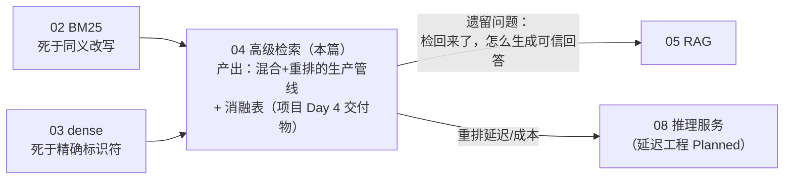
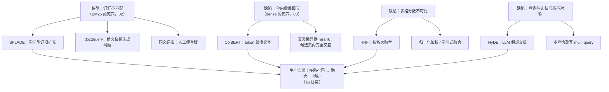

# 04 · 高级检索：SPLADE、ColBERT、重排与融合

## 一句话

BM25 认字不认义、稠密检索认义不认字，高级检索就是三招补救：让稀疏检索学会联想（SPLADE）、让稠密检索保留词级细节（ColBERT）、以及"多路召回 + 融合 + 精排"的组合架构（RRF + 交叉编码器 rerank）——这也是 JD 里最密集的关键词区。

## 本篇在全局脉络中的位置



02 和 03 各自留下了互补的死角，本篇是**合流点**：不发明新检索器，而是把已有的通道组装成"多路召回 → 融合 → 精排"的架构，并用消融表证明每一级的存在价值。本篇学完，检索侧闭环；"找到了证据怎么答"交给 05。

## 老类比

- **多路召回 + 融合 = 联邦查询**。同一个问题同时发给几个引擎，把结果合并去重排序。老系统里的元搜索引擎就是这个思路。
- **交叉编码器重排 = 两级审批**。第一级（检索）是初筛简历的 HR，快但粗；第二级（rerank）是逐个面试的技术官，慢但准，所以只面试前 100 名。
- **SPLADE = 会自动加同义词的倒排索引**。像给老搜索引擎配了一个自动扩充的同义词典，但扩充什么、权重多少是模型学出来的。
- **ColBERT = 保留明细表不做汇总**。单向量稠密检索相当于只存了每个文档的"汇总行"；ColBERT 把每个词的向量都存下来（明细表），查询时逐词对账。

## 原理详解

### 0. 补救手段版图：每个缺陷都有对症的药，别乱吃

高级检索不是一堆孤立技术，而是**对症下药的映射关系**——先认缺陷，再选药：



**本项目的选型上下文**（切片内 vs Planned 的取舍理由，面试必讲）：

- **切片内：RRF + 交叉编码器 rerank**。理由：两者都**不动索引基础设施**——RRF 是融合层纯计算，rerank 插在管线末端；工程成本最低、收益最稳、消融表上最容易证明价值。
- **Planned：SPLADE / ColBERT**。理由：都要**换索引**（SPLADE 重建倒排、ColBERT 存储爆炸），基础设施级改动应该等消融表证明"现有组合的上限不够"再上——先测再买，不为简历关键词提前重构。
- **按需开关：HyDE / multi-query**。查询增强类手段有幻觉和延迟代价，做成按查询类型路由的可选路径，用分类型评估决定开关。

这个"缺陷→药→上药顺序"的框架比背诵每个技术的原理更值钱：JD 里的关键词每年换，框架不换。

### 1. 三种架构的本质区别：什么时候让 query 和 document 见面

理解本章一切的钥匙是这张对比（面试可以直接画）：

```
双编码器(dense)：   query → [编码器] → 1个向量 ┐
                    doc   → [编码器] → 1个向量 ┴→ 点积（离线索引，快）

后期交互(ColBERT)： query → [编码器] → 每词1向量 ┐
                    doc   → [编码器] → 每词1向量 ┴→ MaxSim逐词对齐（折中）

交叉编码器(rerank)：[query + doc 拼一起] → 编码器 → 相关分（无法离线索引，最准最慢）
```

- **双编码器**：文档向量可离线算好建索引，查询时只算一个 query 向量 + ANN。快，但整段文本压成一个向量，细节（具体零件号、数字）被"平均"掉了。
- **交叉编码器**：query 和 doc 拼接后一起过 Transformer，注意力机制让每个查询词直接"看到"每个文档词——精度天花板。但每个 (query, doc) 对都要跑一次完整模型，无法预计算，只能用于小候选集重排。
- **ColBERT（后期交互）**：编码独立（可离线索引），但保留每个 token 的向量；打分时对每个查询 token 找文档中最相似的 token（MaxSim），求和。**精度接近交叉编码器，速度接近双编码器**，代价是存储爆炸（每 token 一个向量，比单向量索引大一到两个数量级，工程上靠降维到 128 维 + 量化压缩缓解）。

### 2. SPLADE：神经网络时代的稀疏检索

**动机**：BM25 的词汇不匹配问题（教程 02），但又想保留倒排索引的可解释性和精确匹配能力。

**原理**：拿 BERT 的 MLM（掩码语言模型）头，把一段文本映射到**整个词表（3 万词）上的权重分布**，训练目标（含稀疏正则 FLOPS loss）逼它只给少数词非零权重。效果：文档"hydraulic pump replacement"被编码成 `{hydraulic:2.1, pump:1.9, replace:1.4, fluid:0.8, leak:0.5, ...}` —— **原文里没有的 "fluid"、"leak" 被模型扩充进来了**（term expansion），且都是真实词表中的词，可以直接进倒排索引，用现成的 BM25 基础设施服务。

**定位**：解决词汇不匹配的同时保留稀疏检索的精确性与可解释性。在术语密集的领域（正是技术手册）实测常优于纯 dense。代价：文档编码要过神经网络（索引变慢）、posting list 变长（查询变慢）。

### 3. ColBERT 的 MaxSim 与检索流程

打分公式：`score(q,d) = Σ_{i∈query tokens} max_{j∈doc tokens} (qi · dj)`

直觉：查询的每个词在文档里找"最佳搭档"，各自的最高相似度加总。为什么强？①词级对齐保住了标识符和数字的细节；②max 操作意味着文档只要**某处**强匹配某查询词即可，不受长文档稀释。

工程流程（两阶段）：先用 token 向量做 ANN 粗召回候选文档，再对候选做完整 MaxSim 精排。ColBERTv2 用质心量化压缩存储。

### 4. 融合：RRF 为什么好用

三路召回（BM25/SPLADE、dense、ColBERT）的得分**量纲完全不同**（BM25 可能 0~40，余弦 -1~1），直接加权平均是灾难。RRF（Reciprocal Rank Fusion）绕开分数、只用**名次**：

```
RRF(d) = Σ_每路检索 1 / (k + rank_i(d))     k 通常 60
```

- 文档在某路排第 1 贡献 1/61，第 10 贡献 1/70。多路都靠前的文档总分最高。
- **k 的作用**：k 越大，头部名次之间的差距被压平（第 1 和第 10 差别变小），越"民主"；k 小则头部霸权。60 是论文经验值，稳健得出奇。
- 优点：无需调权重、无需归一化分数、对单路的坏分数免疫。缺点：丢掉了分数的置信度信息。进阶方案是加权 RRF 或学习式融合（learned fusion），但先用 RRF 打底。

顺带指出：这和 02 §6 讲的"多索引分数不可比"是**同一个数学问题**——任何两套打分体系之间都不可比，rank-based 融合是通用解。一次理解，两处使用。

### 5. HyDE：让查询先"变成文档的样子"

**动机**：非对称检索的鸿沟——查询是短问题（"液压泵漏油怎么办"），文档是长陈述。两者在向量空间里天然不在一个区域。

**做法**：先让 LLM **凭空写一段假想的答案文档**（可能包含编造细节，无所谓），然后用**假想文档的 embedding** 去检索真文档。假想文档和真文档"长得像"（都是陈述性技术文本），向量距离更近。

**风险**：LLM 幻觉会把检索带偏（假想答案方向错了，检回一堆错方向的文档）；多一次 LLM 调用增加延迟。所以 HyDE 适合作为**可开关的查询增强路径**，用评估数据决定对哪类查询开启——LearnArken 的"adaptive context orchestration"正是这个意思：按查询类型路由（标识符查询走 BM25 直查，模糊语义查询走 HyDE+dense）。

### 6. 完整的现代检索管线（把本章拼起来）

```
查询 → 查询分类(标识符? 语义? 过程?)
  ├─ BM25/SPLADE 召回 top-100 ┐
  ├─ dense(ANN)  召回 top-100 ┼→ RRF 融合 → 交叉编码器 rerank top-20 → top-5 进 LLM 上下文
  └─ ColBERT     召回 top-100 ┘
（可选前置: HyDE 改写查询；全程: 元数据过滤—适用性/版本/密级）
```

每一级的存在都有量化理由：融合比最好的单路高 X 点，rerank 再加 Y 点，各花多少毫秒——这张消融表（ablation）就是 LearnArken M3 的核心交付物。

**消融表怎么读**（Day 4 交付物的评审姿势）：逐行加组件，每行回答"这一级值不值它的延迟"。哪一行提升 <1 个点，那一级就是候选裁撤对象——架构里没有免费的层。

### 7. 高级组件的限制清单（谁来接盘）

| # | 限制 | 一句话 | 谁接盘 |
| --- | --- | --- | --- |
| 1 | rerank 是延迟大户 | 交叉编码器逐对打分，候选 × 模型大小线性涨 | 小模型/ONNX/量化；批量推理（08）；候选数消融 |
| 2 | RRF 丢置信度 | 只有名次没有"有多相关"，无法做拒答阈值 | rerank 分数可当置信度；拒答逻辑在生成端（05） |
| 3 | 检索再好也不会"回答" | top-5 里有证据 ≠ 用户拿到可信答案 | RAG 生成 + 引用 + 拒答（05） |
| 4 | SPLADE/ColBERT 是基础设施级改动 | 重建索引/存储爆炸，试错成本高 | 消融表先证明现有上限不够，再立项（Planned） |
| 5 | 查询分类器引入新失败点 | 路由错了，正确的通道根本没被问 | 默认全路召回；路由只做"增强开关"不做"通道裁撤" |
| 6 | 评估集过拟合风险随组件数上升 | 组件越多，可调旋钮越多，越容易调到只在 golden set 上好 | held-out 纪律（02 §5）+ 对抗评估（05） |

**杠杆排序**（上药顺序，收益/成本比从高到低）：

```
交叉编码器 rerank     不动索引，插末端，precision 显著提升 —— 永远先上这个
BM25 + dense 双路 RRF  两个既有通道白捡互补性，融合层零训练
HyDE / multi-query    按查询类型开关，先评估后启用
SPLADE                要重建倒排索引，术语密集领域值得立项评估
ColBERT               存储和运维成本最高，留给"上限确实不够"的证据出现之后
```

## 调优与参数

| 环节 | 参数 | 权衡 |
| --- | --- | --- |
| 每路召回 | top-k（100 常见） | 越大融合材料越足，rerank 越贵 |
| RRF | k（60） | 头部集中 vs 平均主义 |
| rerank | 候选数（20~100）、模型大小 | 精度 vs 延迟线性增长；GPU/ONNX 加速 |
| ColBERT | 向量维度（128）、量化位数 | 存储 vs 精度 |
| SPLADE | 稀疏正则强度 | 扩充词多（recall↑）vs posting list 长（延迟↑） |
| HyDE | 开关/生成长度 | 语义查询提升 vs 幻觉带偏+延迟 |

## 失败模式

1. **rerank 候选太少**：正确文档在第 30 名而只 rerank 前 20 → 精排救不了没进候选的文档。Recall 优先于 Precision 的又一体现。
2. **直接加权融合分数**：量纲不齐，某一路分数尺度大就独裁。用 RRF 或先归一化。
3. **HyDE 带偏**：LLM 假想答案方向性错误。检测：对比开关 HyDE 的分查询类型指标。
4. **ColBERT 存储失控**：token 级向量没做降维量化，索引大到不可用。
5. **rerank 延迟爆炸**：交叉编码器逐对打分，100 候选 × 大模型 = 秒级延迟。缓解：小模型、ONNX/量化、减候选。
6. **各路重复召回同一文档的近重复 chunk**：融合后 top-5 全是同一段的变体，上下文多样性为零。需要去重/多样性约束（MMR 思路）。

## 面试问答

**Q: 双编码器、后期交互、交叉编码器的区别？**
A 要点：核心是"query 和 doc 何时交互"——不见面（各自压成单向量，可索引，最快）/ token 级延迟见面（MaxSim，可索引，折中）/ 完全见面（拼接过注意力，不可索引，最准）。画出三段式对比图，并说明生产管线按"召回→精排"分层使用。

**Q: SPLADE 和 BM25 都是稀疏，区别在哪？**
A 要点：BM25 权重来自统计（tf/idf），只含原文词；SPLADE 权重来自神经网络，且做词项扩充（文档里没有的相关词也进索引）。SPLADE 用学习解决词汇不匹配，但保留倒排索引基础设施和可解释性。适合术语密集领域。

**Q: 为什么 RRF 用名次不用分数？k 是干嘛的？**
A 要点：多路分数量纲不可比，名次是天然归一化；公式 1/(k+rank)；k 控制头部名次的差距压缩程度，60 为稳健经验值。知道局限（丢置信度）和进阶（加权/学习式融合）。

**Q: 你的混合检索到底比单路好多少？**
A 要点：这题必须用自己的消融表回答——"在我的基准上 BM25 单路 Recall@10=X，dense=Y，RRF 融合=Z，+rerank 后 nDCG 提升 W，代价是延迟从 a ms 到 b ms"。没有数字的回答在这题上等于零分，这正是项目要先建评估的原因。

**Q: HyDE 是什么？什么时候不该用？**
A 要点：LLM 生成假想答案文档、用其 embedding 检索，弥合"问题↔文档"的形态差异。不该用：标识符/精确查询（直接词法匹配更好）、延迟敏感路径、LLM 对该领域知识为零（假想答案全错会带偏）。应做成按查询类型路由的可选路径并用评估验证。

**Q: 检索管线里如果只能保留一个"高级"组件，你留哪个？**
A 要点：交叉编码器 rerank——工程成本最低（不改索引，插在末端）、收益最稳（precision 显著提升）、可解释（对每个候选给分）。展现"性价比排序"的工程判断力。

**Q: SPLADE/ColBERT 这么强，你为什么没用？**
A 要点：反向展示判断力——两者都是基础设施级改动（重建倒排/存储爆炸），正确顺序是先用零基建成本的 rerank+RRF 摸到现有组合的上限，消融表证明上限不够再立项；"先测再买"比"简历驱动开发"更能打动面试官。补一句已知的适用信号：术语密集领域 SPLADE 常优于 dense，如果评估显示词汇不匹配仍是主要失败模式，SPLADE 是第一候选。
