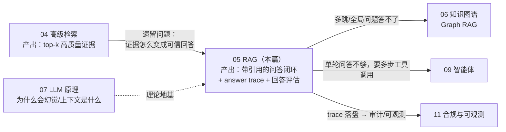
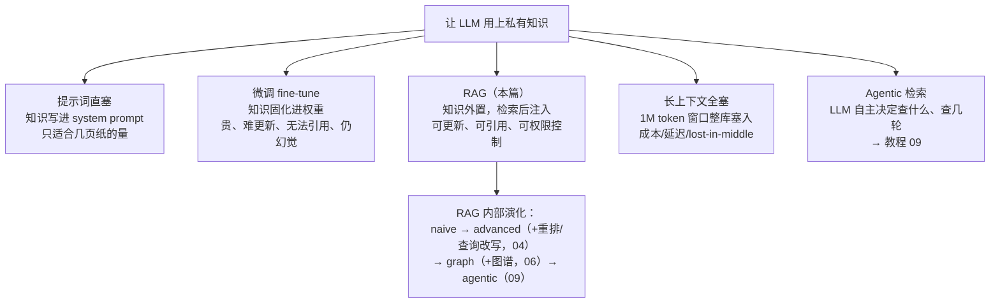
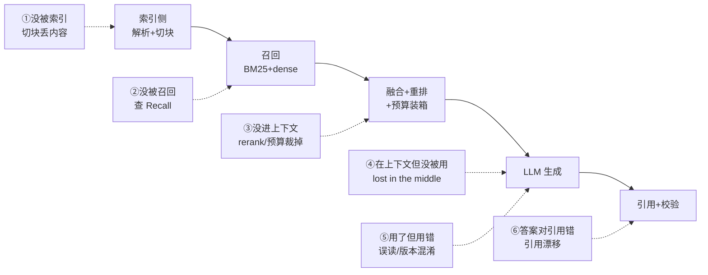

# 05 · RAG：检索增强生成的完整工程

## 一句话

RAG = 先检索出相关证据，把证据和问题一起塞进提示词，让 LLM "看着材料回答"——它把开卷考试代替闭卷考试，是控制幻觉、接入私有数据、让答案可溯源的主流架构。

## 本篇在全局脉络中的位置



本篇是检索线（02→04）的**出口**：前面所有指标最终都要兑换成"用户拿到一个可信、可溯源的回答"。抓三件事：**chunking 决定整条管线的上限**（它在索引侧，错了后面全错）；**拒答是特性**（fail-closed 在安全领域是卖点）；**trace 让回答变成可审计的证据链**（这也是项目 Day 5 的核心交付物）。

## 老类比

- **RAG = 带资料入场的客服系统**。老式智能客服是"规则+模板"，答不上就转人工；LLM 是全能但爱瞎编的客服；RAG 是给这个客服配一个**知识库检索员**，规定"只能根据检索员递上来的资料回答，答案要标注出处，资料里没有就说不知道"。
- **Chunking = 数据库的分页与索引粒度设计**。表设计得不好，再好的查询优化器也救不了；块切得不好，再好的检索器也救不了。
- **上下文窗口 = 内存预算**。LLM 一次能读的 token 有限且越长越贵越慢，往里塞什么就是一个经典的"有限缓存装什么"问题。
- **引用 = 外键约束**。答案里每个论断都必须能 JOIN 回源文档，JOIN 不上的论断就是"孤儿记录"（幻觉）。

## 原理详解

### 0. 知识注入方案版图：RAG 只是五条路之一

"让 LLM 懂你的私有知识"有五条路，RAG 是当前的默认解但不是唯一解——面试时能画出这张版图再解释选型，比直接背 RAG 原理高一档：



选型逻辑（对应 §1 的三个业务理由）：知识量超过几页纸 → 排除直塞；知识要周更、答案要带出处、不同用户可见不同文档 → 排除微调和全塞；单轮问答够用 → 先不上 agentic。剩下的就是 RAG。**这五条路不互斥**：RAG 打底，行为风格用微调，复杂任务升级 agentic——"知识放数据库、逻辑写代码"的老直觉完全适用。

### 1. 为什么需要 RAG（三个业务理由）

1. **知识时效与私有性**：LLM 训练数据有截止日期，且没见过你公司的维修手册。微调（fine-tune）贵、慢、更新困难且依旧会幻觉；RAG 把知识放外部，更新知识 = 更新索引，成本是数据工程级而非训练级。
2. **可溯源**：航空/国防场景答案必须带出处。参数里的知识无法引用，检索来的证据天然带来源。
3. **幻觉控制**：给定证据 + 明确指令 + 拒答机制，幻觉率大幅下降（不为零——这是后面 critic/评估存在的原因）。

**RAG vs 微调**（面试常问）：不是二选一。知识注入用 RAG（可更新、可引用），行为/格式/风格调整用微调。"知识放数据库，逻辑写代码"的老直觉在这里完全适用。

### 2. Chunking：最不性感但最影响效果的环节

**为什么要切块**：①上下文窗口有限；②embedding 对长文本会"平均稀释"（一段 5000 字的向量表达不了其中某句关键信息）；③检索粒度太粗则塞入大量无关内容。

**策略光谱**：

- **固定长度 + 重叠**（如 512 token、重叠 64）：无脑但意外地稳，是必须先跑的基线。重叠是为了防止句子被拦腰切断导致语义丢失。
- **结构感知切块**：按文档的天然边界切——对 LearnArken 就是 S1000D 的结构：一个 `proceduralStep`（连同它的 warning）、一张表、一个前置需求块。**警告必须和它保护的步骤在同一块里**——切散了就是安全事故（用户检回步骤却看不到警告）。
- **图上下文切块（graph-contextualized chunking，JD 原词）**：每个 chunk 除正文外附带结构化元数据——所属 DMC、任务、涉及部件、父出版物、引用关系、版本、适用性。用途：①检索时元数据过滤；②进上下文时可以带上"这段来自 XX 手册 XX 任务"的定位信息；③引用能精确到 DMC+步骤号。这是"文档智能系统"和"通用 RAG demo"的分水岭。

**块大小的权衡**：小块（128~256）→ 检索精准但上下文碎片化，LLM 缺乏周边信息；大块（1024+）→ 上下文完整但检索变糊、塞得少。常见解法是**检索小块、返回大块**（small-to-big：用小块的向量做检索，命中后把它所属的父块/整个步骤送进上下文）。

### 3. 上下文组装（Context Assembly / 编排）

拿到 top-k 证据后到发出 prompt 之间还有一堆工程：

- **上下文预算**：比如 8K token 给证据。裁剪策略：按 rerank 分数从高到低装箱，装不下的丢弃；同源 chunk 合并。
- **多样性**：top-5 别全是同一段的近重复（MMR：边际相关性最大化——每次选"与查询相关但与已选内容不重复"的块）。
- **结构化证据的注入**：表格转 markdown、图谱事实（教程 06）以"事实列表"形式注入、版本 diff 以对比形式注入。**adaptive context orchestration** = 按查询类型决定塞什么组合：依赖类问题多塞图谱事实，过程类问题多塞步骤块，对比类问题塞两个版本。
- **Prompt 契约**：系统提示里写死规则——"仅依据提供的证据回答；每个论断标注 [来源编号]；证据不足时明确说无法回答"。**拒答是特性不是缺陷**（fail-closed），在安全领域是卖点。
- **Lost in the middle 现象**：LLM 对上下文首尾的内容利用率高、中间的容易忽略。最重要的证据放开头或结尾。

### 4. 引用与 Groundedness（答案质量的可测量化）

- **引用机制**：证据块编号（[1][2]...），要求 LLM 生成时内联引用。生成后**程序化校验**：每个引用号真实存在、每个关键论断附近有引用。
- **Groundedness（有据性）**：答案中的论断是否被证据支持。评测方法：用另一个 LLM 当裁判（LLM-as-judge），逐论断问"这句话能否从证据推出"；或用 NLI（蕴含判断）模型。
- **答案评估指标组**：citation coverage（论断有引用的比例）、groundedness、正确性（对 golden 答案）、矛盾率。加上检索指标（教程 02），构成完整评估面板。
- **LLM-as-judge 的纪律**：裁判也是 LLM，也会错。judge 分数必须先和人工标注对齐校准（报告一致率），一致率不过关的 judge 打出的指标不能进 README——只报 judge 数字不报校准过程，等于用一个未验证的仪器出报告。

### 5. Answer Trace：可审计的答案（LearnArken 的招牌设计）

每个答案落一条完整 trace：

```json
{
  "query": "...", "query_type": "procedural",
  "retrieval": {"bm25": [...], "dense": [...], "fused": [...], "reranked": [...]},
  "graph_facts": ["(PumpP-1002) partOf (HydraulicSystem)"],
  "context_final": ["chunk_ids..."],
  "prompt": "...", "model": "name+version",
  "answer": "...", "citations": [...],
  "critic_verdict": {"grounded": true, "issues": []},
  "latency_ms": {"retrieval": 45, "rerank": 120, "llm": 900}
}
```

价值：调试（哪一层丢了证据？）、审计（合规要求）、评估（离线重放）、面试演示（打开一条 trace 讲整个管线，比任何 PPT 都硬）。

### 6. Graph RAG：图谱增强的 RAG（衔接教程 06）

普通 RAG 答不好两类问题：

- **多跳依赖**："改了 P-1002 会影响哪些维修任务？"——答案分散在多个文档的引用关系里，任何单个 chunk 都不包含完整答案。
- **全局汇总**："这套手册主要覆盖哪些系统？"——需要corpus 级视角。

Graph RAG 的做法：把实体和关系抽取成图谱，查询时**先查图（SPARQL 找出依赖链）再检索（对链上每个节点取相关 chunk）**，或把图谱事实直接作为上下文注入。微软的 GraphRAG 论文另辟蹊径：对图做社区检测并预生成社区摘要来答全局性问题。LearnArken 的路线是前者（结构化标准数据天然成图，不需要从纯文本抽取那么重）。

### 7. 常见 RAG 失败链（面试官爱问"RAG 为什么答错了"）

全链路和六个失败点一张图对上（这也是 trace 每个字段存在的理由）：



从后往前排查：

1. 证据没被**索引**（文档没进管线/切块丢内容）
2. 证据没被**召回**（检索失败——查 Recall）
3. 证据被召回但没进**上下文**（rerank 排掉了/预算裁掉了）
4. 证据在上下文但 LLM **没用**（lost in the middle/证据表述晦涩）
5. LLM 用了但**用错了**（误读/张冠李戴/过时版本）
6. 答案对但**引用错了**（引用漂移）

每一层都有对应的指标和修法。能背出这条链，说明你真正理解 RAG 是一个系统而不是一个 prompt。

### 8. RAG 的限制清单（谁来接盘）

| # | 限制 | 一句话 | 谁接盘 |
| --- | --- | --- | --- |
| 1 | 多跳/全局问题原理性答不了 | 答案在关系里，不在任何单个 chunk 里 | Graph RAG（06） |
| 2 | 幻觉可减少不可消除 | prompt 契约挡不住全部 | 程序化校验 + LLM-as-judge + 对抗评估（本篇 §4 + 项目 Day 8） |
| 3 | 单轮"检索→生成"应付不了多步任务 | "对比两版并生成迁移清单"需要规划和多次工具调用 | Agent（09） |
| 4 | 评估天花板 = 标注质量 | judge 未校准、golden 答案有偏，指标就是空中楼阁 | 人工标注纪律 + judge 校准（§4） |
| 5 | 延迟是各层之和 | 检索+重排+LLM 首 token，秒级起步 | 推理服务优化（08）；缓存；流式输出 |
| 6 | 上下文即攻击面 | 检回的文档可能含注入指令（"忽略以上规则…"） | prompt 加固 + 权限过滤 + 审计（11） |

**杠杆排序**（回答质量的力气花在哪，收益从高到低）：

```
chunking（结构感知 + 警告绑定步骤）   索引侧上限，错了全链路封顶
检索质量（02→04 的全部工作）          失败链①②③，实践中占错误大头
prompt 契约 + 拒答 + 引用校验          失败链④⑤⑥的防线，改起来最便宜
上下文组装（排序/去重/预算）           几个点级别的稳定收益
生成参数（temperature 等）             几乎免费但也几乎到顶,五分钟调完
```

规律和 02/03 一致：**越靠上游（数据侧）的决定越值钱，越靠下游（参数侧）的旋钮越廉价**。排查问题从下游往上游查（失败链），投资源从上游往下游投。

## 调优与参数

| 环节 | 参数 | 调法 |
| --- | --- | --- |
| chunk | 大小/重叠/策略 | 三组配置跑同一评估集对比 Recall 和答案质量 |
| 检索 | top-k 进 rerank，top-n 进上下文 | Recall@k 曲线找拐点 |
| 上下文 | token 预算、排列顺序 | 重要证据放首尾；预算 vs 成本实验 |
| prompt | 拒答阈值语气、引用格式 | 用对抗性查询（无答案问题）测拒答率 |
| 生成 | temperature（低，0~0.3） | 事实型任务要确定性，不要创造性 |

## 失败模式

1. **警告与步骤切散**（领域特有，安全级）：结构感知切块 + 校验规则兜底。
2. **版本混淆**：新旧版本的 chunk 同时被召回，LLM 拼接出"缝合怪"程序。修法：默认过滤到最新版，对比类查询显式带版本。
3. **无答案问题不拒答**：证据里没有，LLM 硬编。测试集必须包含"不可回答"问题，考核拒答率。
4. **引用漂移**：论断对，但标的引用号是另一块。程序化校验 + critic 抽查。
5. **上下文互相矛盾**：两个来源说法不一。要求 LLM 显式指出矛盾而非静默选边。
6. **查询与语料语言/术语错位**：用户口语 vs 手册术语。HyDE/查询改写/同义词典。
7. **judge 未校准就报指标**：LLM-as-judge 打 0.92 的 groundedness，但 judge 和人工一致率只有 0.6——指标无意义。先校准后报数。

## 面试问答

**Q: RAG 和微调怎么选？**
A 要点：知识 vs 行为的分工。知识注入选 RAG（可更新、可引用、可权限控制——不同用户可见不同文档，这一点微调根本做不到）；格式/风格/领域行为选微调；两者可叠加。补一句成本视角：RAG 的更新成本是数据工程级的。加分点：画出五条路的版图（直塞/微调/RAG/长上下文/agentic）再说排除逻辑。

**Q: 你的 chunk 怎么切的，为什么？**
A 要点：先讲基线（固定长度+重叠），再讲结构感知（按 proceduralStep/表格/前置需求切，warning 绑定步骤），再讲图上下文元数据（DMC/任务/部件/版本/适用性），最后 small-to-big。每一步都说"评估显示 X 提升了 Y"。

**Q: 怎么防止/减少幻觉？**
A 要点：分层防御——检索保证证据在场（Recall）、prompt 契约（只依据证据+强制引用+允许拒答）、低 temperature、生成后校验（引用存在性、groundedness 裁判、critic agent）、fail-closed、全程 trace 可审计。强调"减少并可检测"而非"消除"。

**Q: 用户说答案错了，你怎么排查？**
A 要点：背出六层失败链（没索引→没召回→没进上下文→没被用→用错了→引用错），说明每层看 trace 的哪个字段、用什么指标定位。这题是展示工程素养的最佳机会。

**Q: 你用 LLM 给自己的 RAG 打分，凭什么可信？**
A 要点：LLM-as-judge 必须先校准——抽样人工标注同一批回答，报告 judge 与人工的一致率，一致率达标后才用 judge 扩大覆盖；judge 的 prompt 和版本固定进 trace 可复现；关键指标（如拒答正确性）保留人工抽查。展示"仪器要先标定再使用"的实验素养。

**Q: 什么时候普通 RAG 不够，需要 Graph RAG？**
A 要点：多跳依赖问题（影响分析——答案在关系里不在任何单个文档里）和全局汇总问题。讲 LearnArken 场景："P-1002 变更影响哪些任务"需要先 SPARQL 遍历依赖图再对节点取证据。

**Q: 长上下文模型（1M token）出现后 RAG 还有必要吗？**
A 要点：有。①成本与延迟：每次塞全库 token 费用不可行；②lost in the middle 在超长上下文更严重；③权限过滤仍需检索层（不能把无权文档塞给模型）；④可审计性：检索结果是明确的证据边界。长上下文放宽了"塞多少"的预算，改变的是 chunk 策略的松紧，不是取代检索。
