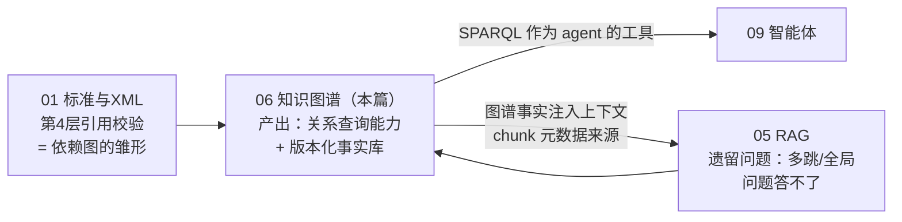
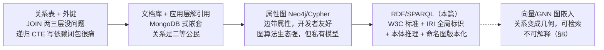
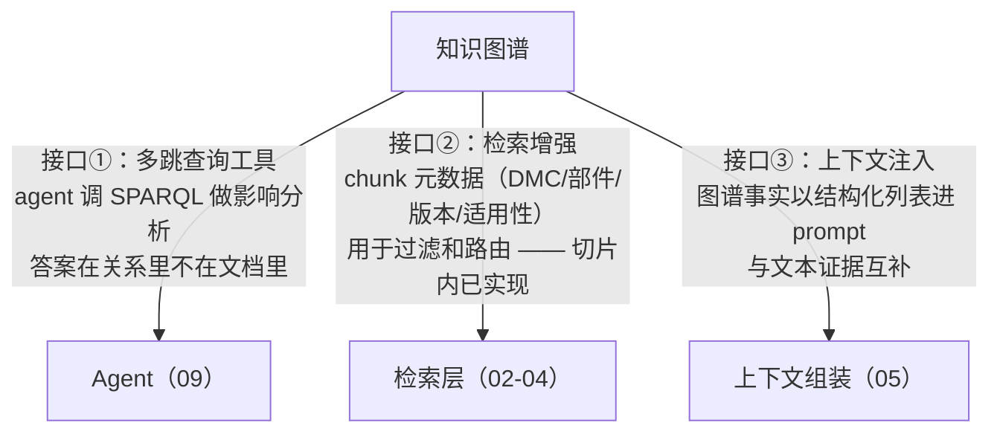

# 06 · 知识图谱：RDF、OWL、SPARQL 与时间版本

## 一句话

知识图谱把"事实"存成"主语-谓语-宾语"三元组的图结构，让"P-1002 变更会影响哪些任务"这类**关系遍历问题**变成一条查询；RDF/OWL/SPARQL 是它的 W3C 标准技术栈，地位相当于关系世界的"表结构/约束/SQL"。

## 本篇在全局脉络中的位置



**执行状态注意**：本篇在项目切片中是**分层实施**的——chunk 携带图上下文元数据（DMC/部件/版本/适用性）在切片内（它是 Day 3 分块器的一部分），RDF/SPARQL 全量图谱标注 Planned。这样安排的原因见 §0 的"什么时候才值得上图谱"。学习上本篇仍然完整讲透，因为它是 JD 高频词，且"知道何时不用"与"知道怎么用"同样值钱。

## 老类比

数据库老手的直译表（这是你学这章最大的优势）：

| 关系数据库世界 | RDF/语义网世界 | 备注 |
| --- | --- | --- |
| 一行数据的一个字段值 | 一条三元组 (s, p, o) | RDF 把"表"打散成原子事实 |
| 表结构 (DDL) | 本体 Ontology（OWL 定义类和属性） | 但 schema 是"开放"的，见下文 |
| 主键 / 外键 | IRI（全局唯一标识符） | 外键天然全局化，跨库 JOIN 免费 |
| SQL | SPARQL | 语法惊人地像 |
| JOIN | 图遍历 / 属性路径 | 多级 JOIN 变成 `路径+` 一个符号 |
| 数据库 (database) | 命名图 (named graph) | 四元组：三元组+图名 |
| CHECK 约束 / 触发器 | OWL 推理 / SHACL 校验 | 语义完全不同，最大的思维陷阱，见下文 |
| ER 图 | 本体图 | ER 图是设计文档，本体是机器可读的数据 |

一句话总结差异：**关系模型为"已知结构的高效存取"设计，RDF 为"异构知识的合并与推理"设计。**

## 原理详解

### 0. 知识表示版图：关系问题有四条存法，图谱是其中一条

"P-1002 被哪些任务用到"本质是**关系查询**。存关系的方案是一条谱，管控/表达力递增：



**选型上下文**（为什么全量图谱的**目标态**押 RDF——M0-M8 愿景，§6 有细节；**⚠️ 注意：本项目实建的最小图谱切片用的是 Neo4j 属性图 + Cypher**，Day 5/9/11，Yi Xin Day 3 定 Neo4j、RDFLib 出局，见 [04 §4](../architecture/04-tech-selection.md) / ADR-0002）：领域是标准驱动 + 多源整合（S1000D/iSpec/S2000M 要合并——IRI 让合并 = 三元组并集）、要版本化（命名图白送）、要推理（传递闭包白送）——这三条是 RDF 在**全量态**的红利。**这三个需求在演示规模还没到，所以 Neo4j 甚至 Postgres 递归 CTE 都是更省事的选择——本项目正是据此先落 Neo4j 最小切片、全量 RDF 图谱排 Planned**——技术没有高低，匹配才有。

**什么时候才值得上图谱**（也是它在本项目被推迟的理由）：图谱的成本在建模和维护，收益在关系查询。判据三问——① 你的高价值查询里"多跳关系"占比多少？占比低，关系表就够。② 关系是显式结构（XML 引用标签）还是要从文本里抽？要 LLM 抽取的图污染风险高、成本大。③ 有没有"合并多源异构数据"的真实需求？没有就用不上 IRI 的红利。本项目的诚实回答：多跳查询在演示问题里占少数、结构化抽取虽然便宜但下游消费者（agent 工具）还没建——所以 chunk 元数据先行（低成本高收益），全量图谱排 Planned。**这个"分层实施"的推理过程本身就是面试答案。**

### 1. 三元组与 IRI：原子化的事实

```turtle
@prefix la: <http://learnarken.dev/ontology#> .
@prefix dm: <http://learnarken.dev/dm/> .

dm:DMC-BIKE-AAA-D00-00-00-041A-A  a               la:DataModule ;
                                   la:title        "液压泵更换程序" ;
                                   la:appliesTo    la:ModelX ;
                                   la:references   dm:DMC-BIKE-AAA-D00-01-00-040A-A ;
                                   la:usesPart     la:Part-P-1002 ;
                                   la:issueNumber  "003" .
```

- 每行是一条三元组（Turtle 语法里 `;` 复用主语）。`a` 是 `rdf:type` 的缩写。
- **IRI 是全局主键**：`http://learnarken.dev/dm/DMC-...` 不只在你的库里唯一，理论上在全世界唯一。两个来源的数据只要用同一 IRI 指同一实体，合并就是纯粹的三元组并集——**没有 schema 迁移、没有列冲突**。这就是它适合"多标准数据整合"（S1000D + iSpec + S2000M 的零件数据）的根本原因。
- 宾语可以是另一个实体（IRI，构成图的边）或字面量（字符串/数字/日期，带类型标注）。

### 2. 本体（OWL）：机器可读的领域模型

本体 = 用三元组定义"类、属性、关系约束"本身：

```turtle
la:DataModule      a owl:Class .
la:ProcedureModule rdfs:subClassOf la:DataModule .
la:usesPart        a owl:ObjectProperty ;
                   rdfs:domain la:DataModule ;
                   rdfs:range  la:Part .
la:partOf          a owl:TransitiveProperty .   # 传递性：零件属于组件，组件属于系统 ⇒ 零件属于系统
```

关键理解：

- **本体也是数据**：类定义和实例数据存在同一个库里，可以被同一种语言（SPARQL）查询。相当于 information_schema 和业务表同构。
- **推理（reasoning）**：声明 `partOf` 是传递属性后，推理机可以**自动推导出**没显式存储的三元组（P-1002 partOf HydraulicSystem，即使只存了两跳）。子类推理同理：查所有 `DataModule` 自动包含 `ProcedureModule` 实例。
- **OWL 有不同推理档位**（profiles：EL/QL/RL），表达力越强推理越贵。工程实践：**用轻量推理（子类、传递、逆属性），复杂逻辑写在应用层**——完整 OWL DL 推理在大图上性能是深坑。
- LearnArken 的本体规模建议：10~20 个类（DataModule、PublicationModule、Part、Task、Warning、System…）、20~30 个属性，够讲清概念且面试可白板画出。

### 3. 两个最大的思维转换（老程序员必躺的坑）

**① 开放世界假设（OWA）**：关系数据库里"查不到 = 不存在"（封闭世界）。RDF 默认"查不到 = 不知道"。推理机不会因为"没存 P-1002 的供应商"就推出"P-1002 没有供应商"。**校验因此不能靠 OWL 推理做**——"每个 DM 必须有 issueNumber"这种约束，OWL 推理永远不会报错（它只会认为 issueNumber "存在但未知"）。真正做数据校验用 **SHACL**（W3C 的图数据约束语言，封闭世界语义，输出违规报告——概念上就是图版的 Schematron，和教程 01 的 findings 一脉相承）。

**② 没有唯一名假设**：两个不同 IRI 可能指同一实体（除非声明 owl:sameAs），同名不保证同物。数据整合时的实体对齐（entity resolution）因此是显式工作。

### 4. SPARQL：会 SQL 就会 80%

```sparql
# 哪些数据模块直接或间接依赖零件 P-1002？—— 变更影响分析的核心查询
PREFIX la: <http://learnarken.dev/ontology#>
SELECT ?dm ?title WHERE {
  ?dm la:usesPart/la:partOf* la:Part-P-1002 .   # 属性路径：usesPart 后接任意级 partOf
  ?dm la:title ?title .
  FILTER NOT EXISTS { ?dm la:status la:Deprecated }
}
```

对照 SQL 的心智映射：

- `WHERE { }` 里是**三元组模式**，变量 `?dm` 同时出现在多个模式中 = 隐式 JOIN。
- **属性路径**是杀手锏：`la:references+`（一级或多级引用）、`la:partOf*`（零级或多级）——SQL 里要写递归 CTE 的活儿，这里一个符号。**这是"为什么图谱做依赖分析比关系库爽"的直接证据。**
- 其他你熟悉的都在：`FILTER`（WHERE 条件）、`OPTIONAL`（LEFT JOIN）、`GROUP BY/COUNT`、`ORDER BY/LIMIT`、`CONSTRUCT`（查询结果输出为新三元组，相当于 SELECT INTO）。
- `FROM NAMED / GRAPH ?g { }`：指定查哪个命名图——版本查询的入口（见下）。

### 5. 命名图与时间版本（JD 的 "temporal graph versioning"）

四元组模型：每条三元组归属于一个"图"（graph IRI）。LearnArken 的版本化设计：

```
graph <http://learnarken.dev/package-a/issue-002> { ...该版本全部三元组... }
graph <http://learnarken.dev/package-a/issue-003> { ...新版本全部三元组... }
graph <http://learnarken.dev/meta> {
  <.../issue-003> la:supersedes <.../issue-002> ;
                  la:validFrom  "2026-03-01"^^xsd:date .
}
```

- 每个包版本一个命名图（快照式，简单、可审计，符合出版物"整包发布"的现实）；元数据图记录版本链和生效时间。
- 查询"当前版本"= 只查最新图；"版本 diff" = 两个图的三元组差集（新增/删除的事实列表）——**这直接生成"两版程序的安全关键差异"这类答案的原料**。
- 替代方案（面试可提）：语句级 reification/RDF-star 给单条三元组挂时间戳，粒度细但复杂；快照式对"整包发版"的领域更合适。这是一个能展示"按业务选技术"的好例子。

### 6. 存储选型：RDFLib → Oxigraph；以及 vs Neo4j

- **RDFLib**：纯 Python 库，学习期完美（几行代码建图、查询、序列化），性能天花板低（内存、单机、无并发服务）。
- **Oxigraph**：Rust 写的 RDF 数据库，带 SPARQL endpoint 服务，是"生产形态"的升级路径。迁移成本≈零（都是标准 RDF/SPARQL——**标准化的红利，值得在面试里点出来**）。
- **vs Neo4j（属性图）**（高频面试题）：属性图的边可以直接带属性、Cypher 对开发者更友好、图算法生态强；RDF 的优势是 **W3C 标准化（数据可移植）、IRI 全局标识（多源整合）、本体+推理（子类/传递自动推导）、命名图（版本化）**。技术出版领域本身就是"标准驱动"的，且需要多标准数据融合，所以 RDF 是更贴合的选择，Neo4j 可作对比实验。

### 7. 实体关系抽取：图从哪来

两条路，LearnArken 主走第一条：

1. **结构化抽取（主路）**：S1000D XML 本身就是半结构化的——DM 的引用、零件表、适用性都是显式标签，写确定性代码映射成三元组即可。**可靠、可测试、可复现**。
2. **LLM 抽取（辅路）**：对自由文本段落（描述、故障说明）用 LLM 抽 (实体, 关系, 实体)，schema 约束输出（只允许本体中定义的类和关系），抽取结果标注来源与置信度，**低置信度不入主图**。这里再次体现"LLM 不可信"主线：抽取结果要过校验（实体是否存在、关系是否符合 domain/range）。

### 8. GNN 图嵌入（可选实验，知道概念即可）

图神经网络给每个节点学一个向量，使图结构相近的节点向量相近（消息传递：每个节点聚合邻居的表示，迭代数轮）。在 LearnArken 中的假设性用途：把节点嵌入作为检索特征（"结构上和已命中模块相邻的模块加分"）。诚实的定位：**可选实验，先测是否真的提升指标**——面试时说"我把它列为假设待验证项"比吹嘘更可信。

### 9. 图谱 × RAG 的三个组合接口（把 05 和 06 拼起来）



三个接口成本递增、独立可用：接口②只需要抽取元数据（不需要图数据库），本项目切片内做的就是它；接口③要求有可查询的事实库；接口①还要求 agent 框架。**图谱不替代文本检索**——关系问题查图，内容问题查文本，两者是分工不是竞争。

### 10. 图谱路线的限制清单（谁来接盘）

| # | 限制 | 一句话 | 谁接盘 |
| --- | --- | --- | --- |
| 1 | 建模与维护成本高 | 本体是要养的产品，不是一次性交付 | 从查询需求倒推、10~20 类封顶的纪律（§2） |
| 2 | 图的质量 = 抽取的质量 | LLM 抽取的幻觉三元组让答案"有据地错" | staging 图隔离 + domain/range 校验 + 置信度门槛（§7） |
| 3 | OWL 推理不能做校验 | 开放世界假设：查不到≠不存在 | SHACL / 应用层校验（§3） |
| 4 | 关系强内容弱 | 图谱答不了"这段描述具体怎么说" | 文本 RAG 分工（§9）；图只管关系 |
| 5 | 属性路径性能悬崖 | `*` 在稠密/有环图上爆炸 | 限深、物化传递闭包（调优节） |
| 6 | 冷启动难证明价值 | 没有消费者（agent/查询）时图谱是纯成本 | 分层实施：元数据先行，全图随需求解锁（§0） |

**杠杆排序**（图谱工程的力气花在哪）：结构化映射（XML 标签→三元组，确定性代码白捡一张可靠的图）> 命名图版本化（快照式，实现简单、演示价值高）> 轻量推理（传递/子类，两行本体声明换依赖闭包）> LLM 抽取（收益看语料，污染风险高）> GNN 嵌入（假设待验证，放最后）。

## 调优与参数

图谱没有 efSearch 式旋钮，"调优"体现在建模决策：

- **粒度**：把步骤（step）建为节点吗？节点越细图越大、查询越强、维护越贵。原则：会被单独引用/查询的才成为节点。
- **推理开关**：物化（materialize：预先算出推导三元组存起来，查询快、更新慢）vs 查询时推理（数据新鲜、查询慢）。快照式版本 + 物化是合理组合。
- **SPARQL 性能**：三元组模式的顺序影响执行计划（先写选择性高的模式）；属性路径 `*` 在稠密图上可能爆炸，必要时限定深度。

## 失败模式

1. **用 OWL 推理做校验**：开放世界假设下永远不报"缺字段"。校验用 SHACL/应用层。
2. **IRI 设计混乱**：版本信息该进 IRI 还是命名图？实体 IRI 里混入版本号会导致"同一逻辑实体在不同版本是不同节点"，依赖遍历断裂。原则：实体 IRI 稳定，版本用命名图表达。
3. **属性路径失控**：`references*` 在有环的图上/稠密图上查询超时。检测：对合成大图做查询压测；修法：限深、物化传递闭包。
4. **LLM 抽取污染主图**：幻觉三元组混入导致下游答案"有据可依地错"。修法：抽取结果隔离到 staging 图 + 校验 + 置信度门槛。
5. **本体过度设计**：一上来建 100 个类，维护崩溃。本体是产品不是论文，从查询需求倒推建模。
6. **忘记字面量类型**：日期存成字符串，FILTER 比较按字典序——"2026-3-1" > "2026-11-1"。永远带 `^^xsd:date`。

## 面试问答

**Q: 为什么选 RDF 而不是 Neo4j？**
A 要点：领域是标准驱动+多源整合（S1000D/iSpec/S2000M 数据要合并，IRI 全局标识让合并=并集）；需要本体推理（子类/传递属性做依赖闭包）；命名图天然支持版本化；W3C 标准保证数据可移植（RDFLib→Oxigraph 零迁移成本）。同时承认属性图的优势（边属性、Cypher 易用、图算法库），说明做过对比判断而非跟风。

**Q: 什么时候不该上知识图谱？**
A 要点：三问判据——多跳关系查询在高价值查询里占比低？关系要靠 LLM 从文本硬抽（而非显式结构）？没有多源整合需求？三者占其二就先别上，关系表/属性图/纯 RAG 更省。展示"知道何时不用"的判断力，并给出自己项目的分层实施决策（元数据先行，全图 Planned）作为实例。

**Q: 图谱在你的 RAG 里具体怎么用？**
A 要点：三个接口——①多跳查询工具（agent 调 SPARQL 做影响分析，答案在关系里不在文档里）；②检索增强（chunk 元数据来自图：DMC/部件/版本/适用性，用于过滤和路由）；③上下文注入（图谱事实以结构化列表进 prompt，和文本证据互补）。给一个具体例子：P-1002 变更影响分析的属性路径查询。说明三接口成本递增、可独立采用。

**Q: 开放世界假设是什么？造成什么工程后果？**
A 要点：查不到=不知道≠不存在；后果是 OWL 推理不能做完整性校验，必须引入 SHACL 或应用层校验；同时它也是特性——允许知识不完整地增量合并。能讲出 OWA 的人在图谱面试里直接进入前 10%。

**Q: 时间版本怎么建模？**
A 要点：每包版本一个命名图（快照式）+ 元数据图记 supersedes/validFrom 链；对比 reification/RDF-star（语句级时间戳）并解释为什么快照式贴合"整包发版"的出版领域；版本 diff = 图差集，直接支撑"两版差异"类查询。

**Q: SPARQL 和 SQL 最大的区别？**
A 要点：数据模型（图 vs 表）带来的查询范式差异——SPARQL 的 JOIN 是隐式的（共享变量），杀手锏是属性路径（`+`/`*` 取代递归 CTE）；再提 OPTIONAL≈LEFT JOIN、CONSTRUCT 产出新图。用"依赖闭包查询在两边分别怎么写"做例子最有说服力。

**Q: 实体抽取的质量怎么保证？**
A 要点：分层——结构化数据走确定性映射（可测试、有 golden 快照）；自由文本走 LLM 抽取但 schema 受限 + domain/range 校验 + 置信度门槛 + staging 图隔离 + 抽样人工评估（precision/recall 报告）。
