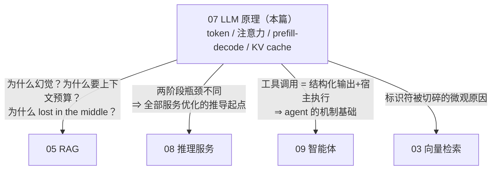
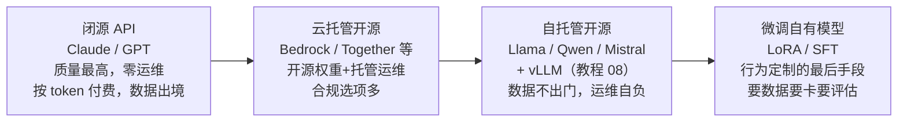
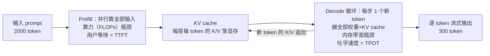

# 07 · LLM 原理：读懂推理服务优化之前必须懂的最小集合

## 一句话

LLM 是一个"给定前文、预测下一个 token 概率分布"的超大函数，理解 token、注意力、prefill/decode 两阶段和 KV cache 这四个概念，教程 08 的所有服务优化（PagedAttention、连续批处理、投机解码）就都能推导出来。

## 本篇在全局脉络中的位置

本篇不在"检索问答"主线上，而是主线脚下的**地基**：05/08/09 的每个工程决策，追问两句"为什么"都会落到本篇的四个概念上。



学法建议：不追公式推导，追**工程后果**——每个概念记住"它导致了下游的什么决策"。这也是面试的考法：没人让你手推注意力，但"为什么 KV cache 是并发天花板"答不上来就露馅。

## 老类比

- **LLM = 极端加强版的输入法联想**。手机输入法根据前几个词猜下一个词；LLM 根据前文全部内容猜下一个 token，猜完把它接到前文再猜下一个——循环往复。它没有"想好了再说"的全局规划，就是逐 token 往外蹦（这解释了很多怪现象）。
- **KV cache = 增量计算的备忘录（memoization）**。老工程直觉：循环里别重复算不变的东西，把中间结果存下来。KV cache 就是把"前文的中间计算结果"缓存住，生成每个新 token 时只算新增的部分。
- **prefill/decode = 编译 vs 逐行解释**。prefill 一次性并行处理整个输入（吞吐型、算力密集），decode 逐 token 串行往外吐（延迟型、内存带宽密集）。两阶段性质完全不同，这是一切服务优化的出发点。
- **temperature = 抽签的公平程度**。模型输出的是概率分布，temperature 决定"按概率抽签"还是"永远选最大概率"。

## 原理详解

### 0. 接入方式版图：懂原理之前先摆正自己的位置

应用工程师不训模型，但要在四条接入路线里选型——这是比原理更先遇到的决策：



**本项目的选型**：主路径 **MiniMax-M3 chat API**（Day 5 裁决改用，原执行计划默认 Claude API，见 [04 §4.6](../architecture/04-tech-selection.md) 与 specs/day5）——都是闭源 API 路线，理由是把学习预算花在检索和评估（差异化所在），而不是 GPU 运维（成熟商品）；执行计划里"不先死磕本地推理"就是这个决策。但**自托管路线必须懂原理**（本篇+08），两个原因：①目标行业（航空/国防）大概率要求数据不出门，自托管是真实的生产形态，面试必问；②API 用户懂了两阶段推理，才知道 TTFT 慢该怪 prompt 太长还是服务商排队——**懂原理让你在任何一条路线上都会排障**。

选型判据一句话：**数据能不能出门（合规）→ 排除法；剩下的按"质量需求 vs 运维预算"选**。行为定制（微调）永远是最后手段——先试 prompt，再试 RAG，都不行才谈微调（呼应 05 §0 的五条路版图）。

### 1. Token：LLM 的字符集

- 模型不认识"字"，只认识 token——由 BPE 类算法从语料统计出的高频片段。经验值：1 token ≈ 0.75 个英文单词 ≈ 0.5~0.7 个汉字。词表通常 3 万~15 万条。
- 老程序员需要建立的直觉：**token 是计费、限长、延迟的通用单位**。上下文窗口 128K = 输入+输出总 token 预算；API 按 token 计费；生成速度按 token/s 衡量。
- 工程后果：①中文比英文"贵"（同样内容更多 token）；②`P-1002` 这类标识符会被切成多个碎 token（`P`, `-`, `100`, `2`），这是 embedding 对标识符不敏感的微观原因之一；③chunk 大小、上下文预算全都以 token 计，需要用模型配套的 tokenizer 精确计数，而不是数字符。

### 2. Transformer 与注意力：一层窗户纸

推理视角下（不讲训练），Transformer = 几十层结构相同的积木堆叠，每层两个部件：

1. **自注意力（self-attention）**：每个 token 位置"回头看"前面所有 token，决定该借鉴谁的信息。机制：每个 token 算出三个向量 Q（查询：我在找什么）、K（键：我是什么）、V（值：我携带什么信息）。位置 i 的输出 = 用 Qi 和所有前文的 K 做点积得到权重，再按权重加权求和所有 V。**"液压泵的'它'指什么"就是靠注意力把'它'和'泵'连起来的。**
2. **前馈网络（FFN/MLP）**：对每个位置独立做两层矩阵乘。模型的大部分"知识"存在这些权重里。

只需再记三件事：

- **因果掩码**：生成式模型的注意力只准往前看（位置 i 看不见 i 之后），所以已生成部分的计算结果永不改变——**这是 KV cache 能成立的数学前提**。
- **参数量与显存**：7B 模型 = 70 亿参数，FP16 下权重占 14GB。粗算法：参数量 × 2 字节（FP16）。这是"为什么要量化"的算术基础。
- **注意力是 O(n²)**：每个 token 和前文每个 token 算一次，上下文越长越贵。长上下文的成本不是线性的。

### 3. 两阶段推理：prefill 与 decode（本章最重要的一节）

处理一个请求"输入 2000 token 的 prompt，生成 300 token 回答"分两步：



- **Prefill（预填充）**：一次性并行计算 2000 个输入 token 的所有层表示，并把每层每个 token 的 K、V 存入 **KV cache**。矩阵大、并行度高，是**算力（FLOPs）瓶颈**。用户感受为"首 token 前的等待"（TTFT，time to first token）。
- **Decode（解码）**：每步只算 1 个新 token——它的 Q 去和缓存里全部 K 做注意力，取回 V 加权。每步计算量很小，但要把**整个模型权重和 KV cache 从显存读一遍**，是**内存带宽瓶颈**。用户感受为"打字机吐字速度"（TPOT/ITL，逐 token 间隔）。

工程推论（教程 08 全靠这个）：

- decode 阶段 GPU 算力大量闲置（等内存），所以**批处理（同时给多个请求 decode）几乎免费提升吞吐**——反正瓶颈是搬权重，搬一次给 32 个请求用。
- 延迟指标必须拆开报告：**TTFT**（受 prefill/排队影响）和 **TPOT**（受 decode 影响），合并成"平均延迟"会掩盖问题。
- 流式输出（streaming）不是美化，是 decode 逐 token 本质的自然暴露——首 token 出来就能开始给用户看。

### 4. KV cache：推理服务的"内存大户"

不缓存会怎样：生成第 300 个 token 时要重算前面 2299 个 token 的全部层表示——O(n²) 重复计算，完全不可用。缓存后每步只算增量。

代价是显存。粗算（面试可现场算）：

```
KV cache 大小 ≈ 2(K和V) × 层数 × kv头数 × 头维度 × 2字节(FP16) × token数
7B 级模型量级 ≈ 每 token 约 0.1~0.5 MB ⇒ 一个 4K token 的会话 ≈ 0.5~2 GB
```

推论：**并发数 × 上下文长度直接吃显存**，KV cache 常常比模型权重还大，是并发能力的天花板。谁管好了 KV cache 谁就赢——这正是 vLLM/PagedAttention 的故事（教程 08）。

### 5. 采样：概率分布怎么变成具体的字

模型每步输出词表上的概率分布，采样策略决定选哪个：

- **greedy（temperature=0）**：永远选最大概率。确定性最强（但因浮点并行归约等原因未必绝对可复现）。
- **temperature**：>0 时按概率抽签；调高则分布拉平（更随机/有创意），调低则更集中（更保守）。
- **top-p / top-k**：只在累计概率前 p（或前 k 个）的候选里抽，砍掉长尾胡话。
- **工程守则**：事实型/结构化输出任务（RAG 答案、JSON、SPARQL 生成）用 temperature 0~0.3；需要多样性的任务（ToT 的多分支探索，教程 09）故意调高。**temperature 是按任务配置的参数，不是全局常量。**

### 6. 上下文窗口与它的真实含义

- 窗口 = 注意力能覆盖的最大 token 数（输入+已生成输出共享）。
- 超长窗口的三个现实成本：O(n²) 注意力、KV cache 线性膨胀、lost in the middle（中段信息利用率低）。所以"128K 窗口"不等于"塞满 128K 是好主意"——RAG 的上下文预算管理依然必要（呼应教程 05）。

### 7. 结构化输出与工具调用（衔接教程 09）

- **结构化输出**：让 LLM 严格输出 JSON。手段从弱到强：prompt 里给 schema 和示例 → few-shot → **约束解码**（constrained decoding：每步采样时用状态机屏蔽不合语法的 token，从机制上保证合法 JSON——老程序员可理解为"采样阶段内联了一个增量 parser"）。
- **工具调用（function calling）**：模型输出"我要调用工具 X，参数 Y"的结构化声明，**执行是宿主程序做的，模型只负责'想调用'**。Agent 的全部魔法就建立在这个朴素机制上。

### 8. LLM 的原理性限制清单（谁来接盘）

每条限制都直接源于"逐 token 概率预测"这个机制本身——这张表是全教程系列"LLM 不可信，用系统围堵"主线的总纲：

| # | 限制 | 机制根源 | 谁接盘 |
| --- | --- | --- | --- |
| 1 | 幻觉 | 目标是"像真话"不是"是真话" | RAG 证据+拒答（05）、critic 校验（09）、trace 审计（11） |
| 2 | 知识截止 + 不知私有数据 | 知识冻结在训练语料里 | RAG 全家（05） |
| 3 | 算术/精确计数弱 | 逐 token 生成不是计算器 | 工具调用，算术交给代码（09） |
| 4 | 输出是概率性的 | 采样机制 | temperature 分任务配置（§5）；评估接受方差；结构化输出用约束解码 |
| 5 | 长上下文贵且中段失焦 | O(n²) 注意力 + lost in the middle | 检索+重排控制进窗内容（02-05）；上下文预算 |
| 6 | 无自知之明 | 不知道自己不知道，置信度不可信 | 外置校验：引用校验、judge、人工抽查（05） |

**杠杆排序**（应用层提升 LLM 输出质量的力气花在哪）：

```
换模型（质量/成本档位）        一行配置，任务级路由——简单任务小模型，难任务大模型
喂对上下文（检索+组装，02-05）  RAG 场景的决定性因素，占效果大头
prompt 契约（角色/规则/示例）   便宜且立竿见影，但有天花板
采样参数（temperature 等）      五分钟配完，之后再动收益趋零
微调                          最后手段：要数据、要卡、要独立评估，且只改行为不加知识
```

### 9. 词汇表：面试黑话速查

| 黑话 | 含义 |
| --- | --- |
| 量化 (quantization) | 权重从 FP16 压到 INT8/INT4，显存减半再减半，精度略损 |
| MoE | 混合专家：每 token 只激活部分参数，参数量大但计算省 |
| GQA/MQA | 多个注意力头共享 K/V，直接砍 KV cache 大小的结构设计 |
| LoRA | 微调时只训练小的低秩增量矩阵，便宜的定制手段 |
| 蒸馏 (distillation) | 大模型当老师教小模型 |
| SFT/RLHF | 指令微调/人类反馈强化学习——"预测下文的模型"变成"听话助手"的两步 |
| perplexity | 语言模型对文本的"惊讶程度"，越低拟合越好 |

## 调优与参数

应用层视角（不训练模型）能拧的旋钮：

| 旋钮 | 影响 | 建议 |
| --- | --- | --- |
| temperature/top-p | 确定性 vs 多样性 | 按任务设定；RAG 事实答案 ≤0.3 |
| max_tokens | 成本与延迟上限 | 按任务设上限，防失控生成 |
| 系统提示词 | 行为契约 | 版本化管理，进 trace（教程 05） |
| 模型选择 | 质量/成本/延迟三角 | 简单任务小模型，难任务大模型——"模型路由"本身是架构设计点 |
| 输出 schema | 可解析性 | 能用约束解码就不要靠祈祷 |

## 失败模式

1. **用字符数估 token 数**：中英混排误差巨大，上下文超限报错或静默截断。永远用配套 tokenizer 计数。
2. **静默截断**：输入超窗，框架砍掉了开头（往往是系统提示词），行为诡异且无报错。防御：发送前显式校验长度。
3. **temperature 配错**：SPARQL 生成配了 0.9，十次三个语法错。按任务配置。
4. **把 LLM 当计算器/计数器**：逐 token 生成机制不擅长算术和精确计数。数字计算交给工具（呼应教程 09 的工具边界）。
5. **忽略输出的概率本性**：同一 prompt 两次结果不同就慌了。要么 temperature=0 + 固定 seed（尽力而为），要么在评估设计上接受方差（多次采样看分布）。
6. **知识截止日期**：模型不知道训练之后的事，还会自信地编。这正是 RAG 存在的理由，闭环了。

## 面试问答

**Q: 讲讲 LLM 推理为什么分 prefill 和 decode？两阶段瓶颈有什么不同？**
A 要点：prefill 并行处理全部输入、算力瓶颈、决定 TTFT；decode 逐 token 自回归、每步要搬全部权重+KV cache、内存带宽瓶颈、决定 TPOT。因为瓶颈不同，优化手段不同（decode 靠批处理提吞吐、prefill 靠 chunked 切分防止阻塞）。这题答好，教程 08 的所有问题都是它的推论。

**Q: KV cache 是什么？为什么它是服务优化的核心？**
A 要点：因果掩码 ⇒ 已处理 token 的 K/V 永不变 ⇒ 缓存复用，把 O(n²) 重算降为增量计算。代价：显存占用与"并发×上下文长度"成正比，常超过模型权重，成为并发天花板。现场算一笔账（7B 模型 4K 会话约 GB 级）最能体现真懂。

**Q: 你为什么用闭源 API（MiniMax-M3）而不是自己部署开源模型？**
A 要点：接入方式版图（API/云托管开源/自托管/微调）+ 排除逻辑——学习项目的差异化在检索与评估，GPU 运维是成熟商品，预算应花在前者；同时明确知道行业合规（数据不出门）会把生产形态推向自托管，所以原理和 vLLM（08）照学，架构上 LLM 客户端做成可替换接口，换后端不动业务层。**这条"可替换接口"不是空谈——本项目就在 Day 5 把原计划的 Claude API 换成了 MiniMax-M3，业务层一行未改**。展示"知道自己在版图哪个位置、往哪里迁移"。

**Q: temperature 是什么？你的项目里怎么设的？**
A 要点：softmax 前的温度缩放，控制采样分布的平坦度。项目里按任务分层：RAG 事实回答/SPARQL 生成 0~0.2，critic 评审 0.2，ToT 多分支探索故意 0.7+ 制造多样性。表达出"这是任务级配置"的意识。

**Q: 为什么 LLM 会幻觉？能根治吗？**
A 要点：机制层面——它是概率性的下一 token 预测器，目标是"像真话"而非"是真话"，训练数据也含噪。不能根治，只能工程化围堵：RAG 提供证据、约束解码限制格式、检索不到就拒答、critic/校验器出口把关、trace 审计。诚实回答"不能根治"反而显得专业。加分点：把 §8 的限制清单背出来——每条原理性限制对应一个系统层的接盘设计。

**Q: 上下文 128K 的模型，是不是塞得越多越好？**
A 要点：不是。O(n²) 注意力成本、KV cache 显存、lost in the middle、按 token 计费。上下文预算管理和精排（rerank 后 top-5）仍然必要。引用自己项目的上下文预算设计。

**Q: 结构化输出怎么保证？**
A 要点：分层——schema 提示 + few-shot 是软约束；约束解码（token 级屏蔽非法输出）是硬保证；最后仍要程序侧 parse+validate+重试兜底。体现"纵深防御"而非单点信仰。
