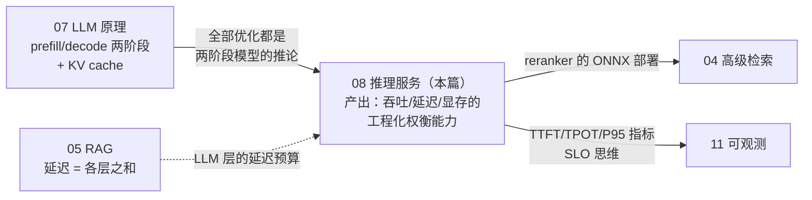
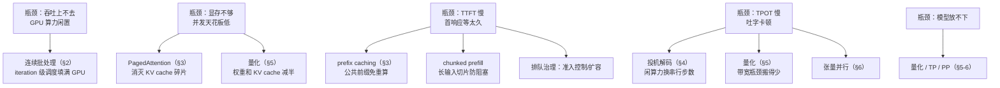

# 08 · 推理服务：vLLM、PagedAttention 与服务优化全景

## 一句话

推理服务解决"一块昂贵的 GPU 如何同时伺候尽可能多的用户还不变慢"，vLLM 的两大杀招是连续批处理（continuous batching，不让 GPU 等人）和 PagedAttention（用操作系统分页的思想管理 KV cache，不让显存浪费）；这一章的一切都是教程 07 两阶段模型的推论。

## 本篇在全局脉络中的位置



**执行状态注意**：本项目主路径用 Claude API（选型逻辑见 07 §0），本篇在切片里是**原理学习 + 文档化 lab**，不是主线交付物。仍然全文学透的原因：①目标行业的数据合规大概率把生产形态推向自托管，这是 JD 高频区；②本章是老系统工程师的**主场**——虚拟内存、连接池、电梯调度、蓝绿部署全是你玩剩下的思想，是面试里把"转型者"翻转成"降维者"的最佳章节。

## 老类比

这一章对老程序员是"最亲切"的一章，因为它全是经典系统工程思想的复刻：

| 推理服务概念 | 老系统对应物 |
| --- | --- |
| 连续批处理 | 数据库连接池 + 电梯调度：不凑齐一整批才发车，随到随上随下 |
| PagedAttention | **操作系统虚拟内存分页**——名字都不装，直接致敬 |
| prefix caching | 编译缓存/模板预编译：公共前缀算一次，大家复用 |
| 投机解码 | 分支预测 + 校验：便宜地猜，昂贵地验，猜对白赚 |
| 量化 | 有损压缩换内存和带宽 |
| 模型路由 | 按请求复杂度分级的服务降级/分流 |
| 蓝绿部署 | 就是蓝绿部署，一模一样 |

## 原理详解

### 0. 优化手段版图：先认瓶颈，再选药（和 04 §0 同一个思维模型）

服务优化手段一大堆，乱上是浪费。正确姿势是先测出瓶颈在哪个指标，再按图索药：



这张图就是本章的目录，也是面试答题的骨架：**每个手段都对应一个明确的瓶颈，说不出瓶颈就别报菜名**。注意多数手段出现在多个瓶颈下（量化既省显存又提 TPOT）——这是它们成为"默认动作"的原因。

### 1. 朴素服务哪里不行

最朴素的实现：一次处理一个请求 → decode 阶段 GPU 算力利用率个位数（教程 07：decode 是内存带宽瓶颈，算力在等内存）。第一步改进是**静态批处理**：攒 8 个请求一起跑。但新问题：批内请求长短不一，生成 50 token 的早完了，得陪着生成 500 token 的等，完成的槽位空转；且新请求必须等整批结束才能进。GPU 利用率仍然稀烂。

### 2. 连续批处理（continuous batching）：调度革命

**思想**：调度粒度从"整批"细化到"每一步（iteration-level）"。每个 decode 步之后：完成的请求立即退出释放资源，等待队列里的新请求立即插入批次（它的 prefill 与他人的 decode 混排执行）。GPU 永远满载，像随上随下的电梯，而非发车制的班车。

**效果**：相对朴素/静态批处理，吞吐量提升可达一个数量级。这是 vLLM 论文的核心贡献之一，也是现代推理引擎（vLLM/TGI/TensorRT-LLM）的标配。

**新问题**：每步都可能进出请求 ⇒ KV cache 的分配释放极其频繁且长度不可预知 ⇒ 显存管理成为瓶颈。这引出 PagedAttention。

### 3. PagedAttention：KV cache 的虚拟内存

**旧做法的病**：为每个请求按"最大可能长度"预留一整块连续显存。生成 100 token 就结束的请求，预留的 2048 token 空间全浪费；不同长度的块产生大量外部碎片。实测浪费高达 60~80% 的 KV cache 显存。

**vLLM 的解法**（直接抄操作系统的作业）：

- KV cache 切成固定大小的 **block**（如 16 个 token 一块）= 物理页。
- 每个请求持有一张 **block table** = 页表，逻辑上连续的 token 序列映射到物理上分散的块。
- 按需分配：生成满一块再要下一块，请求结束立即归还。**碎片趋近于零，同样显存能塞下 2~4 倍并发。**
- **写时复制（copy-on-write）**：并行采样/beam search 时多个分支共享公共前缀的块，分叉时才复制——又是操作系统的老把戏。

**连锁收益——prefix caching（前缀缓存）**：既然 KV cache 按块管理，那么**不同请求间**的公共前缀（系统提示词、RAG 里固定的 few-shot 模板）的块可以哈希共享。RAG 场景系统提示动辄上千 token，prefix cache 命中意味着这部分 prefill 完全跳过，TTFT 大幅下降。**工程含义：把 prompt 里不变的部分放前面、可变的部分（用户问题、检索证据）放后面，命中率天壤之别**——这是应用工程师能白拿的优化。

### 4. 投机解码（speculative decoding）：便宜地猜、昂贵地验

decode 每步的成本 ≈ 把权重搬进计算单元一次，而一次搬运其实能支撑验证多个 token（算力有富余）。于是：

1. 小模型（draft，几百 M 参数）快速连猜 k 个 token（如 5 个）。
2. 大模型**一次前向**并行验证这 5 个 token 是否与自己会生成的一致。
3. 猜对 3 个 → 一次大模型前向产出 3+ 个 token；猜错的位置起全部丢弃重来。

**数学上保证输出分布与大模型完全一致**（验证-拒绝机制），无损加速。加速比取决于 draft 命中率——**技术文档/代码这种模式规律的文本命中率高，收益大**；天马行空的创作收益小。变体：用模型自带的额外预测头替代独立 draft 模型（Medusa/EAGLE 思路）。

### 5. 量化：显存和带宽的一半价票

- 权重从 FP16 → INT8/INT4（GPTQ、AWQ 等校准算法；FP8 在新硬件上流行）。7B 模型 14GB → 7GB → 3.5GB。
- 双重收益：显存变小（能上更小的卡/留更多给 KV cache），**decode 更快**（内存带宽瓶颈 ⇒ 搬的字节少一半≈快一截）。
- 代价：精度轻微下降。**守则：量化后必须重跑自己的评估集**（教程 02/05 的基准再次上岗），不能只信社区报告的 perplexity。
- KV cache 本身也能量化（FP8 KV cache），进一步抬并发天花板。

### 6. 多卡并行：一张卡放不下怎么办

面试知道概念和适用场景即可：

- **张量并行（TP）**：每层的矩阵按行/列切到多卡，每层算完 all-reduce 同步。**单请求延迟也能降**，但要求卡间高速互联（NVLink），一般不跨机。
- **流水线并行（PP)**：按层切段，卡1管 1-16 层、卡2管 17-32 层，microbatch 流水。跨机友好，但有流水线气泡。
- **数据并行/副本**：整模型复制多份，负载均衡分流。模型放得下时最简单。
- 常见组合：机内 TP，跨机 PP 或副本。推理场景 TP 最常用。

### 7. 引擎与格式选型（对应 JD 关键词）

| 工具 | 定位 | 一句话 |
| --- | --- | --- |
| **vLLM** | 开源推理引擎事实标准 | PagedAttention+连续批处理，OpenAI 兼容 API，Python 生态，LearnArken 主路径 |
| **TGI** | HuggingFace 的推理服务器 | 与 vLLM 同类，Rust/Python，HF 生态集成好 |
| **TensorRT-LLM** | NVIDIA 官方优化栈 | 模型编译成引擎（kernel 融合、静态图），榨干 N 卡极限性能；代价是构建复杂、灵活性低——"编译型"vs vLLM 的"解释型"。LearnArken 作为可选 lab，无卡则写清原理笔记 |
| **llama.cpp/Ollama** | CPU/端侧推理 | 个人开发利器，GGUF 量化格式，非数据中心定位 |
| **ONNX / ONNX Runtime** | 模型交换格式+跨平台运行时 | 对 LLM 本体不是主流路径，但对**小模型（reranker/分类器）部署非常实用**：PyTorch 导出 ONNX，摆脱 Python 依赖、CPU 推理提速。LearnArken 用它导出 reranker 并做数值一致性（parity）测试 |

### 8. 服务指标与容量规划（面试的"生产味"来源)

必须拆开谈的指标：

- **TTFT**（首 token 延迟）：用户体感"开始响应快不快"，受排队+prefill 影响。
- **TPOT/ITL**（逐 token 间隔）：体感"吐字流不流畅"，受 decode 与批次拥挤度影响。
- **吞吐（token/s 或 QPS）** vs **P50/P95/P99 延迟**：批次越满吞吐越高、单请求越慢——**吞吐和延迟是一对需要显式权衡的旋钮**（vLLM 里体现为 max_num_seqs 等参数）。
- **SLO 思维**：给定"P95 TTFT < 1s"约束，测出单卡最大并发 ⇒ 得出容量规划。LearnArken 的 load test 报告就按这个格式写。

### 9. 部署运维（蓝绿、滚动、runbook）

老知识直接平移，新对象的特殊点：

- 模型文件巨大（几十 GB），**镜像与权重分离**（权重挂卷/对象存储），否则发布慢到哭。
- 预热：新实例起来先跑几个请求把 CUDA graph/缓存热起来再接流量。
- 蓝绿切换：新模型版本起绿组 → 影子流量/金丝雀对比质量与延迟 → 切流 → 蓝组保留可秒回滚。**模型版本必须进答案 trace**（教程 05），否则回滚后无法归因历史答案。
- 显存 OOM 是新的"磁盘满"：并发×上下文长度的上限要在压测里探明，配额与准入控制（admission control）前置。

### 10. 服务优化的限制清单（谁来接盘）

| # | 限制 | 一句话 | 谁接盘 |
| --- | --- | --- | --- |
| 1 | 吞吐和单请求延迟此消彼长 | 批次塞得越满，单个用户越慢 | SLO 显式化 + 按业务分级路由（§8） |
| 2 | 投机解码收益看文本类型 | draft 猜不中就白干还倒贴 | 用自己的流量实测加速比再决定常开 |
| 3 | 量化的质量损失领域相关 | 通用 perplexity 不掉 ≠ 你的 SPARQL 生成不掉 | 自有评估集回归（02/05 的基准复用） |
| 4 | 优化不解决"答错" | 再快的错误答案也是错的 | 质量线：RAG/评估（05）与服务线正交 |
| 5 | 压测结果强依赖流量真实性 | 假流量测出假容量 | 真实长度分布+多样性的压测集（失败模式 5） |
| 6 | 多卡并行有通信税 | TP 要 NVLink，PP 有气泡 | 先量化后并行；能单卡不多卡 |

**杠杆排序**（应用工程师视角——项目用 API 时你依然能动的部分排最前）：

```
prompt 结构设计（不变前缀在前）    免费，prefix cache 命中率天壤之别，API 用户也受益
按任务路由模型（小任务小模型）      一行配置的成本结构优化
流式输出 + 拆分 TTFT/TPOT 指标     不加速，但体感和可观测性质变
——以下自托管才可动——
量化                              显存+TPOT 双收益，做完必须回归评估
连续批处理/PagedAttention          选 vLLM 即自带，无需手工
投机解码 / TP 并行                 实测证明收益后再上
```

## 调优与参数

vLLM 起步三件套（面试能说出名字和作用即可）：

| 参数 | 作用 | 权衡 |
| --- | --- | --- |
| `gpu_memory_utilization` | 显存用多少比例（默认 0.9） | 越高 KV cache 越多并发越大，OOM 风险越近 |
| `max_num_seqs` / `max_num_batched_tokens` | 批次容量上限 | 吞吐 vs 单请求延迟的主旋钮 |
| `max_model_len` | 最大上下文 | 直接决定每请求 KV cache 预算 |
| `enable_prefix_caching` | 前缀缓存开关 | RAG 场景基本必开，配合 prompt 结构设计 |
| tensor_parallel_size | 张量并行度 | 模型放不下/要压延迟时开 |

标准实验（M7 交付物）：固定模型和数据，扫并发 {1,8,32,64}，记录 TTFT/TPOT/吞吐 P50/P95，画"吞吐-延迟"曲线；开关 prefix caching 对比 TTFT；（可选）加投机解码对比。

## 失败模式

1. **只报平均延迟**：P99 藏着排队灾难。永远报分位数并拆 TTFT/TPOT。
2. **长请求饿死短请求**：一个 32K 上下文请求占满批次，后面全排队。缓解：chunked prefill（长 prefill 切片与 decode 混排）、按长度分队列/限额。
3. **prefix cache 设计浪费**：把用户问题放 prompt 开头、系统提示放后面 ⇒ 命中率归零。不变前缀在前是铁律。
4. **量化后不验证**：perplexity 没掉但领域任务（SPARQL 生成、标识符复述）掉了。用自己的评估集验证。
5. **压测用假流量**：全部相同 prompt ⇒ prefix cache 全命中 ⇒ 测出虚假吞吐。压测数据要模拟真实长度分布与多样性。
6. **OOM 循环崩溃**：上线没做准入控制，高峰期 KV cache 爆显存，重启后流量重放又爆。配额+拒绝策略前置。
7. **忽视冷启动**：镜像拉取+权重加载+编译预热要几分钟，滚动发布时容量瞬时腰斩。预热完成才注册进负载均衡。

## 面试问答

**Q: vLLM 为什么快？**
A 要点：两板斧——①连续批处理：iteration 级调度，请求随完随走随进，GPU 不空转（decode 是带宽瓶颈、算力有富余，批处理近乎免费）；②PagedAttention：KV cache 按块管理+页表映射，消灭预分配浪费和碎片，同样显存并发翻倍，且解锁块级共享（prefix cache、copy-on-write）。能从教程 07 的两阶段瓶颈自然推导出这两点，就是满分答案。

**Q: PagedAttention 和操作系统分页的对应关系？**
A 要点：block=物理页、block table=页表、逻辑 token 序列=虚拟地址空间、按需分配=demand paging、共享前缀=共享内存页、并行采样分叉=copy-on-write。指出差异：无换出到磁盘的常规路径（有 offload 变体）、块大小按 attention kernel 优化选择。

**Q: 投机解码为什么能无损加速？什么场景收益大？**
A 要点：draft 小模型连猜 k 个，大模型一次前向并行验证，接受-拒绝机制保证输出分布与大模型逐 token 生成完全一致；本质是用 decode 阶段闲置的算力换串行步数。规律性强的文本（代码、技术文档、有 RAG 证据约束的回答）命中率高收益大；开放创作收益小。

**Q: TTFT 和 TPOT 为什么要分开看？各自怎么优化？**
A 要点：对应 prefill/decode 两阶段+排队。TTFT 差 → 查排队（准入/扩容）、prefix caching、chunked prefill、缩输入；TPOT 差 → 查批次拥挤（调 max_num_seqs）、量化（带宽瓶颈搬得少）、投机解码、TP 并行。合并平均会互相掩盖。按 §0 的"瓶颈→药"图答题最稳。

**Q: 怎么给这套系统做容量规划？**
A 要点：先定 SLO（P95 TTFT/TPOT），用真实分布的流量压测扫并发，找 SLO 被击穿的拐点得出单卡容量，再按峰值 QPS 和冗余系数算卡数；KV cache 显存 =（显存-权重-激活）决定并发上限，公式现场可算。补一句准入控制和降级路由（简单查询走小模型）。

**Q: 你项目用的是 Claude API，这章不就白学了？**
A 要点：不白学，三层反驳——①prompt 结构设计（prefix cache 友好）、流式输出、TTFT/TPOT 指标拆分，API 用户照样受益；②目标行业数据合规会把生产推向自托管，架构上我把 LLM 客户端做成可替换接口，迁移时业务层不动；③懂两阶段模型才能排障：TTFT 慢是我 prompt 太长还是服务商排队，能分清。展示"选了 API 是权衡，不是无知"。

**Q: TensorRT-LLM 和 vLLM 怎么选？**
A 要点：vLLM——灵活、生态好、换模型快、Python 栈，绝大多数场景首选；TensorRT-LLM——编译式优化（kernel 融合、图优化）榨极限性能，锁 NVIDIA、构建重、迭代慢，适合模型固定、流量巨大、追求极致单位成本的场景。诚实补充：我在无卡环境把它做成文档化 lab，讲得清 build→engine→runtime 的流程。

**Q: ONNX 在你项目里干什么用？**
A 要点：不是给 LLM 用的——LLM 走 vLLM。是给 reranker/分类器这类小模型做部署优化：PyTorch 导出 ONNX，ONNX Runtime CPU 推理提速、摆脱训练框架依赖，并写了数值 parity 测试（同输入下 PyTorch vs ONNX 输出误差 < 容差）。展示"按模型大小选部署路径"的判断。
