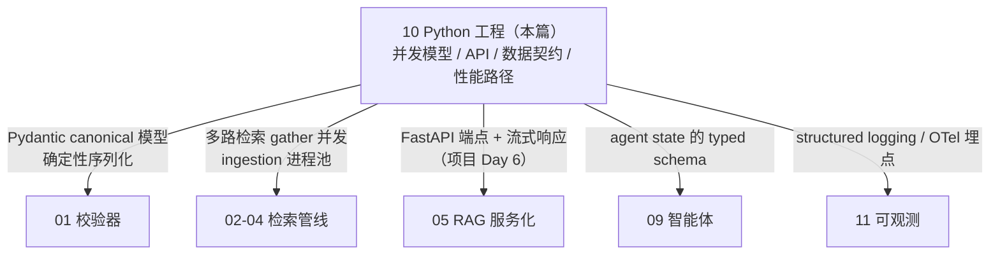
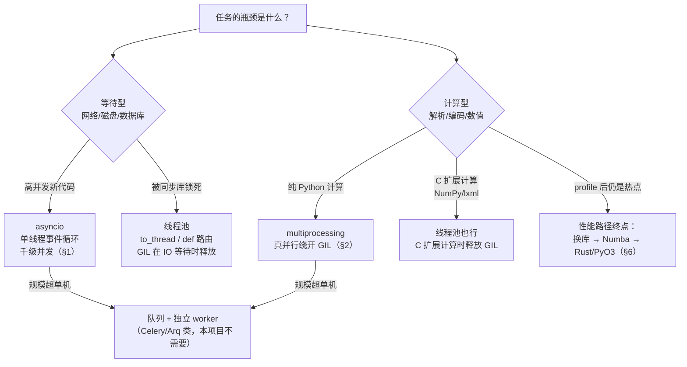

# 10 · Python 工程：asyncio、多进程、FastAPI 与性能路径

## 一句话

这一章讲 JD 里的工程底座：asyncio 解决"等待多"（IO 密集），multiprocessing 解决"计算多"（CPU 密集 + GIL），FastAPI/Pydantic 是 API 与数据契约的当代标配，Rust/PyO3 是压测证明瓶颈之后的最后手段——对老程序员这章大半是翻译工作，重点标注了"新瓶装旧酒"与"真正的新坑"。

## 本篇在全局脉络中的位置

本篇和 11 一起构成**工程线**：不在"检索问答"主线上，但主线的每一天都踩在它上面。

另有一层与 AI-first 工作流的关系值得点破：**工程底座是 AI 产出代码的机械闸**。AI 写实现、红队挑毛病，但最终拦住坏代码的是确定性的闸门——类型契约（Pydantic/mypy）、测试（pytest golden 快照）、CI、pre-commit。执行计划里"每天 `make test` 全绿才能打 tag"的纪律，物质基础全在本篇。**AI 写代码的时代，工程纪律不是更不重要，而是唯一不能外包的部分。**

## 老类比

| Python 概念 | 你熟悉的对应物 | 差异警告 |
| --- | --- | --- |
| asyncio 事件循环 | Node.js 事件循环 / Java NIO / select 循环 | 单线程协作式：一个协程堵住，全场卡死 |
| async/await | 协作式多任务的语法糖 | await 点 = 唯一的让出点 |
| GIL | 一把全局大锁：同一时刻只有一个线程执行 Python 字节码 | 多线程对 CPU 密集任务无效（3.13 的 free-threading 是实验性的，面试可提但别赌） |
| multiprocessing | fork 出真进程，各带各的解释器 | 跨进程传数据要序列化（pickle），成本不可忽视 |
| Pydantic | DTO + Bean Validation + 序列化框架三合一 | v2 核心是 Rust 写的，校验很快 |
| FastAPI | Spring Boot 之于 Java 的地位 | 类型注解即文档即校验 |
| PyO3 | JNI，但人体工学好十倍 | — |

## 原理详解

### 0. 并发模型版图：先问瓶颈，再选工具

Python 的并发选项一张图选完——入口问题永远是"**瓶颈是等待还是计算**"：

**工具链版图**（本项目 Day 1 的选型，一句话理由）：`uv`/pip + `pyproject.toml`（打包标准化，poetry 亦可，别用裸 requirements.txt）；`ruff`（lint+format 一件套，快到没借口不开）；`pytest`（测试事实标准）；`pre-commit` + GitHub Actions（机械闸，对 AI 产出代码尤其关键）；`mypy/pyright`（类型检查，Pydantic 的契约延伸到全代码库）。这套组合 2026 年没有争议，面试不会深挖，配置对了就行。

### 1. asyncio：单线程怎么伺候一万个连接

**模型**：一个线程跑一个**事件循环**，协程（async def）执行到 `await`（等网络/数据库返回）时把控制权交回循环，循环调度下一个就绪的协程。没有线程切换开销，没有锁地狱，一个线程轻松挂几千并发连接——前提是**大家都在等 IO**。

三条铁律（面试和实战都是这三条）：

1. **不能阻塞事件循环**。在 async 函数里调了同步的 `requests.get()`、`time.sleep()`、重型 CPU 计算 ⇒ 整个循环停摆，所有请求一起卡。这是 async 服务事故的第一大来源。修法：用异步库（httpx/asyncpg）、`asyncio.sleep`、或把同步/CPU 活儿丢出去——`await asyncio.to_thread(blocking_fn)`（IO 型同步库）或进程池（CPU 型）。
2. **await 才有并发**。`await f1(); await f2()` 是串行；`await asyncio.gather(f1(), f2())` 才是并发。LearnArken 的多路检索（BM25/dense/ColBERT 同时查）就该 gather。
3. **并发要限流**。gather 一千个下载 = 自己 DDoS 自己。用 `asyncio.Semaphore` 或 TaskGroup + 队列控制并发度，对下游（数据库、embedding 服务）保持背压（backpressure）。

### 2. GIL 与 multiprocessing：CPU 密集的正解

- **GIL 的准确表述**：CPython 中同一时刻只有一个线程在执行 Python 字节码。多线程适合 IO 等待（等待时释放 GIL），对纯 Python 计算无加速。**注意例外**：NumPy/lxml 等 C 扩展在计算期间会释放 GIL，所以"多线程跑 NumPy"实际有效——面试说出这个例外很加分。
- **multiprocessing / ProcessPoolExecutor**：真并行，每进程独立解释器独立 GIL。代价：①启动慢；②**跨进程数据要 pickle 序列化**，传大对象可能比计算本身还贵（大数组考虑共享内存 shared_memory）；③fork 与线程/锁混用有死锁坑（macOS 默认已改 spawn）。
- **LearnArken 的分工样例**（正好当面试答案）：API 层 asyncio（等数据库/向量库/LLM，全是 IO）；ingestion worker 里 XML 解析和 chunk 切分是 CPU 密集 ⇒ 进程池；embedding 批量编码若在本机 CPU 跑也是进程池/或独立服务。**先问"瓶颈是等待还是计算"，再选工具**——这句是总纲。

### 3. FastAPI：类型驱动的 API 层

核心机制一句话：**函数签名的类型注解 = 参数校验 + 序列化 + OpenAPI 文档**，三位一体。

值得在项目里演示的点：

- **async def vs def 的路由选择**：async def 的 handler 跑在事件循环（内部必须全异步）；普通 def 的 handler FastAPI 自动丢线程池（同步库也安全）。**混错方向是最常见事故**：async def 里调同步 SDK ⇒ 全服务卡死。
- **依赖注入（Depends）**：数据库会话、鉴权、配置的注入点，天然支持测试时替换（override）。类比 Spring 的 DI，但轻得多。
- **流式响应**：`StreamingResponse`/SSE 对接 vLLM 的逐 token 输出（教程 08 的 TTFT 体验就靠它透传）。
- **BackgroundTasks vs 独立 worker**：轻活（写审计日志）可以用 BackgroundTasks；重活（ingest 一个 500MB 的包）必须走独立 worker 进程 + 队列，API 只受理任务并返回任务 ID——老架构直觉完全适用。
- **生命周期（lifespan）**：启动时加载模型/建连接池，关闭时优雅释放。模型加载几十秒，绝不能放在请求路径里。

### 4. Pydantic：数据契约的执行者

- **角色**：LearnArken 的 canonical 模型（教程 01）、API 请求响应、agent 的 state（教程 09）、工具的参数 schema——全是 Pydantic model。**一个类型定义，四处复用**，这就是"keep one canonical data model"原则的落地工具。
- **校验哲学**：解析即校验（parse, don't validate）——数据进门时一次性变成强类型对象，之后全程放心用；错误信息结构化（哪个字段、什么约束、什么值），直接映射成 API 的 422 响应和校验 findings。
- **实用特性**：`Field` 约束（正则约束 DMC 格式）、`model_validator`（跨字段规则）、判别联合（discriminated union，按 `type` 字段自动分发到不同 DM 子模型——多态反序列化的老需求）、`model_dump_json` 的确定性序列化（教程 01 的确定性快照靠它）。

### 5. 可观测性基础（衔接教程 11）

- **structured logging**：日志输出 JSON（logfmt 亦可），带 request_id/trace_id，能被机器查询。print 调试的时代结束了。
- **OpenTelemetry 三件套**：trace（跨服务调用链）、metrics（计数器/直方图）、logs。FastAPI/httpx/asyncpg 都有自动埋点库；LearnArken 的自定义 span：`retrieval.bm25`、`retrieval.rerank`、`llm.generate`——正好和答案 trace（教程 05）对齐。
- **老直觉平移**：trace_id ≈ 当年打在每行日志里的"全局流水号"，OTel 只是把它标准化+可视化了。

### 6. 性能路径：profile 之前不许优化

标准流程（也是 learning-guide "profile before optimization" 的展开）：

1. **测**：cProfile/py-spy（采样式，可挂生产进程）找热点；对 async 服务用 py-spy dump 看卡在哪。
2. **算法与批量先行**：N+1 查询、重复 embedding 计算、没批量的逐条编码——十倍收益通常在这里，不在语言。
3. **换库**：orjson 替 json、lxml 本来就是 C、polars 替 pandas。
4. **Numba/Cython**：数值热点 JIT/编译，改动小。
5. **Rust + PyO3（最后手段）**：写一个 Rust 函数编译成 Python 可 import 的模块（maturin 一条命令打包）。LearnArken 的候选场景：chunk 切分/token 统计这类每文档跑百万次的纯计算。**交付标准是 before/after 基准表**，没有基准的 Rust 移植是简历装饰而不是工程。

这个 1→5 的顺序本身就是本篇的**杠杆排序**：每往下走一级，改动成本上升一个量级、预期收益下降——所以顺序绝不能反着走。"先上 Rust 再 profile"和"先调 k1/b 再修分词器"（02 §6）是同一种病。

### 7. Python 路线的限制清单（谁来接盘）

| # | 限制 | 一句话 | 谁接盘 |
| --- | --- | --- | --- |
| 1 | GIL：多线程无法并行纯 Python 计算 | 计算密集必须换模型 | multiprocessing（§2）；C 扩展；Rust（§6） |
| 2 | asyncio 单线程：一处阻塞全场死 | 协作式调度没有抢占 | 三条铁律（§1）+ py-spy 排障 |
| 3 | 跨进程通信要序列化 | 传大对象比算还贵 | 传路径/ID、共享内存（§2） |
| 4 | 纯 Python 速度天花板低 | 热点循环比 C 慢 10~100 倍 | 性能路径五步（§6），Rust 是最后一步 |
| 5 | 动态类型的规模化风险 | 重构靠 grep 是灾难 | Pydantic 边界契约 + mypy 全库检查（§0、§4） |
| 6 | 依赖地狱 | 环境不可复现 = "我这能跑" | lockfile + pyproject + CI 里干净环境装（§0） |

## 调优与参数

| 场景 | 旋钮 | 备注 |
| --- | --- | --- |
| API 并发 | uvicorn workers 数 × 事件循环 | worker 数 ≈ CPU 核数起步；纯 IO 服务少 worker 高并发即可 |
| 进程池 | max_workers、任务粒度 | 任务太碎 ⇒ 序列化开销吃掉收益；合并成批 |
| 下游保护 | Semaphore 并发度、超时、重试+退避 | 对 LLM/向量库调用必须有 timeout，否则悬挂协程堆积 |
| Pydantic | v2 + model_config 严格模式 | 宽松模式静默转型（"123"→123）在数据管线里是隐患 |
| 队列 | 有界队列 + 背压 | 无界队列 = 延迟炸弹（OOM 前一切正常） |

## 失败模式

1. **async 路由里调同步库**：全服务卡死，压测立现。检测：py-spy dump 看事件循环线程栈。
2. **fire-and-forget 协程被 GC**：`asyncio.create_task` 不留引用，任务凭空消失且异常无人知晓。保存引用/用 TaskGroup。
3. **进程池传大对象**：pickle 序列化比计算还慢。传路径/ID，数据落盘或共享内存。
4. **没有超时**：下游 LLM 悬挂 ⇒ 协程堆积 ⇒ 内存涨死。所有网络调用带 timeout。
5. **事件循环里做 CPU 重活**："只是解析个 50MB XML" ⇒ 其他请求全部卡 3 秒。丢进程池。
6. **Pydantic 宽松转型**掩盖数据质量问题：severity 字段 "3" 和 3 混着来。严格模式 + 枚举。
7. **测试异步代码不会写**：忘了 pytest-asyncio/anyio，测试永远"通过"（协程没被 await）。

## 面试问答

**Q: asyncio 和 multiprocessing 什么时候用哪个？（JD 原题概率极高）**
A 要点：一句总纲——瓶颈是等待用 asyncio，瓶颈是计算用 multiprocessing。asyncio：单线程事件循环协作调度，适合高并发 IO（API 网关、同时查多个检索后端），代价是全员必须不阻塞；multiprocessing：真并行绕开 GIL，适合 XML 解析/chunk 切分，代价是启动与 pickle 开销。补 GIL 准确定义 + C 扩展释放 GIL 的例外 + 自己项目里两者各用在哪。

**Q: GIL 到底锁了什么？多线程还有用吗？**
A 要点：锁"同一时刻执行 Python 字节码的线程数=1"；IO 等待释放 GIL 所以多线程对 IO 有效；NumPy/lxml 等 C 扩展计算时释放 GIL 所以"多线程跑 C 扩展计算"也有效；纯 Python CPU 计算才必须多进程。提一句 3.13 free-threading 实验性进展，显示知识新鲜度。

**Q: 你的 FastAPI 服务怎么处理一个 500MB 包的 ingest 请求？**
A 要点：绝不在请求路径里做——受理后落任务表返回 202+task_id，独立 worker 进程消费（解析用进程池并行），进度可查询，完成后写审计事件。点出：API 层 asyncio 与 worker 层 multiprocessing 各得其所，队列有界防雪崩。

**Q: Pydantic 在你项目里承担什么角色？**
A 要点：不是"参数校验库"而是数据契约中枢——canonical 模型、API schema、agent state、工具参数四处同源；解析即校验哲学；确定性序列化支撑快照测试；结构化错误直接变成 validation findings。这个回答把教程 01/09 串起来了。

**Q: 服务变慢了你怎么排查？**
A 要点：先分层定位（OTel trace 看哪个 span 变慢：检索？rerank？LLM？）→ 若是自身进程，py-spy 采样看热点/看事件循环是否被阻塞 → 修复顺序：算法与批量 > 换库 > Numba/Cython > Rust。强调 profile 先于优化 + 修完用同一基准验证。

**Q: 什么时候值得上 Rust/PyO3？**
A 要点：三个前提——profile 证明热点在纯计算、算法层已无空间、该热点调用频率足够高。给自己项目的例子（chunk 切分基准 before/after X 倍）。反面表态：没有基准数据支撑的 Rust 化是负资产（维护成本+构建复杂度）。

**Q: 大量代码是 AI 写的，你怎么保证质量？**
A 要点：把质量从"人盯"换成"闸拦"——类型契约（Pydantic 边界 + mypy 全库）、golden/快照测试、CI 干净环境、pre-commit，AI 产出必须全绿才能合并；再叠加流程闸：人写 SPEC 定验收标准、独立模型红队评审、本人裁决 findings。核心立场：AI 提高了写代码的速度，所以机械闸和评审纪律的价值上升而非下降。
