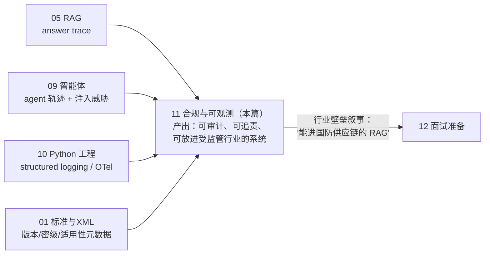
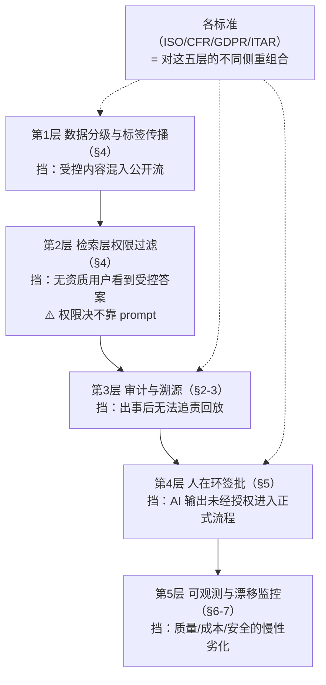

# 11 · 合规与可观测性：审计、追踪与受监管行业的 AI 工程

## 一句话

在航空/国防语境里，"答案是什么"只值一半分，"答案怎么来的、谁批准的、出错能不能追责"值另一半；这一章把 JD 里那串吓人的缩写（ISO 9001/AS9100、21 CFR Part 11、GDPR/HIPAA、ITAR/EAR）翻译成一组可实现的工程需求：审计日志、溯源、访问控制、数据分级、电子签批。

## 本篇在全局脉络中的位置



本篇是工程线的**出口**，也是这个项目区别于"又一个 RAG demo"的**行业壁垒所在**：检索算法人人会调，但"答案可审计、权限在检索层强制、AI 永远没有合并权限"这套受监管行业的设计语言，是目标赛道（技术出版智能/航空国防软件）真正的准入券。前面所有教程的产物在这里汇成一个词：**可信（trustworthy）**——不是"模型很准"，而是"错了能追责"。

## 老类比

- **审计日志 = 财务系统的凭证**。做过企业软件的都知道：删改要留痕、凭证不可篡改、月底能对账。把"账目"换成"AI 答案"，整套纪律原样平移。
- **合规标准 = 强制性的非功能需求清单**。产品经理视角：这些标准不是法务的事，是**需求来源**——每条标准最终都会落成具体的表结构、接口和流程。
- **export control 标签 = 数据库行级安全 + 污点传播**。一条数据带上"受管制"标记后，所有由它派生的数据（chunk、embedding、答案）都继承标记——像编译器的 taint analysis。
- **OpenTelemetry = 标准化的全链路流水号**。当年你在日志里手工打的 request_id，现在有了 W3C 标准、SDK 和可视化。

## 原理详解

### 0. 信任栈：五层机制，各挡一类事故

合规缩写年年变，工程机制就五层。先看全景再逐层拆——**每层挡住一类事故，缺一层就漏一类**：



这张图也是面试答题的总骨架：任何"你们怎么满足 XX 标准"的问题，先把标准翻译成它侧重的层，再讲那层的实现。**标准是需求方言，信任栈是通用实现语言。**

### 1. 各标准的"一句话 + 工程落点"（面试速查）

| 标准 | 管什么 | 一句话理解 | LearnArken 里的落点 |
| --- | --- | --- | --- |
| **ISO 9001 / AS9100** | 质量管理体系（AS9100 是航空航天加强版） | "写你所做，做你所写，证明你做了" | 流程有文档（ADR、runbook）、变更有记录、质量记录可检索——repo 本身就是演示 |
| **21 CFR Part 11**（FDA 电子记录） | 电子记录与电子签名的可信性 | 电子记录要防篡改、可追溯、签名绑定身份 | 审计日志 append-only + 哈希链；"人工批准 AI 修复"的电子签批模拟 |
| **GDPR / HIPAA** | 个人数据 / 医疗数据隐私 | 最小化收集、可删除、访问受控 | PII 检测与脱敏管道（上传文档里的姓名/证件号在索引前打码）；删除权 ⇒ 索引与向量库的删除传播 |
| **ITAR / EAR** | 美国军品/两用物项出口管制 | **技术数据给外国人看 = 出口**，无授权即违法 | 数据分级标签（export-controlled 与否）+ 标签随派生数据传播 + 查询时按用户资质过滤 |

面试上限话术：不需要装合规专家，要展示的是**"标准 → 工程需求"的翻译能力**："21 CFR Part 11 我理解为三条工程需求：不可篡改的审计轨迹、操作与身份的强绑定、电子签名流程——我在项目里分别用哈希链日志、鉴权上下文注入 trace、审批状态机做了最小演示。"

### 2. 审计日志：不是普通日志

和应用日志（debug 用，可轮转丢弃）的本质区别：审计日志是**业务记录**，要求：

- **完整性**：谁（身份）、何时、对什么（资源+版本）、做了什么、结果如何、依据什么（对 AI 答案：检索到的证据、模型版本、prompt 版本）。
- **不可篡改（tamper-evident）**：append-only 表 + 每条记录含前一条的哈希（哈希链）——改任何历史记录都会断链。演示级实现一晚上写完，概念上和区块链同源但别提区块链。
- **可检索**：合规检查的现实场景是"给我看 3 月份所有关于 X 部件的 AI 答案及其证据"。
- **保留策略**：留多久、谁能看、能不能删（GDPR 的删除权和审计留存的冲突是真实的法务问题——工程上用假名化解决：审计记录留，身份映射删）。

**AI 特有的部分**（这是新东西，也是 JD 要的）：答案 trace（教程 05）就是 AI 的审计单元——query、检索结果、图谱事实、prompt、模型+版本、答案、引用、critic 结论一条龙。**关键设计：trace 是审计日志的子集，一次落库两处受益**（调试 + 合规）。

### 3. 溯源（provenance）与版本钉扎

合规问题"这个答案为什么这么说"要能精确回放，前提是**万物有版本**：

```
答案 trace
 ├─ 源包版本（content hash） ├─ canonical 模型版本（transform 代码版本）
 ├─ chunk 集版本（chunker 配置 hash） ├─ embedding 模型名+版本
 ├─ 索引快照 ID ├─ prompt 模板版本 ├─ LLM 模型+版本 ├─ 评估集版本
```

这就是 learning-guide "version everything" 的原因说明书。老直觉：这和"可复现构建"（reproducible build）是同一件事——把"构建产物"换成"AI 答案"。

### 4. 数据分级与访问控制

- **分级模型**：每个文档/DM 打标签（public / proprietary / export-controlled / PII-containing），标签在 ingestion 时确定，**随派生链传播**：chunk 继承文档标签，embedding 继承 chunk 标签，答案继承所用证据的最高密级标签（high-water-mark 原则——多密级证据合成的答案按最高级处理）。
- **查询时过滤**：用户资质进检索过滤器（Qdrant payload filter / SPARQL FILTER）——**权限过滤必须在检索层，不能靠 prompt 叮嘱 LLM"别泄密"**（教程 05 讲过：进了上下文就可能进答案）。这句是面试金句级的架构立场。
- **PII 管道**：正则+NER 检测 → 索引前脱敏（替换为占位符+侧表保存映射，或不可逆掩码）→ 检测本身要评估（precision/recall，漏检一个证件号就是事故）。

### 5. 人在环（human-in-the-loop）与电子签批

受监管行业的定式：**AI 提案，人批准，系统留痕**。LearnArken 的演示场景——LLM 生成的 BREX 修复建议：

```
AI 生成修复 → 校验器通过 → critic 通过 → 进入"待批准"状态
→ 授权人审查并电子签名（身份+时间+被签内容的哈希）→ 状态机流转到"已批准" → 才允许合入
```

这是一个普通的审批状态机（老技能），亮点在于把 AI 输出纳入了它——"AI 永远没有合并权限"是和教程 09 工具白名单一脉相承的设计立场。

顺带一提：这条定式也是本项目 **AI-first 开发工作流**的自指实践——AI 写代码（提案）、红队评审（critic）、本人裁决合并（签批）、journal/reviews 留痕（审计）。系统内给用户的信任设计和开发流程里给自己的质量设计是同一个模式，面试时把这层自指点出来非常出彩。

### 6. OpenTelemetry：三信号与落地

- **Trace**：一次请求的树状 span（API → 检索 ×4 → rerank → LLM → critic），每个 span 带时长与属性。W3C traceparent 头跨服务传播。**性能定位（教程 10）与答案审计共用这套骨架。**
- **Metrics**：计数器（请求数、拒答数、critic 拦截数）、直方图（TTFT、检索延迟）。面板上业务指标与系统指标并排——"critic 拦截率突然降为 0"既可能是质量提升也可能是 critic 挂了。
- **Logs**：结构化日志挂 trace_id，从指标异常一键下钻到现场。
- 落地顺序建议：自动埋点（FastAPI/httpx instrumentation）起步 → 手动加业务 span（retrieval.fuse、agent.critic）→ 导出到本地 Jaeger/Grafana 做演示截图（作品集素材）。

### 7. AI 系统特有的可观测维度（超出传统 APM 的部分）

- **质量漂移**：线上 groundedness 抽样评估、拒答率、引用覆盖率的时间序列——模型/索引/语料任何一环变化都可能悄悄劣化质量，传统 APM 看不见。
- **成本观测**：per-request token 消耗，按租户/查询类型分解。token 就是新时代的计费 CPU 秒。
- **安全观测**：提示注入尝试检测计数（教程 09 的注入测试转为线上监控）。

### 8. 合规工程的限制清单（谁来接盘）

| # | 限制 | 一句话 | 谁接盘 |
| --- | --- | --- | --- |
| 1 | 个人项目不可能"合规" | 合规是法务+认证流程，不是代码特性 | 话术纪律：只说"演示了 XX 式的控制机制"（失败模式 7） |
| 2 | PII/密级检测永不完美 | NER 漏检一个证件号就是事故 | 检测器自身要有 precision/recall 评估 + 保守分级（high-water-mark） |
| 3 | 审计不防错，只防赖 | 记录完整不等于答案正确 | 质量线（02-05 评估）与信任线正交，两条都要 |
| 4 | 人在环是吞吐瓶颈 | 全量人批 = 系统没有自动化价值 | 风险分级：低风险自动、高风险签批；critic 预筛降低人工量（09） |
| 5 | 观测数据本身是泄密面 | trace 里有全量 prompt 和证据 | trace 存储过数据分级；观测平台也要权限（失败模式 5） |
| 6 | 合规成本前置且不可见 | demo 里看不出哈希链的价值 | 面试叙事：用"事故调查走查"演示（面试问答第 4 题） |

**杠杆排序**（演示项目里先做哪个，收益/成本比从高到低）：

```
answer trace 落盘             一次实现，调试+审计+面试演示三处受益，必做
数据分级 + 检索层过滤          金句级架构立场的载体，Qdrant payload 白送机制
哈希链审计日志                 一晚上的工作量，"防篡改"叙事的实物证据
签批状态机                    老技能新用，AI-first 自指叙事加成
PII 管道                      检测器要评估才有说服力，成本最高，Planned 也可
```

## 调优与参数

本章的"调优"是策略选择：

| 决策点 | 选项与权衡 |
| --- | --- |
| trace 采样率 | 性能 trace 可采样；**审计 trace 不可采样（必须 100%）**——两者共架构但策略分离 |
| 审计粒度 | 每次工具调用都记 vs 只记关键节点：先全记，量大再分级 |
| PII 处理 | 可逆假名化（留映射侧表，权限极高）vs 不可逆掩码（安全但不可恢复） |
| 标签传播 | 保守的 high-water-mark（宁可过严）vs 细粒度逐段标注（准确但贵） |
| 日志保留 | 审计长留（年级）+ 应用日志短留（周级），存储分层 |

## 失败模式

1. **审计与调试日志混在一起**：轮转策略把审计记录滚没了。物理分离、策略分离。
2. **标签传播断链**：文档打了 export-controlled，但 embedding/答案没继承 ⇒ 受控内容从答案泄出。测试：给受控文档提问，用无资质用户断言拒绝。
3. **靠 prompt 做权限**："请不要向该用户透露 X" ⇒ 注入即破。权限在检索层，进上下文前就过滤。
4. **删除不传播**：源文档删了，chunk/向量/缓存的答案还在——GDPR 场景的经典事故。删除要有 checklist 式的传播清单+验证查询。
5. **trace 里泄密**：把完整 prompt（含 PII/受控内容）明文存进低权限可读的观测平台。trace 存储本身要过数据分级。
6. **哈希链没人验**：写了防篡改结构但没有定期校验任务 ⇒ 形同虚设。加一个 nightly 验链 job。
7. **合规话术越界**：面试或 README 里说"符合 ITAR"——个人项目不可能"符合"，只能"演示了 ITAR 式的控制思路"。措辞过度是红旗。

## 面试问答

**Q: JD 里提到 ITAR/GDPR/21 CFR，你怎么理解这些对系统设计的影响？**
A 要点：定位成"标准→工程需求的翻译"：ITAR ⇒ 数据分级标签+派生传播+资质过滤（检索层强制）；21 CFR Part 11 ⇒ 防篡改审计轨迹+身份绑定+电子签批状态机；GDPR ⇒ PII 检测脱敏+删除传播。每条给出自己 repo 里的最小实现。收尾声明诚实边界："我演示的是控制机制，真实合规需要法务与认证流程。"加分点：先画信任栈五层图，再把标准映射到层。

**Q: AI 系统的审计日志和普通日志有什么不同？**
A 要点：业务记录 vs 调试信息；五要素（谁/何时/对什么/做了什么/依据什么）；AI 特有的"依据"= 完整答案 trace（证据、模型版本、prompt 版本、critic 结论）；不可篡改（append-only+哈希链）；100% 记录不采样；保留与访问策略独立。

**Q: 怎么保证受控数据不从 AI 答案里泄露？**
A 要点：分层——①ingestion 定级，标签随 chunk/embedding/答案传播（high-water-mark）；②检索层按用户资质硬过滤（架构立场：权限决不依赖 prompt）；③答案标签继承+输出侧检查；④对抗测试：无资质用户询问受控内容必须拒答。指出最脆弱点是"派生数据断链"，所以传播要测试覆盖。

**Q: 一个 AI 答案出了事故，你的系统怎么支持事后调查？**
A 要点：拿一条 trace 现场走查——从答案倒查引用→证据 chunk→源文档版本→当时的索引快照/模型版本/prompt 版本，全部钉扎可回放；审计链哈希证明记录未被改动；再讲根因分层（教程 05 的六层失败链）定位是检索、上下文还是生成的问题。这题答好等于把 05/08/11 三章串成一个闭环。

**Q: 可观测性你做了什么？和普通 Web 服务比多了什么？**
A 要点：OTel 三信号 + 自定义业务 span（检索各路/融合/rerank/LLM/critic）；比传统 APM 多三个维度——质量漂移（groundedness/拒答率/引用覆盖率时间序列）、token 成本分解、安全事件（注入尝试）。给一个真实定位案例（如"TTFT 恶化，trace 显示是 rerank 候选数配置变了"）最有说服力。

**Q: AI 提案人批准会不会把系统拖成人工瓶颈？**
A 要点：风险分级是标准答案——低风险动作（查询、报告）全自动；改变正式数据的动作（修复合入、发布）走签批；critic/校验器做预筛，人只看过了机器关的少数案例。用自己修复 agent 的漏斗数字说话（AI 提案 N 条 → 校验器过滤后 M 条 → 人工批准 K 条）。点出这和自己开发流程（AI 写码→红队→人裁决）是同一个模式。
