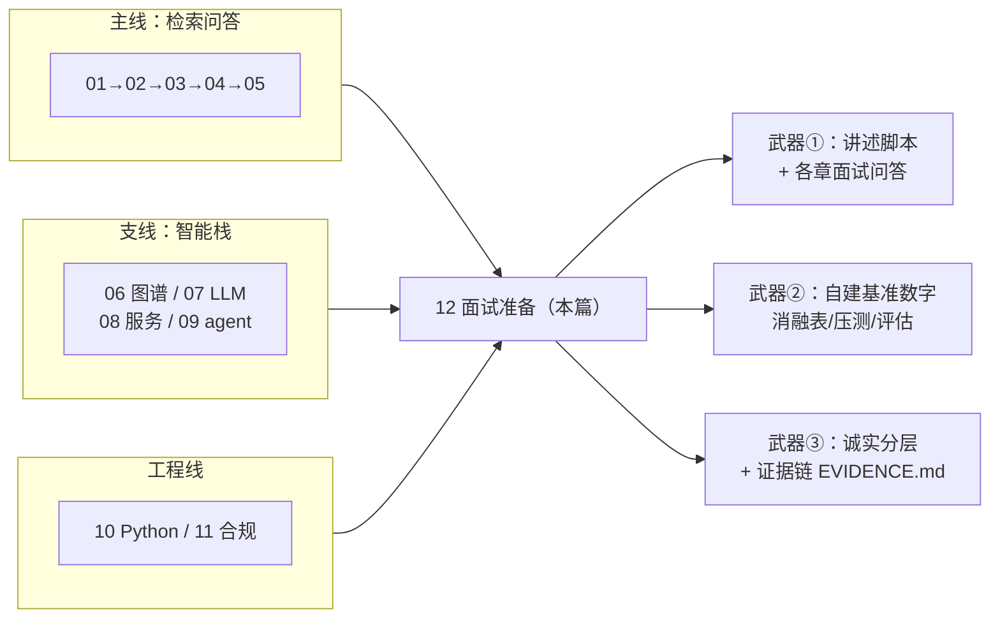
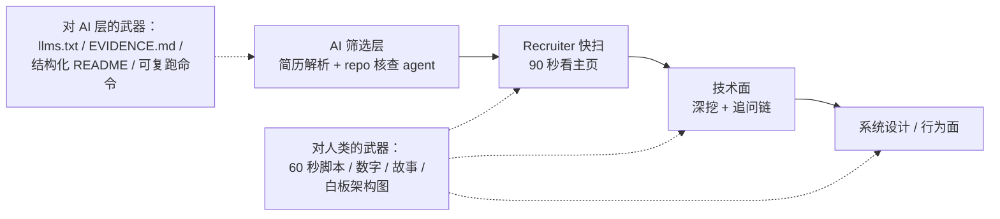

# 12 · 面试准备：问题库、追问应对与项目讲述脚本

## 一句话

面试的胜负手不是背概念，而是三件事：一个讲得滚瓜烂熟的项目故事、每个关键词后面藏一个自己测出来的数字、以及被追问到知识边界时的诚实降落姿势。

## 本篇在全局脉络中的位置

本篇是全系列的**汇合点与出口**：前面十一篇的知识在这里兑换成三种面试武器。

**先认清对手的形态**——2026 年的招聘漏斗里，人类面试官之前还有一道 AI 关卡，两道关卡吃的证据不一样：

对 AI 筛选层，**repo 的机器可读性就是简历**：claim→证据的映射（EVIDENCE.md）、一条命令复跑基准、清晰的诚实分层标注——招聘方的 agent 能在几分钟内验证你的声明，验证通过的声明比任何形容词都硬。这正是执行计划 Day 9 的交付物存在的理由。

## 第一部分：项目讲述脚本（自我介绍后的必考题）

### 60 秒版（"介绍一下你的项目"）

> ⚠️ **使用须知**：下面是**完整蓝图版**（覆盖 M0-M8 全部设计）。Day 10 收尾时必须按 `EVIDENCE.md` 裁剪成"已实现"版——凡是 repo 里指不出证据的名词，一律从陈述里删掉或明确标注 Planned。宁可短而全真，不可长而掺水。

> 我做了一个面向航空/国防技术出版物的智能问答平台。输入是 S1000D 风格的结构化维修手册，系统做四件事：**校验**（XSD/BREX 业务规则/包级引用完整性，输出结构化 findings）、**建图**（RDF/OWL 知识图谱，命名图做版本化，SPARQL 做变更影响分析）、**检索问答**（BM25+稠密+ColBERT 多路召回、RRF 融合、交叉编码器重排，答案带引用和完整 trace）、**多智能体评审**（检索/图谱/标准/批评/裁判分角色，critic 拦无据论断，fail-closed）。底座是 FastAPI+asyncio、Qdrant、vLLM 服务，全程 OpenTelemetry 追踪 + 防篡改审计日志。每个环节都有自建基准：检索有 Recall/nDCG 消融表，服务有 TTFT/吞吐压测报告。

讲述技巧：说完 60 秒停住，让面试官选方向。**每个名词都是你埋的钩子**，他追哪个你就展开哪章教程的内容。

### 挑重点深讲版（按面试官背景选）

- 对 **ML/检索背景**面试官：直奔混合检索消融表 → ColBERT MaxSim → 为什么 BM25 在标识符查询上不可替代（教程 02/03/04）。
- 对**系统/平台背景**面试官：直奔 vLLM 两板斧 → KV cache 算术 → TTFT/TPOT 压测方法（教程 07/08）。
- 对**领域/业务背景**面试官：直奔 S1000D 建模 → BREX 校验 findings → 审计与出口管制标签传播（教程 01/11）。
- 对**架构师**：画整体数据流（visual-map 的架构图背下来，白板 90 秒画出），强调"LLM 不可信"主线下的层层围栏设计。

### 讲述铁律

1. **每个模块配一个数字**："RRF 融合比最好的单路 Recall@10 高 X 个点""rerank 加了 Y ms 但 nDCG 提升 Z"。数字可以小，不能没有。
2. **每个选型配一个被否掉的替代方案**："选 RDF 没选 Neo4j，因为多标准整合需要 IRI 全局标识和命名图版本化；Neo4j 我做了对比笔记"。教程 01-11 每篇的"版图/选型"节就是这条铁律的弹药库——每个技术都先给版图再给选型理由。
3. **主动暴露一个失败**："SPLADE 一开始没提升，查出来是分词器把零件号切碎了"——失败故事是真实性的最强信号。
4. **诚实分层**："已实现并测过 / 实现了但只是玩具规模 / 只做了调研笔记"三档，绝不混。被戳穿一次，全场归零。

## 第二部分：高频问题库（按主题，含追问链）

每题格式：问题 → 好答案的骨架 → 常见追问。详细答案在各章教程的"面试问答"节，这里是索引和追问链。

### 检索与 RAG（最高频区）

| 问题 | 骨架 | 典型追问 |
| --- | --- | --- |
| 为什么要混合检索？ | 稠密认义不认字/稀疏认字不认义 + 消融数据 | "你的领域里 dense 输在哪？给个例子"（零件号） |
| chunk 怎么切？ | 基线→结构感知→图上下文元数据→small-to-big | "warning 和步骤切散了会怎样？"（安全事故级） |
| 怎么评估 RAG？ | 检索指标+答案指标两层，golden set 纪律 | "golden set 多大？怎么防过拟合？"（held-out） |
| 怎么治幻觉？ | 分层围栏：证据/契约/低温/校验/critic/拒答 | "critic 也是 LLM，谁 critic 它？"（对抗测试集测 critic 捕获率+确定性校验器兜底） |
| RAG vs 微调？ | 知识 vs 行为分工 + 权限论据 | "长上下文时代 RAG 会死吗？"（成本/权限/审计三论据） |
| RAG 答错了怎么排查？ | 六层失败链 + trace 逐层看 | "讲一次你真实排查的经历"（准备一个具体故事） |

### 向量检索与 ANN

| 问题 | 骨架 | 典型追问 |
| --- | --- | --- |
| HNSW 原理？ | 跳表式分层图+贪心导航，M/efC/efS 三参数 | "内存放不下怎么办？"（IVF-PQ+refine，现场算压缩账） |
| recall 怎么测？ | Flat 做真值→扫参数→recall-QPS 曲线 | "efSearch 从 64 到 256 你观察到什么？"（边际递减） |
| 过滤+向量检索怎么做？ | pre/post-filter 权衡，Qdrant 按基数自动选 | "过滤条件很苛刻时会发生什么？"（召回坍缩） |
| 数据更新后索引怎么办？ | HNSW 增量 vs IVF 重建窗口，一致性实验设计 | "删除呢？"（标记删除+定期重建，像 VACUUM） |

### LLM 与推理服务

| 问题 | 骨架 | 典型追问 |
| --- | --- | --- |
| vLLM 为什么快？ | 连续批处理+PagedAttention，从两阶段瓶颈推导 | "PagedAttention 和 OS 分页哪里不像？"（无磁盘换出常规路径、块大小按 kernel 定） |
| KV cache 多大？ | 现场算：2×层×kv头×维度×2B×token 数 | "怎么省？"（GQA/量化 KV/prefix 共享/滑窗） |
| TTFT 恶化怎么查？ | 排队→prefill→prefix cache 命中率 | "TPOT 呢？"（批次拥挤/带宽/量化/投机解码） |
| 投机解码原理？ | 猜-验-收，分布无损，规律文本收益大 | "为什么无损？"（接受-拒绝采样保证分布一致） |
| 量化的代价？ | 显存/带宽收益 vs 精度，必须自测评估集 | "你测了什么？"（领域任务而非 perplexity） |

### 知识图谱

| 问题 | 骨架 | 典型追问 |
| --- | --- | --- |
| 为什么 RDF 不是 Neo4j？ | 标准化/IRI 整合/推理/命名图版本化 | "属性图哪里更好？"（边属性/Cypher 易用/图算法生态——要会夸对手） |
| SPARQL 杀手锏？ | 属性路径替代递归 CTE，影响分析一行 | "路径查询慢怎么办？"（限深/物化闭包/模式顺序） |
| OWA 是什么？ | 查不到=不知道，校验必须 SHACL/应用层 | "那 OWL 推理有什么用？"（子类/传递/逆属性的自动推导） |
| 图谱怎么进 RAG？ | 三接口：agent 工具/chunk 元数据/事实注入 | "图谱数据错了呢？"（结构化映射可测试+LLM 抽取隔离 staging） |

### Agent 与多智能体

| 问题 | 骨架 | 典型追问 |
| --- | --- | --- |
| ReAct 讲一下？ | T/A/O 循环+停机条件+预算护栏 | "死循环怎么办？"（重复检测/步数上限/循环计数） |
| 为什么多 agent？ | 立场分离/上下文隔离/可测试/成本路由+消融数据 | "延迟涨了多少？"（诚实报数+说明何时值得） |
| ToT/MCTS 用在哪？ | 修复规划，确定性校验器当评估函数 | "为什么不全用 MCTS？"（成本，主路径 ReAct） |
| 提示注入怎么防？ | 威胁建模+工具白名单最小权限+critic+测试集 | "prompt 里写'别听文档的'行吗？"（不行，权限设计＞prompt 防御） |
| 什么是 adversarial validation？ | 先辨双义（ML=分布偏移检测；governed-AI=对抗角色攻击产出），再报项目三层实践：critic 攻答案 / Day 8 攻评估 / 红队攻代码，证据链在 repo（09 §4 术语卡） | "和普通 evaluation 差别？"（evaluation 是中立打分，adversarial 是有立场的攻击者+收敛条件：无新 P0/P1 才停） |

### 工程与合规

| 问题 | 骨架 | 典型追问 |
| --- | --- | --- |
| asyncio vs multiprocessing？ | 等待 vs 计算总纲+GIL 例外+项目实例 | "async 服务卡死怎么查？"（py-spy dump 看循环线程） |
| 大文件 ingest 怎么设计？ | 202+task_id+worker+进程池+有界队列 | "worker 挂了呢？"（幂等+重试+任务状态机） |
| 审计日志怎么设计？ | 五要素+append-only 哈希链+100%不采样 | "GDPR 删除权和审计留存冲突？"（假名化） |
| 受控数据怎么不泄露？ | 定级+派生传播+检索层硬过滤+对抗测试 | "为什么不能靠 prompt？"（注入即破，权限在检索层） |

## 第三部分："这项目是不是 AI 写的？"（2026 必考题）

这题答错的方式有两种：撒谎说全手写（一追代码细节就穿帮，诚信归零），或心虚地承认后无话可说（能力叙事崩塌）。正确姿势是**主动亮出工作流，把问题变成主场**：

**标准答案骨架**（对应执行计划的每日七步循环）：

> "是 AI 参与实现的，而且这是刻意设计的工作流——我认为 2026 年还坚持全手写才是危险信号。具体分工：每天的 SPEC 是我写的（目标/接口/验收标准，repo 里 `docs/specs/` 可查）；AI 按 SPEC 实现；然后我用**另一个独立模型**做只读红队评审，输出分级 findings；**每条 finding 由我裁决** accept/reject 并写理由（`docs/reviews/`）；红队报的数字我全部复跑过。最后我手写当天的学习日志：AI 错在哪、我怎么发现的、我否掉了它什么方案（`docs/journal/`）。"

**为什么这个答案是加分项而不是止损**：

- **裁决记录是理解的不可伪造证明**——不理解实现的人无法判断红队 finding 的真假。面试官若质疑，邀请他任选一天的 review 记录现场对质。
- **它展示的正是雇主要买的技能**：把模糊目标拆成 AI 可执行的规格、组织多智能体互相对抗保证质量、对产出做最终把关。这三件事就是 AI 时代工程师的岗位说明书。
- **它和项目本身的设计自指**（教程 11 §5）：系统里"AI 提案、人批准、留痕"的签批状态机，和开发流程里"AI 写码、红队评审、人裁决"是同一个模式——一个人能在两个层面贯彻同一套质量哲学，这是架构成熟度的信号。

**追问链与应对**：

| 追问 | 应对 |
| --- | --- |
| "那你自己会写代码吗？" | 指向裁决记录里"我否掉 AI 方案"的实例 + 现场白板任意一段核心逻辑（chunking 边界/RRF 公式/哈希链）——理解测试随时接 |
| "红队也是 AI，它漏了呢？" | 承认会漏（引用自己 journal 里红队漏检的真实案例），所以有机械闸兜底：类型契约/golden 测试/CI；分层防御不指望任何单层 |
| "这算你的项目还是 AI 的项目？" | 类比：架构师不砌砖，但大厦是他的作品。SPEC、验收标准、每一条技术选型和被否掉的替代方案都是我的判断，`EVIDENCE.md` 里每个声明可核查 |

**话术红线**：不夸大手写比例（会被 git 历史戳穿——commit 带 Co-Authored-By 是诚实留痕）；不贬低 AI 贡献（显得不懂协作）；不说"AI 只是辅助"这种模糊话（要说得出具体分工边界）。

## 第四部分：追问降落技术（被问到不会的怎么办）

面试官的追问链设计出来就是要探到你的边界。边界处的表现比边界的位置更重要。

**三段式降落**：

1. **明确承认**："这个我没有实际做过/没测过。" —— 快、干脆，不要绕。
2. **给出最近的已知点**："但相邻的 X 我做过，我理解它们的关系是……" 或 "基于原理我推测是……，理由是……"（标明是推测）。
3. **展示获取路径**："如果要落地，我会先跑一个 Y 实验来验证。"

反例（红旗行为）：不懂装懂被追穿、把读过的博客说成做过的实验、报不出自己"基准数据"的细节（真做过的人一定记得数量级和踩的坑）。

**知识边界的诚实映射**（提前想好这张表）：

- 做过+测过：混合检索消融、ANN 参数扫描、校验器、trace 设计……（能报数字和坑）
- 做过但玩具规模：多 agent、vLLM 压测（单卡/小模型）……（主动声明规模）
- 只有调研笔记：TensorRT-LLM、GNN 嵌入、分布式多机 serving……（能讲原理和实验设计，声明没跑过）

这张表要和 `EVIDENCE.md` 严格同步——面试前最后一件事就是对着 EVIDENCE.md 校准这三档的内容，确保口径与 repo 一字不差。

## 第五部分：反向问题（你问面试官的）

好的反问既是信息收集又是能力展示（每问背后都暗示你懂什么）：

- "你们的检索评估 golden set 怎么维护的？领域专家参与标注吗？"（暗示：我知道评估是命脉）
- "线上答案的 groundedness 有持续监控吗？质量漂移怎么发现？"（暗示：我有质量运维意识）
- "受控数据的分级是文档级还是段落级？派生数据（embedding/缓存）的标签传播怎么处理？"（暗示：我懂合规工程的难点在派生链）
- "推理这块是自建 serving 还是用托管 API？如果自建，吞吐和 P95 的 SLO 大概什么量级？"（暗示：我能聊容量规划）
- "多 agent 的部分，你们怎么控制成本和延迟的上限？"（暗示：我知道 agent 的生产化痛点）
- "团队现在怎么用 AI 写代码？有没有评审/验收上的约定？"（暗示：我有成熟的 AI 协作方法论，还能顺便探明团队的真实工程文化）

## 第六部分：考前一周清单

- [ ] 白板画出系统架构图（90 秒内，visual-map 的架构图）
- [ ] 60 秒项目陈述**按 EVIDENCE.md 裁成已实现版**并背熟，掐表练 3 遍
- [ ] 每章教程的"面试问答"节过一遍，每题能脱稿说出骨架
- [ ] 每章教程的"版图/选型"节过一遍，确保每个技术都能先画版图再讲选型（讲述铁律 2 的弹药）
- [ ] 准备 4 个具体故事：一次排查（六层失败链实战）、一次失败（SPLADE/分词器类）、一次权衡决策（RDF vs Neo4j 类）、一次否掉 AI 方案的裁决（journal 里选）
- [ ] "这项目是不是 AI 写的"标准答案 + 三条追问应对，练到不假思索
- [ ] 自己的基准数字背熟：Recall@10 各路对比、rerank 增益与延迟、TTFT/吞吐、KV cache 算术
- [ ] "诚实映射表"三档内容与 EVIDENCE.md 逐条核对，降落话术练熟
- [ ] 反向问题选 3 个最匹配该公司的
- [ ] 重读 JD，把每个关键词映射到 repo 里的具体文件路径（JD coverage matrix 更新到最新）
