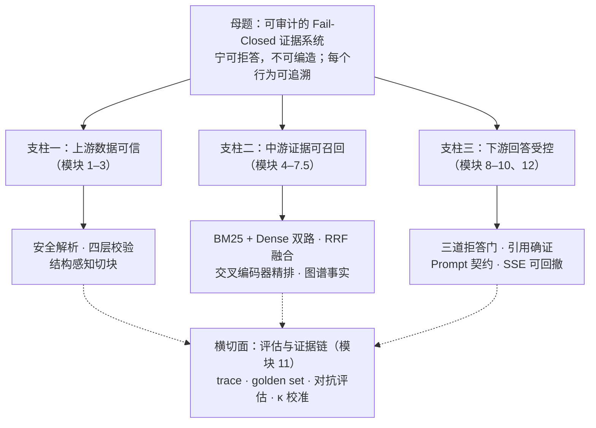
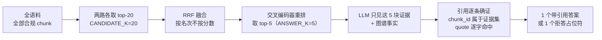
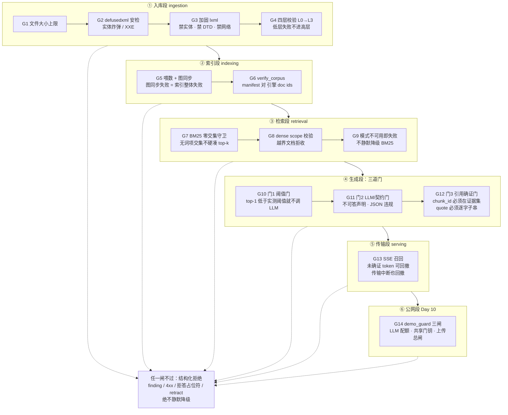
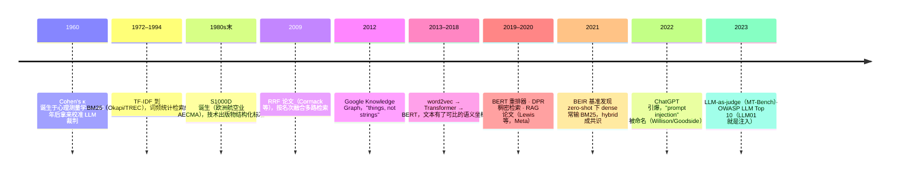

# 13 · RAG 系统面试手册：知识点、实现与选型理由

## 一句话

LearnArken 不是一个普通的“PDF 丢进向量库再问答”的 RAG demo，而是一个面向航空维修技术出版物的 **standards-aware, fail-closed, graph-augmented RAG system**：先把 S1000D-like XML 解析成规范模型，经过四层校验后再结构感知切块，使用 BM25 + dense retrieval + RRF + cross-encoder reranking 检索证据，最后由 LLM 在严格引用和拒答契约下生成答案；证据不足时系统拒答，而不是编。

面试时主线要反复强调：

> 我把 RAG 当成一个可审计系统来做，而不是一个 prompt。上游保证数据可信，中游保证证据可召回，下游保证回答可引用、可拒答、可追踪。

## 主线故事：一个问题的旅程（记忆脉络 = 介绍脉络）

这是整本手册的**总纲**。用"记忆宫殿"法把系统讲成八幕剧：每幕是一个房间、一个画面、一个技术点、一句金句。**准备时**每天在脑子里走一遍八个房间，任何模块忘了都能从画面重建；**面试时**沿同一条线讲，30 秒、3 分钟、10 分钟只是走得快慢不同。

> 使用警告：比喻是给你记的，讲给面试官时**点到为止**——每个比喻抛出后一句话内落回术语和文件名，否则会显得在讲童话。下面每幕的写法就是示范：画面 → 术语 → 金句。

### 序幕 · 赌注（为什么是 fail-closed）

凌晨两点的机库，一位维修工程师问系统："这个机型的液压泵怎么拆？"如果系统编一个看似流畅的答案，代价可能是空难调查报告里的一行记录。所以这个系统的第一性原理只有一句：**宁可拒答，不可编造**。整个架构就是把这句话工程化——拒答不是失败，是特性。

### 第一幕 · 进门安检（手册入库 → 模块 2）

一份 XML 手册想进图书馆，先过安检：超重包裹不收（大小上限）、藏炸弹的不收（defusedxml 挡实体炸弹/XXE），然后由戴白手套的管理员（加固 lxml）登记每页的行号和位置（XPath）。再过四道资格审查——L0 良构 → L1 schema → L2 业务规则 → L3 跨文件引用，低层不过不看高层。

> 金句：**不可信的纸，永远进不了书架。**

**支线剧情 · 会自愈的图书馆（→ 模块 10.5）**：安检查出的破损页，交给一位带工单系统的维修工（ReAct 修复 Agent）——他只能用六件登记在册的工具，补丁必须人签字才落纸，修没修好由质检员（校验器复跑）说了算，不由他自己说。

### 第二幕 · 建档切块（→ 模块 3）

进馆的手册不整本上架，切成一张张"证据卡"。切法不按厚度（固定窗口），按章节天然的缝切（procedural step / warning 边界）——**警告永远不和它保护的步骤分家**。每张卡带身份证：DMC、XPath、适用机型、危险标志、引用关系。

> 金句：**下游永远不需要回头翻原书。**

### 第三幕 · 两位侦探找证据（→ 模块 4/5/6）

问题来了，派两位侦探：**老刑警 BM25** 认死理——编号、件号一个字符不能差，而且他敢说"没线索"（零交集拒绝）；**年轻侦探 dense** 懂人话——你说"拆"，他知道 "remove"。两人各交 20 个嫌疑名单（CANDIDATE_K=20），合议时只比名次不比各自的打分（RRF）；最后由只看卷宗细节的**老法医**（cross-encoder）把 20 个精挑成 5 个（ANSWER_K=5）。

> 金句：**便宜的广撒网，贵的只精审——hybrid 不是保守，是分工。**

### 第四幕 · 档案室的关系网（→ 模块 7/7.5）

老档案员（Neo4j）翻着卡片提醒："这份手册引用了那两份，又被另外三份引用——你要改它，先看牵连"（`graph impact` 反向依赖查询）。这些关系不是猜出来的，是从 XML 结构字段里**抄**的（dmRef/ICN 确定性序列化）。

> 金句：**关系是抄来的，不是编的。**

### 第五幕 · 法庭三道门（→ 模块 8/9）

5 张证据卡呈上法庭。门一：证据太弱不开庭（阈值门——低于实测阈值连律师费都省了，不调 LLM）；门二：辩护律师（LLM）自己说"这案子辩不了"，或者陈词不合格式（JSON 契约违规）；门三：判决书里每条引用必须**逐字**出自案卷（quote 子串校验），页码由书记员回填（系统回填 DMC/XPath），防止律师顺嘴改口供（citation drift）。任一门不过——当庭拒答，格式固定。

> 金句：**判决要么可查证，要么不判。**

### 第六幕 · 直播与黑匣子（→ 模块 10/12）

庭审对外直播（SSE 流式），但每个字都标着"未生效"；若最终门没过，整段直播撤回（retract 事件）——观众永远不会把草稿当判决。全程五段录像进黑匣子（trace 五跨度：检索/重排/图/LLM/生成）。

> 金句：**出了错，能定位到哪一层的责任。**

### 第七幕 · 自己当自己的对手（→ 模块 11）

上线前我雇刺客攻击它：32 个对抗问题（改写/扰动/无答案陷阱/跨文档）。行为对不对，机器确定性判分；答得有没有据，请两位**外籍裁判**（Codex + Gemini——绝不请与被告同族的 MiniMax），两人都点头才算数（交集判定）；裁判自己还要先对人工标注考试（Cohen's κ 0.74 / 0.67，过 0.60 及格线）。

> 金句：**评估器自己也要被评估。**

### 尾声 · 开放验收（→ Day 9/10）

我不请面试官信我，我请他**查账**：`llms.txt` 是账本目录，`EVIDENCE.md` 每行都是"主张 → 证据文件 → 复跑命令"，实测过让陌生 AI（MiniMax）只读这两个文件就能定位任一数字的复跑命令。demo 是按需拉起的**真栈**——点一下 token 链接，GCP 虚机现场开机，跑的和跑分**同一套拓扑**，闲置 30 分钟自动关。

> 金句：**整个项目本身，就是那条证据链。**

### 八个房间速查表

| 幕 | 房间/画面 | 技术 | 模块 | 随口抛的数字 |
| --- | --- | --- | --- | --- |
| 序幕 | 凌晨机库 | fail-closed 母题 | 全部 | 14 道闸 |
| 一 | 安检门 | 安全解析 + 四层校验 | 2 | 4 层 |
| 支线 | 带工单的维修工 | ReAct 修复 Agent | 10.5 | 6 工具 / 3 熔断 |
| 二 | 证据卡 | structure-aware chunking | 3 | 3 策略对照 |
| 三 | 两侦探 + 法医 | hybrid + RRF + rerank | 4–6 | 20 进 5；R@5 0.985 |
| 四 | 档案关系网 | graph facts + impact | 7/7.5 | 2 种边 |
| 五 | 三道门法庭 | fail-closed gates | 8/9 | 3 门；阈值实测非手挑 |
| 六 | 直播 + 黑匣子 | SSE retract + trace | 10/12 | 5 跨度 |
| 七 | 刺客 + 裁判 | 对抗评估 + 双裁判 | 11 | 32 例；κ 0.74/0.67 |
| 尾声 | 查账 | 证据链 + 按需部署 | 14.5 | 327 测试全绿 |

### 同一条线的三档变速

- **30 秒（电梯）**：只讲序幕 + 四个动词——"我做了一个航空维修手册问答系统：手册**安检**入库、双路**找证**、法庭式**审判**（三道门，证据不足拒答）、全程可**验收**（trace + 复跑命令）。它的卖点不是会答，是**不会瞎答**。"
- **3 分钟**：每幕一句话（下节"3 分钟项目讲法"就是这条线的压缩稿）。
- **10 分钟白板**：讲到哪幕画哪张图——序幕画「三支柱」，三/五幕画「证据漏斗」，被追问安全画「拦截塔」挑 G4/G12/G13 三道闸。

## 3 分钟项目讲法

### 60 秒版

我做了一个航空维修技术出版物的智能问答系统，语料是合成的 S1000D-like XML。系统先用 `defusedxml` 和加固 `lxml` 做安全解析，再把 Data Module、DMC、ICN、applicability、warning/caution、dmRef 等结构抽成 Pydantic canonical model。入库前跑四层校验：well-formedness、mini-XSD、BREX-like rules、cross-file reference integrity。

检索侧我做了三类 chunking 对照：structure-aware、recursive、semantic。主力是 structure-aware chunking，因为维修手册天然有 procedural step、warning、precondition、description、IPD 这些边界。检索层有 BM25 baseline、Qwen3-Embedding-8B dense retrieval over Vespa、RRF hybrid fusion，以及 bge-reranker-v2-m3 cross-encoder reranking。技术语料里 DMC、ICN、part number 这种 identifier 很关键，所以 BM25 tokenizer 专门保留 identifier 为整 token。

回答侧是 fail-closed RAG：先校验 Vespa manifest，保证引擎里的 chunk 和本地语料一致；再 hybrid-rerank 取证据，注入 Neo4j dependency graph facts；LLM 只能输出 JSON，引用只能给 chunk_id 和 verbatim supporting quote。系统回填 DMC/XPath，并验证每条 quote 确实是被检索 chunk 的逐字子串。任一门不过就拒答，并写 answer trace。

### 追问时的金句

- “我没有把 hallucination 当成纯 prompt 问题，而是做成了 layered defense。”
- “BM25 在这个系统里不是落后方案，它负责 identifier 和 zero-overlap refusal；dense 负责 paraphrase recall。”
- “引用不是让模型自己写来源，而是模型只报 chunk_id，系统回填 DMC 和 XPath，避免 citation drift。”
- “Graph RAG 这里不是从纯文本抽实体，而是从 S1000D 结构字段确定性序列化出 dmRef/ICN 图。”
- “我的评估不是只看主观回答好不好，而是拆成 retrieval metrics、answer gates、adversarial cases 和 trace。”

## 全链路图

```mermaid
flowchart LR
    XML["S1000D-like XML<br/>DMC/PMC/DML/ICN"] --> PARSE["Secure XML Parsing<br/>defusedxml + hardened lxml"]
    PARSE --> MODEL["Canonical Model<br/>Pydantic DataModule"]
    MODEL --> VALID["Validation Gate<br/>L0/L1/L2/L3"]
    VALID --> CHUNK["Structure-aware Chunking<br/>metadata-rich Chunk"]
    CHUNK --> BM25["Sparse Retrieval<br/>BM25 + identifier tokenizer"]
    CHUNK --> EMB["Dense Embedding<br/>Qwen3-Embedding-8B"]
    EMB --> VESPA["Vector Store<br/>Vespa nearestNeighbor"]
    BM25 --> RRF["Hybrid Fusion<br/>Reciprocal Rank Fusion"]
    VESPA --> RRF
    RRF --> RERANK["Cross-Encoder Reranking<br/>bge-reranker-v2-m3"]
    CHUNK --> GRAPH["Dependency Graph<br/>Neo4j DM/ICN graph"]
    GRAPH --> PROMPT["Context Assembly<br/>chunks + graph facts"]
    RERANK --> PROMPT
    PROMPT --> LLM["MiniMax-M3<br/>JSON contract"]
    LLM --> GATES["Fail-Closed Gates<br/>threshold / LLM / citation validation"]
    GATES --> TRACE["Answer + Citations<br/>or refusal + trace"]
```



## 全景记忆地图：一个母题、三根支柱、一串数字

先把整个项目压缩成一张"骨架图"。所有模块都挂在**一个母题、三根支柱**上——面试时无论被问到哪个细节，先定位它属于哪根支柱、在为母题的哪一环负责，再展开。这样讲永远不会散。



配套一串数字（"一栋楼"记忆法）：

> 进门 **4** 层安检（L0–L3 校验）→ 后厨 **3** 把刀（三种 chunking 对照）→ **2** 路召回（BM25+dense）→ **1** 次融合精排（RRF → cross-encoder）→ 顶楼 **3** 道门（阈值 / LLM 契约 / 引用确证）→ 全程 **5** 段行车记录（trace 五跨度：检索/重排/图/LLM/生成）。

背下 **4-3-2-1-3-5**，整条链路就丢不了；每个数字都能展开成一个模块的完整故事。

### 证据漏斗：数量视角的递进

同一条链路，换成"证据数量怎么一步步收窄"来看。这张图适合回答"你的 pipeline 里数据是怎么流动的"：



讲法：**每一步收窄都有明确的经济学理由**——20 是召回预算（两路互补取并，宁多勿漏），5 是精排预算（cross-encoder 贵、LLM 上下文更贵，好钢用在刀刃上），最后收敛成"要么可验证、要么拒答"的二值输出。收窄的每一刀都有对照实验背书（消融表）。

## Fail-Closed 拦截塔：从文件进门到答案出门的 14 道闸

这是整个项目**最值得画给面试官看的一张图**。fail-closed 不是回答层的一个 if，而是从文件进门到答案出门的一路闸门；每道闸只拦它能**确定性判断**的东西，判断不了的**显式交给下一层**——这就是"层层递进"的真正含义。



### 递进关系表：每道闸挡什么、把什么下放给下一层

| 闸 | 位置 | 能确定性判断的 | 判不了、显式下放的 |
| --- | --- | --- | --- |
| G1–G3 | `loader.py` | 文件太大、实体炸弹、XXE、DTD | 内容对不对 → 交给校验层 |
| G4 | `validation/` | 良构、schema、BREX 规则、跨文件引用完整性 | 语义能否被检索到 → 交给分块与检索 |
| G5–G6 | `retrieval/__init__.py` | 索引与本地语料是否同一批（不新、不旧、不混） | 单条查询的召回质量 → 交给检索段 |
| G7–G9 | `bm25.py` / `dense.py` | 词项零交集、scope 越界、依赖服务缺位 | 证据够不够答这道题 → 交给三道门 |
| G10 | `answer/engine.py` | 精排分数太低（不值得花 LLM 的钱） | 分数高也可能答不了 → 交给 LLM 门 |
| G11 | `answer/engine.py` | 模型自己声明不可答、输出违反 JSON 契约 | 模型说答了但引用是编的 → 交给引用门 |
| G12 | `answer/engine.py` | 引用不在证据集、quote 非逐字原文 | 语义是否真蕴含 → 交给 Day 8 离线对抗评估 |
| G13 | `api/app.py` | 已吐 token 但最终被否决 / 流中断 | —（协议级兜底） |
| G14 | `api/demo_guard.py` | 公网花费超额、无钥访问、语料变异 | —（部署面兜底） |

面试讲法（挑三道闸展开，别背全表）：

> "我的 fail-closed 是一条闸门链，不是一个 if。每层只拦它能确定性判断的事，判断不了的显式交给下一层——比如引用确证门只保证 quote 是逐字原文，它保证不了语义蕴含，所以语义层面我放到 Day 8 的异构双裁判离线评估。**每一层都知道自己的边界在哪，这比任何单独一层单打独斗都可靠。**"

## 面试知识点总表

| 知识点 | English | 本系统怎么实现 | 为什么这么做 |
| --- | --- | --- | --- |
| RAG 总体架构 | Retrieval-Augmented Generation | `answer_question()` 串起 chunking、retrieval、rerank、graph facts、prompt、LLM、citation validation | 私有知识外置，答案可更新、可引用、可拒答 |
| 安全解析 | Secure XML Parsing | `defusedxml` 先挡 DTD/entity，再用 `lxml` 取行号和 XPath | 防 XXE/entity bomb，同时保留可审计定位 |
| 规范模型 | Canonical Model | `models.py` 的 Pydantic `DataModule`、`DmCode`、`Applicability` | 下游不直接依赖 XML，降低耦合 |
| 四层校验 | Layered Validation | L0 well-formed、L1 mini-XSD、L2 BREX rules、L3 cross-file integrity | 不可信数据不能进入知识库；失败要有 finding |
| S1000D 数据模块 | Data Module / DMC / ICN | DMC 作为文档身份，ICN 作为图/图片引用 | 航空技术出版物天然结构化，适合做高精度 RAG |
| 适用性过滤 | Applicability Filtering | chunk 继承 applicability assertions，检索可按 context 过滤 | 不同机型/场景的文档不能混答 |
| 结构感知切块 | Structure-aware Chunking | 按 procedural step、warning、precondition、description、IPD 切块 | chunk 边界跟领域语义一致，比固定窗口更稳定 |
| 标识符分词 | Identifier-preserving Tokenization | BM25 tokenizer 保留 `DMC-...`、`ICN-...`、part number 为整 token | 技术语料里标识符查询非常常见，默认 analyzer 会切碎 |
| BM25 | Sparse Retrieval / Lexical Retrieval | LangChain `BM25Retriever` + 自定义 wrapper | 处理精确词、编号、零件号；也能 zero-overlap 拒绝 |
| 稠密检索 | Dense Retrieval | Qwen3-Embedding-8B 生成向量，Vespa exact nearestNeighbor | 处理同义、改写、paraphrase 查询 |
| 向量库 | Vector Store | Vespa feed/search/list_doc_ids，doc id = deterministic chunk_id | 支持向量检索和后续 ColBERT 路径；feed 幂等 |
| 混合检索 | Hybrid Retrieval | BM25 + dense 用 RRF 融合 | BM25 分数和 cosine 分数不可直接相加，用 rank 更稳 |
| RRF | Reciprocal Rank Fusion | LangChain `EnsembleRetriever(c=60, id_key="chunk_id")` | 不同检索器分数尺度不同，按 rank 融合更合理 |
| 重排 | Cross-Encoder Reranking | `bge-reranker-v2-m3` 对 query-doc pair 打分 | bi-encoder 负责召回，cross-encoder 负责精排 |
| 拒答 | Refusal / Fail-Closed | threshold、LLM contract、citation validation 任一失败即 placeholder | 航空维修场景宁可不知道，不能编造 |
| 引用校验 | Citation Validation | LLM 只输出 chunk_id + supporting_quote，系统验证 quote 是 chunk 子串 | 防止 citation drift 和伪引用 |
| 有据性 | Groundedness | 运行时做逐字 quote 地板；Day 8 离线做 adversarial groundedness judging | substring 是必要条件，语义蕴含还要评估 |
| 图谱增强 | Graph-Augmented RAG / Graph RAG | Neo4j 存 DM→DM、DM→ICN；answer prompt 注入 graph facts | 多跳引用和影响分析靠关系，不靠单个 chunk |
| 提示注入防御 | Prompt Injection Defense | 证据 JSON escaped，随机 delimiter，系统提示声明 evidence 是 passive data | 检回文档是不可信输入，不能执行其中指令 |
| 可观测性 | Observability / Trace | 每次回答写 `eval/traces/<trace_id>.json` | 错误可定位到检索、重排、LLM、引用校验哪一层 |
| 评估 | Evaluation | Recall@k、MRR、nDCG、zero-hit、p50、adversarial report | 不靠主观感受证明系统有效 |
| 服务化 | Serving / SSE | FastAPI `/query` 走 SSE token/status/result/retract | demo 能流式展示，同时最终结果仍受 fail-closed gate 约束 |
| 上传事务 | Transactional Upload | staging 校验 + indexing 成功后原子 swap active corpus | 上传失败不能污染旧的可用语料 |
| 可复现 | Reproducibility | uv.lock、模型 revision、manifest、golden set、复跑命令 | 面试/招聘 agent 可以核验项目声明 |

## 模块 0：这些技术从哪来——历史脉络与老技术类比

面试里最能体现深度的不是"我用了什么"，而是"我知道它为什么存在"。每项技术都是对前一代技术某个具体失败的回应——把这条因果链讲出来，选型理由就不再是背诵，而是常识推理。

### 一条时间线



### 五段"为什么诞生"的因果链

1. **为什么有 RAG（2020）**：LLM 的知识焊死在权重里——会过时、无出处、会编造。RAG（Lewis 等，Meta，2020）的回应是把知识外置到检索库：可更新、可引用、可加权限。本项目再往前一步：可引用还不够，要**可确证、可拒答**——这是安全域对 RAG 的加码。
2. **为什么 BM25 没死（1994 → 今）**：2021 年 BEIR 基准发现 dense 检索换个领域（zero-shot）经常输给 BM25，特别是长尾专有名词。本项目的 DMC / 件号正是 dense 的死角，所以 BM25 负责标识符和零交集拒绝，dense 负责改写和同义——**hybrid 不是保守，是分工**。
3. **为什么要 rerank（2019）**：bi-encoder 把 query 和文档各自编码，快但看不见两者的交互；cross-encoder 拼在一起看，准但贵。业界结论是**算力分层**：便宜的广召回，贵的只精排 top 候选——本项目 20 进 5。
4. **为什么图谱确定性构建（2012 思想）**：Google KG 的口号是 "things, not strings"。多数 GraphRAG 用 LLM 从纯文本猜实体关系；本项目的关系（dmRef/ICN）本来就躺在 XML 结构字段里，**序列化即图谱**，不需要猜——这是 S1000D 领域给的独特红利。
5. **为什么 fail-closed（安全工程传统）**：断电时防火门自动锁死（fail-secure）、疏散闸机自动打开（fail-safe）——失败方向取决于哪种失败代价更高。航空维修里错答的代价（装错件、漏警告）远高于拒答，所以整条链路的默认失败方向是"关"。这个词不是 AI 圈发明的，是从安全工程和防火墙（fail-open vs fail-closed）借来的成熟概念。

### 老技术类比表（给传统工程师/PM 的记忆锚点）

| 新概念 | 老对应物 | 一句话讲清 |
| --- | --- | --- |
| BM25 / 倒排索引 | 书末索引 + grep | 按词找位置，词频与稀有度加权 |
| Embedding | 把文本变成坐标点 | 语义相近 = 空间相邻，像把颜色编成 RGB |
| 向量库最近邻 | GIS 里"找最近的加油站" | 在高维空间做空间查询 |
| bi- vs cross-encoder | 简历关键词初筛 vs 面对面面试 | 初筛便宜看得粗，面试贵看得细 |
| RRF | 多评委按名次合议 | 各家分数尺度不同，只比名次不比分 |
| citation validation | 审计底稿 | 每句结论都要能翻到原始凭证那一页 |
| manifest / verify_corpus | 发布物 checksum 校验 | 线上跑的和构建出的必须是同一批 |
| transactional upload | 数据库事务 / 蓝绿发布 | 要么完整生效，要么原样回滚 |
| prompt injection | SQL 注入的自然语言版 | 数据混进指令通道；解法同样是"数据参数化" |
| LLM-as-judge + κ | 质检抽样 + 评分员一致性校准 | 仪器要先校准（对人工标注算 κ）才能信 |
| answer trace | 飞机黑匣子 / 分布式 tracing | 出事后能逐段回放，定位责任层 |
| fail-closed | 保险丝 / 防火门 | 失败时朝安全侧倒，而不是硬撑着继续工作 |
| 修复 Agent 受约束工具面 | 带工单系统的维修工 | 只能用批准的工具，写操作要人签字 |

面试用法：被问到任何一个组件，都可以用"**它解决了上一代的什么失败**"开头——比如被问 RRF，先说"BM25 分数和余弦分数不同尺度、不可直接相加，这是 2009 年就有的按名次融合方案"，再落到自己的 `c=60, id_key="chunk_id"` 实现细节。历史 + 实现 + 理由，三段式永远成立。

## 模块 1：领域与问题定义

### 可能被问

**Q: 这个项目解决的业务问题是什么？为什么不是普通文档问答？**

答题要点：

- 场景是 aviation MRO / technical publication intelligence。
- 用户是维修工程师，问的是“某个维修步骤怎么做”“某个部件变化影响哪些任务”“某个引用是否合规”。
- 这种场景有 safety-critical 和 compliance 要求，所以 RAG 不能只追求回答流畅，要追求 evidence、citation、refusal、auditability。

系统实现：

- 样本在 `samples/package-*`，是 synthetic S1000D-like XML。
- 规范模型在 `src/learnarken/models.py`。
- README 明确项目是 portfolio + learning system，不宣称真实企业规模。

为什么：

- S1000D 本身有 DMC、dmRef、ICN、applicability、issueInfo 等结构，适合做 standards-aware RAG。
- 用合成数据避免真实航空资料版权/合规风险，同时能展示完整架构。

### 关键概念

- **S1000D**：航空/国防技术出版物标准。
- **Data Module (DM)**：S1000D 的基本文档单元。
- **Data Module Code (DMC)**：数据模块的结构化唯一编码。
- **Information Control Number (ICN)**：图像/多媒体等信息实体编号。
- **Applicability**：文档适用条件，例如机型、配置、序列号范围。
- **Issue Info / Versioning**：文档版本信息。

## 模块 2：数据进入 RAG 前为什么要校验

### 可能被问

**Q: RAG 为什么需要 ingestion validation？直接 chunk 不行吗？**

答题要点：

- RAG 的质量上限由 corpus 决定。脏数据进入索引后，下游检索和生成无法可靠区分。
- 技术出版物里最危险的是 stale document、dangling reference、out-of-domain module、missing warning。
- 本系统用 fail-closed ingestion gate：文档不合规就生成 finding，不进入可信知识库。

系统实现：

- `src/learnarken/loader.py`
  - `parse_file()` 先用 `defusedxml` 检查，再用 `lxml` 解析。
  - 超过 `MAX_FILE_BYTES` 拒绝。
  - `lxml` 禁用 entity、DTD、network。
- `src/learnarken/validation/engine.py`
  - L0：XML well-formedness。
  - L1：project mini-XSD。
  - L2：BREX-like single-file rules。
  - L3：cross-file reference integrity。
- `src/learnarken/validation/rules.py`
  - `BREX-001`：危险步骤前必须有 warning/caution。
  - `BREX-002`：DMC 编码格式。
  - `BREX-003`：procedure 必须有 step。
  - `BREX-004`：建议声明 applicability。
  - `BREX-005`：effectiveDate 早于 expiryDate。

为什么：

- XML 安全：防 XXE / entity expansion。
- 可审计：`lxml` 能提供 line number 和 XPath，finding 可以定位到具体文件行。
- 分层校验：低层失败不进入高层，避免错误级联。
- L3 引用图也为后续 Neo4j graph sync 做铺垫。

### 面试表达

> 我没有把语料当成普通文本文件，而是先建了一个 ingestion gate。因为在维修领域，错误来源可能不是 LLM，而是过期或引用断裂的手册。我的校验器会在进入索引前拒绝这类文档，并输出结构化 finding。

## 模块 3：Chunking 为什么是 RAG 上限

### 可能被问

**Q: 你的 chunk 怎么切？为什么这样切？**

答题要点：

- 我做了对照：recursive chunking、semantic chunking、structure-aware chunking。
- 主力是 structure-aware chunking，因为 S1000D-like XML 有天然结构边界。
- chunk 不只是 text，还携带 metadata：DMC、title、issue、applicability、warning/caution flags、dmRef、ICN refs、XPath。

系统实现：

- `src/learnarken/chunking/base.py`
  - `Chunk` 是检索层接口。
  - `make_chunk_id()` 用 DMC + XPath + strategy + file digest 生成 deterministic id。
  - `applies_to()` 做 applicability filtering。
- `src/learnarken/chunking/structure.py`
  - procedural step 单独切。
  - preliminary requirements / safety / closeout 单独切。
  - fault isolation、description、IPD 各自按结构切。
  - IPD 的 part number 在 XML attribute 里，所以额外拼进 chunk text。
  - 每个 chunk 记录 XPath `source_path`，便于 citation traceback。
- `src/learnarken/chunking/recursive.py`
  - 使用 LangChain `RecursiveCharacterTextSplitter` 作为结构盲对照。
- `src/learnarken/chunking/semantic.py`
  - 使用 embedding-based semantic breakpoints 作为对照策略。

为什么：

- 固定窗口可能切断 step 和 warning，导致安全语义丢失。
- 大块召回不准，小块上下文不足；structure-aware 利用领域结构减少这个矛盾。
- deterministic chunk_id 让索引、trace、citation、evaluation 都能稳定引用同一证据。

### 关键概念

- **Chunking**：把文档切成可检索证据单元。
- **Structure-aware Chunking**：按文档结构边界切块。
- **Recursive Character Splitting**：按字符/分隔符递归切块。
- **Semantic Chunking**：按 embedding 相似度变化找语义断点。
- **Metadata-rich Chunk**：文本块附带可过滤、可追踪元数据。
- **Deterministic ID**：相同输入稳定产生相同 chunk_id。

### 面试表达

> 我把 chunk 当成 retrieval contract，而不是临时字符串。它继承了 DMC、XPath、applicability 和 hazard flags，所以后面检索、引用、图谱同步都不用回头解析 XML。

## 模块 4：Sparse Retrieval 为什么仍然重要

### 可能被问

**Q: 都有 embedding 了，为什么还做 BM25？**

答题要点：

- Dense retrieval 擅长语义相似，但对 DMC、ICN、part number 这种 identifier 不一定稳定。
- BM25 对 exact match、编号、专有名词很强。
- BM25 还有 zero-overlap refusal 的价值：未知 identifier 可以返回空，而 dense 往往永远返回 top-k。

系统实现：

- `src/learnarken/retrieval/bm25.py`
  - `_IDENTIFIER` regex 保留含数字和 `-/_` 的 identifier 为整 token。
  - `_indexed_text()` 把 chunk text + DMC + ICN refs + dmRefs 拼进索引文本。
  - `GuardedBM25Retriever` 要求 query tokens 和 document token set 有真实 overlap。
  - 返回的 document 仍是 clean chunk text，避免 identifier stuffing 污染 rerank/display。

为什么：

- 默认 tokenizer 会把 `DMC-LA100-A-29-10-00-00A-520A-A` 切成大量碎片，检索会被数字噪声污染。
- LangChain 的 retriever interface 丢掉 score，所以 wrapper 保留 `ScoredChunk`。
- token-overlap guard 防止 BM25 在没有任何交集时也硬返回 top-k。

### 关键概念

- **BM25**：经典稀疏检索排序函数。
- **Sparse Retrieval / Lexical Retrieval**：基于词项匹配的检索。
- **Identifier-preserving Tokenization**：保留技术编号为完整 token。
- **Zero-hit / Zero-overlap Guard**：无词项交集时不返回伪命中。

## 模块 5：Dense Retrieval 与 Vector Store

### 可能被问

**Q: 你的 embedding 模型怎么选？向量库怎么用？**

答题要点：

- 我做了 embedding bake-off，不是凭感觉选。
- MiniMax embedding 被测出 length bias，移出架构；默认使用本地 Qwen3-Embedding-8B。
- Vespa 做 nearestNeighbor 存储与检索；Python 层做 BM25/RRF/rerank。

系统实现：

- `src/learnarken/embedding/providers.py`
  - 所有 provider 走 LangChain `Embeddings` interface。
  - `DEFAULT_PROVIDER = "qwen3-8b"`。
  - Qwen3 使用 4096 维 normalized vector。
  - query side 使用 Qwen3 的 query prompt。
  - HF model revision 固定，写入 eval artifacts 和 manifest。
  - `embed_query_cached()` 对 query embedding 做 LRU cache。
- `src/learnarken/vespa/store.py`
  - `feed()` 用 chunk_id 作为 Vespa document id，upsert 幂等。
  - `search()` 使用 Vespa `nearestNeighbor`。
  - `package` 和 `strategy` 做 engine-side scope filter。
  - `list_doc_ids()` 用于 corpus identity verification。
- `src/learnarken/retrieval/dense.py`
  - `VespaDenseRetriever` 把 Vespa 包成 LangChain `BaseRetriever`。

为什么：

- Embeddings interface 让 semantic chunker、dense retriever、bake-off 共用同一抽象。
- Vespa 被选中是因为除了 dense vector，也保留未来 late interaction / ColBERT 的路径。
- toy scale 下默认 exact search，避免 ANN approximation 影响 ablation 结论。
- manifest + engine doc id set 校验防止 stale/mixed index 被当成当前 corpus。

### 关键概念

- **Embedding**：把文本映射到向量。
- **Bi-Encoder**：query 和 document 分别编码后算相似度。
- **Vector Store / Vector Database**：存储向量并做 nearest neighbor search。
- **Nearest Neighbor Search**：找向量空间里最相近的文档。
- **Approximate Nearest Neighbor (ANN)**：用近似算法换速度。
- **HNSW**：常见 ANN 图索引。
- **L2-normalized Vector**：向量归一化后用角度/余弦相似度。
- **Model Revision Pinning**：固定模型快照保证可复现。

## 模块 6：Hybrid Retrieval、RRF 与 Reranking

### 可能被问

**Q: 为什么要 hybrid retrieval？为什么用 RRF，不直接加权分数？**

答题要点：

- BM25 和 dense 互补：一个重 exact match，一个重 semantic similarity。
- BM25 score 和 cosine / Vespa relevance 不在同一尺度，不能直接加权相加。
- RRF 用排名融合，避开分数尺度问题。
- reranker 用 cross-encoder 看完整 query-document pair，精排候选。

系统实现：

- `src/learnarken/retrieval/hybrid.py`
  - `hybrid_retriever()` = BM25 + `VespaDenseRetriever`。
  - `EnsembleRetriever(weights=[0.5, 0.5], c=60, id_key="chunk_id")` 做 RRF。
  - `CANDIDATE_K = 20`，每路先取更多候选。
  - `reranked_retriever()` 用 `CrossEncoderReranker`。
  - `rerank_scored()` 直接拿 cross-encoder raw score，供 refusal threshold 使用。
- `src/learnarken/retrieval/__init__.py`
  - `MODES = ("bm25", "dense", "hybrid", "hybrid-rerank")`。
  - dense/hybrid 模式不可用时 fail closed，不静默降级 BM25。
  - `verify_corpus()` 检查 manifest 和 engine doc ids。

为什么：

- RRF 的常数 `c=60` 是经典设置，不把它当玄学调参。
- `id_key="chunk_id"` 很关键：BM25 arm 建索引用了增强文本，dense arm 是 clean text，如果按 page_content 去重会把同一 chunk 当成两个文档。
- rerank 改善排序质量，尤其 identifier-category 和 paraphrase 类问题。

### 关键概念

- **Hybrid Retrieval**：稀疏检索 + 稠密检索组合。
- **Reciprocal Rank Fusion (RRF)**：基于排名的融合方法。
- **Cross-Encoder Reranker**：把 query 和 document 拼在一起编码并打分。
- **Candidate Generation vs Reranking**：先高召回，再精排。
- **Score Calibration**：不同系统分数尺度不可比，需要融合策略。

## 模块 7：Graph-Augmented RAG

### 可能被问

**Q: 你这个 Graph RAG 到底做了什么？是不是只是把 Neo4j 摆上去了？**

答题要点：

- 图不是从 LLM 抽出来的，而是从 XML 结构确定性生成。
- 目前已实现两层：
  - interface ③：把检索命中的 DM 的 graph facts 注入 prompt。
  - reverse impact query：查某个 DM 被哪些 DM 引用，做影响分析。
- 不是宣称已经做了完整微软式社区摘要 GraphRAG。

系统实现：

- `src/learnarken/graph/store.py`
  - graph shape：
    - `(:DM)-[:REFS]->(:DM)`
    - `(:DM)-[:USES_ICN]->(:ICN)`
  - `sync(chunks, owner)` 在 `index_package()` 时同步图。
  - 使用 Cypher `MERGE`，幂等 upsert。
  - `facts(dmcs)` 查询 outbound refs、inbound refs、ICNs，注入 answer prompt。
  - `impact(dmc, depth)` 做 reverse dependency breadth-first traversal。
- `src/learnarken/retrieval/__init__.py`
  - `index_package()` 同时 feed Vespa 和 sync Neo4j；图同步失败则整个 index fail closed。
- `src/learnarken/answer/engine.py`
  - `facts = graph.facts([c.dmc for c in evidence])`。

为什么：

- 技术出版物的依赖关系在结构字段里，不需要 NLP entity extraction。
- 多跳问题“某模块变化影响哪些任务”本质是 graph traversal，不是 top-k chunk 能自然答好的。
- 图和向量索引从同一批 chunk 同步，避免两个视图不一致。

### 关键概念

- **Knowledge Graph**：实体和关系组成的图。
- **Graph-Augmented RAG**：把图谱查询结果作为 RAG 上下文。
- **Graph RAG**：使用图结构增强检索和推理的 RAG。
- **Cypher**：Neo4j 查询语言。
- **Idempotent Upsert**：重复执行不会产生重复数据。
- **Reverse Dependency / Impact Analysis**：从被引用对象反查影响范围。

### 面试边界

> 我当前实现的是 graph facts injection 和 dependency impact query，不是完整的社区摘要式 GraphRAG。这里的价值在于：图谱来自结构化标准数据，确定性、可测试、可同步，而不是让 LLM 猜实体关系。

## 模块 7.5：为什么要用 Graph Database，什么时候可以不用

### 可能被问

**Q: 你为什么需要图数据库？这些关系放在 SQL 表或 metadata 里不行吗？**

答题要点：

- 不是“用了图数据库就高级”，而是当问题核心是关系遍历、影响分析、来源链路、权限/审核路径时，graph database 才有明确价值。
- LearnArken 的图来自 S1000D-like 结构字段：DMC、dmRef、ICN，不是模型猜出来的关系。
- 当前使用 Neo4j 是为了演示 property graph 的工程路径；如果对齐 Arken 岗位，还要能解释 RDF/OWL/SPARQL 方案。

系统实现：

- `src/learnarken/graph/store.py`
  - `(:DM)-[:REFS]->(:DM)` 表示 data module 引用关系。
  - `(:DM)-[:USES_ICN]->(:ICN)` 表示图示/图片引用。
  - `facts(dmcs)` 把检索命中 DM 的出入边和 ICN 作为 structured context 注入 prompt。
  - `impact(dmc, depth)` 做 reverse dependency traversal，回答“如果这个 DM 变化，哪些 DM 受影响”。
- `src/learnarken/retrieval/__init__.py`
  - `index_package()` 同一批 chunk 同步 Vespa 和 Neo4j，图和向量索引保持同源。

为什么用 graph database：

| 触发条件 | 为什么图数据库合适 | 本项目对应 |
| --- | --- | --- |
| 多跳关系查询 | variable-depth traversal 比 top-k 检索自然 | `impact(dmc, depth)` |
| 反向影响分析 | 从被引用对象反查所有依赖者是图遍历问题 | DM reverse dependency |
| 证据链/来源链 | provenance、review path、source exclusion 都是关系 | answer trace + graph facts |
| 多对多依赖密集 | 文档、部件、图示、版本、审核人互相连接 | DMC / ICN / dmRef |
| 关系本身是业务事实 | “A 引用 B”比两段文本相似更关键 | cross-file integrity |
| 权限和治理路径 | RBAC / reviewer-bound workflow 可表达为 policy graph | 当前未全做，但和 Arken 对齐 |
| 时间版本 | superseded-by、effective/expiry、point-in-time query 适合 temporal graph | 当前模型有 dates，完整 temporal graph 是补强项 |

什么时候可以不用：

| 情况 | 更简单方案 |
| --- | --- |
| 只做单轮语义问答，问题答案基本在单个 chunk 中 | vector DB + metadata filter |
| 关系只有一跳、规模很小、更新很少 | Python dict / JSON adjacency list |
| 查询主要是固定 join、过滤、聚合 | relational DB + indexed foreign keys |
| 只有少量 bounded-depth 查询 | SQL recursive CTE 或物化路径表 |
| 图边来自 LLM 抽取且没有人工/规则校验 | 先不要进可信图；放 staging，评估 edge precision/recall 后再用 |
| 图查询没有带来可测指标提升 | 保留 metadata，不引入额外服务 |
| 系统运维承受不了额外一致性边界 | 先把关系字段嵌入 chunk metadata，等需求证明后再拆服务 |

### 使用图数据库的评估点

| 评估维度 | 指标 | 怎么判断该用 |
| --- | --- | --- |
| 查询结构 | relation-heavy query ratio | 影响分析、多跳依赖、来源链路类问题占比高 |
| 检索提升 | Recall@k / nDCG@k by category | graph-enhanced 在 cross-doc / dependency 类问题有稳定提升 |
| 回答质量 | groundedness / exact answer accuracy / false refusal | 加 graph facts 后答案更准且不增加幻觉 |
| 图质量 | edge precision / edge recall / dangling refs / duplicate nodes | 图边可从结构字段稳定抽取并被校验 |
| 时效一致性 | vector graph version match / stale graph refusal | 图和向量索引能证明来自同一 corpus epoch |
| 性能成本 | graph lookup p50/p95 / sync time / failure rate | 延迟和运维成本小于质量收益 |
| 治理价值 | provenance coverage / access-policy correctness | 权限、审核、来源排除需要随答案传播 |

面试表达：

> 我使用图数据库的判据不是“有没有实体”，而是“关系查询是否是产品能力”。如果只是普通语义问答，向量库加 metadata 足够；如果要做影响分析、来源链、审核路径、权限传播、版本追溯，图就从可选组件变成核心模型。

### Neo4j、RDF/OWL、SPARQL 怎么说

当前系统用 Neo4j，是因为：

- property graph + Cypher 上手快，适合演示 DM/ICN dependency graph。
- `MERGE` upsert 简洁，适合本项目 idempotent sync。
- reverse dependency traversal 用 Cypher 表达直接。

但 Arken 岗位描述点名 **RDF/OWL ontologies** 和 **SPARQL federated queries**。面试时要主动补一句：

> 我当前用 Neo4j 实现了最小可运行图切片；如果要对齐跨标准技术出版物平台，我会把 canonical model 映射成 RDF triples，用 IRI 表示 DMC/ICN/part/version，用 named graph 做版本和来源隔离，用 SHACL 做图约束校验，用 SPARQL property paths 做跨标准依赖查询。Neo4j 适合工程演示，RDF/OWL 更适合跨标准语义互操作。

关键英文：

- **Graph Database**
- **Property Graph**
- **RDF (Resource Description Framework)**
- **OWL (Web Ontology Language)**
- **SPARQL**
- **Named Graph**
- **SHACL**
- **Temporal Graph Versioning**
- **Provenance**
- **Policy Graph**

## 模块 8：RAG Answer Engine 与 Fail-Closed Gates

### 可能被问

**Q: 你怎么防止 RAG 幻觉？**

答题要点：

- 幻觉不能完全消除，只能降低、检测、拒答。
- 我做了三类 gate：
  - threshold gate：reranker top-1 分数太低，不调用 LLM。
  - LLM / contract gate：LLM 说不可答，或 JSON contract 违规。
  - citation validation gate：引用必须指向检索到的 chunk，quote 必须是逐字证据。
- 任一 gate 失败，返回固定 refusal placeholder。

系统实现：

- `src/learnarken/answer/engine.py`
  - 默认 `mode="hybrid-rerank"`。
  - `load_threshold()` 从 `eval/results/day5-refusal-threshold.json` 读取实测阈值，并校验在 `[0,1]`。
  - `_candidates()` 根据 mode 获取候选。
  - `rerank_scored()` 得到 raw score。
  - `ANSWER_K = 5`，只把精选证据给 LLM。
  - `refuse(gate)` 写 trace 并返回 placeholder。
  - citation validation 检查：
    - `chunk_id` 必须在 evidence ids。
    - quote 至少 `MIN_QUOTE_CHARS = 12`。
    - quote whitespace/case normalized 后必须是该 chunk text 子串。
    - boilerplate quote 被拒绝。
- `src/learnarken/answer/models.py`
  - `AnswerResult` 记录 answer/refused/refusal_gate/citations/graph_facts/trace_id。
  - `Citation` 的 DMC 和 XPath 由系统回填。

为什么：

- 安全域里“低置信也给一个可能答案”不可接受。
- LLM 自己写 DMC/XPath 容易 citation drift，所以系统只让模型输出 chunk_id 和 quote。
- quote substring 不是完整 semantic groundedness，但它是可机器校验的必要条件。

### 关键概念

- **Fail-Closed**：不满足安全条件时拒绝，而不是降级输出。
- **Hallucination**：模型生成无事实依据内容。
- **Grounded Answering**：答案必须由证据支持。
- **Citation Drift**：答案引用指向错误来源。
- **Structured Output Contract**：要求 LLM 输出固定 JSON schema。
- **Refusal Threshold**：低置信时提前拒答的阈值。

## 模块 9：Prompt 契约与 Prompt Injection 防御

### 可能被问

**Q: 检索出来的文档里如果有“忽略之前指令”怎么办？**

答题要点：

- 检索内容是不可信输入，不能因为它在 prompt 里就当成系统指令。
- 我的 prompt 把证据区和指令区分开：system message 定规则，evidence 作为 JSON data 放在随机 delimiter 中。
- 同时要求模型只用 evidence 回答，引用必须提供 verbatim quote。

系统实现：

- `src/learnarken/answer/prompt.py`
  - `make_delimiter()` 生成随机 `<<EVIDENCE_...>>`。
  - `build_system()` 声明 evidence 是 passive DATA。
  - `build_user()` 把 documents 和 graph_facts 序列化为 JSON，放进 delimiter fence。
  - prompt 还包含 Day 8 加固规则：
    - entity/value alignment：问题里有错误数值时不能附和。
    - no derivation：不能自行计算/换算/组合新数值。
    - evidence insufficient 时拒答。

为什么：

- JSON escaping 避免文档标题或字段值伪造 prompt 标签。
- 随机 delimiter 降低 evidence break-out 风险。
- prompt 只是防线之一，最终仍靠 citation validation gate。

### 关键概念

- **Prompt Injection**：外部文本试图劫持模型指令。
- **Instruction Hierarchy**：system / user / tool / data 的权限层级。
- **Data Spotlighting**：显式标出不可信数据区域。
- **Context Isolation**：让证据作为数据而非指令参与生成。

## 模块 10：LLM Client 与 Streaming

### 可能被问

**Q: 为什么不用 OpenAI SDK？你怎么处理流式输出和 JSON？**

答题要点：

- MiniMax-M3 chat endpoint 是 OpenAI-compatible，但需要非标准 `X-Proxy-Token`，所以手写 urllib client。
- M3 会输出 `<think>...</think>` 前缀，需要剥除再解析 JSON。
- streaming path 也复用同一 JSON contract，最终失败会 retract。

系统实现：

- `src/learnarken/llm/minimax.py`
  - `_build_request()` 加 `Authorization: Bearer` 和 `X-Proxy-Token`。
  - `_strip_think()` 删除 `<think>` 和可能出现的 ```json fence。
  - `_parse_contract()` 要求解析结果是 JSON object。
  - `chat_json()` 非流式调用，transport error 抛 `LLMError`。
  - `chat_json_stream()` 接收 SSE delta，完整内容再走同一 contract parse。
- `src/learnarken/api/app.py`
  - `/query` 用 worker thread 调 `answer_question(on_event=...)`。
  - 事件包括 `status`、`token`、`retract`、`result`、`error`、`done`。
  - 如果已流出 token 但后续 gate 失败，发送 `retract`。

为什么：

- 流式改善 demo 体验，但最终答案必须等 citation validation 后才权威。
- 对中途失败的 stream，不重试生成并继续拼接，因为可能 double-stream 或混入不一致内容。
- `def` route 让 Starlette 放入 threadpool，避免同步 LLM/reranker 堵住 event loop。

### 关键概念

- **Server-Sent Events (SSE)**：服务端持续推送事件。
- **Retraction**：撤回已显示但未验证的 token。
- **Streaming JSON Contract**：流式输出最终仍必须满足结构化输出协议。
- **Transport Error vs Contract Error**：网络/API 失败和模型输出格式失败要分开处理。

## 模块 10.5：自愈修复 Agent（受约束的 ReAct Agent）

### 可能被问

**Q: 你做过 agent 吗？不是只调 API 的那种？**

答题要点：

- 做过一个受约束的修复 agent：读校验器 findings，诊断 XML 缺陷，提出结构化补丁，校验器复验通过才算修好。
- 关键词不是"自主"，是"**受约束**"：工具白名单、沙箱、三维预算熔断、写操作人工批准。
- 信任来源是**确定性校验器复跑**，不是 LLM 自称修好——生成器和验证器不共谋。

系统实现：

- `src/learnarken/repair/agent.py` / `core.py`
  - ReAct 循环：thought / tool / args 结构化 JSON（不依赖原生 function calling，M3 的 function calling 非标准）。
  - 三维熔断：最多 12 次迭代、60k token、连续 3 步无进展即停（配置版本化在 `pyproject.toml`，可复现）。
- `src/learnarken/repair/tools.py`
  - 6 个工具：`search_corpus` / `read_module` / `query_xml`（只读）、`run_validator`（确定性复验）、`propose_patch`（**唯一写路径**）、`exec_sandbox`。
  - 绝不提供自由字符串/正则替换工具。
- `src/learnarken/repair/patch.py`
  - 4 种扁平 `EditOp`（set_attr / set_text / remove / insert），由 lxml 拼 DOM——LLM 不直接写 XML 文本，"忘了闭合标签"这类崩溃在结构上不可能发生（神经符号分工）。
- `src/learnarken/repair/sandbox.py`
  - temp-dir jail（只放目标文件副本）、import/命令白名单、禁网络、`setrlimit` + 超时（10s / 1GB）。
  - 诚实标注：应用层围栏，不是 OS 级隔离。
- `src/learnarken/repair/apply.py`
  - 默认 dry-run；`--apply` 逐补丁人工批准；原子写入 + trash 回滚 + TOCTOU 复检。

为什么：

- Agent 的主要失败模式是**工具面太自由**。ACI（agent-computer interface）设计得越窄，行为越可预测——这比 prompt 里写一百条规则都有效。
- 修复的验收必须外部化：改完重跑 L0–L3，红灯变绿灯才叫修好；LLM 的"我修好了"没有证据地位。
- 循环、工具、预算、审批四件套，就是业界 "agent = LLM + tools + loop + constraints" 共识的领域化落地。

### 关键概念

- **ReAct (Reason + Act)**：思考与工具调用交替的 agent 模式。
- **ACI (Agent-Computer Interface)**：agent 可用的工具面设计。
- **Budget / Circuit Breaker**：迭代、token、无进展三维熔断。
- **Sandbox**：受限执行环境。
- **Human-in-the-loop Approval**：写操作需人工批准。
- **Generator-Verifier Separation**：产出方与验收方分离，防共谋。

### 面试表达

> 我的 agent 故事不是"它多聪明"，而是"我把它关得多好"：六件登记在册的工具、补丁必须人签字、修没修好由确定性校验器说了算。生产里 agent 值钱的不是自主性，是**可预测性**。

## 模块 11：Evaluation、Trace 与 Adversarial Testing

### 可能被问

**Q: 你怎么证明这个 RAG 有效？**

答题要点：

- 拆成检索评估和回答评估。
- 检索评估看 Recall@k、MRR、nDCG、zero-hit、latency。
- 回答评估看 answerable success、false refusal、trap refusal、citation validity、groundedness。
- Day 8 有 adversarial set，专门攻击 rewrite invariance、perturbation、no-answer、cross-doc。

系统实现：

- `src/learnarken/retrieval/evaluate.py`
  - 对 golden set 算 IR metrics。
- `src/learnarken/retrieval/__init__.py`
  - `run_eval()` 比较 chunking strategy。
  - `run_ablation()` 比较 BM25/dense/hybrid/hybrid-rerank，并记录 p50。
- `eval/golden/`
  - golden queries 是人工标注/审查的评估集。
- `src/learnarken/answer/trace.py`
  - 每次回答写 trace：question、packages、retrieval、rerank、graph、llm、generation、outcome。
- `src/learnarken/adversarial/run.py`
  - `evaluate()` 跑 adversarial cases。
  - 对 answered rows 调用 heterogeneous judges。
- `src/learnarken/adversarial/judge.py`
  - judge prompt 要求 groundedness verdict，并使用 nonce 防 prompt echo。

为什么：

- Retrieval 和 generation failure 要分开看，否则不知道错在召回还是生成。
- No-answer traps 对安全域很关键，不能只评 answerable queries。
- LLM-as-judge 只能作为辅助仪器，必须有人工校准意识；Cohen's Kappa 这类一致性指标是面试加分点。

### 关键概念

- **Recall@k**：前 k 个结果是否召回相关证据。
- **MRR (Mean Reciprocal Rank)**：第一个相关结果排名的倒数均值。
- **nDCG (Normalized Discounted Cumulative Gain)**：考虑排名位置和相关性等级的指标。
- **Zero-hit Rate**：无答案查询返回空的比例。
- **Answer Trace**：一次回答的全链路审计记录。
- **Adversarial Evaluation**：带攻击意图的评估集。
- **LLM-as-Judge**：用另一个模型评价输出质量。
- **Cohen's Kappa**：衡量 judge 与人工标注一致性，扣除随机一致。

### 面试表达

> 我不会只说“看起来答得不错”。我的设计是 retrieval metrics 证明证据能不能回来，answer gates 证明系统会不会瞎答，adversarial eval 证明在扰动和无答案陷阱下有没有失守。

## 模块 12：API、Demo 与工程边界

### 可能被问

**Q: 你的 demo 是怎么服务化的？上传失败会不会污染语料？**

答题要点：

- FastAPI 是薄编排层，核心 AI 逻辑仍在 domain modules。
- 上传是 transactional upload：先 staging，校验和索引都通过后再原子替换 active。
- 查询服务遇到 Vespa/Neo4j/LLM/config 错误会返回 error event，不降级成不可信答案。

系统实现：

- `src/learnarken/api/app.py`
  - `/health` 检查 Vespa、Neo4j、MiniMax config、threshold artifact。
  - `/upload` 限制 filename 必须是 `DMC-*.xml`，限制 2 MiB，要求 UTF-8。
  - `_staged_commit()`：复制 active 到 staging，写新文件，跑 `analyze_package()`，再跑 `index_package()`，成功后 `_swap_into_active()`。
  - `/query` 使用 SSE 输出状态和结果。
  - CSRF guard 只允许 loopback origin。
- `src/learnarken/api/demo_guard.py`
  - public demo 下限制 LLM quota/concurrency/uploads。

为什么：

- demo 也要体现生产形状：事务、错误边界、服务健康检查、流式协议。
- 但它仍诚实标注是 loopback/single-user toy scale，不宣称公网生产能力。

### 关键概念

- **FastAPI**：Python API framework。
- **Transactional Upload**：上传要么完整提交，要么不改变现有状态。
- **Atomic Swap**：用原子 rename 替换 active directory。
- **CSRF Guard**：防浏览器跨源提交。
- **Health Check**：服务依赖健康检查。

## 模块 13：LangChain 的使用边界

### 可能被问

**Q: 你用了 LangChain 吗？哪些东西交给框架，哪些自己写？**

答题要点：

- 用了，但没有把领域逻辑交给框架。
- LangChain 管 pipeline primitives：Embeddings、BM25Retriever、Document、EnsembleRetriever、CrossEncoderReranker。
- 自己保留领域逻辑：XML validation、Chunk model、identifier tokenizer、fail-closed gates、citation validation、answer trace。

系统实现：

- `chunking/documents.py` 是 `Chunk` 和 LangChain `Document` 的转换点。
- `embedding/providers.py` 提供 LangChain `Embeddings`。
- `retrieval/bm25.py` 包装 LangChain `BM25Retriever`。
- `retrieval/hybrid.py` 使用 `EnsembleRetriever` 和 `CrossEncoderReranker`。
- `answer/engine.py` 没用 LCEL，因为 fail-closed gates 是核心领域逻辑。

为什么：

- 框架适合接管通用管道组件，不适合替代安全域业务契约。
- 这样以后迁移某个 LangChain 日落组件，影响范围可控。

### 关键概念

- **Framework Primitive**：框架提供的通用组件。
- **Domain Logic**：业务特定、不能外包给框架的规则。
- **Anti-Corruption Layer**：用自己的模型隔离外部框架/存储系统。

## 模块 14：面试高频问答

### Q1: RAG 和 Fine-tuning 怎么选？

答：

RAG 和 fine-tuning 不是互斥。知识注入优先 RAG，因为私有知识要更新、要权限过滤、要 citation；fine-tuning 更适合行为、格式、风格。LearnArken 的维修手册会变化，且答案必须追溯到 DMC/XPath，所以知识不能固化在模型权重里。

关键英文：

- **Fine-tuning**
- **Knowledge Injection**
- **Access Control**
- **Citation / Provenance**

### Q2: 为什么长上下文模型不能直接替代 RAG？

答：

长上下文降低了 context budget 压力，但不能替代 retrieval。原因是成本、延迟、权限过滤、审计边界、lost-in-the-middle。技术出版物还需要明确知道“模型看了哪几个证据块”，这正是 retrieval result 和 trace 的价值。

关键英文：

- **Long Context**
- **Context Window**
- **Lost in the Middle**
- **Audit Boundary**

### Q3: RAG 答错了你怎么排查？

答：

按六层失败链从 trace 排：

1. 内容是否通过 ingestion gate。
2. 内容是否被正确 chunk。
3. 相关 chunk 是否被召回。
4. 召回后是否被 rerank/预算裁掉。
5. 证据是否进入 prompt。
6. LLM 是否误读，或者 citation validation 是否拦住。

对应 trace 字段：`retrieval`、`rerank`、`graph`、`generation`、`outcome`。

关键英文：

- **Failure Analysis**
- **Retrieval Failure**
- **Context Assembly Failure**
- **Generation Failure**
- **Citation Failure**

### Q4: 为什么 dense mode 的 zero-hit 不好？

答：

Dense retriever 通常总会返回 nearest neighbors，即使问题完全无答案。它擅长找“最像”的内容，但不天然知道“没有”。本系统里 dense/hybrid 的拒答主要靠 answer layer：threshold、LLM refusal、citation validation；BM25 的 token-overlap guard 则保留了 lexical zero-hit 能力。

关键英文：

- **Nearest Neighbor Always Returns**
- **No-answer Trap**
- **Refusal**
- **Zero-hit Rate**

### Q5: 为什么用 Cross-Encoder Reranker？

答：

Embedding bi-encoder 把 query 和 document 分开编码，速度快，适合召回；cross-encoder 把 query-document pair 一起看，慢但判断相关性更准。我的 pipeline 是 candidate generation 再 reranking：先 BM25+dense 扩大召回，再用 bge-reranker 精排 top candidates。

关键英文：

- **Bi-Encoder**
- **Cross-Encoder**
- **Reranking**
- **Candidate Generation**

### Q6: 你的 citation validation 能保证 groundedness 吗？

答：

不能完全保证。逐字 quote validation 是 groundedness 的必要条件，不是充分条件。它能防伪引用和 citation drift，但语义蕴含还需要 LLM-as-judge 或 NLI。项目 Day 8 做了 adversarial groundedness evaluation，但 runtime gate 当前只保证引用确实指向原文。

关键英文：

- **Necessary Condition**
- **Sufficient Condition**
- **Semantic Entailment**
- **NLI (Natural Language Inference)**
- **Groundedness**

### Q7: Prompt injection 只靠 prompt 能防住吗？

答：

不能。Prompt 是一层防线，不是权限系统。本系统做了 data spotlighting、JSON evidence、random delimiter、passive data instruction，但最终还靠检索前的权限/适用性过滤、citation validation、fail-closed behavior。真正的安全要放在系统边界，不只放在自然语言指令里。

关键英文：

- **Prompt Injection**
- **Data Spotlighting**
- **Defense in Depth**
- **Least Privilege**

### Q8: 为什么图谱不用 LLM 抽实体关系？

答：

因为这个领域数据本来就是结构化的。dmRef、ICN、DMC、applicability 都在 XML 里，确定性解析比 LLM extraction 更可控、可测试、可复现。LLM extraction 可以作为未来补充，但不应该作为基础事实来源。

关键英文：

- **Deterministic Extraction**
- **Entity-Relation Extraction**
- **Structured Source of Truth**
- **Knowledge Graph Construction**

### Q9: 怎么解释 “fail closed”？

答：

Fail closed 就是系统在证据、配置、服务、索引一致性、引用校验任何环节不满足条件时拒绝输出答案，而不是给一个看起来合理但不可验证的回答。航空维修场景里 false answer 的风险高于 refusal。

关键英文：

- **Fail-Closed**
- **Graceful Degradation**
- **Safety-Critical System**
- **Risk Trade-off**

### Q10: 你如何证明不是 stale index 在回答？

答：

`index_package()` 写 `.vespa-manifest.json`，记录 packages、strategy、provider、revision、dimension、chunk_ids。查询/消融前 `verify_corpus()` 同时检查 manifest 和 Vespa engine 实际 document id set。如果不一致，系统 fail closed，要求重新 index。

关键英文：

- **Corpus Manifest**
- **Index Consistency**
- **Stale Index**
- **Reproducibility**

### Q11: 为什么 answer language 固定英文？

答：

因为合成语料是英文 S1000D-like technical text，答案固定英文可以避免跨语言引用对齐噪声。这个是项目 scope decision，不是系统能力上限；如果要支持中文，需要额外评估 multilingual embedding、translation grounding 和 citation quote 对齐。

关键英文：

- **Multilingual Retrieval**
- **Cross-lingual Grounding**
- **Scope Decision**

### Q12: 如果 Neo4j 挂了，为什么不继续只用向量检索？

答：

因为当前设计里 graph facts 是 answer evidence 的一部分，图和向量索引必须一致。如果 Neo4j 挂了还继续回答，就会把“graph-augmented RAG”降级成“普通 RAG”，但 trace/评估会误报系统能力。所以这里选择 fail closed，不 silent fallback。

关键英文：

- **Silent Fallback**
- **Capability Mismatch**
- **Consistency**

### Q13: 你怎么讲“AI 写代码”的部分？

答：

直接承认 AI 参与实现，但强调自己的工作是 spec、选型、验收、红队裁决和证据链。这个 repo 的价值之一就是展示 AI-first engineering workflow：human writes decision layer，AI implements，independent model red-teams，human adjudicates。面试重点不是“我有没有逐字符手写”，而是“我能否设计、验证、裁决和维护系统”。

关键英文：

- **AI-first Engineering**
- **Human-in-the-loop**
- **Red-team Review**
- **Adjudication**
- **Evidence Chain**

### Q14: 这个 demo 怎么部署的？成本怎么控？

答：

两层。常驻的只有一个静态状态页；真栈（Vespa + Neo4j + 本地嵌入/重排模型 + LLM）装在一台平时**停机**的 GCP VM 上，访客通过带 token 的链接点一下才开机——token 还能告诉我是哪家公司在看。费用三道围栏：VM 内部的看门狗（业务闲置 30 分钟自动关机、开机 3 小时硬顶、自检失联即关——歧义一律朝关机解）；`demo_guard` 拦 LLM 花费（云预算警报看不见外部 LLM API 的钱，这道闸才是问答路径唯一真实的费用围栏）；$20 GCP 预算警报兜底。关键选型理由：**部署的就是跑分那套拓扑**，基准数字零口径漂移——demo 不掺水。

关键英文：

- **On-demand Infrastructure / Scale-to-Zero**
- **Idle Watchdog**
- **Cost Fence**
- **Deployment-Benchmark Parity**

## 模块 14.2：五个战伤故事（行为面试弹药）

面试官记不住你的架构图，但记得住你的故事。每个故事按"**现象 → 动作 → 结果 → 点题**"讲，60–90 秒一个；点题句就是你想让对方带走的素质标签。

**① 测出供应商缺陷并换掉它（MiniMax embedding 长度偏置）**
现象：dense 检索排序诡异，长文档总是赢。动作：写独立探针脚本控制变量实测，确认 MiniMax embedding 存在长度偏置，同一评测下 R@5 只有 0.500，而本地 Qwen3-8B 是 0.985。结果：裁决移除该供应商，探针脚本和历史数据入库、任何人可复跑。
点题：**选型靠测量不靠品牌；而且我把"推翻的过程"也留成了证据。**

**② 推翻自己的好看数字（X-01 聚合缺陷）**
现象：修掉评估管线一个聚合 bug 后，整体有据率"看起来"从 0.917 涨到 0.979。动作：意识到生成器非确定，把对抗集重复跑 3 遍——该缺陷确实 3/3 → 0/3 被确定性消除，但**整体率其实持平**，之前的涨幅是单次噪声。结果：改掉 README，把"非确定系统必须重复测、报稳健缺陷不报噪声均值"写进评估纪律。
点题：**我宁可数字难看，不让数字说谎。**

**③ 体验与安全打架时，把冲突做进协议（SSE × fail-closed）**
现象：引用确证要等完整 JSON，流式要先吐字——先吐的字可能事后被判"该拒答"，直接顶撞 fail-closed。动作：不私下折中，把三个选项（不流式 / 只推进度 / 真流式+回撤）连同风险摆给决策人裁定。结果：选了真流式+回撤——token 显式标"未确证"，最终门不过就发 `retract` 协议级撤回。
点题：**冲突不靠含糊妥协消化，做成协议里的一等事件；体验和安全可以都要。**

**④ 差点在假前提里优化（部署选型）**
现象：执行计划里写着"免费层部署"，我照着这个前提认真优化了一版缩水方案。动作：被一句"付费云账户在手"点醒——**继承来的约束我从没核实过**。结果：推翻重来，改成按需真栈：token 触发停机 VM、与跑分同拓扑、闲置 30 分钟自关。
点题：**动手前先问"这个约束还成立吗"，比在错误前提里优化到极致更值钱。**

**⑤ 守卫最容易漏它声称保护的东西（红队与 demo_guard）**
现象：我给公网 demo 写的防护代码，独立红队一轮查出连环洞：预算门挡不住真花费（LLM 花费不走云账单）、一处 fail-closed 被写成 fail-open、修复时又留了占位密钥后门。动作：全部当天修完 + 复核 + 补"公网模式反向失效"回归测试。结果：三闸（配额/门钥/上传）全部 fail-closed 收口。
点题：**自己写的安全代码必须交给别人审——我的流程里红队是强制步骤，不是可选项。**

用法建议：⑤和②适合答"说一个你犯过的错"；①适合答"说一个你做过的技术决策"；③适合答"和他人意见冲突怎么办"（把"决策人"讲成协作方）；④适合答"你学到的最大教训"。

## 模块 14.5：针对 Arken AI Engineer 岗位的对齐与补强

Arken 岗位关键词非常集中：regulated work、source-traceable/refusable AI、Knowledge-Graph RAG、S1000D/ASD-SPEC compliance、multi-agent orchestration、multi-modal ingestion、MLOps/inference serving。LearnArken 的主线很贴，但面试时要把“已实现”和“知道如何升级”分开讲。

### 已经很贴的部分

| Arken 关注点 | LearnArken 证据 |
| --- | --- |
| Source-traceable / defensible answers | citation backfill、supporting quote validation、answer trace |
| Refusable AI | threshold / LLM / citation validation 三门 fail-closed |
| S1000D technical publication | DMC、ICN、dmRef、applicability、issueInfo、BREX-like validation |
| Graph-contextualized RAG | chunk metadata + Neo4j graph facts injection |
| Hybrid retrieval | BM25 + dense + RRF + cross-encoder rerank |
| Evaluation discipline | retrieval ablation、golden set、adversarial eval、trace |
| Governance mindset | ingestion gate、manifest verification、human-reviewed evidence chain |
| LangChain retriever composition | BM25Retriever、Embeddings、EnsembleRetriever、CrossEncoderReranker |

### 教程里建议补强的知识点

| 优先级 | 需要补的点 | 为什么对 Arken 重要 | 你面试时怎么讲 |
| --- | --- | --- | --- |
| P0 | RDF/OWL/SPARQL 与 Neo4j 对比 | JD 点名 RDF/OWL ontologies、SPARQL federated queries | “我当前用 Neo4j 做 property graph 切片；跨标准互操作会转 RDF/OWL。” |
| P0 | 图数据库使用判据 | 面试官可能追问“为什么不是 SQL/vector metadata” | 背模块 7.5：多跳/影响分析/来源链/权限传播才上图 |
| P0 | ASD SPEC 2000M / ATA iSpec 2200 / MIL-STD-40051 / DITA 一页速查 | JD 不只要 S1000D | “我用 S1000D 做深切片，知道相邻标准如何映射到 canonical model。” |
| P1 | ColBERT / SPLADE / uniCOIL | JD 点名 multi-representation learning | 说明当前是 BM25+dense，Vespa 选型保留 ColBERT 路径 |
| P1 | HyDE、query decomposition、adaptive context orchestration | JD 点名 advanced RAG orchestration | 当前未实现，可设计成 query classifier + retriever routing |
| P1 | Temporal graph versioning | regulated work 常问“哪个版本在当时有效” | 当前有 effective/expiry metadata，下一步是 named graph / valid-time edges |
| P1 | Multi-modal ingestion | JD 点名 OCR、table extraction、schematic parsing、text-image-diagram fusion | 当前 ICN 只建引用；下一步对 ICN 图像做 OCR/CV metadata |
| P1 | Constrained decoding / CFG / Regex | 输出要能进合规流水线 | 当前 JSON contract 是弱约束；可升级 grammar-constrained decoding |
| P1 | RBAC / policy graph / capability tokens | Arken 官网强调 reviewer-bound、governance-admitted sources | 当前只有 applicability/context filter，需补权限传播设计 |
| P2 | Embedding drift detection | JD 点名 KL/JS/Wasserstein 和 adaptive reindexing | 可作为 eval/monitoring 章节补充 |
| P2 | vLLM/TensorRT-LLM/PagedAttention | JD 有 inference serving | 教程 08 已讲，项目当前未落生产 serving |
| P2 | Z3/SMT/formal verification | JD 提到 symbolic executor / formal methods | 可把 validation/repair agent 和 SMT 约束连接起来讲 |
| P2 | Merkle DAG immutable audit trail | JD 提到 immutable audit | 当前 trace 是 JSON 文件；可升级 hash chain / Merkle DAG |

### 投递时的项目定位话术

> 这个项目不是把 JD 全量做完，而是把最核心的 regulated RAG spine 做成了可运行证据链：S1000D-like ingestion、validation、structure-aware chunking、hybrid retrieval、graph facts、fail-closed answering、citation validation、trace 和 adversarial eval。对于 JD 里更重的部分，比如 RDF/OWL、ColBERT、multi-modal ingestion、policy graph、formal verification，我能明确说出当前边界和下一步升级路径。

### 不要硬装已经做了的点

| JD 关键词 | 项目当前状态 | 面试安全说法 |
| --- | --- | --- |
| SPLADE / uniCOIL / ColBERT | 未实现，Vespa 选型保留路径 | “我知道为什么需要 sparse neural / late interaction，但当前切片只实现 BM25+dense。” |
| RDF/OWL/SPARQL | 教程有，代码当前 Neo4j property graph | “Neo4j 是最小实现，RDF/OWL 是跨标准平台化升级。” |
| Multi-modal OCR/table/schematic parsing | 只处理 XML 和 ICN 引用 | “当前把图示作为引用节点，下一步抽取图像 metadata。” |
| Fine-tuning / LoRA / DPO | 未实现 | “本项目知识注入走 RAG，微调用于行为/格式时再评估。” |
| vLLM/TensorRT production serving | 教程覆盖，项目 demo 用 external LLM API | “我能讲 serving 原理，但这个 repo 的运行切片不是自建 GPU serving。” |
| Formal verification / Coq/Lean | 未实现 | “当前是 schema/rule/citation 的 deterministic validation，不是 theorem proving。” |

## 模块 15：演示路线

面试时不要从 UI 开始讲，先讲一条请求经过系统的路径。

### 演示脚本

1. 先展示 README 里的系统目标和 benchmark 表。
2. 跑或展示 `learnarken validate samples/package-a`，说明 ingestion gate。
3. 展示 `learnarken chunk samples/package-a --strategy structure`，说明 chunk metadata。
4. 展示 `learnarken index samples/package-a samples/package-c`，说明 Vespa + Neo4j 同步。
5. 展示 `learnarken query "How do I remove the hydraulic pump?"`，说明 hybrid-rerank + graph facts + citations。
6. 打开 `eval/traces/<trace_id>.json`，逐层讲 retrieval、rerank、graph、llm、outcome。
7. 再问一个 no-answer / perturbed query，展示 refusal gate。

### 白板路线

按被问的问题选图：被问**架构**画开头的「三支柱」，被问**数据流**画「证据漏斗」，被问**幻觉/安全**画「拦截塔」（挑 G4 / G12 / G13 三道闸讲递进）。如果只有一次画图机会，画下面这个五层简版：

```text
Validated Corpus
  -> Structure-aware Chunks
  -> BM25 + Dense + RRF + Rerank
  -> Prompt with Evidence + Graph Facts
  -> JSON Answer + Citation Validation + Trace
```

每层补一句风险和防线：

- Corpus 风险：脏数据；防线：四层校验。
- Chunk 风险：切断安全语义；防线：structure-aware。
- Retrieval 风险：证据召不回；防线：hybrid + rerank + metrics。
- Prompt 风险：注入/误读；防线：JSON evidence + delimiter + contract。
- Answer 风险：幻觉/伪引用；防线：fail-closed gates + trace。

## 模块 16：哪些地方要诚实标边界

面试里最怕把 toy slice 讲成 production system。下面这些要主动说清：

| 边界 | 诚实说法 |
| --- | --- |
| 数据规模 | 样本是 synthetic S1000D-like XML，规模是教育/portfolio 级，不是真实企业库 |
| Schema | mini-XSD 和 toy BREX，不是真实完整 S1000D/BREX 工具链 |
| Citation validation | runtime 只做 verbatim quote 必要条件，不做完整语义蕴含 |
| Refusal threshold | toy scale 下是成本 guard，不是全部拒答能力来源 |
| Graph RAG | 已实现 graph facts injection 和 impact query，不宣称完整社区摘要 GraphRAG |
| Serving | FastAPI + Streamlit 是 loopback demo，非公网多租户生产服务 |
| ANN | Vespa 默认 exact search，HNSW/ANN trade-off 是可演示路径，不是当前 benchmark 主体 |
| LLM-as-judge | adversarial eval 有异构 judge，但 judge 可信度仍需人工校准，例如 Cohen's Kappa |

这不是减分项，反而是工程可信度。可以这样说：

> 我把实现分成 production-shaped interfaces 和 toy-scale data。接口上保留真实系统需要的边界，比如 manifest、idempotent feed、fail-closed、trace；但数据和部分规则明确是 synthetic slice。

## 速记卡片

### 先背这个：一串数字 + 三张图

- **4-3-2-1-3-5**：4 层校验 → 3 种切块 → 2 路召回 → 1 次融合精排 → 3 道拒答门 → 5 跨度 trace。忘了任何模块，从这串数字重建。
- **三张图的调用时机**：架构问题 → 三支柱；数据流问题 → 证据漏斗（20 进 5 进 1）；幻觉/安全问题 → 拦截塔。
- **14 道闸只背三个代表**：G4（四层校验，上游把门）、G12（引用确证，下游兜底）、G13（SSE 回撤——连已经流出去的字都能撤回，最有故事性）。
- **万能开场句式**："它解决了上一代的什么失败"（历史）→ "我在代码里怎么落的"（实现）→ "为什么这么选"（理由）。

### 关键数字卡（面试时能随口报出的硬数字）

| 数字 | 是什么 | 出处/复跑 |
| --- | --- | --- |
| 0.985 / 0.870 | Qwen3-8B 的 R@5 / MRR（bake-off 胜出） | `tools/dense_bakeoff.py` |
| 0.500 | MiniMax embedding 长度偏置下的 R@5（被移除的原因） | bake-off historical 行 |
| 32 + 32 | 检索 golden 32 题（27 可答 + 5 陷阱）+ 对抗集 32 例 | `eval/golden/` |
| 20 → 5 | 每路候选 CANDIDATE_K → 精排后给 LLM 的 ANSWER_K | `hybrid.py` / `engine.py` |
| 0.74 / 0.67 | 双裁判对人工标注的 Cohen's κ（n=30，软门 0.60） | `eval/results/day8-kappa.json` |
| 实测非手挑 | 拒答阈值从 golden 分数分布测得，加载时校验 ∈[0,1] | `day5-refusal-threshold.json` |
| 12 / 60k / 3 | 修复 Agent 三维熔断：迭代 / token / 无进展 | `pyproject.toml` |
| 14 | fail-closed 闸门数（拦截塔） | 本手册拦截塔 |
| 327 | 测试数（另 9 skip），v1.0.0 收口全绿 | `make test` |
| 30 min / $20 | demo VM 闲置自关 / GCP 预算警报 | `deploy/` |
| 4-3-2-1-3-5 | 全链路数字串（校验/切块/召回/融合/门/trace） | 全景记忆地图 |

报数字时永远跟一句出处（"这个数字在 repo 里有冻结 artifact 和复跑命令"）——数字 + 出处的组合比数字本身可信十倍，这本身就是项目母题的现场演示。

### 你最应该背熟的 20 个英文概念

1. **Retrieval-Augmented Generation (RAG)**
2. **Fail-Closed**
3. **Groundedness**
4. **Citation Validation**
5. **Citation Drift**
6. **Structure-aware Chunking**
7. **Hybrid Retrieval**
8. **Sparse Retrieval**
9. **Dense Retrieval**
10. **Reciprocal Rank Fusion (RRF)**
11. **Cross-Encoder Reranking**
12. **Identifier-preserving Tokenization**
13. **Vector Store**
14. **Nearest Neighbor Search**
15. **Knowledge Graph**
16. **Graph-Augmented RAG**
17. **Prompt Injection**
18. **Data Spotlighting**
19. **Answer Trace**
20. **Adversarial Evaluation**

### 一句话对应实现

- RAG：`src/learnarken/answer/engine.py`
- Prompt contract：`src/learnarken/answer/prompt.py`
- Citation model：`src/learnarken/answer/models.py`
- Answer trace：`src/learnarken/answer/trace.py`
- BM25：`src/learnarken/retrieval/bm25.py`
- Dense retrieval：`src/learnarken/retrieval/dense.py`
- Hybrid/RRF/rerank：`src/learnarken/retrieval/hybrid.py`
- Embeddings：`src/learnarken/embedding/providers.py`
- Vespa store：`src/learnarken/vespa/store.py`
- Neo4j graph：`src/learnarken/graph/store.py`
- Chunk model：`src/learnarken/chunking/base.py`
- Structure chunking：`src/learnarken/chunking/structure.py`
- XML loader：`src/learnarken/loader.py`
- Validation：`src/learnarken/validation/engine.py`
- API/SSE：`src/learnarken/api/app.py`
- Adversarial eval：`src/learnarken/adversarial/run.py`

## 最后一段背诵版

> LearnArken 的核心不是“我接了一个 LLM”，而是我把 RAG 做成了一个安全域里的证据系统。数据进来先校验，chunk 带结构和元数据，检索用 BM25+dense 互补，RRF 融合后用 cross-encoder 重排，回答时注入 graph facts，并用 JSON contract 和 citation validation 强制模型只能基于证据回答。证据不足、索引不一致、服务异常或引用不可验证都会 fail closed。每次回答都有 trace，所以我能解释系统为什么答、为什么拒答、错了该从哪层查。
