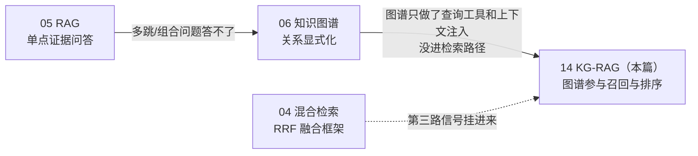

# 14 · KG-RAG：把知识图谱推进检索路径

## 一句话

KG-RAG 解决的问题是：**答案不在任何单个文档里、而在文档之间的关系里**时，让图谱以"第三路检索信号"的身份参与召回与排序，而不是只当元数据仓库。

## 本篇在全局脉络中的位置

06 讲了图谱 × RAG 的三个接口（§9）：①多跳查询工具（Day 9 已做，影响分析 BFS）、②检索增强（Day 3 起 chunk 元数据过滤已做基础版）、③上下文注入（Day 5 已做）。本篇讲的是**接口②的完全体**：图谱不再只是过滤条件，而是产生候选、参与融合排序的一路检索器。动手节点：Day 11。

## 老类比

- **数据库的外键 join 扩展查询**：`WHERE id = X` 查不到答案时，老程序员会写 `JOIN refs ON ...` 把关联行也拉出来。KG-RAG 的邻域扩展就是给全文检索加了一层"沿外键 join 出去再找"的能力——只是"外键"是 dmRef/零件引用，"再找"是把邻居 chunk 送进融合排序。
- **推荐系统的双路召回**：内容相似（embedding）一路、协同信号（用户-物品图）一路，各自召回再融合。hybrid+graph 就是把"文本相似"和"结构相邻"两种相关性证据融合，谁也不替代谁。

## 原理详解

### 0. 版图与选型：图谱进 RAG 的五条路线

| 路线 | 做法 | 成本 | 适用 | 本项目 |
| --- | --- | --- | --- | --- |
| 元数据过滤/路由 | chunk 带图谱元数据（DMC/版本/适用性），检索前过滤 | 低 | 有结构化元数据即可 | ✅ Day 3 起 |
| 上下文注入 | 图谱事实以结构化列表进 prompt | 低 | 有可查事实库 | ✅ Day 5（接口③） |
| 多跳查询工具 | agent 调图查询做影响分析，答案在关系里 | 中 | 关系类问题 | ✅ Day 9（接口①） |
| **图谱增强检索** | query 实体链接 → 邻域扩展 → 第三路信号进融合 | 中 | 答案分散在引用链上 | **Day 11 本篇** |
| GraphRAG（微软 2024） | LLM 全语料抽实体图 + 社区检测 + 逐社区摘要，面向"全局性问题"（query-focused summarization） | 高（全语料多次过 LLM） | "整个语料库在讲什么"类全局问题 | ❌ 不做，见下 |

**为什么不做 GraphRAG**：它的图靠 LLM 抽取（幻觉三元组风险，见 06 §7），索引期成本随语料线性烧钱，而它主打的"全局摘要问题"不在维修问答的高价值查询里。本项目的图来自**确定性结构映射**（XML 显式引用 → 边），零幻觉、可测试——这是受控领域的选型纪律，面试时是加分对比点。另外注意术语：社区里 "KG-RAG / GraphRAG / Graph-augmented RAG" 用法混乱，讲清楚自己指哪条路线本身就是专业信号。

### 1. 实体链接：query 到图节点的桥

图谱只认节点 ID，用户问的是自然语言，中间需要**实体链接**（entity linking）：

- **确定性优先**：DMC、零件号（P-1002）、任务编号都有严格语法，正则 + 词表就能高精度识别——技术语料的巨大红利，别上来就上 NER/LLM。
- **LLM 兜底**（可选）："那个液压泵的图"这类指代才需要语义解析，且解析结果要过词表校验（解析出的实体必须真实存在于图中，否则丢弃——fail-closed 的实体链接）。
- **歧义处理**：一个零件号出现在多个版本的 DM 里 → 用 applicability/版本元数据消歧，消不了就全保留，交给排序层。

### 2. 邻域扩展：从命中节点长出候选

命中实体后沿边扩展，三个设计决策：

1. **边类型白名单**：只沿有检索意义的边走（refs、supersedes、part-of），不沿弱语义边（如同包共存）——边类型选错，扩展就是纯噪声。
2. **跳数**：1 跳是安全区，2 跳要配衰减权重，3 跳基本是噪声（图的"六度分隔"效应：技术文档引用图很稠密，3 跳能到全图大半）。
3. **扩展结果的两种用法**：
   - **候选扩展**（recall 导向）：邻居 chunk 直接加入候选池，作为第三路进 RRF——本项目选这个，因为 RRF 框架现成（04 篇），实现是"多一路 ranked list"；
   - **特征加权**（precision 导向）：不加候选，只给已有候选里"结构上相邻"的加分——适合候选池已够大、只缺排序信号的场景。

### 3. 预期收益的诚实定位：假设待验证

Day 4 消融的教训（04 篇 + README）：8B embedder 在 43 chunk 的玩具规模上几乎无短板，教科书上"dense 输标识符"都没发生。所以**不要预设 graph 一定涨点**。KG-RAG 的理论收益区在：

- **组合问题**：答案要拼多个 DM（"更换 P-1002 前要做哪些准备？"——preparation 在被引用的另一个 DM 里）；
- **引用链问题**：query 的词只出现在链条一端（cross-reference 类是 Day 4 表里 hybrid 唯一 0.80 的类目）；
- **废止传播**："X 废止后哪些程序受影响"——已由接口①覆盖，检索路径管不着。

正确的实验姿势：**先补多跳 golden 题，再测消融行**；涨了报涨、平了报平——"我验证了一个假设，结论是此规模下不显著"在面试里比编造涨点值钱得多（Day 8 的裁判纪律同样适用）。

### 4. 评估设计：消融行怎么加才可信

- 对照组固定：hybrid（RRF: BM25 + dense）vs hybrid+graph（RRF: BM25 + dense + graph），**只动一个变量**；
- golden set 扩充要标注来源（新加的多跳题单独归类，报分时新旧分开报——否则是"往考卷里塞自己擅长的题"，红队必查）；
- zero-hit 率照报：graph 路会不会把 no-answer 陷阱变成"有邻居就硬答"？这是 graph 路线特有的 fail-closed 风险；
- p50 照报：图遍历在内存邻接表上是微秒级,但实体链接若走 LLM 就是百毫秒级——延迟预算要点名。

### 5. 限制清单（谁来接盘）

| # | 限制 | 一句话 | 谁接盘 |
| --- | --- | --- | --- |
| 1 | 图的覆盖 = 显式引用的覆盖 | 文档没写 dmRef 的隐含关系，图里就没有 | LLM 抽取（06 §7，污染风险自负）或人工建模 |
| 2 | 对单点问题无增益 | 答案在单个 chunk 里时 graph 只添噪声 | 融合层权重/路由（本篇 §2） |
| 3 | hub 节点爆炸 | 高被引模块（如通用安全须知）1 跳就是半个图 | 度数截断 + 边类型白名单 |
| 4 | 实体链接是单点故障 | 链接错，后面全错 | 确定性规则 + fail-closed 校验（§1） |
| 5 | 图与索引的一致性 | 文档更新后图没重建 → 引用已删除的 chunk | 图随索引同一管线重建（幂等，INV-2） |

**杠杆排序**：多跳 golden 题的质量（决定你能不能测出真相）> 边类型白名单（决定信噪比）> 融合权重（RRF k 微调）> 跳数（1→2 收益递减明显）> 实体链接的 LLM 兜底（最后再做，先看确定性规则的覆盖率报表）。

## 调优与参数

- **跳数 / 度数截断**：1 跳起步；单节点邻居数超过阈值（如 20）截断或降权——hub 防爆。
- **RRF 第三路的 k**：graph 路的 ranked list 通常短而准，k 用与其他路相同值起步，观察它是"抬进前 10"还是"淹没直接命中"再调。
- **实体链接置信度**：正则命中=1.0 直接用；LLM 解析的实体要过图内存在性校验，校验不过=丢弃不猜。
- **排序内序**：graph 路内部怎么排？按"距离命中实体的跳数 + 边权"排，别按文本相似度排（那是别的路的活，重复计权）。

## 失败模式

1. **邻居噪声淹没直接命中**：融合后直接相关的 chunk 反而被挤出 top-k。检测：消融行对比逐题 diff；修法：graph 路降权/只做特征加权。
2. **hub 节点爆炸**：通用模块被大量引用，1 跳扩出几十个候选。修法：度数截断、tf-idf 式"逆被引频率"降权。
3. **实体链接错误级联**：零件号正则把版本号误识别为零件。检测：链接结果抽样人查；修法：语法收紧 + 图内存在性校验。
4. **图谱陈旧**：增量更新只重建了索引没重建图。修法：同一 ingest 管线产出索引+图，禁独立更新入口。
5. **no-answer 陷阱失守**：问的实体在图里有邻居，系统就放弃拒答。检测：zero-hit 率消融前后对比；修法：graph 候选不豁免答案层的证据充分性判断。

## 面试问答

**Q: KG-RAG 和微软 GraphRAG 是一回事吗？**
A 要点：不是。GraphRAG 特指"LLM 全语料抽图 + 社区检测 + 社区摘要"，面向全局性问题，索引期成本高、图靠 LLM 抽取；广义 KG-RAG 是任何"图谱参与检索/生成"的做法。能画出五条路线的版图（过滤/注入/查询工具/检索增强/GraphRAG）并说明各自成本与适用，就赢了大多数只听过 GraphRAG 名字的候选人。

**Q: 你的图从哪来？为什么不用 LLM 抽取？**
A 要点：XML 显式结构确定性映射（dmRef/零件引用→边），可测试、零幻觉；受控领域"有据地错"比"没有"更危险（06 限制清单 #2）。LLM 抽取留给自由文本场景，且要 staging 隔离 + 校验 + 置信度门槛。

**Q: 图谱扩展什么时候反而伤指标？**
A 要点：单点问题（噪声）、hub 节点（候选爆炸）、实体链接错误（级联）、以及 no-answer 陷阱（有邻居就硬答）。给检测手段（逐题 diff、zero-hit 消融）而不只给结论，展示的是评估纪律。

**Q: 怎么证明 graph 这一路真的有贡献？**
A 要点：单变量消融（hybrid vs hybrid+graph），新加多跳题与原题分开报分，涨平都如实报。主动说"我的预注册假设是收益集中在跨模块组合题"——把实验设计说成假设检验，是区分工程师和调参侠的信号。

**Q: 实体链接为什么不直接用 LLM？**
A 要点：技术语料的实体有严格语法，正则+词表 precision 高、免费、可测试；LLM 只兜自然语言指代的底，且解析结果必须过"图内存在性"校验（fail-closed）。先报确定性规则的覆盖率，有数据再决定要不要兜底层。
