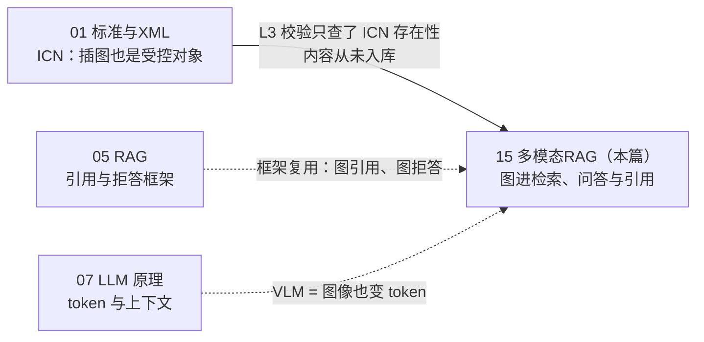

# 15 · 多模态 RAG：让技术插图进入检索与问答

## 一句话

多模态 RAG 解决的问题是：维修手册里大量信息只存在于**插图**（S1000D 的 ICN——部件位置、拆装顺序、hotspot 标注）中，纯文本管线对它们是全盲；本篇讲如何让图进索引、进答案、进引用，同时不放松 fail-closed 纪律。

## 本篇在全局脉络中的位置

01 篇讲过 ICN 是 S1000D 的受控插图对象，Day 2 的 L3 校验器查过"ICN 缺失"，但插图**内容**从没进过检索。动手节点：Day 12。

## 老类比

- **附件 OCR 进全文索引**：老系统里 PDF/扫描件附件要先 OCR 抽文本才能被搜到。describe-then-index 是同一个思路，只是"OCR"换成了 VLM 生成结构化描述——把新模态**归一化**到已有管线能处理的形态，复用全部下游设施。
- **按 Content-Type 路由的网关**：多模态编排（orchestration）本质是网关逻辑——请求进来先判断要不要看图、看哪张、调哪个模型，文本问题绝不为看图付延迟和钱。和当年"静态资源走 CDN、动态请求走应用服务器"是同一门手艺。

## 原理详解

### 0. 版图与选型：图像进 RAG 的三条路线

| 路线 | 做法 | 强项 | 弱项 | 本项目 |
| --- | --- | --- | --- | --- |
| **describe-then-index** | 入库时 VLM 对每张图生成文本描述，描述进现有文本索引 | 复用全部检索/评估设施；描述可人审可版本化；推理期零 VLM 成本 | 描述没写的信息永久检索不到（有损压缩） | ✅ Day 12 |
| 共空间 embedding（CLIP/SigLIP 系） | 图和文编进同一向量空间，text query 直接检索图 | 免描述、对自然照片强 | 对**密集线框+小字标注**的技术图退化明显；无法解释"为什么命中" | ❌ |
| 视觉文档检索 / late-interaction（ColPali/ColQwen，2024–） | 整页当图像，VLM patch 向量 + MaxSim 匹配，免解析管线 | 表格/图文混排页面效果惊艳；省掉整条解析管线 | 索引大（每页数百向量）；引用粒度是"页"不是"论断"；玩具语料优势无从发挥 | ❌，版图必知 |

**选型理由（面试可复述）**：受控领域的引用必须精确到"论断有出处"，describe-then-index 的描述本身就是可引用、可审计、可 diff 的中间产物——**可审计性优先于端到端效果**，这和 Day 5 拒答逻辑是同一条价值观。ColPali 路线是 2024 年后视觉文档检索的重要进展（版图必知，面试常被问），但它的页级引用粒度与本项目"引用精确到 chunk"的红线冲突。

### 1. VLM 怎么"看"图（一分钟原理）

vision encoder 把图像切成 patch，编成一串"图像 token"，与文本 token 一起进同一个 transformer（07 篇的机制完全适用）。工程后果两条：

- **图像也占上下文窗口**（一张高清图数百到上千 token），"把全部插图塞进 prompt"和"把全库文档塞进 prompt"一样不可行——所以才需要检索；
- **VLM 的幻觉长在细节上**：整体描述通常靠谱，**编号、箭头方向、小字标注**这类高信息密度细节最容易编——恰恰是维修场景最要命的部分。防线见 §2、§4。

### 2. 受控描述生成：schema 约束的 captioning

自由发挥的 caption（"图中是一个泵的分解图"）检索价值低且无法验证。受控做法：

1. **schema 约束输出**：Pydantic 模型定死字段——部件清单（名称+hotspot 编号）、视图类型（分解/剖面/位置）、警告标注、图题——VLM 只许填表，不许作文；
2. **与 XML 元数据互验**：S1000D 里 hotspot 编号在 XML 里有对应条目（`<hotspot>`→零件引用），VLM 抽出的编号集合与 XML 声明的集合**做 diff**——对不上就标记该图"描述不可信"，fail-closed 降级为只用 XML 侧信息。这是本项目独有的免费质检器：**结构化标准送了一份 ground truth**；
3. **描述与图 checksum 绑定**：图文件换了、描述必须重生成——防"描述漂移"（和 Day 4 的 manifest 一致性检查同一纪律）。

### 3. 多模态编排（orchestration）：路由、成本、二次看图

JD 语境里的 multi-modal LLM orchestration，工程上就是三个决策点：

- **入库期 vs 查询期分工**：重活（逐图描述）放入库期，一次付费终身检索；查询期默认只查文本索引（含图描述 chunk），零 VLM 成本；
- **路由**：什么 query 需要走到"看图"？答案引用到了图描述 chunk → 回答带图引用即可，仍不必看图；只有 agent 场景（"帮我确认图里 3 号件是不是卡簧"）才触发**二次看图**——取原图 + 原始问题再调一次 VLM 复核；
- **预算护栏**：二次看图是最贵路径，要限次数、限分辨率、记 trace（Day 10 的 demo_guard 费用拦截同一思路）。

### 4. 引用与 fail-closed：图也要讲证据

文本 RAG 的两条红线原样适用，只是对象换成图：

- **图引用 = ICN id + 描述版本（checksum）+ 描述中的具体字段**——审计者能沿引用找到那张图和当时的描述，链条不断（EVIDENCE.md 的哲学延伸到图）；
- **拒答**：问题问到描述 schema 覆盖不了的内容（"图里螺栓的扭矩是多少"——描述只记部件和编号，不记数值）→ 拒答并说明"该信息不在插图描述范围内"，**绝不让 VLM 现场看图硬编数值**。图文冲突陷阱同理：受控出版物里图文冲突本身是校验缺陷，正确行为是报告冲突而非择一作答。

### 5. 评估：看图 golden set 的三类题

| 类型 | 例子 | 考什么 |
| --- | --- | --- |
| 答案在图 | "P-1002 在分解图中的 hotspot 编号是？" | 图描述被检索到且引用正确 |
| 答案在文 | 普通程序类问题 | 图 chunk 不喧宾夺主（对照旧指标不回归） |
| 图文冲突/超范围陷阱 | "图里 5 号件的扭矩值？" | fail-closed：拒答或报告冲突 |

指标：图引用正确率（引的是对的图+对的字段）、旧 golden set 无回归、陷阱题拒答率。数量 8–10 题即可，标注人做——小而诚实，胜过大而含糊。

### 6. 限制清单（谁来接盘）

| # | 限制 | 一句话 | 谁接盘 |
| --- | --- | --- | --- |
| 1 | 描述是有损压缩 | schema 没设的字段永久检索不到 | schema 迭代 + 二次看图兜底（§3） |
| 2 | VLM 细节幻觉 | 编号/箭头最容易编 | XML hotspot 互验 + 受控 schema（§2） |
| 3 | 二次看图贵且慢 | 每次都是百毫秒级+真金白银 | 路由默认不看图 + 预算护栏（§3） |
| 4 | 合成插图 ≠ 真实图纸 | 自绘 SVG 的复杂度远低于真实工程图 | 诚实分层：README 标注玩具规模（INV-7） |
| 5 | 图文一致性无人管 | 图改了描述陈旧 | checksum 绑定 + 同管线重建（§2） |

**杠杆排序**：描述 schema 设计（决定检索上限，上限在数据侧的又一次应验）> hotspot 互验（免费 ground truth，别的语料求不来）> 路由逻辑（省钱大头）> VLM 模型选择（受控 schema 下模型差距被压缩）> 分辨率/切图参数（最后再调）。

## 调优与参数

- **描述生成**：temperature 0；每图独立调用（不批量塞多图，防串图）；prompt 里给 XML 侧的部件词表作为封闭候选集，压幻觉空间。
- **分辨率**：技术图的小字标注需要高分辨率输入，但 token 成本平方级增长；先测"该 VLM 在多低分辨率下还能读对 hotspot 编号"再定档。
- **图 chunk 的检索权重**：图描述 chunk 和正文 chunk 同池融合，先不加权，评估显示图 chunk 挤占正文再降权。
- **二次看图护栏**：每会话次数上限、单图分辨率上限、全程 trace 落盘。

## 失败模式

1. **VLM 幻觉 hotspot 编号**：描述里出现 XML 未声明的编号。检测：§2 的集合 diff（机械闸，零成本）；修法：该图降级 fail-closed。
2. **描述漂移**：图更新、描述没重生成，答案引用旧图内容。检测：checksum 校验入 CI；修法：ingest 管线原子化重建。
3. **图 chunk 喧宾夺主**：图描述文本"关键词浓度"高，普通问题也召回图 chunk 挤掉正文。检测：旧 golden set 回归对比；修法：降权或路由隔离。
4. **陷阱题失守**：问超出描述范围的内容时，LLM 拿描述里相邻数字硬答。检测：陷阱题拒答率；修法：prompt 中显式声明描述字段边界 + 答案层证据校验。
5. **共空间 embedding 误用**：拿 CLIP 系模型检索密集线框图，相似度全靠图题文字撑，线框内容形同虚设。这是选型期失败——版图 §0 的对比就是防它。

## 面试问答

**Q: describe-then-index 和多模态 embedding 怎么选？**
A 要点：三问——引用要不要精确到论断（要→描述路线）？图是自然照片还是密集标注技术图（技术图→CLIP 系退化）？推理期预算多少（描述路线推理期零 VLM 成本）？给出自己"可审计性优先"的选型及代价（有损压缩），并展示知道 ColPali 这条 2024 后的重要路线及其不选理由（页级引用粒度）。

**Q: ColPali 是什么？为什么重要？**
A 要点：视觉文档检索的 late-interaction 方案——整页当图像、patch 级向量、MaxSim 匹配，跳过整条解析管线，在图文混排/表格密集文档上效果显著；代价是索引膨胀和页级引用粒度。能说清它与 ColBERT 的师承关系（04 篇 late-interaction）是加分项。

**Q: VLM 在你的场景里最大的风险是什么？怎么防？**
A 要点：细节幻觉（编号/箭头/小字）。三层防线：schema 约束输出（只许填表）、XML hotspot 集合互验（结构化标准送的免费 ground truth——这条是本项目独有答案）、答案层 fail-closed（超出描述范围拒答）。

**Q: 多模态编排里成本怎么控？**
A 要点：重活前置到入库期一次付清；查询期默认走文本索引零 VLM 成本；二次看图仅 agent 复核场景触发且有预算护栏（限次、限分辨率、trace 落盘）。展示"入库期/查询期成本分账"的思维方式。

**Q: 图和文说的不一致，信谁？**
A 要点：都不信——受控出版物里图文冲突本身是数据缺陷，正确行为是报告冲突（校验 finding）而非择一作答。这是 fail-closed 哲学在多模态的延伸，也把话题引回自己的校验器和红队工作流。
