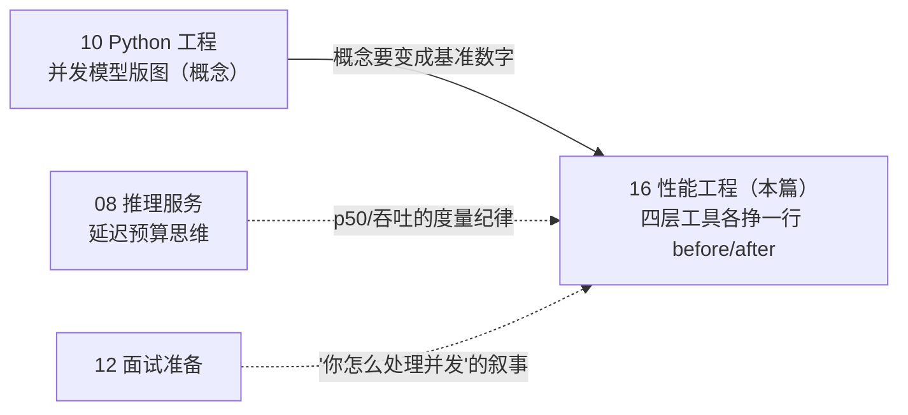

# 16 · 性能工程：Python 并发版图与热点优化

## 一句话

本篇解决的问题是：把"我用架构规避共享状态并发"的老直觉，升级为一张**按负载类型选工具**的现代 Python 并发版图（asyncio / multiprocessing / numba·Cython / Rust 扩展），并让每个工具在项目里挣到一行可复现的基准数字。

## 本篇在全局脉络中的位置

10 篇讲过并发模型的概念版图，本篇是它的动手篇。动手节点：Day 13。

## 老类比

- **Apache prefork vs nginx epoll**：老运维都经历过——每连接一个进程/线程的 Apache 被单线程事件循环的 nginx 打爆。asyncio 就是把 nginx 的 epoll 模型搬进 Python：一个线程、一个事件循环、成千上万个挂起的 I/O 等待。你当年选 nginx 的理由，就是今天选 asyncio 的理由。
- **"用架构消灭锁"**：Java 时代你用队列、无状态服务、幂等写入规避共享可变状态——这套现在叫 **share-nothing + 消息传递**，是并发学界的正统结论。Python 的 multiprocessing 默认进程隔离、显式传递，等于把这个架构原则做进了运行时。你不是绕开了并发，是提前三十年用对了模型。
- **存储过程下推**：SQL 慢了不是加线程，是把热点计算推near数据（索引、物化）。numba/Cython/Rust 是同一思路——不是并发问题的都别用并发解，热点用编译解。

## 原理详解

### 0. 并发版图与选型：负载类型决定工具

| 负载 | 症状 | 正确工具 | 为什么不是线程 |
| --- | --- | --- | --- |
| I/O 密集 | CPU 空转等网络/磁盘（LLM API、embedding 服务） | **asyncio** | GIL 下线程虽能重叠 I/O，但事件循环单线程**无数据竞争**，并发结构还更显式 |
| CPU 密集 | 单核 100%（解析、打分、评估） | **multiprocessing** | GIL 让线程对纯 Python CPU 任务零加速 |
| 数值热点 | profile 显示某循环占大头 | 先 numpy 向量化，再 **numba/Cython** | 这不是并发问题，是每指令做功太少的问题 |
| 仍不够 | 编译后仍是瓶颈 | **Rust/C++ 扩展**（PyO3） | 到这层才谈原生代码，且边界依然 share-nothing |

**GIL 与 2026 年现状（面试必备）**：GIL 是 CPython 的全局解释器锁，同一时刻只有一个线程执行字节码——这是"线程加速不了 CPU 任务"的根源。现状：**Python 3.13 起提供官方 free-threaded 构建（PEP 703，实验性），3.14（2025-10）进入正式支持阶段（PEP 779）；3.14 还引入了子解释器 stdlib 接口（PEP 734）**。但 free-threaded 是**独立构建**（cp313t/cp314t wheel），生态兼容仍在铺开，本项目基线 3.12 不受影响。关键论点：**GIL 移除后锁与竞态的风险回来了，share-nothing 架构反而更值钱**——这句话能把"新特性"聊成"判断力"。

### 1. asyncio：单线程并发，风险模型完全不同

老多线程的恐惧（竞态、死锁）在 asyncio 里基本不存在，因为只有一个线程；代价是换来一个新坑：

- **await 点交错**：每个 `await` 都是让出点，两次 await 之间世界可能被别的协程改过。检查-后-使用（check-then-act）跨越 await 就是逻辑竞态——这是 asyncio 面试第一考点，也是"单线程不等于无并发问题"的实例。
- **结构化并发**：3.11 起用 `asyncio.TaskGroup`（出错自动取消兄弟任务）+ `asyncio.timeout`，别再裸 `create_task` 后忘了收——"孤儿任务吞异常"是 asyncio 三大事故之一。
- **限流三件套**：`Semaphore(k)` 限并发度 + 超时 + 重试（指数退避）。并发度 k 不是越大越好：上游 API 有 rate limit，k 的选择要写出理由（这就是基准表里"所选并发度"一列的来历）。
- **红线**：事件循环里绝不做阻塞调用（同步 HTTP 客户端、重 CPU 循环）——一个阻塞调用冻结全部协程。CPU 活交给 `run_in_executor` 或干脆进程池。

### 2. multiprocessing：绕过 GIL 的 share-nothing 并行

- **模型**：每个 worker 是独立进程、独立解释器、独立内存——数据靠 pickle 序列化传递。没有共享，就没有锁。这正是 INV-2 要求的形态：分片藏在抽象后、写入幂等，单机进程池和真分布式共享同一套接口设计。
- **成本模型（拐点分析的理论课）**：加速比不会线性到底，三个吃掉收益的开销——进程启动（spawn 要重新 import）、pickle 序列化（传大对象比算还慢）、结果汇聚。所以扩展曲线的**拐点分析比峰值加速比更有面试价值**："4 worker 到 8 worker 只涨 1.2× 因为任务粒度太细、序列化占比升到 40%"是工程师的语言。
- **实操要点**：`concurrent.futures.ProcessPoolExecutor` 优于裸 `multiprocessing.Pool`（接口与线程池对称、好测试）；任务粒度要粗（每片秒级以上）；`chunksize` 合并小任务；传"分片描述"（路径、ID 区间）而不是传数据本身——让 worker 自己读，序列化成本立降一个量级。

### 3. profile 纪律：先测量，后优化

- **工具**：`py-spy`（采样式，免改代码、可看生产进程、出火焰图）定位大头；`cProfile` 精确到函数调用数做复核。两者定位一致才动手。
- **纪律**：没有 profile 数据不许写优化代码——猜热点的命中率低得惊人（Day 4 的教训同构：教科书说 dense 输标识符，实测没输）。优化后**同一 profile 复跑**，前后火焰图对比是最硬的证据。
- **口径**：报告优化收益必须带场景（数据规模、重复次数、冷热缓存）——"快 10 倍"没有分母就是营销话术，违反 INV-5 精神。

### 4. numba / Cython：编译层的选型

| | numba | Cython |
| --- | --- | --- |
| 形态 | 装饰器 `@njit`，JIT 编译 | 超集语言，AOT 编译成扩展模块 |
| 适用 | numpy 数组上的数值循环 | 复杂数据结构、要发布的库、与 C 接口 |
| 成本 | 一行装饰器起步；首调用有编译延迟 | 构建链、类型标注、维护成本高一档 |
| 坑 | nopython 模式外静默回退到慢路径 | 忘标类型 = 白写（仍走 Python 对象协议） |

**顺序纪律**：纯 Python 循环 → numpy 向量化 → numba → Cython → Rust，每一步都先问"上一步够不够"。很多时候结论是 **numpy 已经把肉吃完，numba 只多挤 1.1–1.3×**——把这个"不值得"的结论如实写进基准表，比伪造 10× 更能证明成熟度（诚实评估纪律的又一次应验）。

### 5. Rust/PyO3：知情消费者优先，自写靠证据开门

- **先认账**：本项目 latency-critical 路径已经在用 Rust——Tantivy（BM25，p50 <1ms）、Qdrant 都是 Rust 实现。"通过选型获得 Rust 性能"是完全正当的工程姿态，面试可以直接这么说。
- **自写扩展的路线**（开门才做）：PyO3 + maturin，把一个纯函数热点（如 DMC 解析、分词）搬过去，边界保持"进纯数据、出纯数据"——不共享状态，GIL 释放（`allow_threads`）随手可得。
- **开门条件**（仿 Day 4b 的证据开门模式）：profile 显示 Python 侧（而非 I/O 或模型推理）成为端到端瓶颈。玩具语料上大概率开不了门——不开门就写留痕结论，这条留痕本身就是"何时不用 Rust"的判断力证据。

### 6. 限制清单（谁来接盘）

| # | 限制 | 一句话 | 谁接盘 |
| --- | --- | --- | --- |
| 1 | asyncio 帮不了 CPU 任务 | 事件循环里一个重循环冻结全部协程 | 进程池 / `run_in_executor`（§1） |
| 2 | multiprocessing 传大对象很贵 | pickle 比计算还慢时并行变负优化 | 传分片描述不传数据（§2） |
| 3 | numba 只吃数值循环 | 字符串/字典逻辑基本无效 | Cython 或重新设计数据布局（§4） |
| 4 | 编译加速救不了坏算法 | O(n²) 编译完还是 O(n²) | 先改算法与数据结构，profile 说话（§3） |
| 5 | free-threaded 生态未稳 | 3.13t/3.14t 是独立构建，轮子覆盖不全 | 版图知识跟踪，生产暂不切换（§0） |

**杠杆排序**：profile 找对热点（找错全白干）> 算法与数据布局（上限）> asyncio 限流结构（I/O 场景收益最大又最便宜）> multiprocessing 任务粒度（决定扩展曲线形状）> numba/Cython（最后一层内挤）> 自写 Rust（证据开门，玩具规模基本不开）。

## 调优与参数

- **asyncio 并发度 k**：从上游 rate limit 反推起点，观察 429/超时率调整；写进基准表连同理由。
- **进程池 worker 数**：CPU 密集从 `os.cpu_count()` 起步往下试（内存与超线程会让满配不是最优）；配合 `chunksize` 让每片任务秒级以上。
- **numba**：`@njit` 保证 nopython 模式（失败要报错而不是静默回退）；首调用编译延迟要从计时里剔除（预热一次再测）。
- **py-spy**：采样频率默认即可；`--native` 能看到扩展内部（确认时间花在 Tantivy 里而不是胶水层）。

## 失败模式

1. **事件循环里混入阻塞调用**：全部协程冻结、吞吐骤降。检测：py-spy 火焰图里事件循环线程卡在同步调用；修法：换 async 客户端或丢进 executor。
2. **check-then-act 跨 await**：两次 await 之间状态被改，重复写入/超发请求。检测：并发压测下的不变量断言；修法：临界区不跨 await，或显式 `asyncio.Lock`。
3. **孤儿任务吞异常**：`create_task` 后无人 await，协程报错无声消失。修法：TaskGroup 统一收口。
4. **小任务负加速**：进程池并行后反而更慢——序列化+启动开销 > 计算本身。检测：扩展曲线 1 worker 对比串行基线；修法：加粗粒度或放弃并行（如实报告）。
5. **numba 静默回退**：忘了 nopython 约束,装饰器还在、加速没了。检测：`@njit` 强制模式直接报错；修法：改写不受支持的结构。
6. **无分母的加速比**："快 10 倍"不带数据规模与缓存状态。这是评估纪律事故,红队按 INV-5 直接打回。

## 面试问答

**Q: 你怎么处理并发？（本篇的核心叙事题）**
A 要点：先立原则——"我避免的是共享可变状态,不是并发"；再给版图——I/O 用 asyncio（单线程无竞态）、CPU 用 multiprocessing（进程隔离无共享）、热点用编译（numba/Rust）；最后落证据——自己项目的扩展曲线、拐点分析、INV-2 幂等分片。收尾一句 free-threading 展望（无 GIL 时代 share-nothing 更重要）。

**Q: GIL 是什么？现在还在吗？**
A 要点：CPython 字节码级全局锁,线程对 CPU 任务零加速的根源；3.13 起 free-threaded 官方构建（PEP 703）,3.14 进入正式支持,另有子解释器（PEP 734）；但独立构建、生态未齐,生产判断是"跟踪不抢跑"。能说清"移除 GIL 后锁的风险回归"的候选人极少。

**Q: asyncio 和多线程怎么选？**
A 要点：都只对 I/O 有效;asyncio 优势是无数据竞争、并发结构显式（TaskGroup/Semaphore）、单机可挂万级连接;线程适合少量阻塞型第三方库无 async 版的场景（丢 executor）。反问一句负载类型是加分动作。

**Q: 你的并行加速比为什么不线性？**
A 要点：Amdahl（串行段）+ 序列化开销 + 启动成本三件套,给自己扩展曲线的拐点数字,说明对策（粗粒度、传分片描述、chunksize）。这题答出成本模型就赢了只背"进程绕过 GIL"的人。

**Q: 什么时候上 Cython/Rust？什么时候不上？**
A 要点：顺序纪律（numpy → numba → Cython → Rust）+ 证据开门（profile 显示 Python 侧是瓶颈才动）;引用自己"不开门"的留痕结论——知道何时不用,和知道怎么用同样值钱;顺带点名自己栈里已在消费 Rust（Tantivy/Qdrant）。
