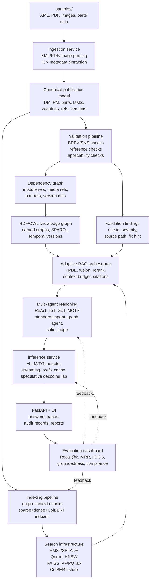
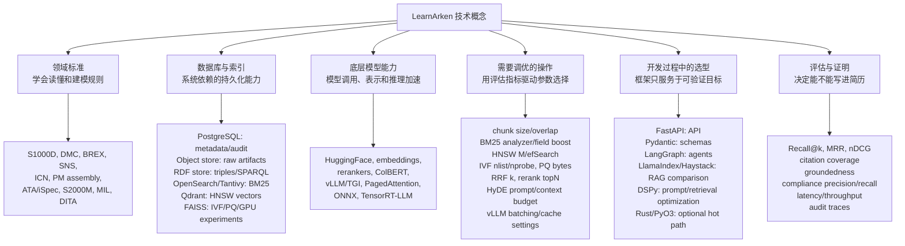
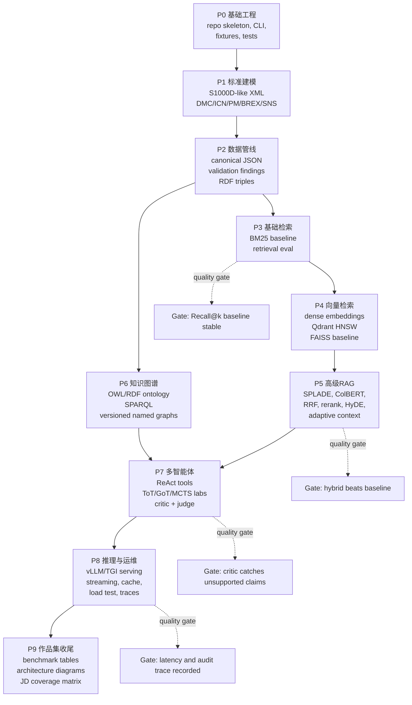

# LearnArken Visual Map

## Conclusion

这份图谱把项目拆成三层理解：

1. **系统架构**：数据从技术出版物进入，经过标准校验、图谱、检索、Agent、推理服务，最后形成可审计答案。
2. **知识领域**：哪些是标准知识，哪些是数据库/索引，哪些是底层模型，哪些是调优操作，哪些是工程选型。
3. **学习顺序**：先搭标准化数据和评估闭环，再逐步加高级检索、知识图谱、多智能体和推理优化。

## System Architecture

Source: [docs/diagrams/architecture-flow.mmd](diagrams/architecture-flow.mmd)
Rendered: [architecture-flow.svg](diagrams/rendered/architecture-flow.svg)

## Knowledge Domain Map

Source: [docs/diagrams/learning-domain-map.mmd](diagrams/learning-domain-map.mmd)
Rendered: [learning-domain-map.svg](diagrams/rendered/learning-domain-map.svg)

```mermaid
flowchart LR
  subgraph D0["业务与标准域"]
    S1000D["S1000D\nDMC, PM, ICN, BREX, SNS"]
    Adjacent["ATA iSpec 2200\nASD S2000M\nMIL-STD-40051\nDITA"]
    Compliance["ISO/AS9100\n21 CFR Part 11\nGDPR/HIPAA\nITAR/EAR"]
  end

  subgraph D1["数据工程域"]
    Parse["XML/PDF/image parsing\nnamespaces, XPath, XSD"]
    Model["Canonical model\nPydantic schemas\nversioned packages"]
    Validate["Rule engine\nvalidation findings\ndependency graph"]
  end

  subgraph D2["数据库与索引域"]
    Pg["PostgreSQL\nmetadata, versions,\naudit log"]
    Obj["Object storage\nsource files,\ncontent hashes"]
    KG["RDF/OWL store\nSPARQL, named graphs"]
    Lexical["Lexical index\nBM25, SPLADE"]
    Vector["Vector DB\nQdrant HNSW"]
    Faiss["FAISS lab\nFlat, HNSW, IVF, PQ, GPU"]
  end

  subgraph D3["检索与RAG算法域"]
    Chunk["Graph-context chunking"]
    Dense["Dense embeddings\nE5/BGE/SBERT"]
    ColBERT["ColBERT\nlate interaction"]
    Fusion["RRF fusion\nhybrid retrieval"]
    Rerank["Cross-encoder rerank\nmonoT5-style rerank"]
    HyDE["HyDE\nquery expansion"]
    Context["Adaptive context\ncitation assembly"]
  end

  subgraph D4["底层模型与推理域"]
    HF["HuggingFace\nTransformers, tokenizers"]
    Torch["PyTorch\nbatching, inference,\noptional DDP/FSDP notes"]
    VLLM["vLLM/TGI\nPagedAttention,\ncontinuous batching"]
    TRT["TensorRT-LLM\noptional NVIDIA lab"]
    ONNX["ONNX\nsmall model export"]
  end

  subgraph D5["多智能体与推理搜索域"]
    ReAct["ReAct\ntool use + reasoning"]
    ToT["ToT\nbranching plans"]
    GoT["GoT\ndependency reasoning graph"]
    MCTS["MCTS/LATS\nsearch over actions"]
    Critic["Adversarial critic\njudge, evidence gap checks"]
  end

  subgraph D6["工程选型与运维域"]
    API["FastAPI\nasync API, streaming"]
    Frameworks["LangGraph\nLlamaIndex/Haystack\nDSPy"]
    Obs["OpenTelemetry\nstructured logs\nanswer traces"]
    Deploy["Docker/K8s sketch\nblue-green deploy\nload test"]
    Rust["Optional Rust/PyO3\nlatency hot path"]
    Formal["Optional Lean/Rocq\nsmall invariant proof"]
  end

  D0 --> D1
  D1 --> D2
  D2 --> D3
  D4 --> D3
  D3 --> D5
  D2 --> D5
  D1 --> D5
  D4 --> D5
  D5 --> D6
  D3 --> D6
  D6 -.observes.-> D1
  D6 -.observes.-> D3
  D6 -.observes.-> D5
```

## Concept Classification

Source: [docs/diagrams/concept-classification.mmd](diagrams/concept-classification.mmd)
Rendered: [concept-classification.svg](diagrams/rendered/concept-classification.svg)

## Learning Dependency Plan

Source: [docs/diagrams/learning-roadmap.mmd](diagrams/learning-roadmap.mmd)
Rendered: [learning-roadmap.svg](diagrams/rendered/learning-roadmap.svg)

## How To Read The Map

- **先看 System Architecture**：理解项目怎么跑起来。
- **再看 Knowledge Domain Map**：理解每项技术属于哪个领域，以及谁依赖谁。
- **然后看 Concept Classification**：区分数据库、底层 LLM、调优项、开发框架和评估项。
- **最后看 Learning Dependency Plan**：按依赖顺序学习和实现，避免一上来就陷进 vLLM、ColBERT 或 MCTS。
